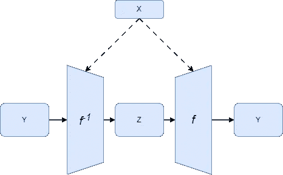
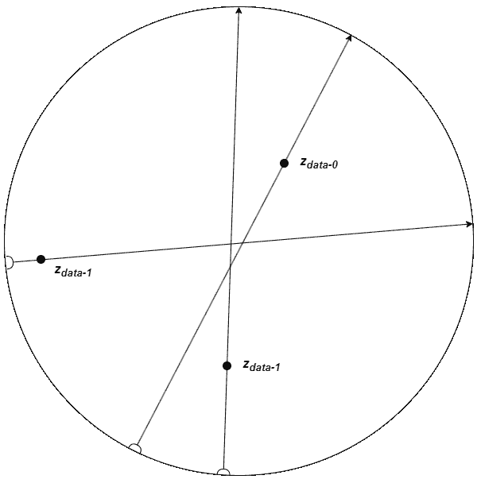
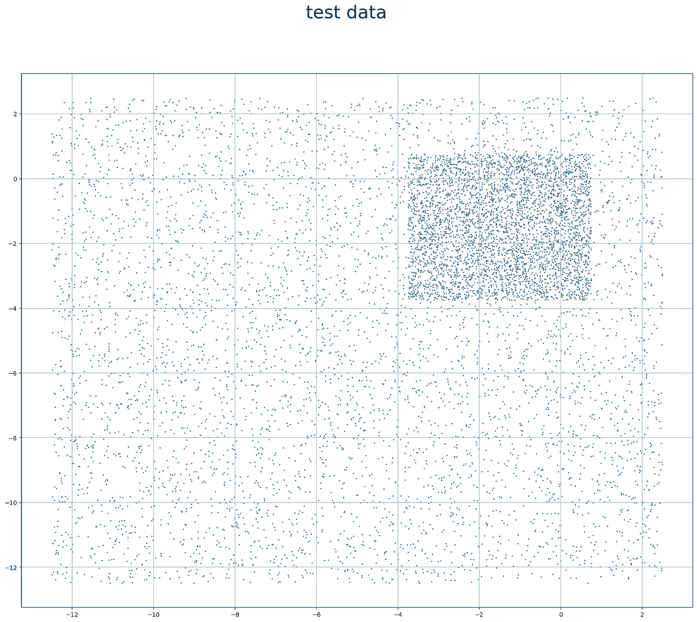

# 近似具有多元输出的随机函数

> 原文：[`towardsdatascience.com/approximating-stochastic-functions-with-multivariate-outputs-ffefc7099a90?source=collection_archive---------10-----------------------#2024-09-04`](https://towardsdatascience.com/approximating-stochastic-functions-with-multivariate-outputs-ffefc7099a90?source=collection_archive---------10-----------------------#2024-09-04)

## 一种新颖的生成式机器学习模型训练方法

 [Nicolas Arroyo Duran](https://medium.com/@nicolas.arroyo.duran?source=post_page---byline--ffefc7099a90--------------------------------)

·发表于 [Towards Data Science](https://towardsdatascience.com/?source=post_page---byline--ffefc7099a90--------------------------------) ·阅读时长 21 分钟·2024 年 9 月 4 日

--

Pin Movement Training — 作者图像

您可以通过克隆 [`github.com/narroyo1/pmt`](https://github.com/narroyo1/pmt) 来重现本文中的实验。

本系列之前的文章名为 [*近似随机函数*](https://medium.com/p/be7d6ccf4f6)，介绍了一种新颖的方法来训练生成式机器学习模型，能够近似任何具有单一输出变量的随机函数。从现在开始，我将简称这种方法为***Pin Movement Training***，或简称为***PMT***。这是因为它通过将大头针插入布料并移动它们的类比来加以说明。

该方法是针对具有任意输入数量的***X***函数，但仅有单一输出***Y***而描述的。本文将对具有任意输出数量的函数对***PMT***进行推广。将提供该方法的总结，并且应该足以理解它是如何工作的，但如果您想要更深入的描述，可以阅读之前的文章。

该推广方法由于下文所述的原因，利用了类似于自编码器的架构。由于这一点，并且由于均匀采样分布可能对许多应用更加方便，我认为此方法是变分自编码器的有效替代方案。

# 原始方法回顾

假设我们想使用神经网络来近似定义为 𝑓(𝑥) → 𝑌 的随机函数，其中***x***是***X***中任意维度的输入，而***Y***是一个一维随机变量。

我们要做的第一件事是引入一个次级输入***Z***，它定义为一个均匀分布的随机变量，范围为*[Zₘᵢₙ, Zₘₐₓ]*。这是为了给原本确定的系统引入随机性。这将给我们带来一个神经网络，定义为 𝑓𝜃(𝑥,𝑧∼𝑍) → 𝑌，其中𝜃代表网络训练后的权重。

现在让我们可视化任意给定点 𝑥′, 𝑠.𝑡. *x*′ *∈ X*。对于这个***x'***，我们希望将整个范围*[Zₘᵢₙ, Zₘₐₓ]*映射到*Yₓ*′。也就是说，*f(x′, Zₘᵢₙ)* 应尽可能接近 *min(Yₓ′)*，而 *f(x′, Zₘᵐₐₓ)* 应尽可能接近 *max(Yₓ′)*。此外，中点 *f(x′, mid(Z))* 和 *mid(Yₓ′)* 应尽可能相似，当然，范围内的其他每个点也应如此（参见**图 1**）。

**图 1** 将***Z***映射到***Y*** — 图片来源：作者

为了实现这一点，我们可以将模型 𝑓𝜃 想象为一块可拉伸的透明布料，其中 ***X*** 水平表示，***Z*** 垂直表示。我们还可以设想一个板子，板子上绘制了数据集中的所有数据点，在这个板子上，***X*** 水平表示，***Y*** 垂直表示。然后我们将布料放置在板子上方。

对于每个数据点，我们在布料的垂直中点位置放置一个“针”，该位置为***Z***或*mid(Z)*。然后我们比较针的位置与数据点的位置。如果数据点高于针，我们在不取下布料上针的情况下，将针向上移动预定的距离，使其到达板子上的更高位置。这个过程中，针会拉伸或压缩布料。如果数据点低于针，则将针向下移动预定的距离。我们将向上和向下的移动距离相加，并称之为总移动距离。

在处理每个数据点后，如果针最初不在中点位置，总移动距离会朝着实际中点的方向更大。经过足够多次重复这个过程后，针会达到一个接近中点的位置，在这个位置，向上和向下的总移动距离相等，也就是说，针上方的数据点数量与下方的数据点数量相同。请参见**图 2**，了解这个过程如何稳定。

**图 2** 将针移向观察点，直到它稳定在中间位置 — 图片来源：作者

现在，如果我们不是将 pin 放在***Z***的中点，而是将其放在从最小点***Zₘᵢₙ***到范围*[Zₘᵢₙ, Zₘᵐₓ]*中 1/3 距离的位置上。并且不是将其上下移动相同的预定距离，而是将其向下移动预定距离的*1.5*倍，向上移动预定距离的*0.75*倍。那么这个 pin 将在一个稳定点上停留（上下移动的总距离相等），该点大致位于数据点的***1/3***处。

这是因为*向上移动的距离* * *较高的数据点* = *向下移动的距离* * *较低的数据点* 或者 (0.75∗2/3=1.5∗1/3=0.5)。参见**图 3**，其中展示了此过程如何使*Zₘᵢₙ + 1/3*和*Zₘᵢₙ + 2/3*的 pins 稳定。

**图 3** 将 2 个 pins 移动至观测点直到它们稳定——图源自作者

***我们如何通过神经网络实现这种移动？*** 为了用神经网络移动“布料上的 pins”，我们选择一个在***Z***中的值（我们称之为***z-pin***），并通过反向传播，将目标值设定为***z-pin***加/减预定的距离，操作如下：

利用这一原理，我们可以在***Z***中均匀选择点，并通过若干周期获得我们需要的映射。即 𝑓𝜃(𝑥,𝑧∼𝑍) → 𝑌。

# 来自原文的注释

+   在原文中，布料拉伸/收缩的类比指的是用于重塑模型的*pins*，然而模型定义和训练方法使用了***z-samples***这一术语来指代同一具体概念。在本篇文章中以及未来的讨论中，这些将被专门称为***z-pins***。

+   在选择***z-pins***时，原文总是将它们均匀分布在***Z***中，并且在每个周期对每个数据点使用相同的位置。然而，这并不是必要的，唯一的要求是***z-pins***在***Z***中均匀分布。

+   原文文章会在每个数据点使用多个***z-pins***。但这并非必要，每个数据点只需选择一个***z-pin***即可。在本篇文章中，所有实验将在每个数据点每个周期选择一个单一的***z-pin***。

# 针对多个输出的推广

在重新审视原始方法以应对单一输出后，接下来我们将讨论针对多个输出所需的变化。

# 重新定义 Z 空间

让我们定义***Z***，即我们从中选择***z-pins***的采样空间。在原文中，***Z***被定义为一个单一维度的范围，简单地通过下限和上限描述为*[Zₘᵢₙ, Zₘᵐₓ]*。然而，在广义方法中，为了能够处理多维输出***Y***，***Z***必须也在多个维度中进行定义（但需要注意的是，***Z***和***Y***的维度数量不必相同）。

理论上，它可以是任何有界的 n 维空间，但因为后续计算标量更为简便，正如你将看到的那样，我选择使用一个可以通过原点 ***O***、半径 ***R*** 和维度 ***N*** 定义的 [*超球面*](https://en.wikipedia.org/wiki/N-sphere)（见 **图 4**）。

**图 4** 三维超球面 ***Z-空间*** — 作者图片

现在让我们定义一些与 ***Z*** 相关的概念，这些概念将在接下来的讨论中派上用场。

+   ***z-针***：这些是***Z***中的均匀采样点。它们可以定义为一个***N***维向量，形式如下：*zₚᵢₙ = (z₀, z₁, …, zₙ)*，其中 *z₀, z₁, …* 是***Z***中的坐标。

+   ***z-方向***：一个 ***z-方向*** 是一个位于原点 ***O*** 的单位向量，定义如下：*z-dir = O + (ž₀, ž₁, …, žₙ)*

+   ***z-线***：一个 ***z-线*** 是一个位于 ***Z*** 中的直线，连接 ***Z*** 中的任意两个点。我们将其定义为一个以 ***z-针*** 为起点，并具有 ***z-方向*** 的直线，包含所有位于 ***Z*** 中的点，形式如下：*zₗᵢₙₑ = zₚᵢₙ + z-dir 使得 ∀z ∈ zₗᵢₙₑ : z ∈ Z*

# 模型

进入多维 ***Z*** 空间引入了一个重要的挑战。在一维的 ***Z*** 和 𝑌 空间中，判断所选的 ***z-针*** 投影，即 𝑓𝜃*(x, zₚᵢₙ)* 是否大于或小于观测到的数据点，以决定将其移动到哪个方向，变得非常简单。在一维中，“大于”可以简单地转换为***Z***中的“大于”，而 ***z-针*** 可以简单地向上移动。这是因为我们只是将一条线映射到另一条线。

但是在多维 𝑌 和 ***Z*** 的情况下，无法假设这两个空间具有相同的形状或相同的维度数量，这意味着为了根据数据点与***z-针***的关系决定移动方向，有必要将数据点从 𝑌 映射到 ***Z***。这意味着除了训练函数 𝑓𝜃 来生成 𝑌 中的值外，我们还需要训练一个逆函数 𝑓𝜃⁻¹ 来将数据点映射到 ***Z***。这一事实使得我们的模型架构发生了变化，变成了如下所示：

**图 5** 模型架构 — 作者图片

模型的左侧允许我们将 𝑌 中的点映射到 ***Z***。模型的右侧允许我们通过在 ***Z*** 中采样点来生成 𝑌 中的随机样本。

你可能注意到，这个架构与普通自编码器的架构相似，的确如此。这一优势在于，它使得该方法对于学习有界且均匀分布的潜在表示非常有用。

# 方法

在定义了我们需要的所有概念后，我们可以继续讨论如何在多维空间中进行针的移动。

# 将数据点映射到 Z

第一步是使用逆函数𝑓𝜃⁻¹（或使用自编码器术语中的编码器）将批次中的所有数据点从𝑌空间映射到***Z***空间。我们将原始数据点称为*y 数据*，将映射后的数据点称为*z 数据*。

**图 6** 将数据点映射到 2 维***Z 空间*** — 图像来源于作者

# 选择 z-针

接下来，我们必须选择一些***z-针***。为了做到这一点，我们首先选择均匀采样的***z-方向***，每个数据点选择一个。最简单的方法是选择一个超球面上的随机点，其维度与***Z***相同。然后，我们使用选定的***z-方向***，并将它们平移，使得前一步中映射的*z 数据*作为原点。这就得到了如***图 7***所示的一些***z 线***。

**图 7** 在 2 维***Z 空间***中选择随机***z 线*** — 图像来源于作者

一旦我们得到了我们的***z 线***，接下来就可以在这些线中随机选择点，这些点就是我们的***z-针***。***图 8***展示了这种情况的示意图。

**图 8** 在 2 维***Z 空间***中选择随机***z-针*** — 图像来源于作者

为了使方法有效，对于任何给定的***z 线***，它在***Z***中的每个映射数据点*z 数据*出现的概率应该是相等的，否则在计算运动标量中的方程将无法成立。

给定一个 2 维的***Z***空间，并且对于其中的任何一个***z 线***，可以将其视为一个最小宽度为𝜖的线段，使其看起来像一个长矩形，类似于***图 8***中的***z 线***。任意给定的𝑧出现在其中的概率就是这个“薄”***z 线***的面积与***Z***面积之比。

因为这个“薄”***z 线***是矩形的，所以其任意一个最小长度为𝛿的线段𝑠在其长度上具有相同的面积，因此任意一个𝑧出现在该线段的概率是相等的。

同样，任意给定的𝑧​出现在这个“薄”***z 线***中的概率，选择该“薄”***z 线***的***z-方向***的概率是恒定的，因为***z-方向***是通过均匀分布选择的。

根据方程（2）和（3），我们得到任意一个𝑧出现在给定的***z 线***的任意线段上的概率，并选择相同的***z-方向***，而且对于满足上述要求的每个线段，这个概率都是相同的。

这个概率与𝑧在***z 线***中的位置无关，因此在任何***z 线***中的分布都是均匀的。

# 计算目标值

在选择了***z-pins***之后，我们可以继续计算目标值（或***z-targets***）用于反向传播。我们所需要做的就是将运动常数𝑀加到每个***z-pin***上，方向是映射数据点𝑧-𝑑𝑎𝑡𝑎所在的方向。

**图 9** 显示了如何计算***z-targets***。

**图 9** 计算***z-targets*** *在* 2-D ***Z-space*** 中 — 图片来源：作者

# 计算运动标量

运动标量的计算方法类似于原始一维方法中的计算方式。

让我们首先通过图示一个***z-line***和一个***z-pin***以及一些映射的数据点𝑧𝑑𝑎𝑡𝑎，如同在**图 10**中看到的那样。

**图 10** 计算标量 — 图片来源：作者

设***a***为***z-pin***到***z-line***一端的距离，***b***为到另一端的距离。并且设前侧的数据点数量为***a'***，后侧的数据点数量为***b'***。我们的目标是使数量***a'***与距离***a***成正比，***b'***与***b***成正比，即 𝑎:𝑏::𝑎′:𝑏′。

接下来，我们将把𝛼称为在长度为***a***的侧面上应用于***z-pin***的运动标量。而我们将把𝛽称为在长度为***b***的侧面上应用于***z-pin***的运动标量。

我们还将***T***称为总运动量，它是将***z-pin***沿每个数据点的侧面移动一个常数运动量***M***并乘以该侧的标量的总和。

我们希望当 𝑎′/(𝑎′+𝑏′)≈𝑎/(𝑎+𝑏)∧𝑏′/(𝑎′+𝑏′)≈𝑏/(𝑎+𝑏) 时，***T*** 为 0（即稳定），即当***z-pin***将数据点按照预定比例分配到两侧时。将***T***替换为***0***后，方程(5)给出了以下方程：

现在让我们记住，并非所有的***z-lines***长度相同，因为它们被由***Z***定义的超球面所限制，朝向中心的***z-lines***将比边缘的***z-lines***长。较长的***z-lines***将表示***Z***中更大的空间（参见方程(1)），因此它们在运动中的影响应该与其长度成比例。我们希望***T***与***z-line***的长度成线性关系，这给我们带来了以下方程：

如果我们将*(6)*和*(7)*合并，我们得到标量应具有以下值：

这些方程与原文中的方程相似。

你可能已经注意到，当***a***或***b***趋近于*0*时，这些方程会在边缘发生断裂。

为了解决这个问题，引入了一个最大标量常数 ***S*** 来钳制标量。当然，在钳制标量时，我们必须小心调整两侧的值，例如，如果 ***a*** 非常小（因此 𝛼 很大），但数据点位于 ***b*** 一侧，则标量 𝛽 也必须进行调整，否则方程 (5) 将无法成立。

我们首先选择两个标量 𝑚𝑎𝑥(𝛼,𝛽) 中的最大值。然后，我们通过将 ***S*** 除以 𝑚𝑎𝑥(𝛼,𝛽) 来计算一个调整值，并将其钳制到 1.0，以确保其始终位于 [0, 1] 的范围内。我们将使用该调整值来防止标量超过 ***S***。最后，如果 ***a*** 为 0.0，则 𝛼 和 𝛽 的值分别为 ***S*** 和 0.0，如果 ***b*** 为 0.0，则反之亦然。这样，我们就得到了修正后的方程式 *(8b)*。

下面你可以看到与 ***a*** 或 ***b*** 成比例的标量图像。注意它们在超过选定的 ***S*** 之后是如何被钳制的。

**图 11** 针脚标量钳制，***S=5.0*** — 图片由作者提供

计算出两个标量后，我们可以通过确定数据点所在的边来选择使用哪个标量。

# 训练模型

现在所有相关概念都已明确，我们可以继续描述训练算法。

# 1\. 预训练和选择 Z 超参数

所描述的算法假设模型 𝑓𝜃⁻¹ 和 𝑓𝜃 彼此反向匹配。如果我们在进行针脚运动时同时训练这两个模型来使它们相互匹配，可能会导致启动缓慢。因此，已经发现，进行“预训练”阶段，使得我们仅训练 𝑓𝜃⁻¹ 和 𝑓𝜃 以使它们匹配，会更有利。这个阶段本质上是一个普通的自编码器训练。在重构误差达到一个合理低的值之后，算法可以进入主训练阶段。

这个预训练阶段还有一个额外的优势，它使得在完成后更容易定义 ***Z***。在章节 重新定义 *Z-space* 中提到，***Z*** 是由原点 ***O*** 和半径 ***R*** 定义的。经过一段时间的预训练后，我们只需要通过逆模型运行一批数据点来计算一组 *Z-data*。

然后我们取这个集合的平均值，并将其用作原点***O***。

我们还可以使用 *Z-data* 到 ***O*** 的平均距离作为 ***R***，但是已观察到，调整和调试该值可能会获得更好的结果。

这是有效的，因为在“预训练”阶段后，模型已经找到了一个能够表示数据的区域，因此在其附近定义 ***Z*** 很可能会产生较低的重构误差。

# 2\. 针脚运动

为了开始 pin 的移动，我们从训练数据集中选择一批数据*y-data = {y-data₀, y-data₁, …, y-dataₙ}*并将其映射到 z*-data = {z-data₀, z-data₁, …, z-dataₙ}*，正如在将数据点映射到 Z 中所解释的那样。

下一步是随机选择***z-pins***集合*{z-pin₀, z-pin₁, …, z-pinₙ}*（每个数据点一个）的方法，如选择 Z-pins 部分所述。

> *注意，每个数据点可以选择多个* **z-pins** *。但是这不是必须的，为了简便起见，我们在实验中只使用一个。*

然后我们计算目标值*z-targets = {z-target₀, z-target₁, …, z-targetₙ}*和标量 s = *{s₀, s₁, …, sₙ}*，如计算目标值和计算移动标量部分所述。

获得***z-targets***后，我们通过将其传递给𝑓𝜃计算当前模型的预测值，这将给我们：

现在我们已经为损失函数的第一个组成部分准备好了所有内容：

请注意，我们使用的是加权平均绝对误差*(WMAE)*函数，而不是加权平均平方误差*(WMSE)*。这是因为后者旨在惩罚较大的差异，而我们将所有的 pin 都移动相同的距离。

# 3\. 重建损失

损失函数的下一个组成部分是我们的模型𝑓𝜃和我们的逆模型𝑓𝜃⁻¹之间的差异。这与变分自编码器和普通自编码器中的*重建损失*非常相似。我们需要将批量数据点传递给𝑓𝜃⁻¹，获取结果后再传递给𝑓𝜃，然后使用这些结果和原始数据点进行反向传播。

# 4\. 逆重建损失

在定义损失函数的最后一个组成部分之前，我们先解释一下它为什么是必要的。理想情况下，在训练结束时，𝑓𝜃和𝑓𝜃⁻¹都应该是双射的，这意味着***Z***和***Y***之间会有严格的一一对应关系。然而，在训练过程中并不能保证这一点，可能会出现***Z***中的某些区域未能映射到***Y***中。

**图 12** 模型和逆模型可能不是双射的 — 作者提供的图片

正如你在***图 12***中看到的，经过*loss-y*组成部分的训练后，𝑓𝜃和𝑓𝜃⁻¹在***Y***上是一致的。即*∀y ∈ Y,* 𝑓𝜃⁻¹(𝑓𝜃(𝑦)) ≈ *y*。然而，并不是所有的***Z***都被使用，一些***Y***中的点映射到了它之外。这是一个问题，因为假设将***z-pins***移动到一个位置，这个位置会映射到一个***Y***中的点，而𝑓𝜃和𝑓𝜃⁻¹都能一致，这个假设被打破了。

***图 12***展示了可能发生的两个问题。布料中的“折叠”发生在***Z***中的两个或更多点映射到***Y***中的同一点时。发生“越界”时，***Z***中的一个点映射到***Y***之外的点。

为了解决这个问题，我们向损失函数中添加了第三个组件：

这样做的目的是使𝑓𝜃和𝑓𝜃⁻¹​在***Z***方面保持同步，方法是选择***Z***中的随机点，而不是使用训练集中的数据点。

请注意，对于重建损失和逆重建损失，我们简单地使用均方误差（MSE）。

# 5\. 损失函数

现在我们已经有了损失函数的所有组件，剩下的就是为它们定义权重，我们将这些权重命名为𝛾-𝑝、𝛾-*y*和𝛾-𝑧。我们可以将(10)、(11)和(12)结合起来，像这样定义损失函数：

剩下的就是对损失进行反向传播。

# 测试模型

在原始论文中，我们使用了目标 1 和目标 2 测试，测量了***z-pins***之间的数据点密度，并将其与测试数据集的密度进行了比较。然而，在多维空间中，这种方法并不实用，因为***z-pins***之间的空间数量会迅速增大。

原始论文还使用了[*地球搬运工距离（EMD）*](https://en.wikipedia.org/wiki/Earth_mover%27s_distance)作为模型性能的指标。对于多维*PMT*，我们将使用*EMD*来衡量模型的准确性。我们将通过将训练数据集中的数据点与*PMT*模型生成的数据点进行比较来定义 EMD 误差。

为了估计最低的 EMD 误差是多少，我们还将通过将训练数据集中的数据点与测试数据集中的数据点进行比较来计算一个基准 EMD。

这为我们提供了一个基准，可以用它来与 E-emd 进行比较，从而衡量模型的准确性。

# 与变分自编码器的比较

与*PMT*最相似的生成模型是变分自编码器（*VAE*）。它具有几乎相同的神经网络架构，并且既是生成模型又是潜在表示映射器。两者之间的最大区别在于，*VAE*中的源分布是无界的（高斯分布），而*PMT*中的源分布是有界的（均匀分布）。

然而，实验表明，无论是有界还是无界目标分布，*PMT*都优于*VAE*。此外，*PMT*中的重建误差显著低于*VAE*。其原因可能在于，损失函数的各个组件在*PMT*中相互协作，而在*VAE*中则是相互竞争。而且，由于目标分布是均匀的，***Z***中数据点之间的间距可以更大。

另一个区别是，*PMT*有更多的超参数，包括𝑆（最大标量）、𝛾-𝑝（针脚移动权重）、𝛾-𝑦（重建损失权重）、𝛾-𝑧（反向重建损失权重）和𝑀（运动常数），而*VAE*的超参数仅为*kld 权重*。这可能会使得*PMT*的训练更加困难。

最后，*PMT*每个周期的训练时间比*VAE*长，这因为需要进行一次传递来计算***z-targets***，而且损失函数有一个附加组件（见公式（12））。

# 实验

现在，我将在多个数据集上尝试该模型。为了方便绘制，下面的实验将不包含***X***输入。

由于与*VAE*的相似性，每个实验将使用*PMT*和*VAE*模型进行比较。在每个实验中，两个模型将采用相同的神经网络架构。

你可以在[`github.com/narroyo1/pmt`](https://github.com/narroyo1/pmt)找到源代码和重现下面实验所需的一切。

# 多个数据块

我将尝试的第一个数据集是使用[*make_blobs()*](https://scikit-learn.org/stable/modules/generated/sklearn.datasets.make_blobs.html)从*sklearn*库生成的。顾名思义，它生成若干个高斯数据块，是测试*PMT*在无界数据集上表现的一个良好数据集。

**图 13a** 生成的数据 — 作者提供的图像

**图 13b** PMT 训练动画 /**图 13c** VAE 训练动画 — 作者提供的图像

**图 13d** EMD 误差图/**图 13e** 重建损失图 — 作者提供的图像

**图 13a**展示了由*make_blobs()*函数生成的测试数据。**图 13b**和**图 13c**分别展示了*PMT*和*VAE*训练方法的动画。

**图 13d**展示了计算的*EMD*误差（𝐸-𝑒𝑚𝑑）图，分别为*PMT*、*VAE*和基准值（𝐵-𝑒𝑚𝑑）。正如你所看到的，*PMT*的𝐸-𝑒𝑚𝑑比*VAE*的更接近𝐵-𝑒𝑚𝑑，这意味着其性能更好。

**图 13e**展示了*PMT*和*VAE*的重建误差图。正如你所看到的，*PMT*的重建误差比*VAE*低一个数量级。

# 方形与另一个方形

第二个数据集相当简单。我们只需要一个外部的方形区域，里面均匀分布着数据点，再加上一个内嵌的方形区域，里面同样是均匀分布的数据，但密度更大。这将帮助我们测试具有尖锐细节的非高斯分布。

**图 14a** 生成的数据 — 作者提供的图像

**图 14b** PMT 训练动画/**图 14c** VAE 训练动画 — 图像来源：作者

**图 14d** EMD 图/**图 14e** 重建损失图 — 图像来源：作者

**图 14d** 显示了 *EMD* 错误图，你可以从中看到 *PMT* 超越了 *VAE*。

**图 14e** 显示了重建误差值，你可以看到 *PMT* 的重建误差比 *VAE* 低两个数量级。

# 人类行为

下一个数据集由人体运动传感器数据构成，这些数据是通过进行几种体育活动获得的。它来源于 [移动健康人体行为分析数据集](https://www.kaggle.com/datasets/gaurav2022/mobile-health)¹。这个数据集具有 3 个维度，而不像之前的数据集只有 2 个维度。

**图 15a** 测试数据 — 图像来源：作者

**图 15b** PMT 训练动画/**图 15c** VAE 训练动画 — 图像来源：作者

**图 15d** EMD 图/**图 15e** 重建损失图 — 图像来源：作者

**图 15d** 显示了 *EMD* 错误图，再次证明 *PMT* 超越了 *VAE*。

**图 15e** 显示 *PMT* 的重建误差比 *VAE* 低一个数量级。

# MNIST

最后是著名的 [MNIST 数据集](https://huggingface.co/datasets/ylecun/mnist)²。正如你所知，它包含了人类书写的数字的位图，而任务是生成看起来像手写数字的新的数据点。这个数据集很有趣，因为它具有大量的输出维度（784）和 4 维的潜在空间。

**图 17a** PMT 原始数据/**图 17b** PMT 重建/**图 17c** PMT 生成的样本 — 图像来源：作者

**图 16c** VAE 原始数据/**图 16e** VAE 重建/**图 16e** VAE 生成的样本 — 图像来源：作者

**图 16g** 重建损失图 — 图像来源：作者

由于输出维度过多，计算 EMD 错误图非常困难（而且没有指示性意义），因此这个数据集没有 EMD 错误图。

**图 16b** 绘制了重建误差图，再次证明 *PMT* 的误差低于 *VAE* 的误差。

# 结论与未来的方向

用单一输出逼近随机函数对于预测单值分布（如温度或市场值）非常有用。但产生多个输出的能力使得该方法适用于多种应用场景，如模拟和生成任务。

本文描述的多输出方法已经证明，在实验数据集中，它能够在概率相似度和重建方面优于 VAE。我相信它们在各种现实世界应用中也会产生更好的结果。

未来，我希望在更高维度的数据集上继续测试*PMT*，以进行生成任务，比如[时尚 MNIST](https://www.kaggle.com/datasets/zalando-research/fashionmnist)和[CelebA](https://mmlab.ie.cuhk.edu.hk/projects/CelebA.html)。为此，还需要尝试深度网络和卷积神经网络（CNN）。

如果有任何问题或建议，欢迎随时联系我。

[1]: 移动健康人类行为分析

https://www.kaggle.com/datasets/gaurav2022/mobile-health

CC0 公共领域 [`creativecommons.org/publicdomain/zero/1.0/`](https://creativecommons.org/publicdomain/zero/1.0/)

[2] MNIST 手写数字数据库

[## MNIST 手写数字数据库，Yann LeCun，Corinna Cortes 和 Chris Burges

### 手写数字 Yann LeCun，纽约大学 Courant 研究所 Corinna Cortes，Google 实验室，纽约 Christopher J.C. Burges…

yann.lecun.com](http://yann.lecun.com/exdb/mnist?source=post_page-----ffefc7099a90--------------------------------)

MIT [`choosealicense.com/licenses/mit/`](https://choosealicense.com/licenses/mit/)
