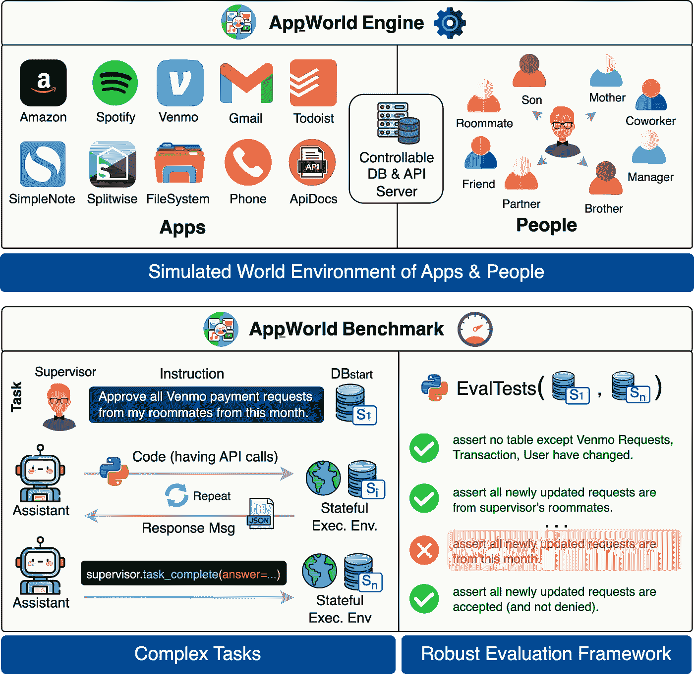

# AI 代理能否完成你在应用上的日常任务？

> 原文：[`towardsdatascience.com/appworld-a-controllable-world-of-apps-and-people-for-benchmarking-interactive-coding-agents-37517dd9d498?source=collection_archive---------2-----------------------#2024-07-28`](https://towardsdatascience.com/appworld-a-controllable-world-of-apps-and-people-for-benchmarking-interactive-coding-agents-37517dd9d498?source=collection_archive---------2-----------------------#2024-07-28)

## 在一个由应用和人组成的世界中对编码代理进行基准测试

 [Harsh Trivedi](https://medium.com/@harshjtrivedi94?source=post_page---byline--37517dd9d498--------------------------------)

·发表于 [Towards Data Science](https://towardsdatascience.com/?source=post_page---byline--37517dd9d498--------------------------------) ·阅读时间：7 分钟·2024 年 7 月 28 日

--

*想象一个世界，在这个世界中，AI 代理可以充当你的个人助手，像在亚马逊上设置退货或根据你的邮件取消会议等任务。这要求代理能够在复杂的工作流中与应用程序交互操作，而迄今为止，还没有一个很好的方法来评估这样的代理。直到现在。*

# **🤖 1\. 个人应用的编码代理**

随着底层 AI 模型的不断改进，AI 助手（例如我们手机上的助手）也在不断进步。几年前，它们在回答简单的事实性问题时还存在困难。今天，它们已经*开始*达到可以代表我们操作应用程序执行基本任务的程度。例如，最近的 [GoogleIO](https://youtu.be/uFroTufv6es?si=u6MjyEBxN4hRQ11T&t=1088) 和 [Apple WWDC](https://www.youtube.com/live/RXeOiIDNNek?si=60ztV3xEV1GTSrAE&t=4199) 事件，正是关于 AI 助手作为自主代理为我们工作这一愿景。

在未来，它们将能够在我们的应用程序上自主完成更复杂的任务。例如，你可以说：“嘿，我的一些同事通过电子邮件取消了会议，请删除我对应的手机提醒。” 代理会自主地检查你的邮箱，弄清楚哪些同事取消了会议，然后打开日历应用，确定哪些会议是和这些同事的，并将其取消。

包含像亚马逊、Venmo、Gmail 等应用的日常任务示例

AI 模型可以通过**交互式**编写**代码**并调用**API**来解决这类任务。*API* 使代理能够在应用程序上执行基本操作，*代码* 使代理能够将这些操作组织成复杂的逻辑和控制流程，而*交互* 使代理能够探索用户账户并根据代码执行结果进行适应。

请看下图中的示例，代理的任务是启动一个播放列表，确保其中的歌曲足够覆盖用户今天的运动时长。为此，代理首先需要编写代码调用 SimpleNote **API**（第一个代码块），找到并“读取”（打印）包含运动计划的笔记。只有在进行这次**交互**以观察笔记的结构后——看到时长按天列出——代理才能编写必要的代码（第二个代码块），这包括查找今天的星期几并提取相关时长。为了选择播放列表，代理必须编写丰富的**代码**，使用 for 循环和其他控制流来遍历播放列表，计算播放列表的时长，并播放一个涵盖运动时长的列表（第三个代码块）。

一个代理代表用户通过交互式编写包含各种应用程序 API 调用的丰富代码来解决任务。

现在我们知道代理如何完成这类任务，问题是：

> **我们如何开发和基准化这样的编码代理，以完成各种应用中的日常数字任务？**

为此，我们需要（i）一个丰富、稳定且可复现的执行环境，让代理可以通过代码和 API 与许多日常应用进行交互，（ii）需要 API 调用和丰富交互式编码的复杂任务，以及（iii）一个可靠的评估框架。

现有的基准如 [Gorilla](https://arxiv.org/pdf/2305.15334)、[ToolBench](https://arxiv.org/abs/2307.16789)、[API-Bank](https://arxiv.org/abs/2304.08244)、[ToolTalk](https://arxiv.org/abs/2311.10775)、[RestBench](https://arxiv.org/abs/2306.06624) 并不满足这三个要求。除了缺少上述类型的环境，它们的任务只涉及 1–4 次 API 调用的线性序列，不需要丰富的交互式编码，并且它们通过将代理的解决方案与参考解决方案（使用 LLM 或人工方式）进行比较来进行评估，但这种方式在复杂任务中表现不佳，因为复杂任务可能有多种不同的解决方案。

# **🌎 2\. 引入 AppWorld**

为了解决这一差距，我们引入了 **AppWorld**，它包括（1）一个可控且模拟的世界环境（**引擎**），在这个环境中，编码代理可以通过 API 代表人们操作各种应用程序，（2）一个在此环境上定义的复杂任务的**基准**，以及（3）一个强大的**评估**框架，用于评估代理的性能。

AppWorld 的概述，包括一个模拟的应用程序和人类世界环境，一个建立在其上的复杂任务基准，以及一个强大的评估框架。

**⚙️ 2.1 引擎：模拟的数字世界**

AppWorld Engine 是一个基于 API 的高保真模拟器（60K 行代码），模拟来自各个领域的 9 款日常应用程序的生态系统（例如 Gmail 用于电子邮件，Amazon 用于购物，Spotify 用于音乐等）。这个引擎由一个完全可控的本地后端支持，包含 457 个 API 和 100 多个数据库表，紧密模拟了真实应用的丰富功能。这些 API 拥有详细的文档（[互动探索](https://appworld.dev/api-explorer)），代理可以阅读这些文档来理解其使用方法。

然后，我们在此引擎之上模拟了一个人的数字世界及其在这些应用程序中的数字活动。具体来说，我们将应用数据库（DB）填充了 106 个虚构人物，这些人生活在这个模拟世界中。他们通过各种关系相互联系，比如室友、朋友、经理等，以便执行人际任务，例如与室友分账。接着，模拟他们的日常生活，执行各种个人和人际活动，例如在 Amazon 上订购 T 恤进行家庭配送，或通过电话向室友请求车钥匙等。最终的数据库包含超过 30 万行，跨越 726 列。

**📊 2.2 复杂任务基准测试**

AppWorld 基准测试在此引擎基础上构建了 750 个日常任务（如上所示的示例），这些任务需要使用多个 API（通常 15 个以上），跨越多个应用（1–4 个），并且要求编写丰富且互动的代码（通常是 80 行以上，包含许多编程构造）。请参见下面的统计图表，并在我们的游乐场上[互动探索任务](https://appworld.dev/task-explorer)。

每个任务指令都会配有一个监督者（AppWorld 中的人物），代理需代表其执行任务。代理可以访问他们所有的应用账户。每个任务的初始数据库状态都经过精心设计（通过编程），以确保任务明确定义，并包含现实的干扰和障碍。任务还包括任务变体，从整体上检查代理是否能在不同的初始条件和指令变体下可靠地解决任务。

所有任务的实现都是由我们设计和开发的（不是众包的）。它们的实现代码总行数超过 40K 行（是的，任务开发投入了大量工作；请参阅论文）。

AppWorld 基准测试中任务的难度等级分布，以及我们编写的解决方案的特性，如应用程序数量、唯一 API 和代码行数、评估测试的数量等。

**✔️ 2.3\. 强大的评估框架**

在 AppWorld 中，复杂任务可以通过多种方式完成（例如，可以通过其 Amazon API 或确认邮件下载订单收据）。此外，解决任务的代理可能以多种不同的方式造成附带损害（例如，发起一个并未要求的退货）。因此，基于***过程***的方式，将代理生成的代码与参考代码或 API 调用进行比较，是不足以评估任务完成情况的。

相反，AppWorld 采用了***基于状态***的方法。具体来说，对于每个任务，我们定义了一套程序化的单元测试，利用数据库状态快照作为输入：(1) 代理开始前的状态和(2) 代理结束后的状态。然后，我们检查是否只进行了预期的数据库更改，并确保没有发生意外更改。这使我们能够*可靠地*检查代理是否正确完成任务而未造成附带损害。

最后，为确保任务是可解的，我们编写验证解决方案代码，并通过程序化的方式验证其运行是否通过所有评估测试。

# **🧪 3\. 代理的表现如何？**

我们使用多种少量样本提示方法对多种 LLM 进行了基准测试，方法包括 ReAct、计划与执行、生成带反思的完整代码和函数调用。即便是最好的 LLM，GPT-4o，也表现得相当差劲。例如，它在挑战测试集中的任务仅正确完成约 30%。GPT-4 Turbo 和开放 LLM 则更为落后。

此外，在我们的严格鲁棒性度量下，得分要低得多，该度量检查代理是否能够在不同的初始条件和指令扰动下可靠地完成所有任务变化。

展示了使用各种提示方法的最先进大型语言模型（LLMs）的分数。AppWorld 对当前模型来说是具有挑战性的。例如，GPT-4o 仅能正确解决大约 30%的 Test-Challenge 任务，且在我们的鲁棒性度量中得分下降至 13.0。

此外，分数随着难度的增加而显著下降，依据我们提供的标签以及其他难度指标（例如，基于我们书面验证解决方案的 API 数量和代码行数）。

展示了在各种任务难度指标下，最佳模型 GPT4-o 的分数曲线。随着任务难度的增加，模型的分数显著下降。

# **🔮 4\. AppWorld 的未来是什么？**

AppWorld 是一个模块化且可扩展的基础平台，为自动化数字任务开辟了许多激动人心的可能性。例如，未来的工作可以：

1.  将 AppWorld 引擎扩展为支持基于浏览器/移动 UI 的控制，以便为现有任务提供统一的基准，涵盖代码、API 和 UI 基础的自主代理。

1.  将 AppWorld 基准扩展为需要多代理（和人类）协调与合作的任务（例如，通过与朋友的代理在电子邮件中协调，安排一次日历会议）。

1.  将我们的数字世界引擎叠加到一个物理世界引擎上，比如 [Simulacra](https://arxiv.org/abs/2304.03442)，并通过角色扮演代理在一个受控环境中研究社会动态和行为。

1.  将引擎作为一个没有后果的沙盒，用来研究当数字助手被赋予“代理”角色，在现实世界中代替我们行动时，可能产生的隐私和安全风险。

1.  当然，还可以将 AppWorld 扩展到更大的应用和任务生态系统。

我们非常激动，期待自己和他人能够在 AppWorld 的基础上探索这些方向（以及更多！）。如果需要帮助或想要合作，随时联系我们！

# 🚀 **5\. 准备好尝试了吗？**

AppWorld 易于使用且速度快。你可以通过 pip 安装其开源 Python 包并开始构建和测试你的代理。如果你已经有了代理，下面的代码就是你在 AppWorld 上运行并评估它所需要的全部内容。

AppWorld 环境的最小使用示例。

有关论文、代码、排行榜、数据探查器（任务、API、代理轨迹）、互动游乐场（直接与 AppWorld 任务互动）、视频解说等内容，请访问 [**https://appworld.dev**](https://appworld.dev)。

**新消息**：AppWorld 在 ACL'24 上获得了 **最佳资源论文** 奖。**🏆** 🎉

**图片来源**：所有图片均由作者创建。
