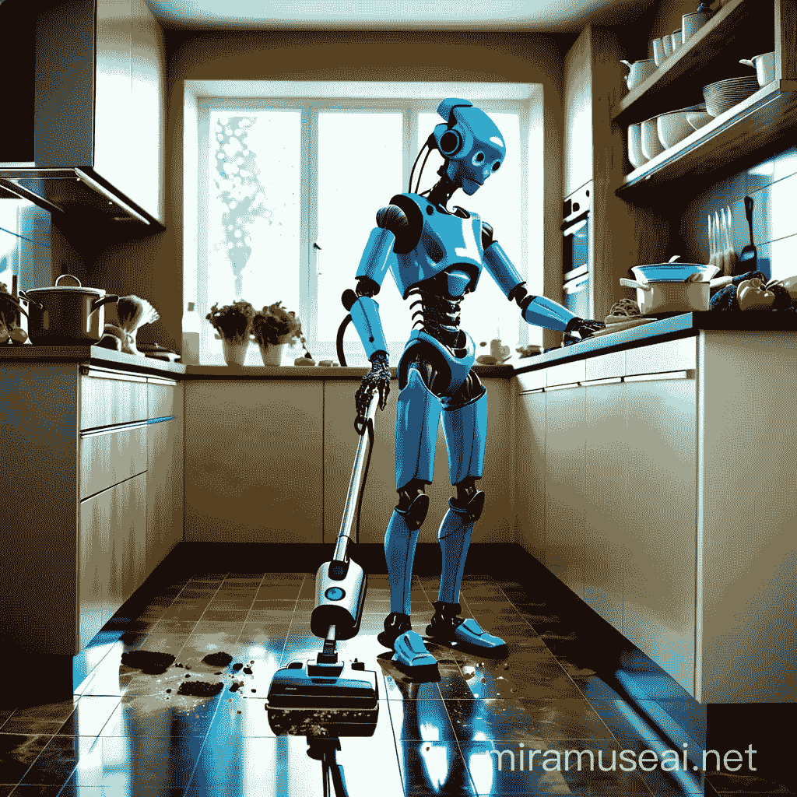

# 类人机器人会一直存在吗？

> 原文：[`towardsdatascience.com/are-the-humanoids-here-to-stay-050da171530b?source=collection_archive---------4-----------------------#2024-03-01`](https://towardsdatascience.com/are-the-humanoids-here-to-stay-050da171530b?source=collection_archive---------4-----------------------#2024-03-01)

## 类人机器人可能最终解决困扰机器人适应的“旧场地”问题，而最近在多模态变换器和扩散模型方面的突破，可能真的让这一切成为现实。

 [Nikolaus Correll](https://medium.com/@nikolaus.correll?source=post_page---byline--050da171530b--------------------------------)

·发表于 [Towards Data Science](https://towardsdatascience.com/?source=post_page---byline--050da171530b--------------------------------) ·10 分钟阅读·2024 年 3 月 1 日

--

几乎每周都有类人公司发布新更新。Optimus 能走路了？Digit 刚刚移动了一个空的购物篮？Figure 也做到了！似乎真正的公司终于开始关注了。从特斯拉开始，类人机器人现在已经在亚马逊和宝马“工作”，距离进入我们的家庭和花园只差一步。

*如果你不是 Medium 的订阅者，你可以* [*在这里*](https://medium.com/towards-data-science/are-the-humanoids-here-to-stay-050da171530b?sk=abfc9adb87dfd585431b280b8beabbd5)*免费阅读这篇文章*。

一位类人机器人正在清理（它自己的？）乱摊子，同时准备做饭。类人形态在无缝集成现有价值创造流程方面具有巨大潜力。图片：作者通过 miramuseai.net 提供
