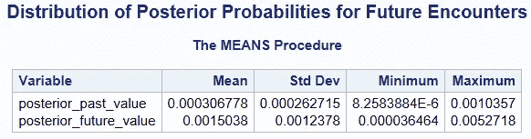
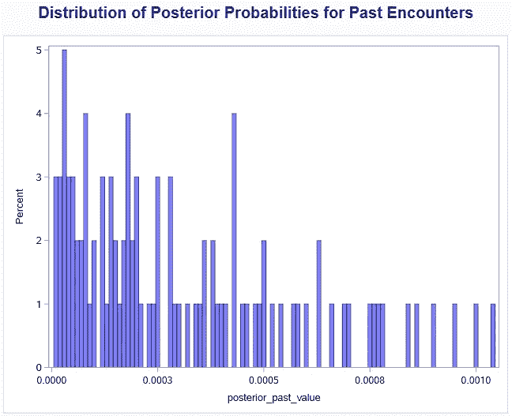
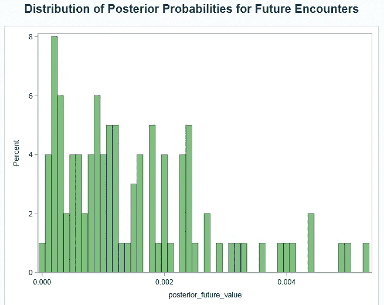

# 我们是孤独的吗？

> 原文：[`towardsdatascience.com/are-we-alone-the-final-drake-equation-analysis-344db95c0166?source=collection_archive---------5-----------------------#2024-09-08`](https://towardsdatascience.com/are-we-alone-the-final-drake-equation-analysis-344db95c0166?source=collection_archive---------5-----------------------#2024-09-08)

## **遭遇外星生命的真实概率（德雷克方程系列的第五部分）**

[](https://medium.com/@james.r.gearheart?source=post_page---byline--344db95c0166--------------------------------)[](https://towardsdatascience.com/?source=post_page---byline--344db95c0166--------------------------------) [James Gearheart](https://medium.com/@james.r.gearheart?source=post_page---byline--344db95c0166--------------------------------)

·发表于[Towards Data Science](https://towardsdatascience.com/?source=post_page---byline--344db95c0166--------------------------------) ·阅读时间 11 分钟·2024 年 9 月 8 日

--

**回顾：**

在本系列文章中，我们探讨了可能导致外星文明存在的各种因素，从宜居行星的数量到智能文明是否发展出通讯技术的概率。在本文的最后一篇，我们探讨了终极问题：我们曾经遇到过外星生命吗？我们未来会遇到它们吗？


所有图片均由作者使用 Midjourney 创作。

# 第 10 步：理性应对外星遭遇

对外星生命的探索长期以来一直是科学、猜测和耸人听闻的混合体。从 UFO 目击到政府的 UAP（不明空中现象）报告，公众的想象力一直被外星遭遇的想法所吸引。然而，从科学的角度来看，我们是否已经遇到过外星生命——或者将来是否有可能遇到外星生命，究竟有多大可能？

这时，理性、数据驱动的方法就显得尤为重要。通过结合德雷克方程、现代模拟和贝叶斯概率模型，我们终于可以计算出过去和未来遭遇外星生命的可能性。

## 为什么这一步很重要

很容易被潜在外星遭遇的兴奋所感染，但现实却远比想象复杂。即使银河系中存在智能文明，它们与我们文明在时间和距离上的重叠几率也极其微小。本文将帮助我们量化这些遭遇的可能性，基于过去和未来的可能性，为我们提供一个更清晰的概率图景。

# 贝叶斯概率与外星遭遇

贝叶斯推理使我们能够在新证据（或证据缺乏）出现时更新我们的概率估计。在外星接触的案例中，我们可以使用这种方法来评估过去和未来接触的概率。

让我们来解析贝叶斯方法：

+   **P(H|E)**：给定当前证据，外星人存在并且我们已与其接触的概率。

+   **P(H)**：我们的先验概率，或是我们对外星人相遇已经发生或将要发生的可能性的初步假设。

+   **P(E|H)**：假设相遇假设为真，当前证据（例如没有确认的外星接触）出现的可能性。

+   **P(E)**：证据的总体概率，它考虑了所有可能的假设。

我们将使用这个框架来计算过去和未来的相遇。

# 外星接触的贝叶斯蒙特卡洛模拟：理解方法

为了量化过去和未来外星接触的概率，我们采用了贝叶斯框架，并结合蒙特卡洛模拟来处理参数中固有的不确定性。本节将带您了解这两种方法背后的基本原理和方法论，然后展示实际代码。

## 为什么使用贝叶斯分析？

贝叶斯分析是一种基于新证据更新事件概率的强大方法。在我们的例子中，事件是我们是否已经遇到或将遇到外星文明。通过结合先验知识和现有的（尽管有限的）证据——例如缺乏确认的接触——我们可以细化我们的估计并量化过去和未来外星人接触的相关不确定性。

贝叶斯定理允许我们计算**后验概率**——换句话说，在我们假设和观察的基础上，外星人相遇的可能性。这个过程至关重要，因为它会随着新信息的出现不断更新我们的理解，无论是外星生命的确凿证据，还是继续缺乏接触的情况。

## 为什么使用蒙特卡洛模拟？

鉴于德雷克方程和其他与外星人接触相关的概率中的不确定性和变异性，使用一组固定的值来估计概率是不现实的。相反，蒙特卡洛模拟使我们能够为每个参数（例如接触的可能性或外星生命存在的先验概率）采样一组广泛的合理值。

通过使用这些不同的值进行数千次模拟，我们可以探索一系列结果，而不是依赖于僵化的点估计。结果是我们对过去和未来相遇的可能性有了更细致的理解，同时对每种情景的概率分布也有了更清晰的认识。

现在，让我们深入了解实际的代码实现：

```py
**********************************;
**********************************;
/* Set the random seed for reproducibility */
data _null_;
   call streaminit(1234);
run;

/* Number of simulations */
%let num_simulations = 100000;

/* Number of civilizations to generate */
%let num_civilizations = 2364;

/* Galactic radius and height in light years */
%let galactic_radius = 50000;
%let galactic_height = 1300;

/* Earth's position (assumed to be at 3/4 of the galactic radius) */
%let earth_position_x = &galactic_radius * 3 / 4;
%let earth_position_y = 0;
%let earth_position_z = 0;

/* Create a dataset to store civilization positions */
data civilization_positions;
    length Civilization $10.;
    input Civilization $ Position_X Position_Y Position_Z;
    datalines;
Earth    &earth_position_x  &earth_position_y  &earth_position_z
;
run;

/* Generate random positions for other civilizations */
data civilization_positions;
    set civilization_positions;
    do i = 1 to &num_civilizations;
        Position_X = rand("Uniform") * &galactic_radius;
        Position_Y = rand("Uniform") * 2 * &galactic_height - &galactic_height;
        Position_Z = rand("Uniform") * 2 * &galactic_height - &galactic_height;
        Civilization = "Civilization " || strip(put(i, 8.));
        output;
    end;
    drop i;
run;

/* Calculate the distance between civilizations and Earth */
data civilization_distances;
    set civilization_positions;
    Distance = sqrt((Position_X - &earth_position_x)**2 + (Position_Y - &earth_position_y)**2 + (Position_Z - &earth_position_z)**2);
run;

/* Calculate the minimum distance to Earth for each civilization */
proc sql;
    create table civilization_min_distance as
    select Civilization, Distance as Min_Distance
    from civilization_distances
    order by Distance;
quit;

/* Calculate the probability of encountering civilizations based on distance */
data probability_encounter;
    set civilization_min_distance;
    Probability = 1 / (1 + Min_Distance);
run;

/* Calculate the average probability for each distance band */
proc sql;
    create table average_probability as
    select case
                when Min_Distance <= 1000 then 'Close'
                when Min_Distance > 1000 and Min_Distance <= 3000 then 'Medium'
                when Min_Distance > 3000 then 'Far'
            end as Distance_Band,
            avg(Probability) as Average_Probability
    from probability_encounter
    group by case
                when Min_Distance <= 1000 then 'Close'
                when Min_Distance > 1000 and Min_Distance <= 3000 then 'Medium'
                when Min_Distance > 3000 then 'Far'
            end;
quit;

/* Print the result */
proc print data=average_probability;
run;

/* Select the closest civilization to Earth and its associated probability */
proc sql;
    create table closest_civilization as
    select Civilization, Min_Distance, Probability
    from probability_encounter
    where Min_Distance = (select min(Min_Distance) from probability_encounter);
quit;

/* Print the result */
proc print data=closest_civilization;
run;

/*Bayesian analysis for probability of encountering aliens in the past or future*/

/* Set seed for reproducibility */
%let num_iterations = 100;

/* Create Bayesian analysis dataset */
data bayesian_analysis;
    call streaminit(123);

    /* Define variables for posterior probabilities */
    array posterior_past[&num_iterations];
    array posterior_future[&num_iterations];

    do i = 1 to &num_iterations;
        /* Sample prior probabilities and likelihoods for past encounters */
        prior_past = rand("Uniform", 0.0001, 0.01); /* P(Past encounter) */
        likelihood_past_encounter = rand("Uniform", 0.001, 0.1); /* P(No contact | Past encounter) */
        likelihood_no_encounter_past = rand("Uniform", 0.8, 0.99); /* P(No contact | No encounter) */

        /* Calculate posterior probability for past encounter using Bayes' Theorem */
        numerator_past = prior_past * likelihood_past_encounter;
        denominator_past = numerator_past + (1 - prior_past) * likelihood_no_encounter_past;
        posterior_past[i] = numerator_past / denominator_past;

        /* Sample prior probabilities and likelihoods for future encounters */
        prior_future = rand("Uniform", 0.001, 0.05); /* P(Future encounter) */
        likelihood_future_encounter = rand("Uniform", 0.01, 0.1); /* P(No contact | Future encounter) */
        likelihood_no_encounter_future = rand("Uniform", 0.8, 0.99); /* P(No contact | No encounter) */

        /* Calculate posterior probability for future encounter using Bayes' Theorem */
        numerator_future = prior_future * likelihood_future_encounter;
        denominator_future = numerator_future + (1 - prior_future) * likelihood_no_encounter_future;
        posterior_future[i] = numerator_future / denominator_future;
    end;

    /* Output the results */
    do i = 1 to &num_iterations;
        posterior_past_value = posterior_past[i];
        posterior_future_value = posterior_future[i];
        output;
    end;
    keep posterior_past_value posterior_future_value;
run;

/* Summary statistics for the posterior probabilities */
proc means data=bayesian_analysis mean std min max;
    var posterior_past_value posterior_future_value;
run;

/* Distribution histograms for the posterior probabilities */
proc sgplot data=bayesian_analysis;
    histogram posterior_past_value / transparency=0.5 fillattrs=(color=blue) binwidth=0.00001;
    title "Distribution of Posterior Probabilities for Past Encounters";
run;

proc sgplot data=bayesian_analysis;
    histogram posterior_future_value / transparency=0.5 fillattrs=(color=green) binwidth=0.0001;
    title "Distribution of Posterior Probabilities for Future Encounters";
run;
```

使用这段代码，我们在一系列假设下模拟了**过去**和**未来**的外星人遭遇，从而利用贝叶斯推理估算每种情境的可能性。在过程结束时，我们得到了过去和未来外星人接触的概率分布，接下来我们将分析这些分布以获取更多洞见。

# 分析表格和图形输出

## 表格输出

该表格展示了后验概率的汇总统计数据，这些概率表示了过去和未来外星人遭遇的可能性：



**posterior_past_value**：

+   平均值：0.000306778

+   标准差：0.000262715

+   最小值：8.258388E-6

+   最大值：0.0010357

**posterior_future_value**：

+   平均值：0.0015038

+   标准差：0.0012378

+   最小值：0.000036464

+   最大值：0.0052718

## 解释：

+   **过去遭遇**：过去遭遇的平均概率约为 0.0003，或约 0.03%。更直观地说，这意味着我们过去遇到外星人的几率约为**1/3,260**。

+   **未来遭遇**：未来遭遇的平均概率较高，大约为 0.0015，即 0.15%。这意味着未来遇到外星人的几率大约为**1/667**。

这些数值的范围表明存在相当大的不确定性，这也符合数据和假设的局限性。过去遭遇的最小值低至 0.000008（即 1/125,000），而最大值则接近 0.001（即 1/1,000）。未来遭遇的值从 0.000036（1/27,397）到 0.005（即 1/190）不等。

## 图形输出

1.  **过去遭遇的后验概率分布**：

    直方图显示了一个广泛的分布，大多数概率集中在较低的范围内，低于 0.0005。 这表明，在我们的模拟中，过去遭遇外星人的可能性普遍较低，但仍然有少数几次情况下，概率较高，接近 0.001（即千分之一）。



2\. **未来遭遇的后验概率分布**：

未来遭遇的分布更为分散，最高概率的发生集中在 0.0005 到 0.002 之间。 这表明，尽管未来遭遇外星人的可能性仍然较低，但其概率比过去的遭遇更高。分布的形态表明，尽管接触的几率较低，但根据不同假设的结果，未来遭遇发生的可能性并非微不足道。



# 关键要点和概率计算

## 过去遭遇：

过去接触的平均后验概率约为 0.0003。用简单的概率来说，这相当于**1/3,260**的机会表明人类可能已经与外星生命接触过，只是没有意识到。这个广泛的分布反映了不确定性，概率从最低的 1/125,000 到最高的 1/1,000 不等，这取决于我们对先验概率和证据的假设。

## 未来的接触：

未来接触的平均后验概率为 0.0015，这意味着有**1/667**的机会我们将来某个时候会遇到外星生命。尽管这种可能性仍然不大，但与过去的接触相比，这个更高的概率表明未来接触的机会更大（尽管仍然微小）。该分布的范围从最低的 1/27,397 到更乐观的 1/190，反映了可能结果的广泛范围。

# 将一切联系起来：这意味着什么？

在这系列研究中，我们的旅程是一次令人着迷的概率、不确定性和最宏大的问题的探索：我们在宇宙中是否孤独？以德雷克方程为框架，我们探讨了从适宜居住行星的形成到智能、能沟通的文明的发展每一个步骤。但这一切意味着什么，为什么我们要采取这种方法？

**更大的图景**

1.  **我们为什么要这么做：** 我们的目标简单却深刻：理性地评估外星文明存在的可能性，更重要的是，评估我们是否已经与它们接触过，或者未来是否会接触。流行文化中有很多关于 UFO、目击事件和神秘信号的猜测，但我们希望以科学的方式来处理这个问题。通过运用德雷克方程，使用蒙特卡洛模拟，并应用贝叶斯推理，我们试图为这个模糊的问题提供一些具体的数字。

1.  **我们是如何做到的：** 我们采用的方法不是寻求确定的答案，而是理解可能性范围。德雷克方程的每一步都带来了巨大的不确定性——有多少适宜居住的行星，多少发展出了生命，多少文明在向宇宙发出信号。为了应对这种不确定性，我们使用了蒙特卡洛模拟，这使我们能够考虑广泛的结果并计算分布，而不是单一的估算值。贝叶斯分析帮助我们根据当前的证据（或者缺乏证据）来细化这些概率，从而提供更细致的外星接触预测。

1.  **结果意味着什么：** 这些数字乍一看可能很小，但它们的意义却非常重大。过去接触的概率（大约为 1/3,260）较低，这并不奇怪，因为缺乏确凿证据。然而，这些概率并非为零，这本身就值得注意——尽管概率很小，但我们已经可能遇到过外星生命，只是我们没有意识到。

1.  未来接触的概率稍微乐观一些：大约是 1/667。尽管仍然是一个小概率事件，但这表明如果我们继续寻找，未来某个时刻我们可能会发现或与外星文明沟通。未来是不可预测的，但随着技术的进步，以及天体生物学和太空探索领域的不断扩展，这一可能性依然存在。

# **总结：**

这项分析带给我们一个令人深思但充满希望的结论。宇宙浩瀚，星际之间的距离——更不用说文明之间的距离——令人震撼。宇宙的结构，再加上文明兴衰的时间尺度，表明遭遇的可能性微乎其微，但并非不可能。

这里的真正奇迹不仅仅在于数字，而在于它们所代表的意义：人类好奇心与我们基于理性和证据的探索能力的交汇点。我们可能是孤独的，或者我们可能在某一天与另一个智能文明共享信号。无论如何，我们为了量化这些概率所做的工作表明，这项搜索本身是值得的。它揭示了我们仍然需要了解宇宙及我们在其中的位置的多么庞大的知识。

虽然成功的机会可能不大，但未来相遇的可能性——无论多么渺茫——依然给我们提供了继续仰望星空的理由。宇宙充满了谜团，我们解决这些谜团的旅程仍在继续。无论我们是否能够与外星文明取得联系，寻找的过程本身就推动了科学、哲学以及我们集体想象力的边界。

这就是这项工作的结论——并没有给出具体的答案，而是提出了深刻的问题，这些问题将继续激发好奇心、探索和对未来几代人的奇迹感。寻找外星生命不仅是对宇宙的探索，也是对我们自身的探索。

如果你错过了之前的部分，可以从[这里](https://medium.com/@james.r.gearheart/calculating-contact-a-data-driven-look-at-alien-civilizations-2435267bd4ac)开始。

除非另有说明，所有图片均为作者提供
