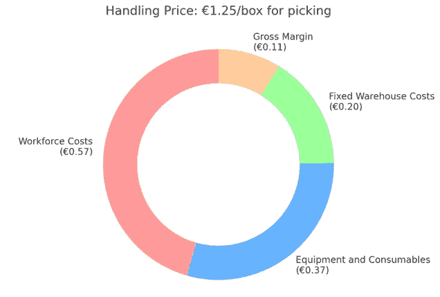
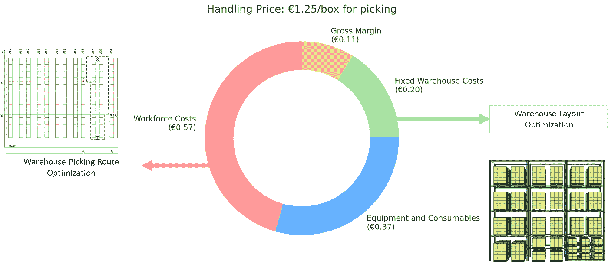
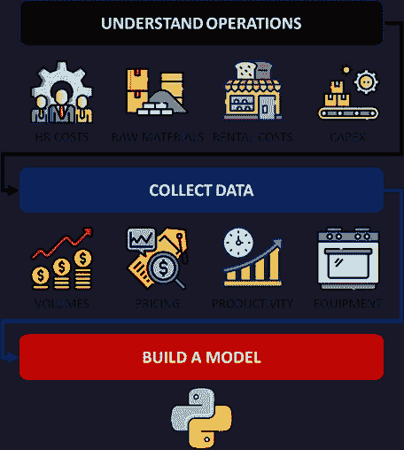
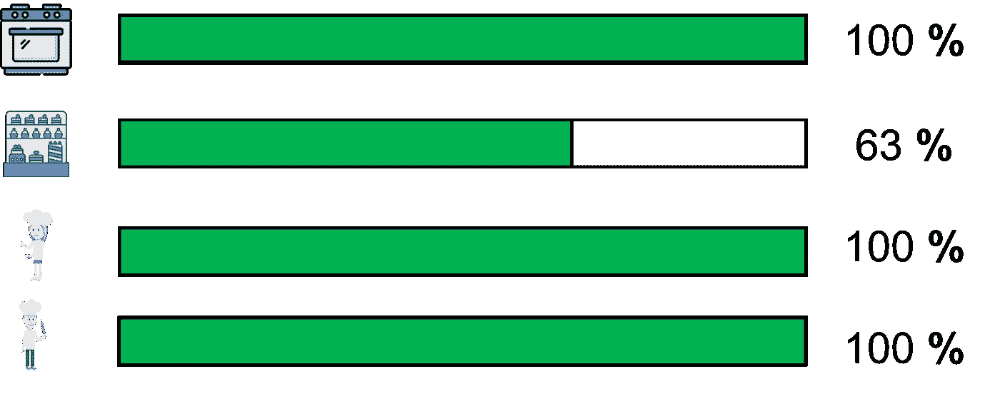

# 你意识到你数据专长在推动商业盈利能力方面的潜力吗？

> 原文：[`towardsdatascience.com/are-you-aware-of-the-potential-of-your-data-expertise-in-driving-business-profitability-16cffb607437?source=collection_archive---------4-----------------------#2024-10-24`](https://towardsdatascience.com/are-you-aware-of-the-potential-of-your-data-expertise-in-driving-business-profitability-16cffb607437?source=collection_archive---------4-----------------------#2024-10-24)

## 一位供应链数据科学家的反思，他偶然发现了数据分析在帮助大小企业方面的力量。

[](https://s-saci95.medium.com/?source=post_page---byline--16cffb607437--------------------------------)[](https://towardsdatascience.com/?source=post_page---byline--16cffb607437--------------------------------) [Samir Saci](https://s-saci95.medium.com/?source=post_page---byline--16cffb607437--------------------------------)

·发表于[Towards Data Science](https://towardsdatascience.com/?source=post_page---byline--16cffb607437--------------------------------) ·11 分钟阅读·2024 年 10 月 24 日

--


图片来源：[Fabian Blank](https://unsplash.com/@blankerwahnsinn?utm_source=medium&utm_medium=referral) via [Unsplash](https://unsplash.com/?utm_source=medium&utm_medium=referral)

我在分析项目中面临的最大挑战是估算一个解决方案的投资回报率（ROI）。

> 销售预测引擎的投资回报率（ROI）是多少？

这是决策者在你提议设计工具来解决他们的运营或业务问题时常常会问的第一个问题。

作为物流解决方案设计经理，我的工作是为零售和时尚公司定价仓储和运输运营。

因此，估算我方案的投资回报率（ROI）变得稍微可控一些，但仍然很难说服决策者。

> 例如，我会解释：“这个算法将提高拣货生产力 25%，这将导致可变成本减少 12%。”

这些成功激励我分享涵盖 60 多个运营案例研究的解决方案，已发布在这个[Medium 博客](https://s-saci95.medium.com/welcome-to-my-profile-5011f02dfbf3)上。

虽然我的重点是改善物流运营，但在过程中发生了一些意想不到的事情：

> 如果我将重点转向商业盈利能力会怎样？

在一个项目中，我将这些工具应用于一个商业案例研究：最大化一家面包店的盈利能力.

我收到的反馈让我意识到，无论是小企业还是大企业，都需要优化他们的利润率，并且自动化数据驱动的决策。

> 通过使用商业语言，我能够更有效地销售我的分析解决方案。

在这篇文章中，我想分享我通过发现数据的力量来帮助企业所获得的见解——以及为什么我认为你也应该考虑这条道路。

```py
Summary

**I. Introduction**
Exploring the challenge of proving ROI in analytics projects
**II. How Did I Develop My Business Acumen?**
Sharing my early career experience as a Solution Design Manager
**III. My journey discovering data analytics for business optimization**
Optimization methods to help a bakery business improve profitability.
**VI. Use your Analytics Skills to Solve Business Problems**
How data analytics can answer the needs of decision makers.
**V. How to Adapt your Analytics Approach to Business Problems?**
The importance of translating business problems into simple analytics solutions 
**VI. Conclusion**
Understanding processes is an important skill to answer business problems
```

## 我是如何培养我的商业敏锐度的？

在我职业生涯的前四年，我为**跨越亚洲的主要国际公司**设计了仓储和运输解决方案。

> 供应链解决方案设计经理的工作是什么？

例如，想象一下像 Costco 这样的零售商希望在上海建立一个配送中心。

1.  他们提供关于交易量和过程需求的数据，通常是在 RFP 中。

1.  我的工作是设计解决方案（布局、人员配置、设备）并基于超过 100 个参数的成本模型来制定定价。

1.  我们向客户展示解决方案，并提供详细的定价表。

> 我们最关心的是什么？毛利率！

为了赢得这个项目，我必须确保具有竞争力的定价，同时保持最低利润率，并且不能低于成本定价。



定价结构 — （图片来自作者）

例如，如果我报价每箱€1.25 用于拣货，我就能准确知道成本和利润是如何分解的

+   **€0.57**用于劳动力成本

+   **€0.37**用于设备和消耗品

+   **€0.20**用于固定仓储成本

+   **€0.11**为我们的毛利（销售额的 8.8%利润）

接下来是什么？你赢得了这笔生意，并签署了一个为期三年的 500 万**欧元预算**合同。

> 但是，如果客户希望将价格降低到每箱€1.10 会发生什么呢？

这在低利润公司中经常发生，比如传统零售商、汽车售后分销商或消费品公司。

你必须找到减少成本的方式，同时保持 8.8%的利润率不变。

因此，我一直在使用数据分析来

+   使用帕累托原则和 Python 减少仓库空间

+   使用路径规划算法提高仓库拣货效率

+   使用图论和 Python 优化运输路线



持续改进举措 — （图片来自作者）

以及许多其他**由数据分析支持的运营改进，这些内容**在[这篇 Medium 博客中分享](https://s-saci95.medium.com/welcome-to-my-profile-5011f02dfbf3)。

> 我可以将类似的方法应用到物流以外的领域吗？

## 我探索数据分析进行商业优化的旅程

这始于我为一家小型物流公司提供咨询服务，该公司将产品运送到巴黎的面包店。

以我作为解决方案设计师的天真视角，我与一家面包店连锁的老板交谈，了解他们的商业模式：

+   一根售价 €1.50 的法棍的利润率是多少（%）？

+   每卖出一个可颂，劳动力成本是多少（€）？

+   你的成本中有多少比例（%）是固定的？

+   你店里最有利润的商品是什么？

令我惊讶的是，他们无法回答这些问题中的任何一个。

我意识到，还有一种做生意的方式，其中价格的设定并不明确了解基础成本，而运营的可视性几乎为零。

> 这是一个巨大的机会——如果我们为这些企业主提供他们迫切需要的可视性和洞察力，会怎么样？

所以，我接受了模拟一家面包店的挑战。

我应用了在物流持续改进项目中使用的相同方法论：

1.  **了解他们当前的运营**：固定和变动成本、瓶颈和收入来源。

1.  **收集和处理数据**，做出必要的假设（例如，每种商品的生产成本和销售价格）。

1.  **建立一个 Python 模型来复制他们当前的设置**并模拟不同的场景。

结果是文章中提出的解决方案：使用 Python 最大化商业盈利。



应用于面包店盈利案例的方法论 — （图像来源：作者）

> 最有利可图的产品组合是什么？

考虑到有限的资源来生产和储存产品，这个模型可以提供最佳的产品组合来销售。

对客户的影响超出了我的预期。

> “这是我第一次能够估算我的商业策略对整体盈利能力的影响，”那位老板说。



添加指标：设备和劳动力使用比例 — （图像来源：作者）

经过几次迭代，我们改进了算法，提供了有趣的见解。

> Samir：“你们生产的瓶颈是人力资源和烤箱的产能。”

对于这样一个简单的算法，用不到一小时编写，感知到的商业价值远远超过我过去的实验。

这标志着我在使用数据分析来推动商业影响的方法上的转折点。

> 你如何利用你的分析技能来支持企业？

## 利用你的分析技能来解决商业问题

自从开始我的[咨询业务](https://www.logi-green.com/)并开发我的可持续[供应链 SaaS](https://bit.ly/green-saas-pitch)以来，我与来自多个行业的几十位企业家进行了交流。

这是一个评估我用数据和商业洞察力解决他们问题能力的机会。

> 他们需要什么？让我们来看看一个例子！

我的一个朋友，他经营着一家小型餐饮企业，使用我的模型来支持决策并最大化收入。


我朋友的商业模型 —— （图片来源：作者）

他们从中国采购可再生杯子，并通过空运或海运将其运送到当地仓库。

从仓库出发，杯子被送到咖啡店和分销商。

> 数据分析在这种情况下能解决哪些问题？

他面临的最大挑战之一是库存管理和现金流。

> “我们不得不拒绝订单，因为我们没有足够的现金支付供应商补货费用，”他解释道。

核心问题很明确：**他们需要清楚了解他们的财务流动。**


咖啡杯的价值链 —— （图片来源：作者）

我需要列出所有相关参数，来解决这个问题并构建价值链模型。

+   供应商的付款条款和交货周期。

+   与客户的服务水平协议和付款条款，按销售渠道（直接客户与分销商）进行细分。

+   固定的运营成本和现金流管理。


业务的模拟引擎 —— （图片来源：作者）

结果是一个用 Python 编写的模拟引擎（具有合理的粒度），它复制了我朋友的业务。

> 接下来是什么？我们可以回答我朋友所有的问题！

我朋友最大的不满是缺乏可视化和无法验证假设。

+   如果我们将库存覆盖周期从 8 周减少到 6 周，会怎么样？

+   使用空运交付会更具成本效益吗？

+   我们是否应该改变销售策略，专注于分销商？

由于涉及的参数复杂，他之前无法得到明确的答案。


所有场景的总结 —— （图片来源：作者）

使用该模型模拟这些假设仅需几秒钟。

这种方法通过确认他们可以安全地减少库存覆盖，而不会影响客户供应，节省了数千欧元。

事实证明，这是一个非常强大的工具，通过简单的分析构建，帮助管理他的业务

+   了解影响价值链的参数

+   模拟“如果”场景来评估商业战略

+   寻找最优设置以最小化成本并最大化盈利

这听起来像是你的业务面临的问题吗？欲了解更多详情，请查看本文

[](/business-planning-with-python-inventory-and-cash-flow-management-4f9beb7ecbec?source=post_page-----16cffb607437--------------------------------) ## 使用 Python 进行商业规划 — 库存和现金流管理

### 小企业的商业规划，用于管理库存、预测流动性需求并最大化盈利能力……

towardsdatascience.com

模型提供的洞察帮助我的朋友减少了运营所需的现金，并降低了销售成本（COGS）。

后来，我们通过解决收入最大化问题，超越了成本降低。

他回来说有另一个与定价策略相关的请求。


定价策略示例 — （图片来源：作者）

与他们的新商业伙伴——一位在餐饮业拥有资本和市场专业知识的专家合作，他们正在制定促进营业额增长的策略。

她提出了多种定价策略，见上文，旨在增加客户的订单数量。

> 我的朋友：“我怎么评估这些策略及其对盈利能力的影响？”

你只需要通过添加定价模块来调整模型，并估算其对盈利能力的影响。

我们可以通过**多种销售量场景**估算每个定价策略的盈利能力及其他商业指标。


模拟定价策略 2 文章: [链接] — （图片来源：作者）

在上表中，我们模拟了定价策略二的影响，假设了七种营业额情景。

> Samir：“你需要获得+200%的增长，才能通过这个策略恢复你的基线情景的盈利能力。”

我们可以通过几次点击评估每个提议的策略。

[](/business-planning-with-python-revenue-optimization-83387074826d?source=post_page-----16cffb607437--------------------------------) ## 使用 Python 进行商业规划 — 收入优化

### 你如何利用数据分析帮助小企业在保持或改善其他方面的同时，最大化收入？

towardsdatascience.com

模型生成的洞察帮助解决了联合创始人之间的激烈讨论。

这一过程使他们就定价策略达成共识，且基于精确的盈利预测。

> 听起来不错，对吧？
> 
> 但是，成功实施这种项目需要什么？

## 如何将分析方法适应商业问题？

正如我多次提到的，为这些项目设计的分析解决方案通常是“技术性基础”的。

我会说，80%的努力都在于将商业问题转化为分析解决方案。

> 保持好奇心！表现出对商业模式的兴趣。

这是一个积极的过程，要求你提出正确的问题，以了解哪些指标对企业主重要，以及如何建模这些流程。


咖啡杯的价值链 — （图片来源：作者）

在达到这种模型化水平之前，我与我的朋友进行了多次迭代，确保我的模型准确反映了他业务的现实。

因此，你需要使你的模型洞察结果对非技术观众可访问，以便他们能帮助你评估结果的准确性。

> 这种解决方案有需求吗？

这是一个市场需求。

自从我开始[全职担任顾问](https://www.logi-green.com)以来，我收到了更多这种类型项目的请求，而不是依赖我的核心供应链工程技能。

由于你直接影响盈利能力并为商业决策者提供可见性，因此获得项目的资本支出（CAPEX）和参与变得更容易。

我们从这两个例子中学到了什么？

+   企业主缺乏对其流程和财务流动的可见性。

+   了解商业模式和流程对于设计正确的仿真模型至关重要。

+   决策者重视数据驱动的洞察力，以支持战略项目。

这种方法适用于各种不同的行业和公司规模的商业案例。

# 结论

我从未想到过，我会从一个优化物流运营的解决方案设计经理，踏上成为帮助企业提高盈利能力的[顾问](https://www.logi-green.com)之路。

这是因为我发现先进的分析工具在业务优化中非常有效。

你不需要关注分析解决方案的复杂性（机器学习、优化或生成 AI），而是要理解业务本身。

> 你听说过可持续性吗？

我目前正在学习关于欧洲**企业可持续发展报告指令（CSRD）**的内容。

这将塑造公司如何报告其可持续发展努力。

这个想法是引入更严格的透明度要求，特别是在环境、社会和治理（ESG）指标方面。


ESG 支柱展示 文章：[链接] — （图片来源：作者）

本文中介绍的我们在商业盈利能力方面的方法**也可以应用于可持续性挑战**。

> 决策者：“我们需要将分销网络的范围 3 排放量减少 30%。”

例如，在这篇关于绿色库存管理的文章中，我分享了一个关于减少商店配送碳排放的案例研究。

这个方法的目标是找到最优配送频率，以最小化 CO2 排放。


绿色库存管理文章：[链接] — （图片由作者提供）

文章中提出的解决这个操作问题的方法是类似的。

1.  了解运营情况

    *为时尚零售商店准备并交付订单*

1.  使用 Python 构建一个仿真模型来估算排放量。

    *输入：销售数据和配送频率 / 输出：CO2 排放量*

1.  测试多个配送频率的不同情境，并计算排放量的减少。

如果你有兴趣寻找减少排放的解决方案，

[](/data-science-for-sustainability-green-inventory-management-e7ddfd97696f?source=post_page-----16cffb607437--------------------------------) ## 数据科学与可持续发展 - 绿色库存管理

### 模拟商店配送频率对时尚零售商 CO2 排放的影响。

towardsdatascience.com

> 针对不同问题的类似方法。

对于任何案例研究，保持好奇心、提出正确的问题并与决策者互动是至关重要的，这样才能真正理解他们的痛点。

通过这样做，你可以创建出能为技术和非技术受众提供可操作性洞察的模型。

根据我的经验，这些洞察可以显著提高盈利能力，并支持运营转型中的决策制定。

如果你还没有考虑将你的专业知识应用到商业挑战中，现在是时候了！

你可能会发现一种新的方式来创造影响——就像我做的一样。

# 关于我

让我们在[Linkedin](https://www.linkedin.com/in/samir-saci/)和[Twitter](https://twitter.com/Samir_Saci_)上建立联系。我是一名使用数据分析来改善物流运营并降低成本的[供应链工程师](https://www.samirsaci.com/blog/)。

若需关于商业分析和可持续供应链转型的咨询或建议，欢迎通过[Logigreen Consulting](https://www.logi-green.com/)与我联系。

如果你对数据分析和供应链感兴趣，请访问我的网站。

[](https://samirsaci.com/?source=post_page-----16cffb607437--------------------------------) [## Samir Saci | 数据科学与生产力

### 这是一个专注于数据科学、个人生产力、自动化、运筹学和可持续发展的技术博客。

[samirsaci.com](https://samirsaci.com/?source=post_page-----16cffb607437--------------------------------)
