# ASCVIT V1：自动化统计计算、可视化和解释工具

> 原文：[`towardsdatascience.com/ascvit-v1-automatic-statistical-calculation-visualization-and-interpretation-tool-aa910001a3a7?source=collection_archive---------2-----------------------#2024-09-16`](https://towardsdatascience.com/ascvit-v1-automatic-statistical-calculation-visualization-and-interpretation-tool-aa910001a3a7?source=collection_archive---------2-----------------------#2024-09-16)

## 轻松实现自动化数据分析：ASCVIT 工具的第一个版本，提供统计计算、可视化和解释功能

[](https://medium.com/@stefanpietrusky?source=post_page---byline--aa910001a3a7--------------------------------)[](https://towardsdatascience.com/?source=post_page---byline--aa910001a3a7--------------------------------) [Stefan Pietrusky](https://medium.com/@stefanpietrusky?source=post_page---byline--aa910001a3a7--------------------------------)

·发表于[Towards Data Science](https://towardsdatascience.com/?source=post_page---byline--aa910001a3a7--------------------------------) ·阅读时间 30 分钟·2024 年 9 月 16 日

--

在我的学习过程中，我参加了一个数据科学研讨会，并首次接触到了统计编程语言 R。当时，我对其可能带来的应用潜力感到着迷。与此同时，得益于机器学习领域的进展，数据的统计评估变得更加简便。当然，这需要一定的技术理解，并且你需要知道某些方法的实际作用。还需要了解哪些数据或输入是某些方法能够正常工作或得出有意义结果的前提。在本文中，我将讨论开发本地应用的第一个版本（V1）的过程，该应用可以用于自动地将各种统计方法应用于任何数据集。这是一个开源项目，旨在用于教育和研究目的。

数据可以以.csv 或.xlsx 格式上传。应用的第一版本提供了一个通用的数据概览（数据预览、数据描述、数据点数量和变量分类）、描述性统计分析（直方图、箱型图、散点图矩阵和相关矩阵）、各种假设检验（t 检验、方差分析和卡方检验）、回归分析（线性回归、逻辑回归和多元回归）、时间序列分析，并支持各种聚类方法（k 均值、层次聚类和 DBSCAN）。该应用是使用 Python 框架 Streamlit 创建的。

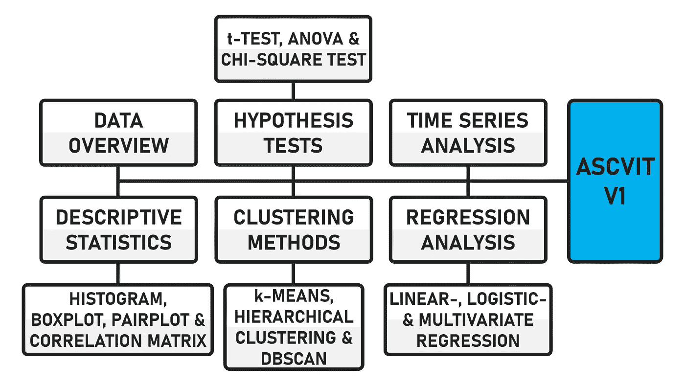

ASCVIT V1 分析方法概览（图片来自作者）

由于代码的模块化结构，可以轻松实现进一步的统计程序。代码中有注释，这使得你更容易上手。当应用程序运行时，上传数据集后界面如下所示。

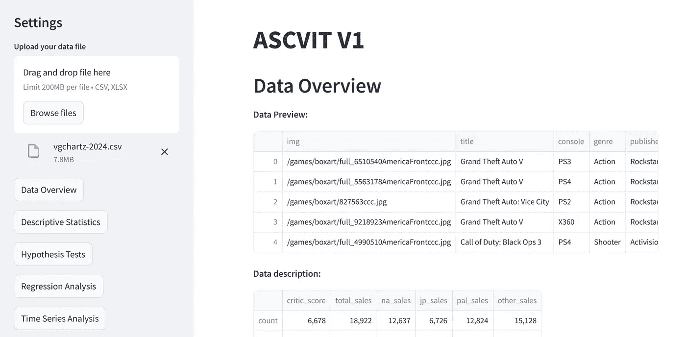

ASCVIT V1 Streamlit 应用程序（图片来自作者）

除了在前述各个领域的自动分析外，还集成了一个功能，能够自动分析统计记录的数值。*“query_llm_via_cli”* 功能使得通过 CLI（命令行界面）与 LLM 进行交流成为可能，使用的是 Ollama。

我已经在我发布的[**Towards Data Science**](https://medium.com/towards-data-science/how-to-talk-to-a-pdf-file-without-using-proprietary-models-cli-streamlit-ollama-6c22437ed932) [1] 文章中解释了这一原理。在应用程序的第一个版本中，此功能仅限于描述性统计分析，但也可以扩展到其他分析上。具体来说，这意味着除了自动统计计算外，应用程序还会自动解读数据。

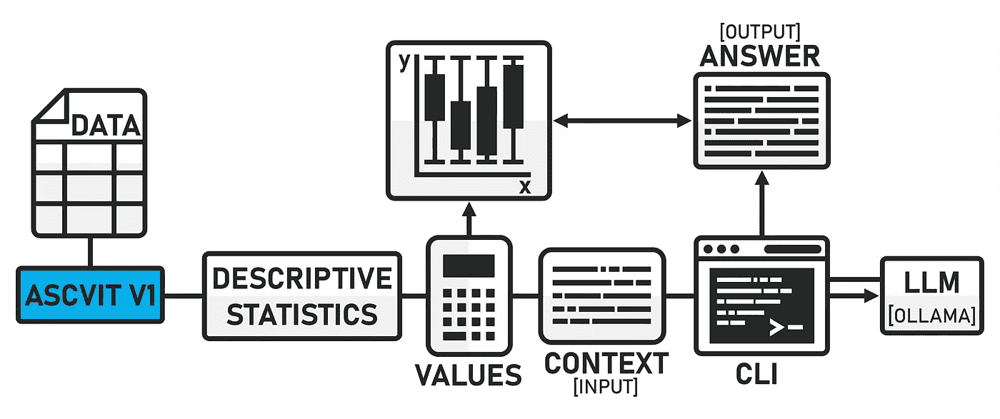

ASCVIT V1 CLI + OLLAMA + LMS（图片来自作者）

## 测试应用程序的数据集

如果你没有自己的数据，可以访问互联网上的多个网站，这些网站提供免费的数据集。用于开发和测试此应用程序的数据集来自[**Maven Analytics**](https://mavenanalytics.io/data-playground?accessType=open&order=date_added%2Cdesc&page=1&pageSize=5)(许可证：ODC-BY) [2]。


MAVEN Analytics 数据游乐场（截图来自作者）

网站上有大量免费的数据集。我所查看的数据涉及从 1976 年到 2024 年间的视频游戏销售数据。具体来说，它记录了北美、日本、欧盟、非洲和其他地区的销售数据。总共有 64016 个游戏标题以及它们的评分、类型、平台等信息。

不幸的是，并非所有标题都有完整的信息。有很多 NaN（非数字）值，这在用 Python 分析时会导致问题或扭曲某些统计分析结果。下面我将简要讨论数据记录的清理过程。

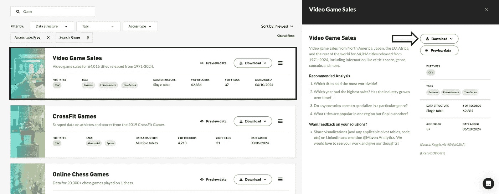

MAVEN Analytics 的视频游戏销售数据（截图来自作者）

## 清理数据集

你可以在将数据集加载到应用程序之前，通过使用单独的脚本清理数据集，或者直接在应用程序中进行清理。在本文的应用程序中，我已在应用程序中直接实现了数据清理。如果你希望提前清理数据记录，可以使用以下脚本进行操作。

```py
import pandas as pd

df = pd.read_csv('YOUR .CSV FILE')
df_cleaned = df.dropna()
df_cleaned.to_csv('cleaned_file.csv', index=False)

print("Lines with missing data have been removed and saved in 'cleaned_file.csv'.")
```

使用*“pd.read_csv(‘.csv’)”*读取文件，并将数据保存到 DataFrame“df”中。*“df.dropna()”*删除 DataFrame 中包含缺失值‘NaN’的所有行。清洗后的 DataFrame 保存在变量*“df_cleaned”*中。使用*“df_cleaned.to_csv(‘cleaned_file.csv’, index=False)”*将数据保存到新的.csv 文件中，且不保存行索引。接下来，输出成功完成的过程*“print(…)”*。该数据集清洗的代码可以在文件*“clean.py”*中找到，并且稍后也可以下载。接下来，让我们进入应用程序的实际代码部分。

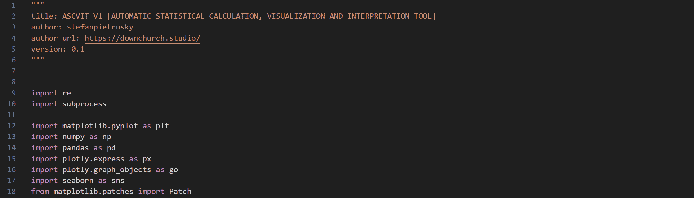

ASCVIT V1 Python 代码片段（作者制作的 GIF）

## 所需的库和模块

使用此应用程序需要各种库和模块，这些库和模块结合在一起执行数据可视化、统计分析和机器学习任务。

```py
import re
import subprocess

import matplotlib.pyplot as plt
import numpy as np
import pandas as pd
import plotly.express as px  
import plotly.graph_objects as go  
import seaborn as sns
from matplotlib.patches import Patch
from scipy import stats
from sklearn.cluster import KMeans, AgglomerativeClustering, DBSCAN
from sklearn.decomposition import PCA
from sklearn.linear_model import LinearRegression, LogisticRegression
from statsmodels.stats.multicomp import pairwise_tukeyhsd

import streamlit as st
```

**关于图表表示的说明。** 有些使用*“pyplot”*（Matplotlib），而有些使用*“plotly”*（例如箱形图）。尽管使用*“plotly”*会产生更互动的图形，但并不意味着每种图表类型都需要使用它。最终，用户必须自行决定图表应如何显示。代码必须相应地进行调整。

可以通过 ZIP 目录中的 requirements.txt 文件使用以下命令安装应用程序所需的库。

```py
pip install -r requirements.txt
```

## 数据概览

函数*“display_data_info()”*专门分析 Pandas DataFrame *“df”*并输出统计关键数据（均值、标准差等）*“df.describe()”*。DataFrame 的总数据点（行数）通过*“len(df)”*输出。同样，DataFrame 的数值型变量*“numerical_columns”*和分类变量*“categorical_columns”*（字符串类型）也会被输出。

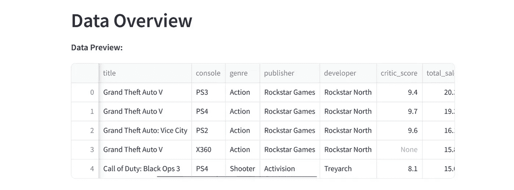

ASCVIT V1 应用数据概览（作者制作的图片）

数据集总共有 64016 个数据点，其中 6 个数值型变量和 8 个分类变量。在开始进行某些统计处理之前，首先应该查看数据。在*“数据概览”*部分，您可以获取各种信息，以得出是否可以进行某些测试的结论。

例如，如果数据集中没有日期变量，则无法进行时间序列分析。如果没有二元变量，则无法进行逻辑回归。该应用程序已经设计为在变量类别不正确时询问或显示错误信息。接下来，让我们继续描述性统计部分。

```py
def display_data_info(df):
    st.write("**Data description:**")
    st.write(df.describe())
    st.write(f"**Number of data points:** {len(df)}")

    numerical_columns = df.select_dtypes(include=np.number).columns.tolist()
    categorical_columns = df.select_dtypes(include='object').columns.tolist()

    st.write("**Numerical variables:** ", ", ".join(numerical_columns))
    st.write("**Categorical variables:** ", ", ".join(categorical_columns))

    return numerical_columns, categorical_columns
```

## 描述性统计

*“descriptive_statistics()”*函数允许用户选择不同的图表类型（直方图、箱型图、对角线图和相关矩阵）。通过*“st.markdown(”“”…“”“)”*可以对这些类型进行简要解释。然后需要选择一个或多个数值变量“selected_vars”。除了相关矩阵外，还可以选择是否应用对数缩放*“apply_log_scale”*。如果数据严重扭曲，应用对数缩放对变量尤其有用。使用相应的图表函数来创建可视化。

```py
def descriptive_statistics(df, numerical_columns):
    chart_type = st.selectbox("Select the diagram:", ["Histogram", "Boxplot", "Pairplot", "Correlation matrix"])

    if chart_type == "Histogram":
        st.markdown("""
        **Histogram:**
        A histogram shows the distribution of a numerical variable. It helps to 
        recognize how frequently certain values occur in the data and whether there are patterns, such as a normal distribution.
        """)
    elif chart_type == "Boxplot":
        st.markdown("""
        **Boxplot:**
        A boxplot shows the distribution of a numerical variable through its quartiles. 
        It helps to identify outliers and visualize the dispersion of the data.
        """)
    elif chart_type == "Pairplot":
        st.markdown("""
        **Pairplot:**
        A pairplot shows the relationships between different numerical variables through scatterplots.
        It helps to identify possible relationships between variables.
        """)
    elif chart_type == "Correlation matrix":
        st.markdown("""
        *Correlation matrix:**
        The correlation matrix shows the linear relationships between numerical variables.
        A positive correlation indicates that high values in one variable also correlate with high values in another.
        """)

    if chart_type in ["Pairplot", "Correlation matrix"]:
        selected_vars = st.multiselect("Select variables:", numerical_columns, default=numerical_columns)
    else:
        selected_vars = [st.selectbox("Select a variable:", numerical_columns)]

    if chart_type != "Correlation matrix":
        apply_log_scale = st.checkbox("Apply logarithmic scaling?", value=False)
    else:
        apply_log_scale = False 

    if st.button("Create diagram"):
        if chart_type == "Histogram":
            plot_histogram(df, selected_vars[0], apply_log_scale)
        elif chart_type == "Boxplot":
            plot_boxplot(df, selected_vars[0], apply_log_scale)
        elif chart_type == "Pairplot":
            plot_pairplot(df, selected_vars)
        elif chart_type == "Correlation matrix":
            plot_correlation_matrix(df, selected_vars)
```

## 直方图函数

*“plot_histogram()”*函数用于根据用户选择的变量创建直方图。开始时，所有 NaN 值都会从变量*“cleaned_data”*中去除。然后计算各种统计关键数字（均值*“mean_value”*、中位数*“median_value”*、标准差*“std_value”*、最小值*“min_value”*、最大值*“max_value”*以及标准差的上下限）。

由于数据是由 LLM（大语言模型）进行解读的，正如前面提到的，数据的离散度（与数据范围相关的标准差）和分布（均值与中位数的差异）被分类。直方图是通过*“fix, ax = plt.subplots()”*创建的，随后添加垂直线以增加信息量，最后通过*“st.pyplot(fig)”*显示直方图。如果数据是扭曲的或呈指数分布，可以激活对数缩放，进而调整直方图的 y 轴。此时，图表看起来如下所示[3]。

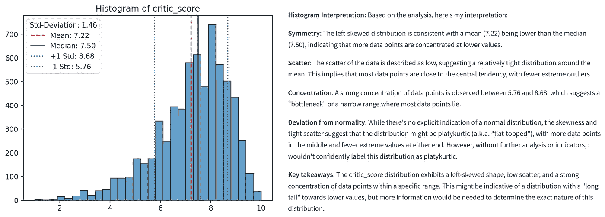

ASCVIT V1 直方图（pyplot）与 LLM 解释（作者提供的图片）

由于目前没有可以直接读取图形的模型，我们为 LLM 创建了一个通用的分析上下文。该上下文包含统计计算结果及附加说明或所需的解释。这意味着，作为 LLM 输入的上下文，可以应用于任何数据集。

具体而言，输入包括上述统计关键数字、分布的分析（对称、右偏或左偏）、扩展范围的估计（低、中或高）以及为 LLM 格式化的解释。根据所需的输出，可以单独调整和进一步指定上下文。

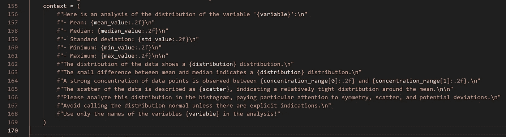

LLM 上下文示例（作者提供的图片）

分析结果通过*“response = query_llm_via_cli(context)”*发送到 LLM，之后在短时间间隔内，根据本地系统的性能，进行直方图的解释*“st.write(f”**Histogram Interpretation:** {response}”)”*。

```py
def plot_histogram(df, variable, apply_log_scale):
    cleaned_data = df[variable].dropna()

    mean_value = cleaned_data.mean()
    median_value = cleaned_data.median()
    std_value = cleaned_data.std()
    min_value = cleaned_data.min()
    max_value = cleaned_data.max()

    std_upper = mean_value + std_value
    std_lower = max(0, mean_value - std_value)  

    concentration_range = (mean_value - std_value, mean_value + std_value)

    if std_value < (max_value - min_value) / 6:
        scatter = "low"
    elif std_value < (max_value - min_value) / 3:
        scatter = "moderate"
    else:
        scatter = "high"

    if abs(mean_value - median_value) < 0.1 * std_value:
        distribution = "symmetrical"
    elif mean_value > median_value:
        distribution = "right-skewed"
    else:
        distribution = "left-skewed"

    fig, ax = plt.subplots()
    ax.hist(cleaned_data, bins=30, edgecolor='black', alpha=0.7)

    ax.axvline(mean_value, color='red', linestyle='--', label=f'Mean: {mean_value:.2f}')
    ax.axvline(median_value, color='green', linestyle='-', label=f'Median: {median_value:.2f}')
    ax.axvline(std_upper, color='blue', linestyle=':', label=f'+1 Std: {std_upper:.2f}')
    ax.axvline(std_lower, color='blue', linestyle=':', label=f'-1 Std: {std_lower:.2f}')
    ax.set_title(f"Histogram of {variable}")
    ax.legend(title=f'Std-Deviation: {std_value:.2f}')

    if apply_log_scale:
        ax.set_yscale('log')

    st.pyplot(fig)

    context = (
        f"Here is an analysis of the distribution of the variable '{variable}':\n"
        f"- Mean: {mean_value:.2f}\n"
        f"- Median: {median_value:.2f}\n"
        f"- Standard deviation: {std_value:.2f}\n"
        f"- Minimum: {min_value:.2f}\n"
        f"- Maximum: {max_value:.2f}\n\n"
        f"The distribution of the data shows a {distribution} distribution.\n"
        f"The small difference between mean and median indicates a {distribution} distribution.\n"
        f"A strong concentration of data points is observed between {concentration_range[0]:.2f} and {concentration_range[1]:.2f}.\n"
        f"The scatter of the data is described as {scatter}, indicating a relatively tight distribution around the mean.\n\n"
        f"Please analyze this distribution in the histogram, paying particular attention to symmetry, scatter, and potential deviations.\n"
        f"Avoid calling the distribution normal unless there are explicit indications.\n"
        f"Use only the names of the variables {variable} in the analysis!"
    )

    response = query_llm_via_cli(context)
    st.write(f"**Histogram Interpretation:** {response}")
```

## 箱型图函数

*“plot_boxplot()”* 函数为用户选择的变量创建箱线图。基于变量，从 DataFrame 中计算统计关键数字，以便在图表中显示数据分布，并使用 LLM 进行集中趋势和离散度分析。除了均值、中位数和标准差之外，与直方图一样，还计算了下四分位数 *“q1”*、上四分位数 *“q3”*、四分位距 *“iqr”*（Q3 — Q1）以及基于四分位距（1.5 * IQR）的下须“lower_whisker”和 *“upper_whisker”*，这些数据也会用于箱线图。

后者有助于识别异常值以及其他超出某个值的数据参数。箱线图是通过 Plotly 库 *“fig = px.box(df, y=variable)”* 创建的，最后在应用程序中显示 *“st.plotly_chart(fig)”*。此图类型也可以使用对数尺度 [4]。图表的样式如下所示：

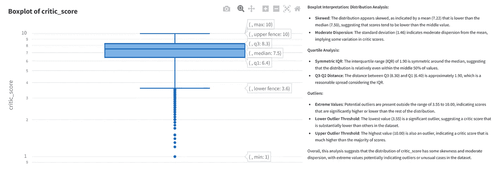

ASCVIT V1 箱线图（plotly），显示 critic_score 和 LLM 解读（作者提供的图片）

与直方图类似，也为箱线图创建了一个上下文，并将其传递给 LLM。统计关键数字以及有关潜在异常值的信息（即那些超出须值的数据）都会被传输。发送给 LLM 的文本已格式化，以便在这些指标上执行分析。

```py
def plot_boxplot(df, variable, apply_log_scale):
    mean_value = df[variable].mean()
    median_value = df[variable].median()
    std_value = df[variable].std()
    q1 = df[variable].quantile(0.25)
    q3 = df[variable].quantile(0.75)
    iqr = q3 - q1
    lower_whisker = max(df[variable].min(), q1 - 1.5 * iqr)
    upper_whisker = min(df[variable].max(), q3 + 1.5 * iqr)

    fig = px.box(df, y=variable)
    fig.update_layout(title=f"Boxplot of {variable}")

    if apply_log_scale:
        fig.update_yaxes(type="log")  

    st.plotly_chart(fig)

    context = (
        f"Here is an analysis of the distribution of the variable '{variable}' based on a boxplot:\n"
        f"- Mean: {mean_value:.2f}\n"
        f"- Median: {median_value:.2f}\n"
        f"- Standard deviation: {std_value:.2f}\n"
        f"- Lower quartile (Q1): {q1:.2f}\n"
        f"- Upper quartile (Q3): {q3:.2f}\n"
        f"- Interquartile range (IQR): {iqr:.2f}\n"
        f"- Potential outliers outside values from {lower_whisker:.2f} to {upper_whisker:.2f}.\n"
        f"Please analyze this distribution and identify patterns or outliers.\n"
        f"Use only the names of the variables {variable} in the analysis!"
    )

    response = query_llm_via_cli(context)
    st.write(f"**Boxplot Interpretation:** {response}")
```

## PAIRPLOT 函数

*“plot_pairplot()”* 函数根据用户选择的变量创建配对图。如果选择的变量少于两个，则会显示错误信息。会显示所有可能的变量组合的散点图，并绘制线性回归线，以显示变量之间的关系。为了使其生效，使用 *“calculate_regression_stats”* 函数计算所有可能的变量对的回归统计数据。所选变量 *“selected_vars”* 中的 NaN 值会被移除。

在这两个变量之间执行线性回归。这里，*“var1”* 是自变量 x，*“var2”* 是因变量 y。计算斜率和 R2 值 *“r_squared”*。结果以元组列表（var1, var2, slope, r_squared）的形式返回。如果选择了三个变量 [*“A”, “B”, “C”*]，则函数会计算对（A, B）、（A, C）、（B, A）、（B, C）等的回归统计 [5]。

```py
def calculate_regression_stats(df, selected_vars):
    regression_results = []
    for var1 in selected_vars:
        for var2 in selected_vars:
            if var1 != var2:
                non_nan_data = df[[var1, var2]].dropna()

                X = non_nan_data[[var1]].values.reshape(-1, 1)
                y = non_nan_data[var2].values

                if len(X) > 0 and len(y) > 0:
                    model = LinearRegression()
                    model.fit(X, y)
                    r_squared = model.score(X, y)
                    slope = model.coef_[0]

                    regression_results.append((var1, var2, slope, r_squared))

    return regression_results

def plot_pairplot(df, selected_vars):
    if len(selected_vars) > 1:
        st.write("**Pairplot with regression lines:**")
        pairplot_fig = sns.pairplot(df[selected_vars], kind='reg', diag_kind='kde', 
                                    plot_kws={'line_kws': {'color': 'red'}, 'scatter_kws': {'color': 'blue'}})
        st.pyplot(pairplot_fig.fig)

        corr_matrix = df[selected_vars].corr()
        regression_stats = calculate_regression_stats(df, selected_vars)
        correlation_list = "\n".join(
            [f"The correlation between {var1} and {var2} is {corr_matrix.at[var1, var2]:.2f}."
             for var1 in corr_matrix.columns for var2 in corr_matrix.columns if var1 != var2]
        )

        regression_list = "\n".join(
            [f"The regression line for {var1} and {var2} has a slope of {slope:.2f} and an R² of {r_squared:.2f}."
             for var1, var2, slope, r_squared in regression_stats]
        )

        context = (
            f"Here are the correlation and regression analyses between the selected variables:\n"
            f"{correlation_list}\n\n"
            f"{regression_list}\n\n"
            f"Please analyze these relationships in detail based solely on the numerical values (correlation and regression lines).\n"
            f"Use only the names of the variables {selected_vars} in the analysis!"
        )

        response = query_llm_via_cli(context)
        st.write(f"**Pairplot Interpretation:** {response}")
    else:
        st.error("At least two variables must be selected for a pairplot.")
```

*“plot_pairplot()”* 函数在对角线上使用 KDE（核密度估计）来显示每个单独变量的分布。与之前的函数一样，也为 LLM 创建了一个上下文进行分析。对于这种类型的图表，LLM 会接收来自相关性和回归分析的数据。文本已格式化，以便生成有关变量之间关系的详细解释。

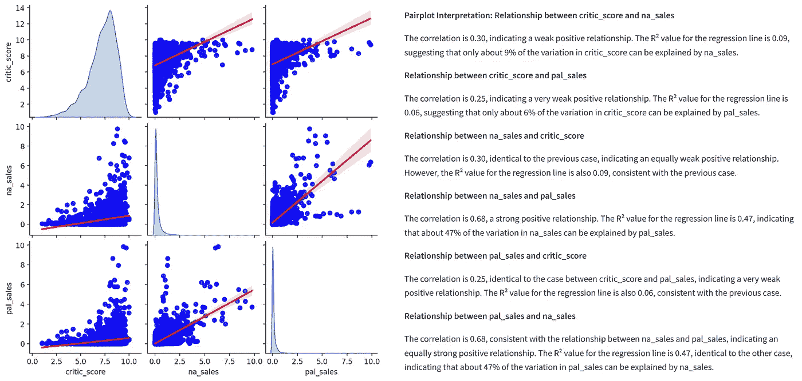

ASCVIT V1 配对图（pyplot），展示 critic_score、na_sales、pal_sales 和 LLM 解释（作者提供的图像）

## 相关矩阵函数

*“plot_correlation_matrix”* 函数用于根据用户选择的变量创建相关矩阵 *“if len(selected_vars) > 1”*。如果只选择了一个变量，将显示错误消息。可视化以热图形式展示。矩阵单元格的颜色表示相关性的强度和方向。显著的相关性会自动发送到 LLM 进行进一步分析 *“if var1 != var2 and abs(corr_matrix.at[var1, var2]) >= 0.5”*。

选定变量之间的线性相关性以相关系数（值在 -1 和 +1 之间）*“corr_matrix = df[selected_vars].cor()”* 的形式展示。若值为 0，表示没有线性相关性。接近 -1 的值表示强烈的负相关，而接近 +1 的值表示强烈的正相关。变量对及其相关值会保存在 *“high_correlations”* [4] 中。

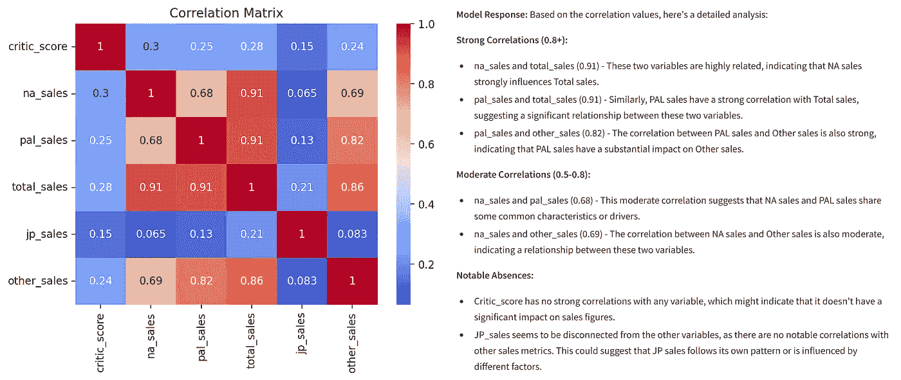

ASCVIT V1 相关矩阵（pyplot），包含所有变量及 LLM 解释（作者提供的图像）

为 LLM 创建了一个上下文。现有的显著相关性被分类为文本描述 *“correlation_list”*。若相关性较强（无论是正相关还是负相关），其值大于 0.7。如果值介于 0.5 和 0.7 之间，则表示中等相关性，而如果值仅略高于 0.5，则表示相关性较弱。如果未发现显著相关性，则会显示相应的消息。

```py
def plot_correlation_matrix(df, selected_vars):
    if len(selected_vars) > 1:
        corr_matrix = df[selected_vars].corr()

        fig, ax = plt.subplots()
        sns.heatmap(corr_matrix, annot=True, cmap='coolwarm', ax=ax)
        ax.set_title("Correlation Matrix")
        st.pyplot(fig)

        high_correlations = []
        for var1 in corr_matrix.columns:
            for var2 in corr_matrix.columns:
                if var1 != var2 and abs(corr_matrix.at[var1, var2]) >= 0.5:  
                    if (var2, var1) not in [(v1, v2) for v1, v2, _ in high_correlations]:  
                        high_correlations.append((var1, var2, corr_matrix.at[var1, var2]))

        if high_correlations:
            correlation_list = "\n".join([f"- {var1} and {var2} have a correlation value of {value:.2f}, "
                                        f"indicating a {'strong' if abs(value) > 0.7 else 'moderate' if abs(value) > 0.5 else 'weak'} correlation."
                                        for var1, var2, value in high_correlations])

            context = (
                f"Here is an analysis of the significant correlations between the selected variables in the correlation matrix:\n"
                f"{correlation_list}\n\n"
                f"Please analyze the correlations solely based on their strength and significance.\n"
                f"Use only the names of the variables {selected_vars} in the analysis!"
                f"Focus in detail on the statistical relationship and patterns."
            )

            response = query_llm_via_cli(context)
            st.write(f"**Model Response:** {response}")
        else:
            st.write("**No significant correlations were found.**")
    else:
        st.write("**The correlation matrix cannot be displayed because fewer than two variables were selected.**")
```

在以下统计程序中，LLM 记录的各项关键数据的解释不可用。然而，基于先前的程序，独立实施应该不成问题。现在让我们转向各种假设检验。

## 假设检验选择

在当前版本中，可以进行三种不同的检验（t 检验、方差分析（ANOVA）和卡方检验） *“test_type = st.selectbox()”*。根据选择的检验类型，会出现简要的说明，解释其用途。根据应用领域，这些描述可以扩展或移除。t 检验用于比较两组的均值。方差分析（ANOVA）用于比较多于两组的均值。卡方检验用于检验两个分类变量之间的独立性。根据选择的检验，执行相应的函数。

## T 检验

如果用户选择了 t 检验，他们必须选择一个组变量（类别型）*“group_col”* 和一个数值变量（数值型）*“value_col”*。组变量定义了要比较的两组，数值变量比较这两组的均值。一旦选择完成，必须在文本框 *“st.text_input()”* 中输入两组的名称 *“group1”* 和 *“group2”*。这两组应该出现在所选的类别变量中。这里也提供了对数标度 *“apply_log_scale”*，它应用于数值变量。当进行检验时，提取组的数据并输出数据点数量（移除 NaN 值后）。然后显示 t 统计量和 p 值。

第一个值表示两组之间均值差异与数据分布的相对关系。是否存在显著的组间差异由 p 值指示。如果 p 值小于 0.05，则说明差异显著。为了直观地突出显示两组的分布，*“filtered_df = df[df[group_col].isin([group1, group2])]”*，创建了一个箱形图 *“fig, ax = plt.subplots()”*。这里使用了*“pyplot”*，你也可以选择使用*“plotly”* [6]。

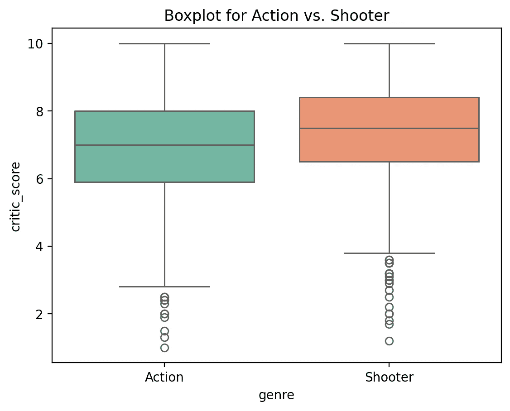

ASCVIT V1 箱形图，按类型（动作/射击）和评论分数分类（图像来源：作者）

在此示例中，*“genre”* 被选为组变量，*“critic_score”* 被选为数值变量。动作（组 1）和射击（组 2）被定义为比较组。该函数还计算组内是否存在显著的离群值。离群值被定义为超出上四分位数 1.5 倍四分位距的数据点 *“outliers_group1/2”*。最后，找到的离群值会被显示出来，以确认 t 检验的有效性。如果偏差过大，必须相应考虑，以便更好地分类检验结果的可靠性和可解释性。

```py
def t_test(df, numerical_columns, categorical_columns):
    group_col = st.selectbox("Choose the group variable:", categorical_columns)
    value_col = st.selectbox("Choose the value variable:", numerical_columns)

    group1 = st.text_input("Name of group 1:")
    group2 = st.text_input("Name of group 2:")

    apply_log_scale = st.checkbox("Apply logarithmic scaling?", value=False)

    if st.button("Perform t-Test"):
        group1_data = df[df[group_col] == group1][value_col]
        group2_data = df[df[group_col] == group2][value_col]

        initial_count_group1 = len(group1_data)
        initial_count_group2 = len(group2_data)

        group1_data = group1_data.dropna()
        group2_data = group2_data.dropna()

        remaining_count_group1 = len(group1_data)
        remaining_count_group2 = len(group2_data)

        st.write(f"**Group 1 ({group1}):** Total number of data points: {initial_count_group1}, without NaN: {remaining_count_group1}")
        st.write(f"**Group 2 ({group2}):** Total number of data points: {initial_count_group2}, without NaN: {remaining_count_group2}")

        if apply_log_scale:
            group1_data = np.log1p(group1_data)
            group2_data = np.log1p(group2_data)

        if not group1_data.empty and not group2_data.empty:

            t_stat, p_value = stats.ttest_ind(group1_data, group2_data)
            st.markdown(f"**t-Statistic:** {t_stat}")
            st.markdown(f"**p-Value:** {p_value}")

            filtered_df = df[df[group_col].isin([group1, group2])]
            fig, ax = plt.subplots()
            sns.boxplot(x=filtered_df[group_col], y=filtered_df[value_col], ax=ax, palette="Set2")
            ax.set_title(f"Boxplot for {group1} vs. {group2}")

            if apply_log_scale:
                ax.set_yscale('log')

            st.pyplot(fig)

            outliers_group1 = group1_data[group1_data > group1_data.quantile(0.75) + 1.5 * (group1_data.quantile(0.75) - group1_data.quantile(0.25))]
            outliers_group2 = group2_data[group2_data > group2_data.quantile(0.75) + 1.5 * (group2_data.quantile(0.75) - group2_data.quantile(0.25))]

            st.write("**Outlier Analysis:**")
            if not outliers_group1.empty:
                st.write(f"In group 1 ({group1}) there are {len(outliers_group1)} outliers.")
            else:
                st.write(f"In group 1 ({group1}) there are no significant outliers.")

            if not outliers_group2.empty:
                st.write(f"In group 2 ({group2}) there are {len(outliers_group2)} outliers.")
            else:
                st.write(f"In group 2 ({group2}) there are no significant outliers.")
        else:
            st.error("One or both groups contain no data after removing NaN values.")
```

## **ANOVA 检验**

*“anova_test()”* 函数集成了执行 ANOVA 检验的选项。该检验用于检查多个组的均值是否存在显著差异。数据首先被清洗 *“df_clean”*。如果 ANOVA 检验显著，还会进行 Tukey 的 HSD 检验（诚实显著差异）。首先，再次定义一个组变量和一个数值变量。如果某个组的数据点少于 2 个，它将被排除 *“valid_groups = group_sizes[group_sizes >= 2].index”*。

如果调整后剩余的组少于两个，则会显示错误信息，且不执行该测试。ANOVA 测试计算 F 值和 p 值。F 值衡量组间的变异性与组内变异性的比值。p 值则指示组间均值差异是否显著。如果 p 值小于 0.05，则至少有一个组存在显著差异。为了可视化结果，使用 *“pyplot”* 创建箱型图 [7]。

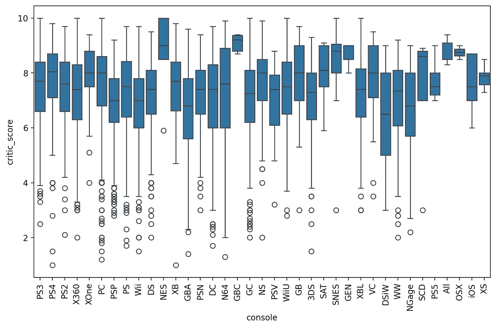

ASCVIT V1 箱型图与控制台和评分（图像来源：作者）

如果 ANOVA 测试结果显著，则进行 Tukey 测试，以具体检验各组之间的差异。因此，ANOVA 测试并不显示哪些组之间存在差异。会创建一个图表，显示各组之间的配对均值差异及其置信区间 *“st.pyplot(tukey.plot_simultaneous())”*。

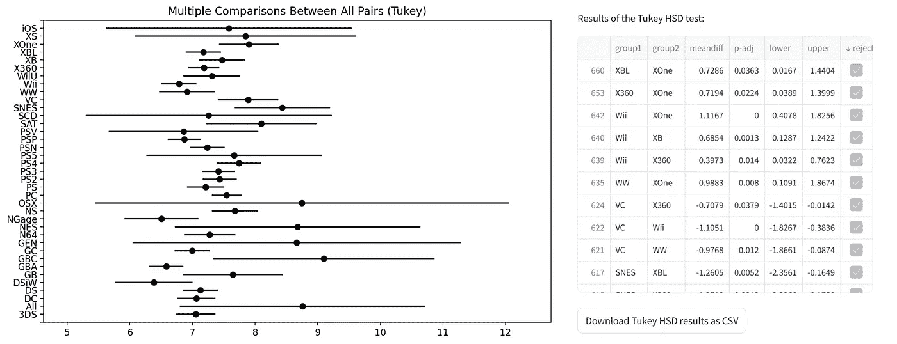

ASCVIT V1 Tukey 测试结果（图像来源：作者）

在图表下方，结果以表格形式显示，*“st.dataframe(tukey_results_df, height=400)”*。该表包含两组数据、均值差异 *“meandiff”*、调整后的 p 值 *“p-adj”*、置信区间以及是否可以拒绝原假设 *“reject”*（True = 显著，False = 不显著）。以下是置信区间的简要示例：对于 3DS 和 GBA 控制台，区间位于 -0.9319 和 -0.0061 之间，因此完全低于零。均值差异是显著的。

关键数字可以用于通过 LLM 解读结果。还可以选择将数据作为 .csv 文件下载，以便进一步进行统计分析（例如回归分析）[7]。

```py
def anova_test(df, numerical_columns, categorical_columns):
    group_col = st.selectbox("Choose the group variable:", categorical_columns)
    value_col = st.selectbox("Choose the value variable:", numerical_columns)

    if st.button("Perform ANOVA"):
        df_clean = df[[group_col, value_col]].dropna()

        group_sizes = df_clean.groupby(group_col).size()
        valid_groups = group_sizes[group_sizes >= 2].index
        df_filtered = df_clean[df_clean[group_col].isin(valid_groups)]

        if len(valid_groups) < 2:
            st.error("After removing small groups, there are not enough groups left for the ANOVA test.")
        else:
            grouped_data = [group[value_col].values for name, group in df_filtered.groupby(group_col)]
            try:
                anova_result = stats.f_oneway(*grouped_data)
                st.markdown(f"**F-Value:** {anova_result.statistic}")
                st.markdown(f"**p-Value:** {anova_result.pvalue}")

                fig, ax = plt.subplots(figsize=(10, 6))
                sns.boxplot(x=group_col, y=value_col, data=df_filtered, ax=ax)
                plt.xticks(rotation=90)
                st.pyplot(fig)

                if anova_result.pvalue < 0.05:
                    st.write("The ANOVA test is significant. Tukey's HSD test will be performed.")
                    try:
                        tukey = pairwise_tukeyhsd(endog=df_filtered[value_col], groups=df_filtered[group_col], alpha=0.05)
                        st.pyplot(tukey.plot_simultaneous())

                        tukey_results_df = pd.DataFrame(data=tukey.summary().data[1:], columns=tukey.summary().data[0])
                        st.write("Results of the Tukey HSD test:")
                        st.dataframe(tukey_results_df, height=400)

                        csv = tukey_results_df.to_csv(index=False)
                        st.download_button(label="Download Tukey HSD results as CSV", data=csv, file_name='tukey_hsd_results.csv', mime='text/csv')

                    except Exception as e:
                        st.error(f"An error occurred during Tukey's HSD test: {str(e)}")

            except ValueError as e:
                st.error(f"An error occurred: {str(e)}.")
```

## **卡方检验**

*“chi_square_test()”* 函数检查两个分类变量之间是否存在统计学显著关系。由于只能使用分类变量，因此不需要激活对数缩放选项。具体来说，它检查类别中观测频率是否相互独立，或者是否存在相关性。用户选择两个现有的分类变量。NaN 值会被移除，并且每个变量仅选择前 10 个最频繁的类别，以保持分析的可管理性，*“value_counts().nlargest(10).index”*。

创建了一个交叉表 *“contingency_table”*，它使用热图显示两个选定变量中类别组合的频率。如果交叉表无效（数据过少或仅有一个类别），则不执行该测试 [8]。

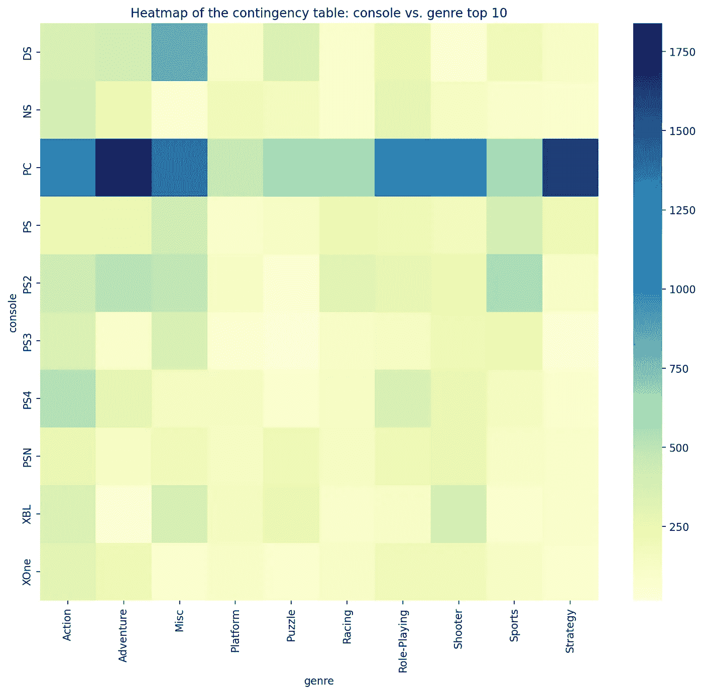

ASCVIT V1 带有类型和控制台的热图（图像来源：作者）

测试计算各种值。卡方值*“chi2”*确定观察频率与预期频率之间差异的程度。高值表明差异很大。与其他分析一样，p 值*“p”*显示差异是否显著。还指示了测试的自由度*“dof”*以及预期频率*“expected”*。

```py
def chi_square_test(df, categorical_columns):
    cat_var1 = st.selectbox("Choose the first group variable:", categorical_columns)
    cat_var2 = st.selectbox("Choose the second group variable:", categorical_columns)

    if st.button("Perform Chi-square test"):
        df_clean = df[[cat_var1, cat_var2]].dropna()

        top_cat_var1 = df_clean[cat_var1].value_counts().nlargest(10).index
        top_cat_var2 = df_clean[cat_var2].value_counts().nlargest(10).index
        df_filtered = df_clean[df_clean[cat_var1].isin(top_cat_var1) & df_clean[cat_var2].isin(top_cat_var2)]

        try:
            contingency_table = pd.crosstab(df_filtered[cat_var1], df_filtered[cat_var2])

            if contingency_table.empty or contingency_table.shape[0] < 2 or contingency_table.shape[1] < 2:
                st.error("The contingency table is invalid. Check the variables.")
            else:
                chi2, p, dof, expected = stats.chi2_contingency(contingency_table)
                st.markdown(f"**Chi-square:** {chi2}")
                st.markdown(f"**p-Value:** {p}")

                st.write("**Heatmap of the contingency table:**")
                fig, ax = plt.subplots(figsize=(12, 10))  # Larger display
                sns.heatmap(contingency_table, annot=False, cmap="YlGnBu", ax=ax)
                ax.set_title(f"Heatmap of the contingency table: {cat_var1} vs. {cat_var2} top 10")
                plt.xticks(rotation=90)
                st.pyplot(fig)

        except ValueError as e:
            st.error(f"An error occurred: {str(e)}.")
```

## 回归分析选择

可用回归分析（线性回归、逻辑回归和多元回归）的选择方式与选择各种假设检验相似。选择分析方法后，将显示简短的说明，并调用相应的函数。

## 线性回归分析

在*“linear_regression()”*函数的开始，创建一个由上传数据集中所有可用数值型变量构成的相关矩阵*“corr_matrix = df[numerical_columns].corr()”*。该矩阵旨在帮助用户理解变量之间的关系，以便识别适合回归分析的变量和不适合的变量（多重共线性）。

最后，选择因变量和一个或多个自变量。数据被清理后，为所有选择的自变量创建线性回归模型*“model = LinearRegression()”*。回归系数和截距被指定。在总体模型运行完成后，为每个自变量创建单独的线性回归模型，并通过散点图表示[9]。

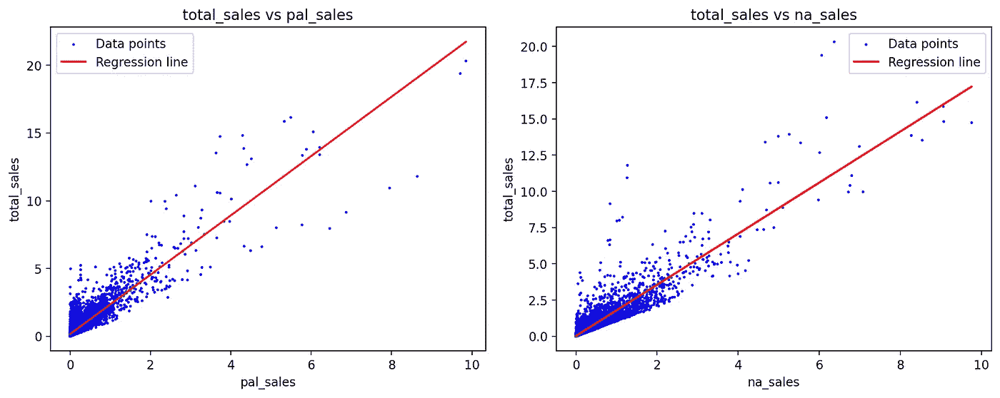

ASCVIT V1 线性回归 pal_sales、na_sales 和 total_sales（图像由作者提供）

显示的回归系数表示当相应的自变量变化一个单位时，因变量的变化程度。假设所有其他变量保持不变。当所有自变量为零时，因变量所取的值由截距指示。

```py
def linear_regression(df, numerical_columns):
    st.write("**Correlation matrix of numerical variables:**")
    corr_matrix = df[numerical_columns].corr()
    fig, ax = plt.subplots(figsize=(10, 8))
    sns.heatmap(corr_matrix, annot=True, cmap='coolwarm', ax=ax)
    st.pyplot(fig)

    dependent_var = st.selectbox("Choose the dependent variable:", numerical_columns)
    independent_vars = st.multiselect("Choose the independent variables:", numerical_columns)

    if independent_vars:
        if st.button("Perform regression"):
            X = df[independent_vars].dropna()
            y = df[dependent_var].loc[X.index]
            y = y.dropna()
            X = X.loc[y.index]

            if y.isnull().values.any():
                st.error("The dependent variable still contains missing values. Please clean the data.")
            else:
                model = LinearRegression()
                model.fit(X, y)

                st.markdown("**Regression coefficients:**")
                for var, coef in zip(independent_vars, model.coef_):
                    st.write(f"- {var}: {coef}")
                st.write(f"**Intercept:** {model.intercept_}")

                for var in independent_vars:
                    X_single_var = X[[var]]  # Use only the current independent variable
                    model_single = LinearRegression()
                    model_single.fit(X_single_var, y)

                    fig, ax = plt.subplots()
                    ax.scatter(X[var], y, edgecolor='none', facecolors='blue', s=5, label='Data points')

                    ax.plot(X[var], model_single.predict(X_single_var), color='red', label='Regression line')
                    ax.set_xlabel(var)
                    ax.set_ylabel(dependent_var)
                    ax.set_title(f"{dependent_var} vs {var}")
                    ax.legend()
                    st.pyplot(fig)
```

## 逻辑回归分析

与其他功能一样，用户在开始时选择因变量和自变量。在此分析方法中，因变量必须是二元的（0/1）。为了演示该功能，我创建了一些与迄今为止使用的数据集无关的数据。或者，你也可以手动调整变量的值，只要类别数目不太多。如果选择了错误的变量，将显示相应的错误信息。

如果所有内容都正确定义，则执行逻辑回归，模型使用自变量来建模目标变量的概率。具体而言，这是指事件发生的概率。每个自变量都有相应的系数，并且逻辑函数会被可视化。这展示了当自变量变化时，目标结果（1 而非 0）的概率如何变化[10]。

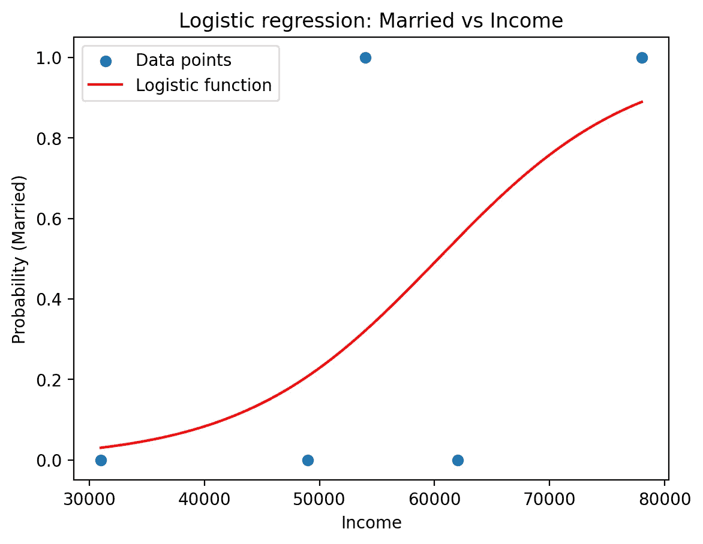

ASCVIT V1 逻辑回归演示用途的虚构值（图片来源：作者）

在散点图中，红线代表目标结果的预测概率，即结果 1 发生的概率。自变量发生变化。*“logistic_regression()”* 函数非常适用于二分类问题，在该问题中，您希望根据多个因素预测事件的发生。

```py
def logistic_regression(df, numerical_columns):
    dependent_var = st.selectbox("Choose the dependent variable (binary):", numerical_columns)
    independent_vars = st.multiselect("Choose the independent variables:", numerical_columns)

    if independent_vars:
        if st.button("Perform logistic regression"):
            X = df[independent_vars].dropna()
            y = df[dependent_var].loc[X.index].dropna()
            X = X.loc[y.index]

            unique_values = y.unique()
            if len(unique_values) != 2:
                st.error("The dependent variable must be binary (e.g., 0 and 1).")
            else:
                model = LogisticRegression()
                model.fit(X, y)

                st.write("**Logistic regression coefficients:**")
                for var, coef in zip(independent_vars, model.coef_[0]):
                    st.write(f"- {var}: {coef}")
                st.write(f"**Intercept:** {model.intercept_[0]}")

                for var in independent_vars:
                    fig, ax = plt.subplots()

                    ax.scatter(X[var], y, label='Data points')
                    x_range = np.linspace(X[var].min(), X[var].max(), 300).reshape(-1, 1)
                    X_copy = pd.DataFrame(np.tile(X.mean().values, (300, 1)), columns=X.columns)
                    X_copy[var] = x_range.flatten()  # Vary the current variable var
                    y_prob = model.predict_proba(X_copy)[:, 1]

                    ax.plot(x_range, y_prob, color='red', label='Logistic function')
                    ax.set_xlabel(var)
                    ax.set_ylabel(f'Probability ({dependent_var})')
                    ax.set_title(f'Logistic regression: {dependent_var} vs {var}')
                    ax.legend()
                    st.pyplot(fig)
```

## 多元回归分析

在多元回归分析中，用户必须选择多个因变量和一个或多个自变量。分析将检视因变量如何受到自变量的影响。选择变量后，NaN 值将被再次删除，必要时会显示错误信息。模型输出所有因变量的回归系数和截距。

为所有自变量和因变量的组合创建带回归线的散点图。这个功能使得可以同时分析多个目标变量，并且建立它们与多个预测因子之间的关系[11]。

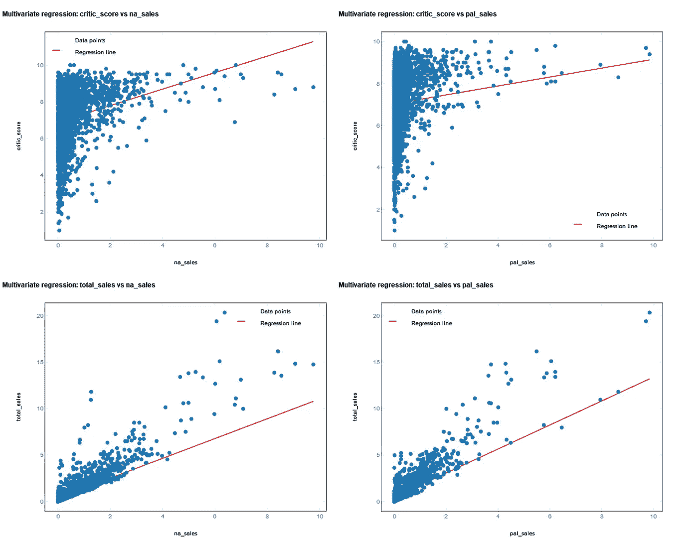

ASCVIT V1 多元回归（plotly）示例（图片来源：作者）

```py
def multivariate_regression(df, numerical_columns):
    dependent_vars = st.multiselect("**Choose the dependent variables (multiple):**", numerical_columns)
    independent_vars = st.multiselect("**Choose the independent variables:**", numerical_columns)

    if dependent_vars and independent_vars:
        if st.button("Perform multivariate regression"):
            X = df[independent_vars].dropna()
            Y = df[dependent_vars].loc[X.index].dropna()
            X = X.loc[Y.index]

            if X.shape[1] != len(independent_vars) or Y.shape[1] != len(dependent_vars):
                st.error("The number of independent or dependent variables does not match.")
                return

            model = LinearRegression()
            model.fit(X, Y)

            st.write("**Multivariate regression coefficients:**")
            for i, dep_var in enumerate(dependent_vars):
                st.write(f"\nFor the dependent variable: **{dep_var}**")
                st.write(f"Intercept: {model.intercept_[i]}")
                for var, coef in zip(independent_vars, model.coef_[i]):
                    st.write(f"- {var}: {coef}")

            for dep_var in dependent_vars:
                for var in independent_vars:
                    fig, ax = plt.subplots()
                    ax.scatter(X[var], Y[dep_var], label='Data points')

                    x_range = np.linspace(X[var].min(), X[var].max(), 300).reshape(-1, 1)
                    X_copy = pd.DataFrame(np.tile(X.mean().values, (300, 1)), columns=X.columns)
                    X_copy[var] = x_range.flatten()

                    y_pred = model.predict(X_copy)

                    ax.plot(x_range, y_pred[:, dependent_vars.index(dep_var)], color='red', label='Regression line')
                    ax.set_xlabel(var)
                    ax.set_ylabel(dep_var)
                    ax.set_title(f'Multivariate regression: {dep_var} vs {var}')
                    ax.legend()
                    st.plotly_chart(fig)
```

## 时间序列分析

该分析方法进行的是时间上的分析。为此，将给定的时间序列按年分组，并计算并显示值的年均值。该分析需要一个时间变量；如果使用的数据集不包含该变量，则无法进行分析。在我选择的数据集中，包含了变量 *“release_date”*，它记录了每个游戏的发布日期。

所选时间变量被转换为日期格式 *“df[time_var]”*。如果数据点无效，则会将其转换为 NaN 值并删除 *“df = df.dropna(subset=[time_var])”*。然后，数据按年分组 *“df[‘year’] = df[time_var].dt.year”*，并计算指定值变量“value_var”的年均值 *“yearly_avg”*。计算值变量的最小和最大年均值以及所有数据点的总体均值 *“overall_avg”*。接着，以折线图的形式显示每年的值变量年均值。总体均值集成在水平线上。为了提高可读性，值会交替显示在数据点的上下方[12]。

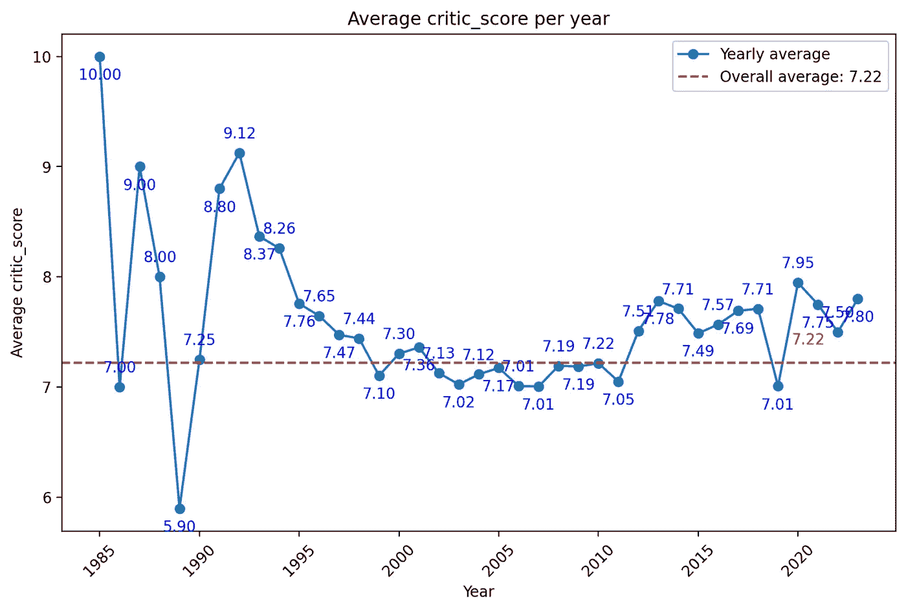

ASCVIT V1 时间序列分析与年份和 critic_score（图片来自作者）

重要的统计关键指标显示在图表下方，可以像描述性分析一样使用 LLM 轻松解释。具体来说，显示了标准差、方差以及值变量和年份的最小值和最大值。*“perform_time_series_analysis()”*函数适用于分析数据序列中的时间趋势。这可以对时间的变异性进行初步分析。

```py
def perform_time_series_analysis(df, time_var, value_var):
    df[time_var] = pd.to_datetime(df[time_var], errors='coerce')
    df = df.dropna(subset=[time_var])

    if df.empty:
        st.error("**Error:** The time variable has an incorrect format.")
    else:
        df['year'] = df[time_var].dt.year
        yearly_avg = df.groupby('year')[value_var].mean().reset_index()

        y_min = yearly_avg[value_var].min()
        y_max = yearly_avg[value_var].max()
        y_range = y_max - y_min
        y_buffer = y_range * 0.05

        overall_avg = df[value_var].mean()

        fig, ax = plt.subplots(figsize=(10, 6))
        ax.plot(yearly_avg['year'], yearly_avg[value_var], marker='o', label='Yearly average')
        ax.axhline(overall_avg, color='red', linestyle='--', label=f'Overall average: {overall_avg:.2f}')
        ax.set_title(f'Average {value_var} per year')
        ax.set_xlabel('Year')
        ax.set_ylabel(f'Average {value_var}')
        ax.set_ylim(y_min - y_buffer, y_max + y_buffer)

        ax.text(yearly_avg['year'].max() - (yearly_avg['year'].max() - yearly_avg['year'].min()) * 0.05, 
                overall_avg + y_buffer, 
                f'{overall_avg:.2f}', color='red', ha='right', va='center')

        for i in range(len(yearly_avg)):
            if i % 2 == 0:
                ax.text(yearly_avg['year'][i], yearly_avg[value_var][i] + y_buffer/2, 
                        f'{yearly_avg[value_var][i]:.2f}', color='blue', ha='center', va='bottom')
            else:
                ax.text(yearly_avg['year'][i], yearly_avg[value_var][i] - y_buffer/2, 
                        f'{yearly_avg[value_var][i]:.2f}', color='blue', ha='center', va='top')

        plt.xticks(rotation=45)
        ax.legend()
        st.pyplot(fig)

        st.write(f"**Standard deviation:** {df[value_var].std():.2f}")
        st.write(f"**Variance:** {df[value_var].var():.2f}")
        st.write(f"**Minimum {value_var}:** {y_min:.2f} in year {yearly_avg.loc[yearly_avg[value_var].idxmin(), 'year']}")
        st.write(f"**Maximum {value_var}:** {y_max:.2f} in year {yearly_avg.loc[yearly_avg[value_var].idxmax(), 'year']}")
```

## 聚类方法选择

与假设检验和回归分析类似，在聚类方法领域也有多种选项可供选择。选择函数的结构与其他方法相似。选择一种方法并执行相应的函数，同时也会显示该方法的简要说明。根据不同的方法，必须定义簇的数量。对于 k-Means 和层次聚类，可以定义最多 10 个簇。对于 DBSCAN，则需要查询半径*“eps”*和每个簇的最小点数*“min_samples”*。每种方法必须选择至少两个数值变量。

## k-Means 聚类

k-Means 算法将数据分为*“n_clusters”*个簇。数据点的分组方式是使得簇内数据点之间的距离最小化。簇的数量由用户确定。根据该数量，算法计算出每个数据点属于哪个簇。结果会发送到*“visualize_clusters()”*函数进行可视化[13]。

```py
def perform_kmeans(X, n_clusters):
    kmeans = KMeans(n_clusters=n_clusters, random_state=42)
    X['Cluster'] = kmeans.fit_predict(X)

    visualize_clusters(X, 'k-Means Clustering')
```

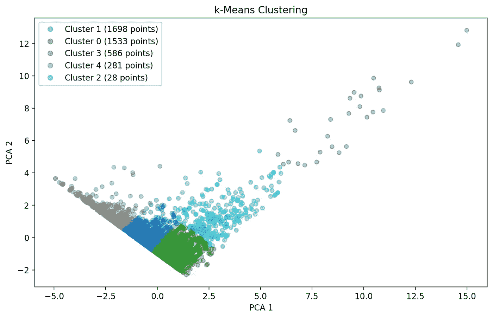

ASCVIT V1 k-Means 聚类与 PCA 降维（图片来自作者）

## 层次聚类

在这里创建了一个簇的层次结构，可以使用聚合或分割方法。该函数使用的是聚合聚类方法，其中每个数据点最初被视为一个独立的簇，然后依次合并。簇的数量由用户确定，算法根据数量进行数据划分。与 k-Means 相同的函数用于可视化*“visualize_clusters(X, ‘Hierarchical Clustering’)”* [14]。

```py
def perform_hierarchical_clustering(X, n_clusters):
    hierarchical_clustering = AgglomerativeClustering(n_clusters=n_clusters)
    X['Cluster'] = hierarchical_clustering.fit_predict(X)

    visualize_clusters(X, 'Hierarchical Clustering')
```

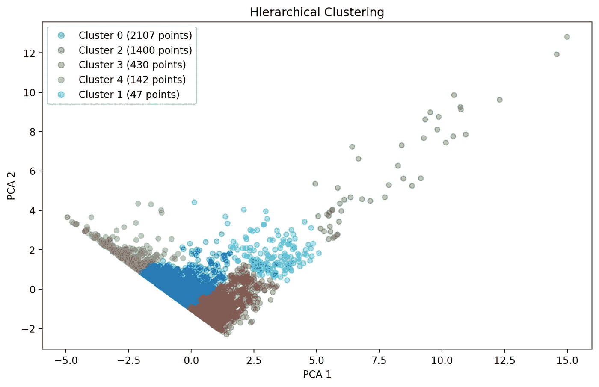

ASCVIT V1 层次聚类与 PCA 降维（图片来自作者）

## DBSCAN 聚类

通过这种方法，数据点根据其周围环境的密度进行分组。该方法非常适合检测异常值（噪声）并发现任何形状的簇。在这里，用户不指定簇的数量，而是指定两个点之间的最大距离*“eps”*，超过该距离就认为它们是邻居。同时，还定义了簇中出现的最小点数*“min_samples”*。可视化也通过*“visualize_clusters()”*函数生成[15]。

```py
def perform_dbscan(X, eps, min_samples):
    dbscan = DBSCAN(eps=eps, min_samples=min_samples)
    X['Cluster'] = dbscan.fit_predict(X)

    visualize_clusters(X, 'DBSCAN Clustering')
```

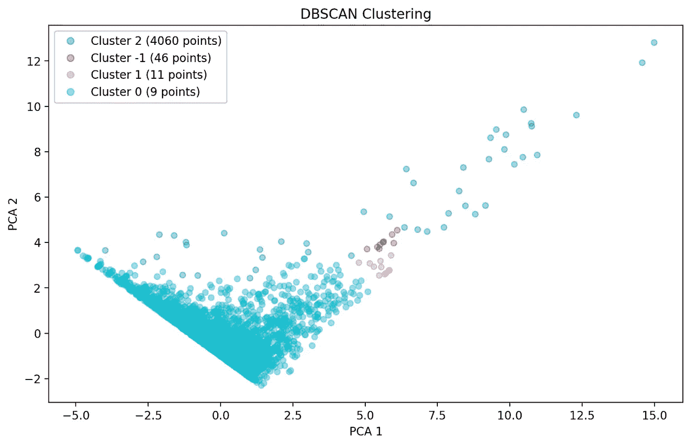

ASCVIT V1 DBSCAN 聚类与 PCA 降维（图片来自作者）

## 聚类可视化

三种不同聚类方法的结果通过*“visualize_clusters”*函数进行可视化，采用主成分分析（PCA）。数据的维度通过 PCA 降到两个分量*“n_components”*，以便能够显示聚类结果。检查数据点和变量*“num_samples”*是否足够；如果不足，则会显示错误信息。聚类结果通过散点图进行可视化，图中显示了前两个 PCA 分量中的数据点。

聚类结果以不同颜色显示*“cmap=‘tab10’”*。在图表中，轴标签*“ax.set_x/ylabel”*和图例*“legend_labels”*已做调整，以便更好地解读。数据点的大小“s”以及透明度*“alpha”*也进行了调整，以提高可见性。在 DBSCAN 中，离群点会被自动分配到聚类-1。聚类的每个变量的平均值以表格形式显示在可视化图形下方*“st.dataframe(cluster_means)”*。

```py
def visualize_clusters(X, title):
    num_samples, num_features = X.shape

    n_components = min(num_samples, num_features, 2) 

    if n_components < 2:
        st.error("Not enough data points or variables to perform PCA.")
        return

    pca = PCA(n_components=n_components)

    try:
        X_pca = pca.fit_transform(X.drop(columns=['Cluster']))

        fig, ax = plt.subplots(figsize=(10, 6))
        scatter = ax.scatter(X_pca[:, 0], X_pca[:, 1], c=X['Cluster'], cmap='tab10', s=25, alpha=0.4)

        ax.set_title(title)
        ax.set_xlabel(f'PCA 1' if n_components >= 1 else '')
        ax.set_ylabel(f'PCA 2' if n_components == 2 else '')

        cluster_counts = X['Cluster'].value_counts()  

        legend_labels = [f"Cluster {int(cluster)} ({count} points)" for cluster, count in cluster_counts.items()]
        legend1 = ax.legend(handles=scatter.legend_elements()[0], labels=legend_labels)
        ax.add_artist(legend1)

        st.pyplot(fig)

        st.write(f"**Average values per cluster:**")
        cluster_means = X.groupby('Cluster').mean()
        st.dataframe(cluster_means)

    except ValueError as e:
        st.error(f"**Error:** Not enough variables were selected.")
```

## 与 LLM 的通信

在应用程序的第一个版本中，统计计算的输出仅在描述性区域进行分析。关键数字通过*“query_llm_via_cli”*函数进行解释。具体来说，该函数用于通过命令行（CLI）与 LLM 进行通信。为此，使用 Python 模块*“subprocess”*通过命令行启动进程。LLM 通过命令[*“ollama”, “run”, “llama3.1”*]启动。输入存储在*“stdin”*中，输出存储在*“stout”*中。

错误和警告被存储在*“stderr”*中，虽然希望不会出现这些问题。输入通过*“process.communicate”*发送到模型。具体来说，创建的*“context”*被发送到函数与 LLM 进行通信。如果模型没有回应，包含超时机制*“timeout=40”*，它将在 40 秒后停止执行。根据所用系统的计算能力，通常模型应更早返回响应。模型的响应被清理并传递到*“extract_relevant_answer”*，以提取相关信息[1]。

```py
def query_llm_via_cli(input_text):
    """Sends the question and context to the LLM and receives a response"""
    try:
        process = subprocess.Popen(
            ["ollama", "run", "llama3.1"],
            stdin=subprocess.PIPE,
            stdout=subprocess.PIPE,
            stderr=subprocess.PIPE,
            text=True,
            encoding='utf-8',
            errors='ignore',
            bufsize=1
        )
        stdout, stderr = process.communicate(input=f"{input_text}\n", timeout=40)

        if process.returncode != 0:
            return f"Error in the model request: {stderr.strip()}"

        response = re.sub(r'\x1b\[.*?m', '', stdout)
        return extract_relevant_answer(response)

    except subprocess.TimeoutExpired:
        process.kill()
        return "Timeout for the model request"
    except Exception as e:
        return f"An unexpected error has occurred: {str(e)}"

def extract_relevant_answer(full_response):
    response_lines = full_response.splitlines()
    if response_lines:
        return "\n".join(response_lines).strip()
    return "No answer received"
```

## 应用程序的主函数

应用程序的结构由*“main()”*函数定义。标题通过*“st.title()”*设置，侧边栏用于上传 CSV 或 Excel 格式的数据集*“uploaded_file”*。上传文件后，应用程序会分析文件并提取数值和类别变量。在这里和许多其他情况下，Streamlit 使用*“session_state”*存储与分析方法选择相关的某些参数。

变量*“numerical_columns”*和*“categorical_columns”*将在上传新数据集后更新。一旦数据可用，用户可以从多种分析方法中选择。选择方法后，会显示该方法，并在相应的变量定义后进行操作。主功能控制应用程序的互动统计分析。

## 自定义选项

如前所述，由于代码的模块化结构，该应用程序可以扩展以包括其他分析方法。使用 LLM 解读统计关键数据的功能也可以转移到其他方法。当前使用的是 Meta 的 Llama3.1 (8B)，但也可以使用 Ollama 的另一款 LLM（例如 Mistral）。此时，*“query_llm_via_cli”*函数中的命令必须进行相应调整。

根据可用的计算资源，也可以使用更多参数的模型。图表的设计可以进一步优化，传输的上下文也可以加以改进，以提升 LLM 的输出效果。或者，你也可以创建一个新的模型文件，调整 LLM 的某些参数（例如参数），从而改善数据的解读。

## ASCVIT V1 PYTHON 脚本 [GITHUB]

应用程序的代码可以从以下[**GitHub 仓库**](https://github.com/stefanpietrusky/ASCVITV1)下载。应用程序可以在相应目录中通过以下命令启动：

```py
Streamlit run app.py
```

## 结论

在本文中，我展示了如何使用 Streamlit 创建一个应用程序，利用多种方法分析数据集。我还展示了如何将 LLM 集成到该应用程序中，从而带来实际的附加值。数据不仅会自动可视化并输出统计参数，还会进行分类。该应用程序具有广泛的发展潜力。我在倒数第二部分列出了一些建议。希望你在使用和自定义应用程序时玩得开心。


你最多可以拍手 50 次！

[1] Pietrusky, S. (2024 年 8 月 21 日). *如何在不使用专有模型的情况下与 PDF 文件交互：CLI, Streamlit, Ollama.* *Towards Data Science*. [URL](https://medium.com/towards-data-science/how-to-talk-to-a-pdf-file-without-using-proprietary-models-cli-streamlit-ollama-6c22437ed932)

[2] Maven Analytics. (2024 年 6 月 10 日). *数据游乐场，视频游戏销售.* [URL](https://mavenanalytics.io/data-playground?accessType=open&order=date_added%2Cdesc&search=game)

[3] Hastie, T., Tibshirani, R., & Friedman, J. (2009). *统计学习的元素：数据挖掘、推断与预测*（第 2 版）。斯坦福大学。[URL](https://hastie.su.domains/Papers/ESLII.pdf)

[4] Bruce, P., Bruce, A., & Gedeck, P. (2021). *数据科学家的实用统计学：50+个 R 和 Python 中的核心概念*（第 2 版）。O’Reilly。

[5] VanderPlas J. (2017). *Python 数据科学手册：处理数据的必备工具*. O’Reilly。[URL]

[6] Fahrmeir, L., Künstler, R., Pigeot, I., & Tutz, G. (2016). *统计学：数据分析之路*（第 8 版）。Springer.

[7] Montgomery, D. C. (2012). *实验设计与分析*（第 8 版）。Wiley. [URL](https://faculty.ksu.edu.sa/sites/default/files/douglas_c._montgomery-design_and_analysis_of_experiments-wiley_2012_edition_8.pdf)

[8] Moore, D. S., McCabe, G. P., Craig, B. A., & Duckworth, W. M. (2021). *统计学实践导论*（第 10 版）。W. H. Freeman.

[9] Montgomery, D. C., Peck, E. A., & Vining, G. G. (2012). *线性回归分析导论*（第 5 版）。Wiley. [URL](https://ocd.lcwu.edu.pk/cfiles/Statistics/Stat-503/IntroductiontoLinearRegressionAnalysisbyDouglasC.MontgomeryElizabethA.PeckG.GeoffreyViningz-lib.org.pdf)

[10] Hosmer, D. W., Lemeshow, S., & Sturdivant, R. X. (2013). *应用逻辑回归*（第 3 版）。Wiley.

[11] Johnson, R. A., & Wichern, D. W. (2007). *应用多元统计分析*（第 6 版）。Pearson. [URL](https://alimoradi.iut.ac.ir/sites/alimoradi.iut.ac.ir/files/file_basepage/richard_arnold_johnson_dean_w._wichern_applied_bookzz.org_.pdf)

[12] Box, G. E. P., Jenkins, G. M., Reinsel, G. C., & Ljung, G. M. (2015). *时间序列分析：预测与控制*（第 5 版）。Wiley. [URL](http://repo.darmajaya.ac.id/4781/1/Time%20Series%20Analysis_%20Forecasting%20and%20Control%20%28%20PDFDrive%20%29.pdf)

[13] Witten, I. H., & Frank, E. (2005). *数据挖掘：实用的机器学习工具与技术*（第 2 版）。Morgan Kaufmann. [URL](http://academia.dk/BiologiskAntropologi/Epidemiologi/DataMining/Witten_and_Frank_DataMining_Weka_2nd_Ed_2005.pdf)

[14] Everitt, B. S., Landau, S., Leese, M., & Stahl, D. (2011). *聚类分析*（第 5 版）。Wiley. [URL](https://cicerocq.wordpress.com/wp-content/uploads/2019/05/cluster-analysis_5ed_everitt.pdf)

[15] Aggarwal, C. C., & Reddy, C. K. (2014). *数据聚类：算法与应用*。CRC Press [URL](https://people.cs.vt.edu/~reddy/papers/DCBOOK.pdf)


仅为缩略图（图片来源：作者）
