# 有限区域内的傅里叶级数的各种形式

> 原文：[`towardsdatascience.com/assorted-flavors-of-fourier-series-on-a-finite-domain-8c93904df6ae?source=collection_archive---------8-----------------------#2024-04-22`](https://towardsdatascience.com/assorted-flavors-of-fourier-series-on-a-finite-domain-8c93904df6ae?source=collection_archive---------8-----------------------#2024-04-22)

## 选择在边界处表现良好的那个

 [Sébastien Gilbert](https://sebastiengilbert.medium.com/?source=post_page---byline--8c93904df6ae--------------------------------)

·发表于 [Towards Data Science](https://towardsdatascience.com/?source=post_page---byline--8c93904df6ae--------------------------------) ·阅读时间：8 分钟·2024 年 4 月 22 日

--

图片由 [Hilda Gea](https://unsplash.com/@hildagea?utm_source=medium&utm_medium=referral) 提供，来源于 [Unsplash](https://unsplash.com/?utm_source=medium&utm_medium=referral)

如果你查阅傅里叶分析的历史，你会发现让·巴普蒂斯特·约瑟夫·傅里叶在研究热流问题时，正式化了这套以他名字命名的级数。

傅里叶级数将周期信号表示为正弦波的和，这些正弦波的频率是基本频率的整数倍。

我们直观地知道，导热介质中的热点会向四面八方传播热量，直到温度均匀分布为止。在这个现象中，无论在空间还是时间上，都没有可见的振荡行为。那么为什么要引入一系列正弦波呢？

初始温度分布、控制微分方程和边界条件决定了一维导热介质（如一根薄金属棒）问题中温度函数 u(x, t)的演变。结果显示，初始温度分布的空间频率分量会随着时间的推移被一个衰减的指数函数所抑制，且其指数因子增长速率与空间频率的平方成正比。换句话说，初始温度分布中的高频部分衰减速度远快于低频部分，这也解释了温度分布的平滑现象。

在这个故事中，**我们将回顾有限区间上定义的傅里叶级数的基础知识**。我们将问题构造为，使得得到的傅里叶级数在区间的边界处具有一些理想的性质。当我们将傅里叶级数应用于解决涉及具有边界约束的微分方程问题时，这种方法将带来好处。

## 傅里叶级数：表示周期函数的工具

傅里叶级数可以逼近周期函数。假设 g(x)是一个周期为 2L 的周期函数。

> 为什么是周期 2L？

我们关注的是定义在有限区间[0, L]上的函数。我们可以构造一个周期为 2L 的周期函数 g(x)，其周期函数 g(x)的定义域为[0, L]，并通过在函数两端加上适当的填充，以获得理想的性质。稍后我们会回到这一点。

假设傅里叶级数存在，我们可以将 g(x)写成：

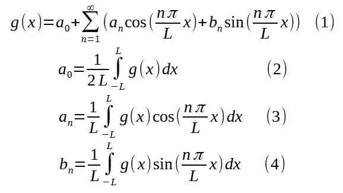

举个例子，我们考虑以下周期函数 g(x)，其周期为 2L = 0.6：

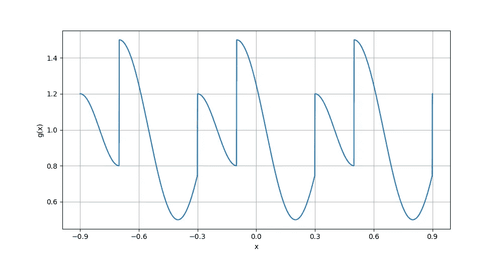

图 1：周期函数 g(x)。图片由作者提供。

通过应用方程（2）、（3）、（4）并使用辛普森数值积分，可以得到 a₀、aₙ和 bₙ的以下值：

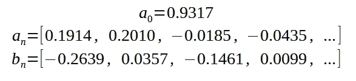

这些值，即傅里叶系数，使我们能够通过方程（1）构建 g(x)的近似值。我们在求和中包含的项数越多，近似值就越精确。图 2 展示了通过方程（1）中不同项数的求和得到的几种近似。

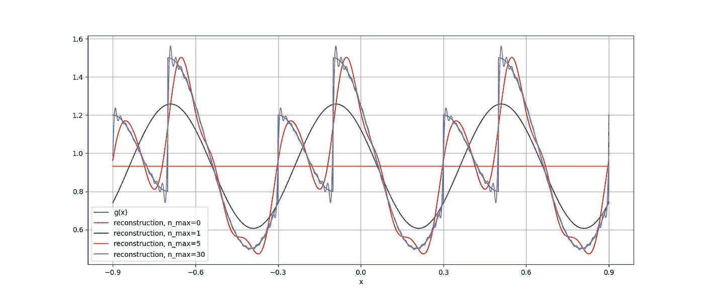

图 2：通过傅里叶级数中的不同项数重构 g(x)。图片由作者提供。

我们已经可以提出一些观察结果：

+   信号中的有限不连续性是可以容忍的，但它们会在重构的近似中产生波动。我们称这些不连续点附近的振荡现象为[吉布斯现象](https://en.wikipedia.org/wiki/Gibbs_phenomenon)。

+   傅里叶级数是一个无限项的和，但我们可以截断求和，并仍然得到原始函数的合理近似。

+   原始信号可能是离散点的样本。傅里叶级数可以在 x 轴的任何位置插值该函数。

## 定义在有限区间上的函数

在工程问题中，我们经常遇到定义在有限区间上的函数。例如，在导热介质的一维温度分布中，温度函数定义在区间[0, L]上，其中 L 是薄金属棒的长度。那么，在这种情况下，如何使用傅里叶级数呢？

为了解答这个问题，我们首先需要认识到，任何在范围[0, L]内与目标函数 f(x)一致的周期函数 g(x)，都是 f(x)的傅里叶级数表示的有效候选。毕竟，我们不关心傅里叶级数在[0, L]范围之外的行为。

## f(x)的天真周期复制

构建 g(x)的最直接方法是将 f(x)在区间[-L, 0]内复制，如图 3 所示：

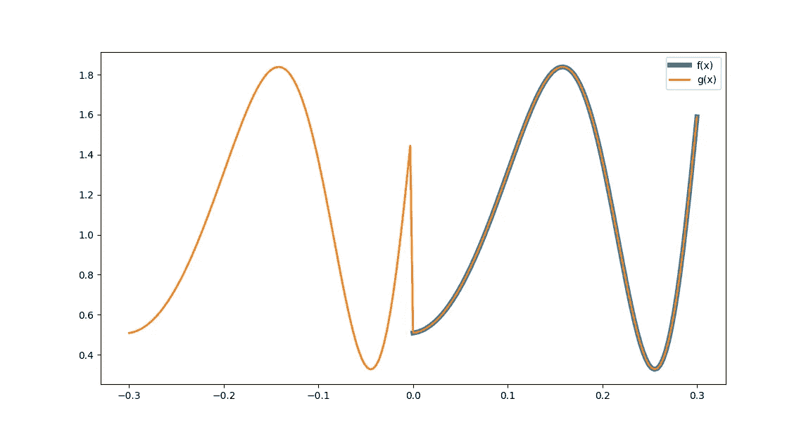

图 3：f(x) 在[0, 0.3]范围内定义，并在范围[-0.3, 0]内复制，构建周期为 0.6 的周期函数 g(x)。图片来源：作者。

对 f(x)的天真周期复制进行傅里叶积分，得到方程（5）到（7）：

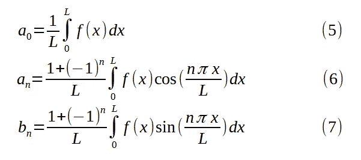

通过将（5）、（6）、（7）代入方程（1）中的 f(x)（参见图 3），我们得到了图 4 所示的傅里叶级数重构：

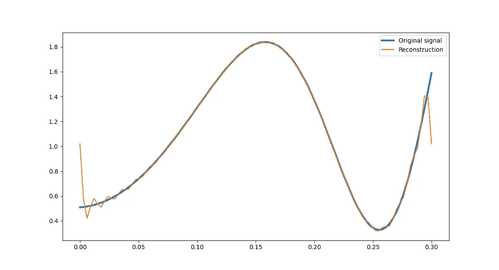

图 4：图 3 中的 f(x)（原始信号）和傅里叶级数，显示为信号重构。图片来源：作者。

傅里叶级数与原始信号非常接近，除了在范围边界处，重构会出现振荡和跳跃。由于我们明确构造了一个周期为 L 的周期信号，傅里叶级数将 x=0 和 x=L 处的过渡解释为有限的间断点。

傅里叶级数允许有限的间断性，但吉布斯现象会在间断点周围恶化重构效果。

对于许多工程应用来说，这是一个问题。例如，在薄金属棒的热传导问题中，金属棒两端（即边界条件）发生的情况是问题描述的一个内在部分。我们可以假设有一根孤立的金属棒，这意味着两端的温度梯度必须为 0。或者，我们可以假设在 x=0 和 x=L 处有任意的设定温度。在这些常见场景中，我们不能使用天真周期复制 f(x)的方法，因为吉布斯现象会在范围的两端破坏信号。

## 偶数半范围扩展

我们可以将 f(x)复制为图 5 中的形式，也可以在范围[-L, 0]内使用 f(x)的翻转版本：

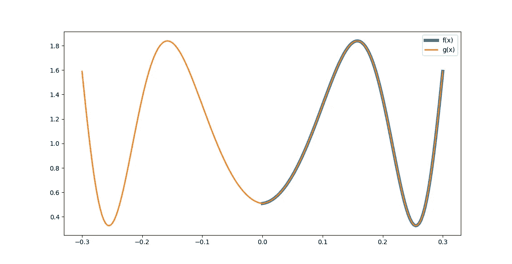

图 5：g(x) = f(-x) 在范围[-L, 0]内。图片来源：作者。

这种方法消除了 x=0 和 x=L 处的间断性。f(x)的偶数半范围扩展的傅里叶积分得到方程（8）到（10）：

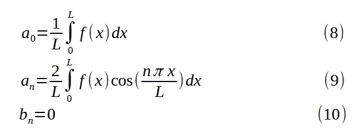

图 6 展示了 f(x)的傅里叶级数重构：

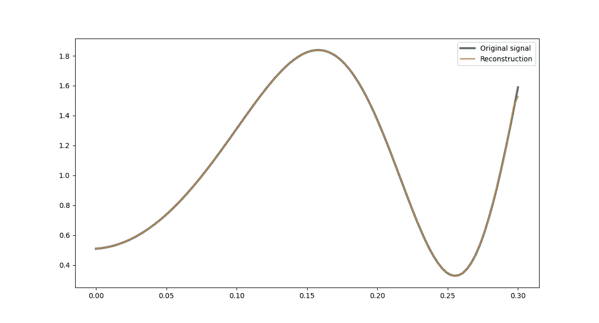

图 6：原始信号及其通过偶数半范围扩展的重构。图片来源：作者。

偶数半范围展开的一个特性是，由于 g(x)是偶函数，所有的 bₙ系数（参见方程(10)）为 0，因此它的傅里叶级数仅由余弦项组成。因此，**傅里叶级数的导数在 x=0 和 x=L 处为零**。你可以通过对方程(1)关于 x 进行求导，且将所有 bₙ项设置为 0 来验证这一点。

这是我们在某些情况下所需要的，例如金属杆被隔离，没有热量泄漏到端部。

## 奇数半范围展开

如果我们改为创建一个奇函数会怎么样呢？这可以通过将 f(x)的旋转版本粘贴到区间[-L, 0]中来实现，如图 7 所示：

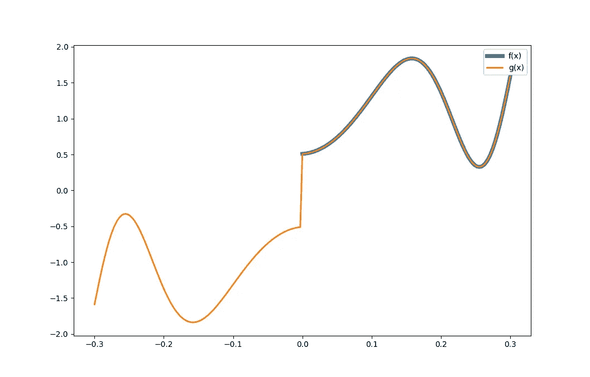

图 7：g(x) = -f(-x)在区间[-L, 0]。图片由作者提供。

f(x)的奇数半范围展开的傅里叶积分得到方程(11)到(13)：

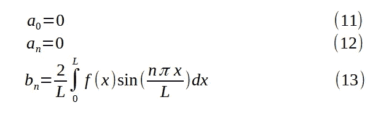

图 8 显示了 f(x)的傅里叶级数重构：

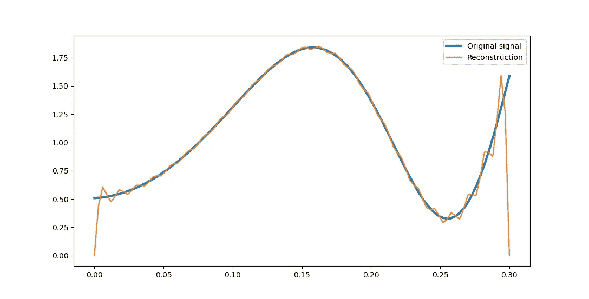

图 8：原始信号及其通过奇数半范围展开的重构。图片由作者提供。

由于 g(x)是奇函数，傅里叶级数仅由正弦项组成。因此，**傅里叶级数在 x=0 和 x=L 处为零**。这个特性可以在模拟振动吉他弦的形状时加以利用。吉他弦在 x=0 和 x=L 处的高度被限制为 0，因此我们自然会使用奇数半展开来模拟初始条件。

图片由[Rio Lecatompessy](https://unsplash.com/@riolec?utm_source=medium&utm_medium=referral)提供，来源于[Unsplash](https://unsplash.com/?utm_source=medium&utm_medium=referral)

## 偶数四分之一范围展开

我们还可以更加创新，设计一个周期为 4L 的周期性函数。如果我们希望在 x=0 处的导数为 0，并且在 x=L 处的值和导数都平滑过渡，可以在[L, 2L]区间附加 f(x)的旋转副本并使该函数为偶函数。图 9 展示了一个例子：

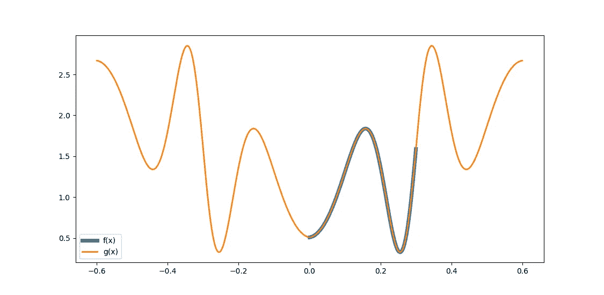

图 9：g(x) = 2f(L) - f(2L+x)在区间[-2L, -L]；f(-x)在区间[-L, 0]；f(x)在区间[0, L]；2f(L)-f(2L-x)在区间[L, 2L]。图片由作者提供。

f(x)的偶数四分之一范围展开的傅里叶积分得到方程(14)到(16)：

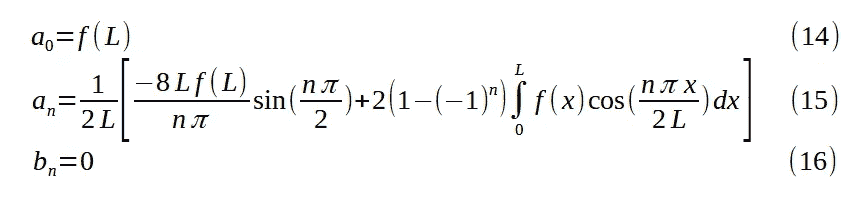

图 10 显示了 f(x)的傅里叶级数重构：

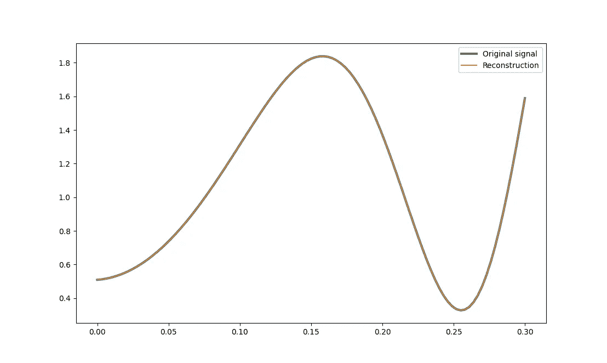

图 10：原始信号和通过偶数四分之一范围展开的傅里叶级数重构。图片由作者提供。

尽管从图中无法看出，傅里叶级数的导数在 x=0 处为 0，并且在 x=L 处与原始信号相同。

## 奇数四分之一范围展开

我们考虑的最后一个情况是，当我们希望 x=0 处的值为 0，x=L 处的导数为 0 时。我们通过在[L, 2L]范围内附加 f(x)的翻转版本来构建 g(x)，并使该函数成为奇函数。

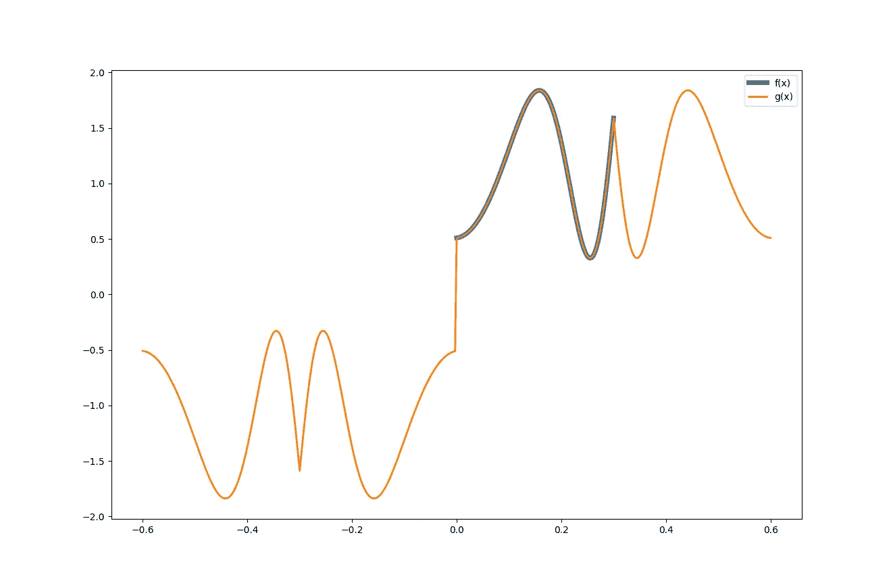

图 11：g(x) = -f(x+2L)在范围[-2L, L]内；-f(-x)在范围[-L, 0]内；f(x)在范围[0, L]内；f(2L-x)在范围[L, 2L]内。图片由作者提供。

f(x)的奇数四分之一范围展开的傅里叶积分得到方程(17)到(19)：

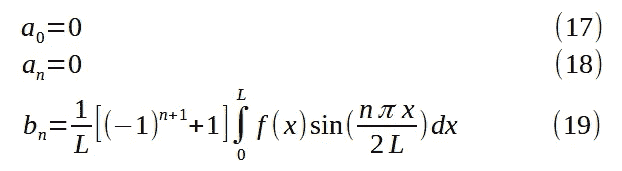

图 12 显示了 f(x)的傅里叶级数重建：

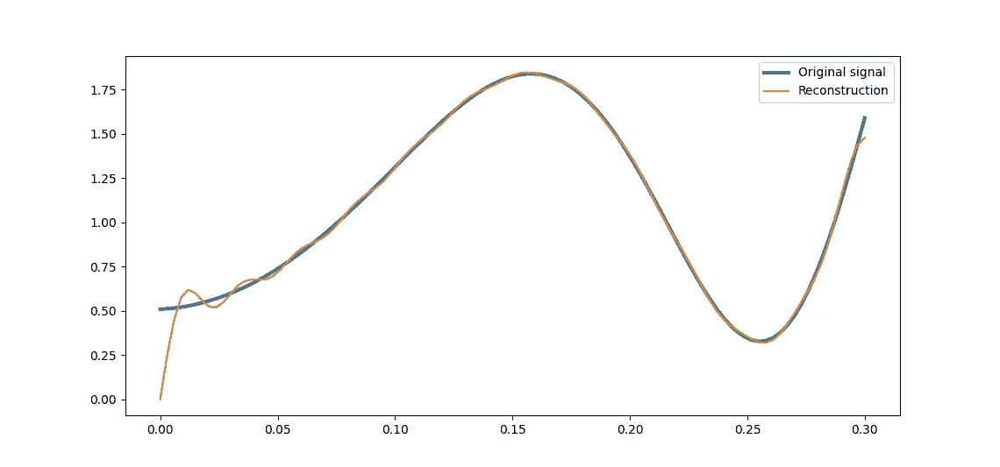

图 12：原始信号与傅里叶级数重建，采用奇数四分之一范围展开。图片由作者提供。

我们可以看到，重建在 x=0 时通过 0。即使原始信号的导数不是零，x=L 处的导数为零。

## 结论

我们考虑了为定义在有限区间[0, L]上的信号 f(x)找到合适的傅里叶级数展开的问题。傅里叶级数适用于周期性函数，因此我们必须构建一个与 f(x)在定义域上匹配的周期性函数。我们观察到定义周期性函数 g(x)的四种方法。每种方法都能确保在范围边界处具有特定的属性：

+   偶数半范围展开：傅里叶级数在 x=0 和 x=L 处的导数为 0。

+   奇数半范围展开：傅里叶级数在 x=0 和 x=L 处的值为 0。

+   偶数四分之一范围展开：傅里叶级数在 x=0 处的导数为 0，并且在 x=L 处具有平滑的值和导数。

+   奇数四分之一范围展开：傅里叶级数在 x=0 处的值为 0，x=L 处的导数为 0。

在未来的故事中，我们将研究热量如何在细长的金属棒中传递。解决方案涉及将初始温度分布转换为傅里叶级数。我们将观察到，傅里叶级数展开的选择自然由边界条件决定（例如，金属棒在 x=0 处是隔离的，在 x=L 处保持固定温度）。我们在这篇文章中创建的那些看似任意的周期性函数，将突然变得有意义！

参考文献

(R1) 《高级工程数学》，Erwin Kreyszig，John Wiley & Sons，1988
