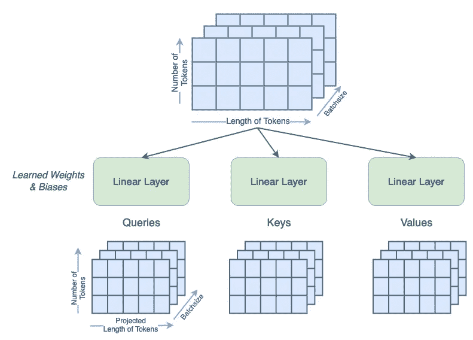
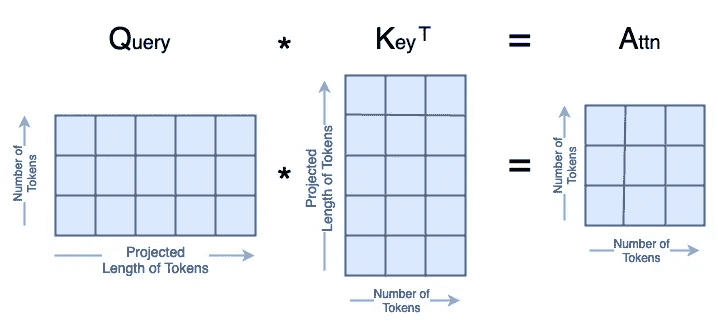
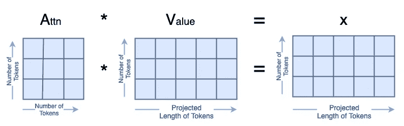
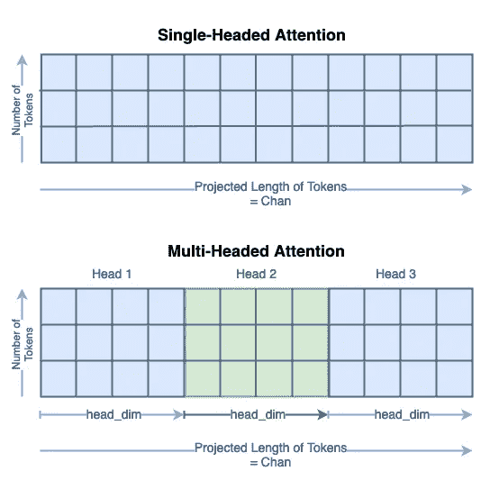
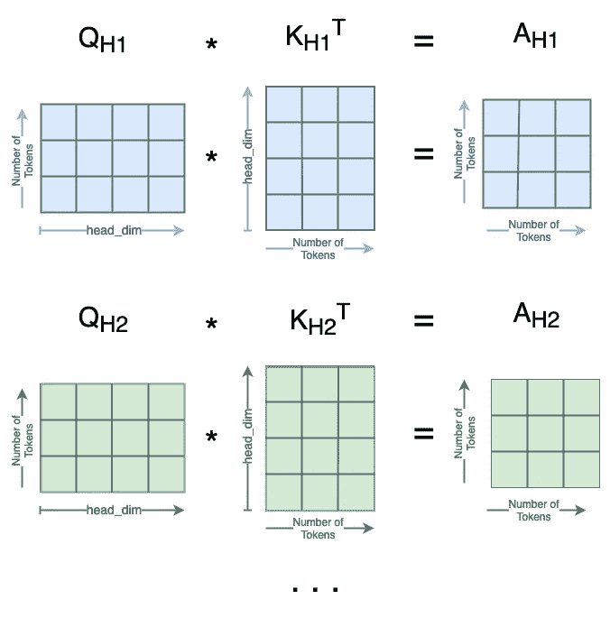
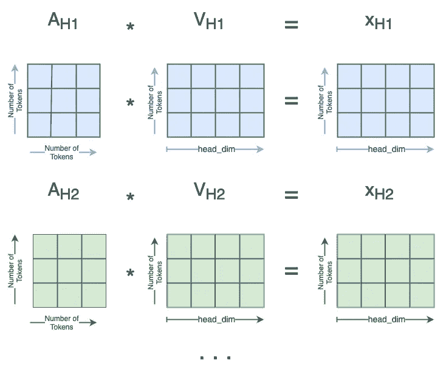

# 视觉变换器的注意力机制解析

> 原文：[`towardsdatascience.com/attention-for-vision-transformers-explained-70f83984c673?source=collection_archive---------3-----------------------#2024-02-27`](https://towardsdatascience.com/attention-for-vision-transformers-explained-70f83984c673?source=collection_archive---------3-----------------------#2024-02-27)

## 视觉变换器解析系列

## 计算机视觉中注意力层背后的数学与代码

[](https://medium.com/@sjcallis?source=post_page---byline--70f83984c673--------------------------------)[](https://towardsdatascience.com/?source=post_page---byline--70f83984c673--------------------------------) [Skylar Jean Callis](https://medium.com/@sjcallis?source=post_page---byline--70f83984c673--------------------------------)

·发表于 [Towards Data Science](https://towardsdatascience.com/?source=post_page---byline--70f83984c673--------------------------------) ·12 分钟阅读·2024 年 2 月 27 日

--

*自 2017 年《Attention is All You Need》¹提出以来，*变换器（transformers）已经成为自然语言处理（NLP）领域的前沿技术。2021 年，*《An Image is Worth 16x16 Words》²成功地将变换器应用于计算机视觉任务。从那时起，许多基于变换器的架构被提出用于计算机视觉。*

**本文深入探讨了在计算机视觉领域，注意力层是如何工作的。我们将讨论单头和多头注意力机制。文章中包含了注意力层的开源代码，并对其底层数学原理进行了解释。代码使用的是 PyTorch Python 包。**


图片来源：[Mitchell Luo](https://unsplash.com/@mitchel3uo?utm_source=medium&utm_medium=referral) 在 [Unsplash](https://unsplash.com/?utm_source=medium&utm_medium=referral)

本文是一个系列文章的一部分，深入探讨视觉变换器的内部工作原理。每篇文章也可以作为一个带有可执行代码的 Jupyter Notebook 进行阅读。该系列的其他文章包括：

+   视觉变换器解析→ [Jupyter Notebook](https://github.com/lanl/vision_transformers_explained/blob/main/notebooks/VisionTransformersExplained.ipynb)

+   **视觉变换器的注意力机制解析**

    → [Jupyter Notebook](https://github.com/lanl/vision_transformers_explained/blob/main/notebooks/AttentionExplained.ipynb)

+   视觉变换器位置嵌入解释

    → [Jupyter Notebook](https://github.com/lanl/vision_transformers_explained/blob/main/notebooks/PositionEmbeddingExplained.ipynb)

+   Tokens-to-Token 视觉变换器解析

    → [Jupyter Notebook](https://github.com/lanl/vision_transformers_explained/blob/main/notebooks/TokensToTokenViTExplained.ipynb)

+   [视觉变换器解释系列的 GitHub 仓库](https://github.com/lanl/vision_transformers_explained)

## 目录

+   一般注意力机制

+   单头注意力

+   多头注意力

+   结论

    — 进一步阅读

    — 引用

# 一般注意力机制

对于 NLP 应用，注意力通常被描述为句子中单词（tokens）之间的关系。在计算机视觉应用中，注意力关注的是图像中 patches（tokens）之间的关系。

有多种方法可以将一张图片分解成一系列的 tokens。原始的 ViT²将图像分割成*patches*，然后将这些*patches*展平为*tokens*；有关这种*patch tokenization*的更详细解释，请参阅视觉变换器文章。*Tokens-to-Token ViT³*开发了一种更复杂的方法，从图像中创建 tokens；关于该方法的更多信息可以在 Tokens-To-Token ViT 文章中找到。

本文将假设 tokens 作为输入，逐步通过一个注意力层。在变换器的开始，tokens 将代表输入图像中的 patches。然而，随着深层注意力层的计算，tokens 将被前面的层修改，从而移除了直接的表示关系。

本文探讨了在*Attention is All You Need*¹中定义的点积（即乘法）注意力机制。这与在*An Image is Worth 16x16 Words²*和*Tokens-to-Token ViT³*等衍生作品中使用的注意力机制相同。代码基于公开的*Tokens-to-Token ViT³*的 GitHub 代码，经过了一些修改。源代码的更改包括但不限于将两个注意力模块合并为一个，并实现了多头注意力。

完整的注意力模块如下所示：

```py
class Attention(nn.Module):
    def __init__(self, 
                dim: int,
                chan: int,
                num_heads: int=1,
                qkv_bias: bool=False,
                qk_scale: NoneFloat=None):

        """ Attention Module

            Args:
                dim (int): input size of a single token
                chan (int): resulting size of a single token (channels)
                num_heads(int): number of attention heads in MSA
                qkv_bias (bool): determines if the qkv layer learns an addative bias
                qk_scale (NoneFloat): value to scale the queries and keys by; 
                                    if None, queries and keys are scaled by ``head_dim ** -0.5``
        """

        super().__init__()

        ## Define Constants
        self.num_heads = num_heads
        self.chan = chan
        self.head_dim = self.chan // self.num_heads
        self.scale = qk_scale or self.head_dim ** -0.5
        assert self.chan % self.num_heads == 0, '"Chan" must be evenly divisible by "num_heads".'

        ## Define Layers
        self.qkv = nn.Linear(dim, chan * 3, bias=qkv_bias)
        #### Each token gets projected from starting length (dim) to channel length (chan) 3 times (for each Q, K, V)
        self.proj = nn.Linear(chan, chan)

    def forward(self, x):
        B, N, C = x.shape
        ## Dimensions: (batch, num_tokens, token_len)

        ## Calcuate QKVs
        qkv = self.qkv(x).reshape(B, N, 3, self.num_heads, self.head_dim).permute(2, 0, 3, 1, 4)
        #### Dimensions: (3, batch, heads, num_tokens, chan/num_heads = head_dim)
        q, k, v = qkv[0], qkv[1], qkv[2]

        ## Calculate Attention
        attn = (q * self.scale) @ k.transpose(-2, -1)
        attn = attn.softmax(dim=-1)
        #### Dimensions: (batch, heads, num_tokens, num_tokens)

        ## Attention Layer
        x = (attn @ v).transpose(1, 2).reshape(B, N, self.chan)
        #### Dimensions: (batch, heads, num_tokens, chan)

        ## Projection Layers
        x = self.proj(x)

        ## Skip Connection Layer
        v = v.transpose(1, 2).reshape(B, N, self.chan)
        x = v + x     
        #### Because the original x has different size with current x, use v to do skip connection

        return x
```

# 单头注意力

从只有一个注意力头开始，我们一步步走过前向传递的每一行，并在过程中查看一些矩阵图示。我们使用 7∗7=49 作为起始的 token 大小，因为这是 T2T-ViT 模型中的起始 token 大小。³我们使用 64 个通道，因为这是 T2T-ViT 的默认值。³我们使用 100 个 tokens，因为这是一个合适的数字。我们使用 13 的 batch 大小，因为它是质数，不会与其他参数混淆。

```py
# Define an Input
token_len = 7*7
channels = 64
num_tokens = 100
batch = 13
x = torch.rand(batch, num_tokens, token_len)
B, N, C = x.shape
print('Input dimensions are\n\tbatchsize:', x.shape[0], '\n\tnumber of tokens:', x.shape[1], '\n\ttoken size:', x.shape[2])

# Define the Module
A = Attention(dim=token_len, chan=channels, num_heads=1, qkv_bias=False, qk_scale=None)
A.eval();
```

```py
Input dimensions are
   batchsize: 13 
   number of tokens: 100 
   token size: 49
```

来自*Attention is All You Need*¹，注意力是通过**Q**uery、**K**ey 和**V**alue 矩阵来定义的。第一步是通过一个可学习的线性层来计算这些矩阵。布尔值*qkv_bias*项表示这些线性层是否具有偏置项。此步骤还会将输入的标记长度从 49 更改为*chan*参数，我们将其设置为 64。



生成单头注意力的查询、键和值（图片由作者提供）

```py
qkv = A.qkv(x).reshape(B, N, 3, A.num_heads, A.head_dim).permute(2, 0, 3, 1, 4)
q, k, v = qkv[0], qkv[1], qkv[2]
print('Dimensions for Queries are\n\tbatchsize:', q.shape[0], '\n\tattention heads:', q.shape[1], '\n\tnumber of tokens:', q.shape[2], '\n\tnew length of tokens:', q.shape[3])
print('See that the dimensions for queries, keys, and values are all the same:')
print('\tShape of Q:', q.shape, '\n\tShape of K:', k.shape, '\n\tShape of V:', v.shape)
```

```py
Dimensions for Queries are
   batchsize: 13 
   attention heads: 1 
   number of tokens: 100 
   new length of tokens: 64
See that the dimensions for queries, keys, and values are all the same:
   Shape of Q: torch.Size([13, 1, 100, 64]) 
   Shape of K: torch.Size([13, 1, 100, 64]) 
   Shape of V: torch.Size([13, 1, 100, 64])
```

现在，我们可以开始计算注意力，注意力的定义如下：

其中*Q, K, V*分别是查询、键和值；dₖ是键的维度，它等于键标记的长度，并且等于*chan*的长度。

我们将逐步分析代码中实现的这个方程。我们将中间矩阵称为**A**ttn。

第一步是计算：

在代码中，我们设置了

默认情况下，

然而，用户可以指定一个作为超参数的替代缩放值。

分子中的矩阵乘法*Q·Kᵀ*看起来是这样的：



*Q·Kᵀ 矩阵乘法（图片由作者提供）*

所有这些代码看起来是这样的：

```py
attn = (q * A.scale) @ k.transpose(-2, -1)
print('Dimensions for Attn are\n\tbatchsize:', attn.shape[0], '\n\tattention heads:', attn.shape[1], '\n\tnumber of tokens:', attn.shape[2], '\n\tnumber of tokens:', attn.shape[3])
```

```py
Dimensions for Attn are
   batchsize: 13 
   attention heads: 1 
   number of tokens: 100 
   number of tokens: 100
```

接下来，我们计算*A*的 softmax，这不会改变其形状。

```py
attn = attn.softmax(dim=-1)
print('Dimensions for Attn are\n\tbatchsize:', attn.shape[0], '\n\tattention heads:', attn.shape[1], '\n\tnumber of tokens:', attn.shape[2], '\n\tnumber of tokens:', attn.shape[3])
```

```py
Dimensions for Attn are
   batchsize: 13 
   attention heads: 1 
   number of tokens: 100 
   number of tokens: 100
```

最后，我们计算*A·V=x*，其形式如下：



*A·V 矩阵乘法（图片由作者提供）*

```py
x = attn @ v
print('Dimensions for x are\n\tbatchsize:', x.shape[0], '\n\tattention heads:', x.shape[1], '\n\tnumber of tokens:', x.shape[2], '\n\tlength of tokens:', x.shape[3])
```

```py
Dimensions for x are
   batchsize: 13 
   attention heads: 1 
   number of tokens: 100 
   length of tokens: 64
```

输出*x*被重新形状化，以去除注意力头维度。

```py
x = x.transpose(1, 2).reshape(B, N, A.chan)
print('Dimensions for x are\n\tbatchsize:', x.shape[0], '\n\tnumber of tokens:', x.shape[1], '\n\tlength of tokens:', x.shape[2])
```

```py
Dimensions for x are
   batchsize: 13 
   number of tokens: 100 
   length of tokens: 64
```

然后，我们将*x*通过一个可学习的线性层，这个线性层不会改变它的形状。

```py
x = A.proj(x)
print('Dimensions for x are\n\tbatchsize:', x.shape[0], '\n\tnumber of tokens:', x.shape[1], '\n\tlength of tokens:', x.shape[2])
```

```py
Dimensions for x are
   batchsize: 13 
   number of tokens: 100 
   length of tokens: 64
```

最后，我们实现了一个跳跃连接。由于当前*x*的形状与输入的*x*形状不同，我们使用*V*来进行跳跃连接。我们确实在注意力头维度上展平了*V*。

```py
orig_shape = (batch, num_tokens, token_len)
curr_shape = (x.shape[0], x.shape[1], x.shape[2])
v = v.transpose(1, 2).reshape(B, N, A.chan)
v_shape = (v.shape[0], v.shape[1], v.shape[2])
print('Original shape of input x:', orig_shape)
print('Current shape of x:', curr_shape)
print('Shape of V:', v_shape)
x = v + x     
print('After skip connection, dimensions for x are\n\tbatchsize:', x.shape[0], '\n\tnumber of tokens:', x.shape[1], '\n\tlength of tokens:', x.shape[2])
```

```py
Original shape of input x: (13, 100, 49)
Current shape of x: (13, 100, 64)
Shape of V: (13, 100, 64)
After skip connection, dimensions for x are
   batchsize: 13 
   number of tokens: 100 
   length of tokens: 64
```

这就完成了注意力层！

# 多头注意力

现在我们已经看过了单头注意力，我们可以扩展到多头注意力。在计算机视觉中，这通常称为**多头自注意力**（MSA）。本节不会详细讲解所有步骤；相反，我们将专注于矩阵形状有所不同的部分。

与单头注意力相同，我们使用 7∗7=49 作为我们的起始标记大小，并使用 64 个通道，因为这是 T2T-ViT 的默认值³。我们使用 100 个标记，因为这个数字很好。我们使用的批量大小为 13，因为它是质数，不会与其他参数混淆。

注意力头的数量必须能够整除通道数，因此在这个例子中，我们使用 4 个注意力头。

```py
# Define an Input
token_len = 7*7
channels = 64
num_tokens = 100
batch = 13
num_heads = 4
x = torch.rand(batch, num_tokens, token_len)
B, N, C = x.shape
print('Input dimensions are\n\tbatchsize:', x.shape[0], '\n\tnumber of tokens:', x.shape[1], '\n\ttoken size:', x.shape[2])

# Define the Module
MSA = Attention(dim=token_len, chan=channels, num_heads=num_heads, qkv_bias=False, qk_scale=None)
MSA.eval();
```

```py
Input dimensions are
   batchsize: 13 
   number of tokens: 100 
   token size: 49
```

计算**Q**ueries、**K**eys 和**V**alues 的过程与单头注意力中相同。然而，你可以看到标记的新长度是*chan*/*num_heads*。*Q*、*K*和*V*矩阵的总大小没有变化，它们的内容只是分布在头维度上。你可以将其视为将单头矩阵分割为多个头：



多头注意力分割（图片由作者提供）

我们将子矩阵表示为 Qₕᵢ，表示***Q****uery* ***h****ead* ***i***。

```py
qkv = MSA.qkv(x).reshape(B, N, 3, MSA.num_heads, MSA.head_dim).permute(2, 0, 3, 1, 4)
q, k, v = qkv[0], qkv[1], qkv[2]
print('Head Dimension = chan / num_heads =', MSA.chan, '/', MSA.num_heads, '=', MSA.head_dim)
print('Dimensions for Queries are\n\tbatchsize:', q.shape[0], '\n\tattention heads:', q.shape[1], '\n\tnumber of tokens:', q.shape[2], '\n\tnew length of tokens:', q.shape[3])
print('See that the dimensions for queries, keys, and values are all the same:')
print('\tShape of Q:', q.shape, '\n\tShape of K:', k.shape, '\n\tShape of V:', v.shape)
```

```py
Head Dimension = chan / num_heads = 64 / 4 = 16
Dimensions for Queries are
   batchsize: 13 
   attention heads: 4 
   number of tokens: 100 
   new length of tokens: 16
See that the dimensions for queries, keys, and values are all the same:
   Shape of Q: torch.Size([13, 4, 100, 16]) 
   Shape of K: torch.Size([13, 4, 100, 16]) 
   Shape of V: torch.Size([13, 4, 100, 16])
```

下一步是计算

对于每个头* i *。在此上下文中，键的长度是

与单头注意力一样，我们使用默认值

尽管用户可以将替代的缩放值指定为超参数。

我们以*num_heads* = 4 个不同的**A**ttn 矩阵结束此步骤，如下所示：



*Q·Kᵀ 矩阵乘法*用于 MSA（图片由作者提供）

```py
attn = (q * MSA.scale) @ k.transpose(-2, -1)
print('Dimensions for Attn are\n\tbatchsize:', attn.shape[0], '\n\tattention heads:', attn.shape[1], '\n\tnumber of tokens:', attn.shape[2], '\n\tnumber of tokens:', attn.shape[3])
```

```py
Dimensions for Attn are
   batchsize: 13 
   attention heads: 4 
   number of tokens: 100 
   number of tokens: 100
```

接下来我们计算*A*的 softmax，它的形状不会改变。

然后，我们可以计算

这在多个注意力头之间类似地分布：



*A·V 矩阵乘法*用于 MSA（图片由作者提供）

```py
attn = attn.softmax(dim=-1)

x = attn @ v
print('Dimensions for x are\n\tbatchsize:', x.shape[0], '\n\tattention heads:', x.shape[1], '\n\tnumber of tokens:', x.shape[2], '\n\tlength of tokens:', x.shape[3])
```

```py
Dimensions for x are
   batchsize: 13 
   attention heads: 4 
   number of tokens: 100 
   length of tokens: 16
```

现在我们通过一些重塑操作将所有的 xₕᵢ合并在一起。这是第一步的逆操作：


多头注意力分割（图片由作者提供）

```py
x = x.transpose(1, 2).reshape(B, N, MSA.chan)
print('Dimensions for x are\n\tbatchsize:', x.shape[0], '\n\tnumber of tokens:', x.shape[1], '\n\tlength of tokens:', x.shape[2])
```

```py
Dimensions for x are
   batchsize: 13 
   number of tokens: 100 
   length of tokens: 64
```

现在我们已经将所有头连接在一起，注意力模块的其余部分保持不变。对于跳过连接，我们仍然使用*V*，但我们必须重新调整其形状以去除头维度。

```py
x = MSA.proj(x)
print('Dimensions for x are\n\tbatchsize:', x.shape[0], '\n\tnumber of tokens:', x.shape[1], '\n\tlength of tokens:', x.shape[2])

orig_shape = (batch, num_tokens, token_len)
curr_shape = (x.shape[0], x.shape[1], x.shape[2])
v = v.transpose(1, 2).reshape(B, N, A.chan)
v_shape = (v.shape[0], v.shape[1], v.shape[2])
print('Original shape of input x:', orig_shape)
print('Current shape of x:', curr_shape)
print('Shape of V:', v_shape)
x = v + x     
print('After skip connection, dimensions for x are\n\tbatchsize:', x.shape[0], '\n\tnumber of tokens:', x.shape[1], '\n\tlength of tokens:', x.shape[2])
```

```py
Dimensions for x are
   batchsize: 13 
   number of tokens: 100 
   length of tokens: 64
Original shape of input x: (13, 100, 49)
Current shape of x: (13, 100, 64)
Shape of V: (13, 100, 64)
After skip connection, dimensions for x are
   batchsize: 13 
   number of tokens: 100 
   length of tokens: 64
```

这就结束了多头注意力！

# 结论

现在我们已经走完了视觉变换器中注意力层的每个步骤。注意力层中的可学习权重位于从标记到查询、键和值的第一次投影以及最终投影中。注意力层的大部分是确定性的矩阵乘法。然而，当使用较长的标记时，线性层可能包含大量的权重。QKV 投影层中的权重数量等于*input_token_len*∗*chan*∗*3*，而最终投影层中的权重数量等于*chan²*。

要使用注意力层，你可以创建自定义的注意力层（如这里所做！），或者使用机器学习包中包含的注意力层。如果你想使用此处定义的注意力层，可以在[GitHub 仓库](https://github.com/lanl/vision_transformers_explained)找到该系列文章的代码。PyTorch 也提供了 `torch.nn.MultiheadedAttention()`⁴ 层，它按照上述定义计算注意力。祝你注意力集中！

本文已通过洛斯阿拉莫斯国家实验室批准发布，编号 LA-UR-23-33876。相关代码已通过 BSD-3 开源许可证批准，许可证编号 O#4693。

## 进一步阅读

要了解更多关于 NLP 上下文中注意力层的内容，请参见

+   视觉变换器直观解析第一部分：功能概述：`towardsdatascience.com/transformers-explained-visually-part-1-overview-of-functionality-95a6dd460452`

+   视觉变换器直观解析第二部分：一步一步了解其工作原理：`towardsdatascience.com/transformers-explained-visually-part-2-how-it-works-step-by-step-b49fa4a64f34`

+   视觉变换器直观解析第三部分：多头注意力深度解析：`towardsdatascience.com/transformers-explained-visually-part-3-multi-head-attention-deep-dive-1c1ff1024853`

+   视觉指南：变换器神经网络多头和自注意力视频：[`www.youtube.com/watch?v=mMa2PmYJlCo`](https://www.youtube.com/watch?v=mMa2PmYJlCo)

关于视觉变换器的广泛视频讲解（包括相关章节），请见

+   视觉变换器及其应用：[`youtu.be/hPb6A92LROc?si=GaGYiZoyDg0PcdSP`](https://youtu.be/hPb6A92LROc?si=GaGYiZoyDg0PcdSP)

    — 人类视觉注意力：4:31 — 5:18 ([`youtu.be/hPb6A92LROc?t=271&si=VMx2lM9lvW-oKcW_`](https://youtu.be/hPb6A92LROc?t=271&si=VMx2lM9lvW-oKcW_))

    — Attention 作为点积：5:18–6:14 [(https://youtu.be/hPb6A92LROc?t=318&si=pF2SFp2XXjK8AWsL](https://youtu.be/hPb6A92LROc?t=318&si=pF2SFp2XXjK8AWsL))

    — Attention 公式的描述：16:13–17:52 ([`youtu.be/hPb6A92LROc?si=toAgKQCOh9zGCR-c&t=973`](https://youtu.be/hPb6A92LROc?si=toAgKQCOh9zGCR-c&t=973))

    — 为什么使用多头自注意力：19:44–19:58 ([`youtu.be/hPb6A92LROc?t=1184&si=Sy1e149ukt99DoRf`](https://youtu.be/hPb6A92LROc?t=1184&si=Sy1e149ukt99DoRf))

## 引用

[1] Vaswani 等人（2017 年）。*Attention Is All You Need.* [`doi.org/10.48550/arXiv.1706.03762`](https://doi.org/10.48550/arXiv.1706.03762)

[2] Dosovitskiy 等人（2020 年）。*一张图胜过 16x16 个词：用于大规模图像识别的变换器.* [`doi.org/10.48550/arXiv.2010.11929`](https://doi.org/10.48550/arXiv.2010.11929)

[3] Yuan 等人（2021 年）。*Tokens-to-Token ViT：从头开始在 ImageNet 上训练视觉变换器.* [`doi.org/10.48550/arXiv.2101.11986`](https://doi.org/10.48550/arXiv.2101.11986)

→ GitHub 代码：[`github.com/yitu-opensource/T2T-ViT`](https://github.com/yitu-opensource/T2T-ViT)

[4] PyTorch。*多头注意力.* [`pytorch.org/docs/stable/generated/torch.nn.MultiheadAttention.html`](https://pytorch.org/docs/stable/generated/torch.nn.MultiheadAttention.html)
