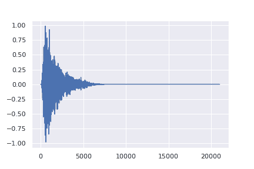

# 音频扩散：生成音乐的秘密武器

> 原文：[`towardsdatascience.com/audio-diffusion-generative-musics-secret-sauce-f625d0aca800?source=collection_archive---------0-----------------------#2024-01-22`](https://towardsdatascience.com/audio-diffusion-generative-musics-secret-sauce-f625d0aca800?source=collection_archive---------0-----------------------#2024-01-22)

图像由 DALL·E 生成

## 探讨扩散技术背后的原理及其如何被应用于为艺术家和制作人创造突破性人工智能工具。

 [Christopher Landschoot](https://medium.com/@crlandschoot?source=post_page---byline--f625d0aca800--------------------------------)

·发表于 [Towards Data Science](https://towardsdatascience.com/?source=post_page---byline--f625d0aca800--------------------------------) ·阅读时间：14 分钟·2024 年 1 月 22 日

--

最近关于生成音乐人工智能算法的炒作引起了广泛关注。有些人认为它是创造力的未来，而另一些人则认为它是音乐的终结。虽然我倾向于支持前者，但作为一名工程师和研究员，我通常尝试从更加客观的角度来看待这些进展。鉴于此，我想介绍一下驱动生成音频和音乐世界的核心技术之一：[*扩散*](https://en.wikipedia.org/wiki/Diffusion_model)。

我的目标不是推销或贬低这些炒作，而是揭示这些技术背后发生的事情，让音乐家、制作人、爱好者和创作者能更好地理解这些看似神奇的音乐创作黑盒。我将回答这些人工智能算法“创造出完全新的东西”这一说法的含义，以及它与人类原创性有何不同。我希望通过更清晰的解释，降低集体的焦虑，并提供洞见，帮助创作者更好地利用这些强大的技术。

本文将涉及一些技术话题，但你不需要具备工程背景就能理解。让我们先从一些背景信息和定义开始。

## 背景

“AI 生成”这个术语已经在音乐行业中变得非常普及，但什么才算是“AI 生成”的内容实际上是相当模糊的。为了赶上这个流行词的热潮，这个说法被随意地使用，无论是 AI 用来模仿某种效果、自动混音或母带处理、分离[音轨](https://en.wikipedia.org/wiki/Stem_(audio))，还是增强音色。只要最终的音频在某种程度上受到 AI 的处理，这个术语就会被贴上整个作品。然而，目前发布的大多数音乐仍然主要通过人工制作生成（是的，即使是鬼才作曲者的“[Heart On My Sleeve](https://youtu.be/7HZ2ie2ErFI?si=Ie3954lyyj7l-tEG)” 👻）。

尽管“AI 生成”这个术语为了点击率而变得老生常谈，但它的恰当使用是当新声音的确是由计算机生成时，即*生成音频*。

音频生成可以涵盖音效样本、旋律、人声，甚至完整歌曲的创作。实现这一点的两种主要方式是通过*MIDI 生成*和*音频波形生成*。[MIDI（数字乐器接口）](https://blog.landr.com/what-is-midi/)生成计算成本较低，并且能够提供高质量的输出，因为生成的 MIDI 数据会通过现有的虚拟乐器来产生声音。这与制作人通过[piano roll](https://blog.landr.com/piano-roll/)编程 MIDI 并通过[VST](https://en.wikipedia.org/wiki/Virtual_Studio_Technology)插件（如[Serum](https://xferrecords.com/products/serum/)）播放的概念相同。

Pro Tools 中的 MIDI 钢琴卷轴

虽然这一点很有吸引力，但它仅部分是生成的，因为实际上没有音频是由 AI 生成的，就像人类不能凭空合成乐器的声音一样。创作能力还受到算法能够访问的虚拟乐器的限制。即便有这些限制，采用这种技术的产品，如[AIVA](https://www.aiva.ai/)和[Seeds by Lemonaide](https://www.lemonaide.ai/)，也能够生成相当引人注目的输出。

音频波形生成是一项更为复杂的任务，因为它是一个端到端的系统，不依赖任何外部技术。换句话说，它从零开始生成声音。这个过程最精确地符合“AI 生成”音频的真正定义。

音频波形生成可以通过多种方法实现，并产生不同的结果。它可以生成单个样本，比如[Audialab 的 ED 2](https://audialab.com/features/)和[Humanize](https://audialab.com/humanize/)，或是我之前的作品 Tiny Audio Diffusion，也可以生成完整的歌曲，如[AudioLM](https://google-research.github.io/seanet/audiolm/examples/)、[Moûsai](https://flavioschneider.notion.site/flavioschneider/Audio-Generation-with-Diffusion-c4f29f39048d4f03a23da13078a44cdb)、[Riffusion](https://www.riffusion.com/)、[MusicGen](https://ai.honu.io/papers/musicgen/)和[Stable Audio](https://www.stableaudio.com/)。在这些最先进的模型中，许多都利用了某种形式的*扩散*来生成声音。你可能至少在某种程度上听说过扩散，可能是通过[稳定扩散](https://stability.ai/stable-diffusion)或其他一些曾席卷全球的顶尖图像生成模型。这种生成方法同样可以应用于音频。那么这一切到底是什么意思呢？

# 什么是扩散？

## 基础知识

在人工智能的背景下，扩散指的只是给信号添加或移除噪声的过程（就像老电视机中的静电噪声）。*前向扩散*向信号中添加噪声（*噪声化*），而*反向扩散*则移除噪声（*去噪*）。从概念层面来看，扩散模型将白噪声逐步通过去噪过程，直到音频类似于某个可识别的声音，比如一个样本或一首歌。这个去噪过程是许多生成音频模型创造力的秘密武器。

音频波形扩散（来源：[CRASH：基于原始音频评分的可控高分辨率鼓声合成生成模型（Rouard, Hadjeres）](https://github.com/simonrouard/CRASH)）

这个过程最初是为图像开发的。观察噪声如何解析成一幅图像（例如，一只小狗坐在网球旁边）能更清楚地展示这些模型是如何工作的。

图像扩散（图像生成使用稳定扩散）

通过概念性的理解，让我们深入探讨音频扩散模型架构的关键组成部分。虽然这会涉及一些技术性内容，但请跟着我，因为对这些算法如何工作的深入理解将更好地说明它们是如何产生结果的（如果没有，您随时可以向[ChatGPT](https://chat.openai.com/)请求简明扼要的解释）。

## U-Net 模型架构、压缩与重建

在音频扩散模型的核心是[*U-Net*](https://arxiv.org/abs/1505.04597)。U-Net 最初是为了医学图像分割而开发的，因其外形像字母 U 而得名，后来由于其强大的能力能够捕捉数据中的局部和全局特征，被适应用于生成音频。原始的 U-Net 是一个二维[*卷积神经网络*](https://en.wikipedia.org/wiki/Convolutional_neural_network)（CNN），用于图像处理，但也可以适配为一维卷积，以处理音频波形数据。请参见下面的原始 U-Net 架构（用于图像）的视觉表示。

U-Net（来源：[U-Net: 卷积网络用于生物医学图像分割（Ronneberger 等）](https://arxiv.org/abs/1505.04597v1)）

类似于变分自编码器（VAE），U-Net 由*编码器*（U 的左侧）和*解码器*（U 的右侧）组成，通过*瓶颈*（U 的底部层）相连接。然而，与 VAE 不同，U-Net 具有*跳跃连接*（由水平灰色箭头表示），这些连接将编码器与解码器连接起来，这是生成高分辨率输出的关键部分。编码器负责捕捉输入音频信号的[*特征*](https://en.wikipedia.org/wiki/Feature_(machine_learning))，或特性，而解码器负责信号的重建。

为了帮助可视化，可以想象音频数据从 U 的左上方进入，沿着红色和蓝色箭头通过编码器向下到达 U 的底部瓶颈层，然后再沿着蓝色和绿色箭头通过解码器回到 U 的右上方。每个蓝色矩形代表一个模型*层*。在编码器的每一层中，输入音频信号会逐渐被压缩，直到它在 U 的底部（瓶颈处）达到高度浓缩的声音表示。然后，解码器接收这个压缩信号，并有效地逆转这一过程以重建信号。数据通过的每一层（蓝色矩形）都有一系列可调的权重，可以看作是成千上万的微小旋钮，用户可以旋转这些旋钮来调整压缩/重建过程。具有不同压缩级别的层允许模型从数据中学习各种特征，从大尺度的特征（例如旋律和节奏）到细粒度的细节（例如高频音色特征）。

使用类比，你可以将整个系统想象成创建一个[MP3](https://en.wikipedia.org/wiki/MP3)音频文件并在播放设备上收听该 MP3 的过程。从本质上讲，MP3 是音频信号的压缩版本。假设编码器的工作是创建一种新的压缩音频格式，类似于 MP3，以尽可能地压缩音频信号而不损失保真度。然后，解码器的工作就像你的 iPhone（或任何播放设备），将 MP3 解码成可以通过耳机播放的高保真音频表现形式。瓶颈可以看作是这个新创建的 MP3 类型格式本身。**U-Net 代表的是压缩和重建的过程，而不是音频数据**。然后，可以以准确压缩和重建各种音频信号为目标训练这个模型。

这一切都很好，但我们还没有生成任何内容。我们只构建了压缩和重建音频信号的方法。然而，这个过程是生成新音频所必需的基本过程，而且只需稍微调整一下就能实现。

## 噪声与去噪

让我们回顾一下我们之前提到的*噪声*和*去噪*的概念。从理论上讲，我们曾设想过一个魔法模型，它可以被训练来将一些白噪声“去噪”成可识别的音频，可能是一首美丽的协奏曲。这个魔法模型的一个关键要求是，它必须能够以高保真度重建输入的音频信号。幸运的是，U-Net 架构的设计正是为了完成这一任务。因此，接下来要解决的难题是修改 U-Net 以执行这个去噪过程。

违反直觉的是，为了教会一个模型去噪音频信号，首先要教它如何给信号添加噪声。一旦它学会了这个过程，它就自然知道如何执行逆操作，以去除噪声。

回想一下前一部分，我们详细描述了 U-Net 如何学习压缩和重建音频信号。噪声处理过程几乎遵循相同的公式，但不同的是，U-Net 并不是重建完全相同的输入音频信号，而是被指导重建加入少量噪声的输入音频信号。这可以通过反转之前小狗图像序列中的步骤来可视化。

扩散噪声步骤（图像由 Stable Diffusion 生成）

向信号添加噪声的过程必须是概率性的（即可预测的）。模型首先展示给一个音频信号，然后被指示预测添加少量[高斯噪声](https://en.wikipedia.org/wiki/Gaussian_noise#:~:text=In%20signal%20processing%20theory%2C%20Gaussian,can%20take%20are%20Gaussian%2Ddistributed.)后的信号。由于其特性，高斯噪声最为常见，但并非必须使用。噪声必须由概率分布定义，意味着它遵循一个特定的模式，且这个模式是可以一致预测的。这个过程会在多个*步骤*中重复，直到信号最终变成只有噪声。

添加噪声到击鼓样本（来源：[CRASH: 基于音频分数的可控高分辨率鼓声合成的原始音频生成模型 (Rouard, Hadjeres)](https://github.com/simonrouard/CRASH)）

例如，让我们以一个击鼓样本为例。U-Net 接收到这个击鼓样本，并被要求重建这个击鼓声音，但加入一些噪声，使其听起来不那么干净。然后，这个略带噪声的击鼓样本被再次提供给模型，并再次要求重建这个击鼓样本，同时增加更多噪声。这个循环会重复进行，直到听起来像是击鼓样本已经不存在，只剩下白噪声。接着，模型被教会如何在广泛的声音中执行这种操作。一旦它成为预测如何向输入音频信号添加噪声的专家，因为这个过程是概率性的，它就可以简单地反转，使得在每一步移除一些噪声。这就是模型在提供白噪声时能够生成击鼓样本的方式。

**由于这个过程的概率性特征，一些令人难以置信的能力出现了，特别是模拟创造力的能力。**

让我们继续讨论击鼓的例子。假设模型已经在成千上万个单次击鼓样本上进行了训练。你可能会认为它可以拿一些白噪声，然后将其转化为任何一个这些击鼓样本。然而，模型的学习方式并不完全是这样。由于它被展示了如此广泛的声音范围，它反而学会了创建那些与它训练过的击鼓样本大致相似的声音，但并不完全相同。这就是如何创造全新声音的过程，这些模型看起来展现出了某种创造力的火花。

为了说明这一点，我们使用以下草图。

假设所有可能的声音，从吉他弹奏到狗吠声，再到白噪声，都可以绘制在一个二维平面上，平面由上图中的黑色矩形表示。在这个空间中，有一个区域是小军鼓击打声所在的位置。由于它们在音色和瞬态特性上的相似性，它们被稍微聚集在一起。这由蓝色的斑点显示，每一个蓝色的点代表我们用来训练模型的一个小军鼓样本。红色的点代表模型训练时使用的已经加入噪声的小军鼓版本，并与它们未加入噪声的蓝色点样本相对应。

本质上，我们的模型学会了将“非小军鼓”区域的点带入“军鼓”区域。所以，如果我们从“非小军鼓”区域（例如随机噪声）选取一个新的绿色点，它与任何蓝色点都不对应，并要求我们的模型将其带入“军鼓”区域，模型将把它带到“军鼓”区域内的一个新位置。这就是模型生成一个“新的”军鼓样本，虽然它与模型训练时的所有军鼓样本有相似之处，但也包含一些新的、未知的特征。

这一概念可以应用于任何类型的声音，包括完整的歌曲。这是一个令人惊叹的创新，能够引领创作方式的多种变化。然而，重要的是要理解，这些模型不会生成超出它们训练范围的内容。如前图所示，尽管我们的概念模型可以处理任何类型的声音，但它只能生成类似于训练样本的小军鼓样本。所有这些音频扩散模型都遵循这一原则。因此，训练模型时使用广泛的数据集至关重要，以确保已知区域（如小军鼓区域）足够多样化且规模足够大，从而避免仅仅复制训练数据。

**这一切意味着没有任何模型能够复制人类的创造力，只能模拟它的变体。**

## 扩散模型的应用

这些模型并不会像人类那样神奇地生成新的音乐风格或探索未知的声音景观。理解这一点后，我们应该将这些生成模型视为增强创意的工具，而不是替代人类创意的替代品。以下是这项技术在创作中应用的几种方式：

+   **通过策展激发创造力**：在采样包中搜索以找到所需的声音是制作过程中常见的做法。这些模型可以有效地作为“无限采样包”的一种形式，通过声音的策展来增强艺术家的创造力。

+   **声音转移：** 就像扩散模型可以将随机噪声转化为可识别的音频一样，它们也可以接收其他声音并将其“转移”到另一种类型的声音上。例如，如果我们使用之前的军鼓模型，并输入一个踢鼓样本而不是白噪声，它会将踢鼓样本转变成军鼓声音。这使得非常独特的创作成为可能，能够结合多种不同声音的特征。

+   **声音变异性（人性化）：** 当人类演奏现场乐器时，例如鼓组中的高帽，每一次击打都会有固有的变异性。各种虚拟乐器尝试通过不同的方法模拟这一现象，但仍然可能听起来不自然，缺乏个性。音频扩散可以实现单一声音的无限变化，从而为音频样本添加人性化元素。例如，如果你编程一个鼓组，音频扩散可以用来让每次击打在音色、力度、起音等方面略有不同，从而使原本可能显得呆板的演奏更具人性化。

+   **声音设计调整：** 类似于人类的变异性潜力，这一概念也可以应用于声音设计，创造对声音的轻微变化。也许你大多喜欢门砰的一声样本，但希望它有更多的质感或脆响。扩散模型可以利用这个样本并对其进行微调，保持大部分特征，同时加入一些新的特征。这可以在比使用均衡器或滤波器更基础的层面上，添加、去除或改变声音的频谱内容。

+   **旋律生成：** 类似于浏览样本包，音频扩散模型可以生成旋律，激发出可供进一步创作的灵感。

+   **立体声效果：** 有多种不同的混音技巧可以为单声道（单声道）声音添加立体声宽度。然而，这些方法往往会带来不必要的色彩、延迟或相位偏移。音频扩散可以用来生成几乎与单声道声音相同的声音，但其内容足够不同，以扩展立体声宽度，同时避免许多不希望出现的现象。

+   **超分辨率：** 音频扩散模型可以增强音频录音的分辨率和质量，使其更加清晰和详细。这在音频修复或处理低质量录音时尤为有用。

+   **图像修复：** 扩散模型可以用来填补音频信号中缺失或损坏的部分，将其恢复到原始或改进后的状态。这对于修复损坏的音频录音、完成可能缺失的音频片段或在音频剪辑之间添加过渡非常有价值。

# 结论

毫无疑问，这些新的生成型人工智能模型是令人惊叹的技术进步，不论它们被视为积极还是消极的。关于扩散模型的优化空间非常广泛，可以在速度、多样性和质量等方面提升它们的性能，但我们已经讨论了这些模型功能的基本原理。这些知识为我们提供了更深刻的背景，让我们理解当这些模型生成“新声音”时，真正意味着什么。

从更广泛的层面来看，人们关心的并不仅仅是音乐本身——更重要的是音乐创作中的人类元素。问问自己，如果你听到一段高超且迅速的吉他独奏录音，你会感到印象深刻吗？这取决于情况。如果这段独奏是由一个制作人编程的虚拟 MIDI 乐器人工生成的，你可能会毫不动容，甚至不喜欢它的声音。然而，如果你知道这段独奏是由一位吉他手用真实吉他演奏的，或者甚至亲眼看到他或她演奏，你将完全被他们的专业技巧和精准度所吸引。我们被演奏中的灵巧、歌词背后的思想和情感，以及创作歌曲时每个决定背后的考虑所吸引。

尽管这些令人难以置信的进步让艺术家和制作人感到一些生存焦虑，但人工智能永远无法剥夺我们创作的声音和音乐中那份人类元素。因此，我们应该以一种工具的心态来看待这些新的进展，认为它们是为了增强艺术家的创造力，而不是取而代之。

*除非另有说明，所有图片均由作者提供。*

我是一名音频机器学习工程师和研究员，同时也是一名终身音乐人。如果你对更多音频人工智能应用感兴趣，可以阅读我之前发布的文章：[Tiny Audio Diffusion](https://medium.com/towards-data-science/tiny-audio-diffusion-ddc19e90af9b) 和 [音乐分离](https://medium.com/rock-nheavy/the-music-demixing-ai-revolution-9d1528c6ef7c)。

在 [LinkedIn](https://www.linkedin.com/in/christopher-landschoot/) 和 [GitHub](https://github.com/crlandsc) 上找到我，了解我当前的工作和研究进展，访问我的网站：[www.chrislandschoot.com](https://www.chrislandschoot.com/)。

在 [Spotify](https://open.spotify.com/artist/2i6noWJnJQPXPsudoiJuMS?si=fvLOxUPqTAWKB894WXMz5Q), [Apple Music](https://music.apple.com/us/artist/after-august/259370281), [YouTube](https://www.youtube.com/AfterAugust), [SoundCloud](https://soundcloud.com/after-august) 和其他流媒体平台上找到我的音乐，艺名为 [After August](https://www.instagram.com/the_after_august/)。
