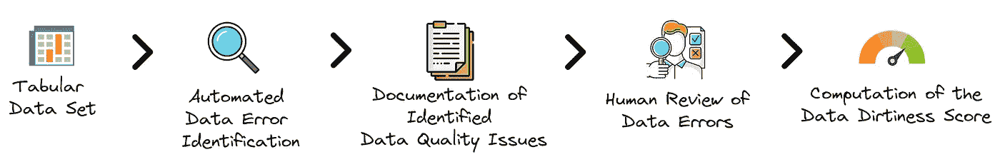
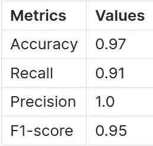

# 数据质量错误检测由 LLM 驱动

> 原文：[`towardsdatascience.com/automated-detection-of-data-quality-issues-54a3cb283a91?source=collection_archive---------0-----------------------#2024-03-22`](https://towardsdatascience.com/automated-detection-of-data-quality-issues-54a3cb283a91?source=collection_archive---------0-----------------------#2024-03-22)

[](https://medium.com/@simon.grah?source=post_page---byline--54a3cb283a91--------------------------------)[](https://towardsdatascience.com/?source=post_page---byline--54a3cb283a91--------------------------------) [Simon Grah](https://medium.com/@simon.grah?source=post_page---byline--54a3cb283a91--------------------------------)

·发表于[Towards Data Science](https://towardsdatascience.com/?source=post_page---byline--54a3cb283a91--------------------------------) ·阅读时间 17 分钟·2024 年 3 月 22 日

--

本文是关于使用大型语言模型（LLM）清理数据系列文章的第二篇，重点介绍在表格数据集中识别错误。



本文概述了我们将要探索的方法论，重点是评估表格数据集的脏污分数，且几乎不需要人工干预。

# 数据脏污分数

鼓励读者首先阅读关于[数据脏污分数](https://medium.com/p/fe2ca5678d40)的介绍性文章，文章解释了关键假设，并演示了如何计算该分数。

简单回顾一下，*数据脏污分数*估算数据集中包含错误的单元格的预期比例。这个指标背后的主要假设如下：

+   **数据错误与违反的约束有关。**

+   如果**没有预期**，则**不会影响分数**。

+   **数据问题**可以**精确定位到特定单元格**。

+   每个**数据错误**都会被分配一个**置信度分数**。

+   **每个单元格对整体得分有相同的影响。**

这一过程的第一步是识别和分类数据集中的数据不准确性。

# 自动检测数据质量问题的重要性

检测数据问题在这个过程中至关重要，但由于多个因素，通常具有挑战性：

+   **高人工标注成本**：识别数据错误通常需要大量来自数据专业人员（如科学家、工程师和分析师）或主题专家（SME）的投入。这需要大量时间且成本昂贵。

+   **数据从业者对这项繁琐工作的热情缺乏**：数据清洗被许多业内人士视为工作中不太吸引人的部分，这并不是什么秘密。数据清洗通常被视为比建模、构建现代数据架构或回答业务查询等更具吸引力活动的前奏，因此它常常排在优先级较低的位置，导致拖延，甚至在某些情况下，直到出现重大问题才被完全忽视。

+   **领域专家的局限性**：领域专家（SMEs）拥有宝贵的知识，但可能缺乏像 SQL 或编程这样的技术技能。虽然无代码和低代码工具在某种程度上有所帮助，但它们尚未被完全采用，且可能无法覆盖所有数据管理方面，比如版本控制。

+   **专业知识差距**：有效的数据清洗超越了基本技能，要求具备专门的专业知识。缺乏培训和数据准备方面的普遍冷漠意味着许多从业者只能识别表面错误，忽视了需要更深层次理解的数据清洗中更复杂的问题。

尽管存在固有的挑战，**大语言模型（LLM）**领域的进展为自动识别简单数据问题并揭示更复杂的数据质量问题提供了有前景的解决方案。

# 大语言模型驱动的数据错误检测

大语言模型正成为自动化检测数据质量问题的宝贵工具，作为高效的起点，推动富有成效的人机协作迭代过程。诸如[Jellyfish: A Large Language Model for Data Preprocessing](https://www.semanticscholar.org/reader/7e17ef56273063dfa838de30b7cc0546b2e5ee10)、[Can language models automate data wrangling?](http://josephorallo.webs.upv.es/escrits/MLJ-DataWranglingAutomation.pdf) 和[Large Language Models as Data Preprocessors](https://arxiv.org/abs/2308.16361)等论文中讨论的模型，展示了它们在自动化约束生成和数据错误检测方面的潜力。这种自动化并不取代人工干预，而是增强了它，使得人们可以审查和调整自动化约束，通过直接处理问题或调整置信度分数来反映数据错误检测中的不确定性。

LLM（大语言模型）特别适用于检测数据质量问题，因为它们在多样化的互联网内容上进行了广泛的训练，涵盖了大量领域知识和与数据质量问题相关的代码审查示例。这种训练使得 LLM 能够基于文本内容识别数据错误，而无需显式定义规则。通过将表格数据集转换为纯文本（称为*序列化*），LLM 能够像一支经验丰富的团队一样仔细审查数据，利用其“压缩”的互联网知识来定位错误。这种广泛的训练使得它们能够以类似人类专家的直觉水平，识别出 CSV 文件等人类可读数据集中的潜在错误。此外，任何领域特定知识的空白都可以通过检索增强生成（RAG）等技术，或者通过根据数据集的特定性质调整模型的提示来弥补。

在数据错误检测中使用 LLM 的另一个关键优势是它们能够处理与数据质量问题相关的固有不确定性。并非所有错误都是直观的，甚至专家有时也会对什么构成数据问题产生分歧。LLM 能够像人类一样，根据直觉和经验的结合，为其发现的错误分配置信度分数，从而反映错误发生的可能性。

在不同数据集和潜在问题中推广错误检测的挑战相当巨大。传统方法通常依赖一套广泛的决策规则或结合专门的机器学习模型来处理各种场景，比如检查地址和电话号码的有效性或进行异常检测。这正是 LLM 的优势所在，它们提供了一种更具适应性且劳动强度更低的替代方案。LLM 能够理解并识别各种数据质量问题，而无需庞大的基于规则的系统或领域特定的模型，这使得它们成为一种无价的工具。与传统商业规则或统计方法相比，机器学习方法的优势相当引人注目。机器学习的采用是由于其相对易用性和在不同用例中的适应性，不需要过多的领域特定知识，也无需花费大量时间进行实施。

接下来，我们将通过一个实际示例演示这种方法。

# 一个案例研究

在上一篇文章中，我们通过使用来自《[Cleaning Data for Effective Data Science](https://github.com/PacktPublishing/Cleaning-Data-for-Effective-Data-Science)》一书的数据集示例，探讨了[数据脏污评分](https://medium.com/p/fe2ca5678d40)的概念。相关的数据集如下：

```py
Student#,Last Name,First Name,Favorite Color,Age
1,Johnson,Mia,periwinkle,12
2,Lopez,Liam,blue,green,13
3,Lee,Isabella,,11
4,Fisher,Mason,gray,-1
5,Gupta,Olivia,9,102
6,,Robinson,,Sophia,,blue,,12
```

数据错误已经被指出。现在，我们想探索如何使用大型语言模型，特别是`GPT-4`，自动发现这些错误。这种新方法提供了一种现代化的方式来发现数据集中的问题，但也带来了可能的风险，如使用外部 API 时的隐私问题。然而，这种方法不仅适用于`GPT-4`，还可以与任何 LLM 配合使用，尽管效果可能会因模型的能力而有所不同。

# 初步步骤：检索表格注释

为了帮助模型识别数据不一致性，提供有关数据框的额外上下文信息是很有帮助的。这正是[data catalog](https://www.datagalaxy.com/en/blog/what-is-a-data-catalog/)（数据目录）的作用，尽管这个话题非常广泛，我们将简化为仅关注 LLM 在检查数据集行批次时识别数据错误所需的基本上下文信息。

所需的关键元数据包括：

+   对**表格**的概述，包括其**描述和用途**。

+   对每个**列的含义和类型**有清晰的**理解**。

鉴于在组织中常常缺乏数据目录或可靠的文档，我们将探讨如何使用 LLM 加速这一过程。这个过程被称为*表格注释*，它涉及识别表格元素的语义信息，包括列、列之间的关系以及单元格中的实体。欲了解更多详细信息，请参考以下资源：[使用 ChatGPT 进行列类型注释](https://arxiv.org/abs/2306.00745)、[使用预训练语言模型进行列注释](https://paperswithcode.com/paper/annotating-columns-with-pre-trained-language)或[SOTAB：WDC Schema.org 表格注释基准](https://paperswithcode.com/paper/sotab-the-wdc-schema-org-table-annotation)。

这是我使用的提示：

```py
Analyse the table below and provide schema annotations based on Schema.org standards.

Student#,Last Name,First Name,Favorite Color,Age
1,Johnson,Mia,periwinkle,12
2,Lopez,Liam,blue,green,13
3,Lee,Isabella,,11
4,Fisher,Mason,gray,-1
5,Gupta,Olivia,9,102
6,,Robinson,,Sophia,,blue,,12

Follow these steps:
1\. Identify the overall semantic type of the table.
2\. Provide a short description of each column.
3\. Annotate each column with its semantic type from Schema.org.
4\. Determine the most suitable data type for each column (after data cleaning).

Summarise the table schema as follows:
- Table Semantic Type: <type>
- Column: <name>, Description: <description>, Semantic Type: <Schema.org type>, Pandas Type: <Pandas data type>
```

在提示指令中，我要求模型分析提供的表格（或表格概述），并建议按照[Schema.org](https://schema.org/)标准进行注释。具体来说，输出应包括：

+   **表格的语义类型**

+   每个**列**的简要**描述**

+   来自 Schema.org 的**列注释类型**，如适用

+   每列的理想或最佳匹配的**数据类型**，无论提供的文本序列化中是否存在数据问题

然后，响应会被格式化为提供清晰和结构化的摘要，可以作为后续提示中的上下文重用：

```py
Summarise the table schema as follows:
- Table Semantic Type: <type>
- Column: <name>, Description: <description>, Semantic Type: <Schema.org type>, Pandas Type: <Pandas data type>
```

表格通过`{table}`占位符插入提示中。典型的方法是通过序列化将表格数据转换为文本，如在[大型语言模型（LLMs）在表格数据上的应用：预测、生成和理解——综述](https://arxiv.org/abs/2402.17944?utm_campaign=Data_Elixir&utm_source=Data_Elixir_475)中所讨论的那样。

以下是`GPT-4`的示例响应：

```py
- Table Semantic Type: Person
- Column: Student#, Description: Unique identifier for each student, Semantic Type: identifier, Pandas Type: int
- Column: Last Name, Description: Family name of the student, Semantic Type: familyName, Pandas Type: string
- Column: First Name, Description: Given name of the student, Semantic Type: givenName, Pandas Type: string
- Column: Favorite Color, Description: Preferred color of the student, Semantic Type: color (custom), Pandas Type: string (or list if cleaned for multiple values)
- Column: Age, Description: Age of the student, Semantic Type: age, Pandas Type: int (after cleaning invalid entries)
```

回复可能会略有不同，但对于这样一个简单的示例通常是一致的。这里的目的是加速初步过程，而不是完全自动化。因此，这可以视为一个初步草稿，之后可以根据我们知识的见解和来自领域专家（SMEs）的外部上下文进行完善。

现在，了解了一些表格的上下文后，让我们探讨如何自动识别数据质量问题。

# 使用 LLMs 检测数据错误

首先，我建议使用一个提示，帮助识别给定表格中的数据质量问题。

```py
Task: Analyse the provided table to identify and document data quality issues.

Below are common data quality issues to guide your analysis. However, you may also identify other relevant issues:
- Ingestion errors
- Typecasting issues
- Duplicates
- Date parsing issues
- Character encoding problems
- Missing values
- Typos/spelling mistakes
- Anomalies/outliers
- Conversion errors and inconsistent units
- Privacy concerns (e.g., exposed PII)
- Domain-specific errors (e.g., invalid formats for addresses, phone numbers, emails)

Instructions:
1\. Examine silently the table and its metadata.
2\. Line by line, identify potential data quality issues without coding.
3\. Document each issue, including:
   - Nature and description of the issue
   - Expected correct state
   - Violated constraint
   - Confidence level in your assessment using ordinal categories: `low`, `medium`, `high` and `certain`.
   - Specific location of the issue in the table (use 'None' for table-wide issues): Index and Column names.

Provided Data:

Table: 
,Student#,Last Name,First Name,Favorite Color,Age
0,1,Johnson,Mia,periwinkle,12
1,2,Lopez,Liam,blue,green,13
2,3,Lee,Isabella,,11
3,4,Fisher,Mason,gray,-1
4,5,Gupta,Olivia,9,102
5,6,,Robinson,,Sophia,,blue,,12

Metadata:
- Table Semantic Type: Person
- Column: Student#, Description: Unique identifier for each student, Semantic Type: identifier, Pandas Type: int or string
- Column: Last Name, Description: Family name of the student, Semantic Type: familyName, Pandas Type: string
- Column: First Name, Description: Given name of the student, Semantic Type: givenName, Pandas Type: string
- Column: Favorite Color, Description: Preferred color of the student, Semantic Type: color (custom), Pandas Type: string (or list if cleaned for multiple values)
- Column: Age, Description: Age of the student, Semantic Type: age, Pandas Type: int (after cleaning invalid entries)

Detected Data Issues:
```

提示的初始部分设置了任务目标，并列出了常见的数据问题示例，如数据摄取错误、重复数据和隐私问题等。**此列表并不详尽，鼓励您根据表格的上下文添加更多相关类型，以指导分析。**

接下来，提示详细说明了逐步指令，采用[Chain-of-Thoughts](https://learnprompting.org/docs/intermediate/chain_of_thought)方法，确保模型有条不紊地分析表格及其元数据，在逐行识别数据问题时模拟人工分析。这个过程应在没有编码的情况下进行，以保持简洁性和广泛适用性。这个步骤非常重要，因为尽管像`GPT-4`这样的模型具有分析能力，可以进行有用的迭代编码会话，但仅依赖于文本分析有助于推广通用性。

在检测到潜在的数据问题时，提示会指导记录以下详细信息：

+   **问题的性质和描述**

+   **期望的正确状态**

+   **违反的约束**

+   使用序数类别的**置信度等级**进行评估：`low`（低）、`medium`（中）、`high`（高）和`certain`（确定）。

+   数据问题的**具体位置**，如果是全表问题，则使用‘None’，并附上索引和列名以供参考。

提示中提供了表格及其元数据，并为每一行添加了索引，帮助模型精确定位错误位置。

> *对于大规模表格，可以分批应用此提示以涵盖整个数据集，并将结果汇总以识别所有数据质量问题。*

下面是该提示生成的输出示例，格式为报告，详细列出了已识别的数据问题，每个问题包括描述、期望状态、违反的约束、置信度等级和位置。

```py
1\. Issue: Incorrect value format in "Favorite Color" column
   - Nature and Description: The entry "blue,green" in the "Favorite Color" column for the second row appears to contain two colors instead of one, suggesting a possible ingestion or data entry error.
   - Expected Correct State: Each cell under the "Favorite Color" column should contain only one color.
   - Violated Constraint: Single value constraint.
   - Confidence Level: High
   - Specific Location: Index 1, Column "Favorite Color"

2\. Issue: Missing value in "Favorite Color" and "Age" columns
   - Nature and Description: The third row has a missing value for "Favorite Color", and the sixth row has missing values for both "Last Name" and "Favorite Color".
   - Expected Correct State: No missing values in any of the columns.
   - Violated Constraint: Non-null constraint.
   - Confidence Level: Certain
   - Specific Location: Index 2, Column "Favorite Color"; Index 5, Columns "Last Name", "Favorite Color"

3\. Issue: Negative value in "Age" column
   - Nature and Description: The fourth row has an age of "-1", which is not possible and indicates a data entry error.
   - Expected Correct State: Age values should be positive integers.
   - Violated Constraint: Age value range (greater than 0).
   - Confidence Level: Certain
   - Specific Location: Index 3, Column "Age"

4\. Issue: Misplaced values in "Favorite Color" and "Age" columns
   - Nature and Description: In the fifth row, what appears to be an age ("9") is placed in the "Favorite Color" column, and an unlikely age ("102") is in the "Age" column, suggesting a possible shifting or misplacement of values.
   - Expected Correct State: Age should be a reasonable positive integer, and favorite color should be a string denoting a color.
   - Violated Constraint: Data type and value range constraint.
   - Confidence Level: High
   - Specific Location: Index 4, Columns "Favorite Color", "Age"

5\. Issue: Inconsistent formatting in row entries
   - Nature and Description: The sixth row contains additional commas, which might indicate incorrect splitting or entry of the data, leading to misalignment of the values with their respective columns.
   - Expected Correct State: Each row should consistently follow the format defined by the column headers without extra delimiters.
   - Violated Constraint: Data format and consistency constraint.
   - Confidence Level: High
   - Specific Location: Index 5, Entire row
```

下一步是将这些识别出的问题转换为 Python 对象，以便更容易计算*数据脏度评分*。

# 将识别的数据问题转换为正确格式

本节重点讲解如何将先前识别的数据问题从简单文本描述转换为 Python 对象。这些对象应遵循`DataIssue`类定义的结构：

```py
@dataclass
class DataIssue:
    type_of_issue: str
    expectation: str
    constraint_violated: str
    confidence_score: str # `low`, `medium`, `high` or `certain`
    location: List[Tuple]  # Cell positions as (Index, Column). Use None for row/column-wide issues.
```

这是我使用的提示：

```py
Task: Document data table issues using the provided `DataIssue` class.

For each identified issue and its description, document it using the provided `DataIssue` class structure. 

```python

from dataclasses import dataclass

from typing import List, Tuple

@dataclass

class DataIssue:

    type_of_issue: str

    expectation: str

    constraint_violated: str

    confidence_score: str # `低`，`中`，`高` 或 `确定`

    location: List[Tuple]  # 单元格位置以（索引，列）表示。使用 None 表示整行或整列的问题。

Instructions:

1\. 静默检查所有识别出的问题及其描述。

2\. 对于每个问题，使用提供的`DataIssue`类结构实例化它。

3\. 仅返回代码。

4\. 一旦代码验证完成，停止生成。

识别的问题：

{issues_found}

Your code here:

```py

The goal is to generate Python code representing each data issue as a `DataIssue` object without redundant text. The identified issues are injected into the prompt using the placeholder `{issues_found}`.

Example output:

```

issue1 = DataIssue(

    type_of_issue="格式不正确",

    expectation="‘喜欢的颜色’列下的每个单元格应只包含一个颜色",

    constraint_violated="单值约束",

    confidence_score="高",

    location=[(1, "喜欢的颜色")]

)

issue2 = DataIssue(

    type_of_issue="缺失值"

    expectation="任何列中都不应有缺失值",

    constraint_violated="非空约束",

    confidence_score="确定",

    location=[(2, "喜欢的颜色"), (5, "姓氏"), (5, "喜欢的颜色")]

)

issue3 = DataIssue(

    type_of_issue="负值",

    expectation="年龄值应为正整数",

    constraint_violated="年龄值范围（大于 0）",

    confidence_score="确定",

    location=[(3, "年龄")]

)

issue4 = DataIssue(

    type_of_issue="值错位",

    expectation="年龄应该是一个合理的正整数，喜欢的颜色应该是表示颜色的字符串",

    constraint_violated="数据类型和数值范围约束",

    confidence_score="高",

    location=[(4, "喜欢的颜色"), (4, "年龄")]

)

issue5 = DataIssue(

    type_of_issue="格式不一致",

    expectation="每一行应该始终遵循由列标题定义的格式，且不应有额外的分隔符",

    constraint_violated="数据格式和一致性约束",

    confidence_score="高",

    location=[(5, None)]  # None 表示整个行的问题

)

```py

The final step involves converting the `location` attribute from lists of tuples to `numpy` arrays, which is detailed in the appendix.

With all elements in place, we can now calculate the *Data Dirtiness Score*.

# Calculation of the Data Dirtiness Score and Comparison with Ground Truth

Let’s revisit the function from the previous article, `compute_data_dirtiness_score`, which uses a list of `DataIssue` objects mentioned earlier.

```

compute_data_dirtiness_score(data_issues)

```py

> *Data Dirtiness Score: 28.33%*

Using the `GPT-4` model, we estimated the score to be around 28% for this sample. This is fairly close to the "ground truth" score of 31.87%.

To understand the discrepancy between these scores, let’s delve into more detailed metrics on data issue detection. In addition to the overall score, we have matrices of cell issue probabilities for both the ground truth and the model’s estimates.

Below is the ground truth matrix, with columns and indices added for clarity:

```

学生编号  姓氏  名字  喜欢的颜色  年龄

0      0.00        0.0        0.00            0.00  0.00

1      0.00        0.0        0.00            0.75  0.00

2      0.00        0.0        0.00            1.00  0.00

3      0.00        0.0        0.00            0.00  1.00

4      0.00        0.0        0.00            0.75  0.75

5      0.75        1.0        0.75            1.00  0.75

```py

And here is the matrix of probabilities estimated by the model:

```

学生编号  姓氏  名字  喜欢的颜色  年龄

0       0.0        0.0        0.00          0.0000  0.00

1       0.0        0.0        0.00          0.7500  0.00

2       0.0        0.0        0.00          1.0000  0.00

3       0.0        0.0        0.00          0.0000  1.00

4       0.0        0.0        0.25          0.8125  0.75

5       1.0        1.0        1.00          1.0000  1.00

```py

Though the matrices appear similar at first glance, we can apply threshold-based metrics such as `accuracy`, `recall`, `precision`, and `F1-score` to get a clearer picture. These metrics provide a straightforward evaluation of the model's performance by considering a cell problematic if the model's likelihood exceeds 0\. Here are the metrics obtained:



The model correctly identified 91% of problematic cells (`recall`), and all of its error predictions were accurate (`precision`).

The model missed one particular issue: “The `Favorite Color` and `First Name` fields might be swapped, considering `Olivia` can be both a name and a colour." This was deemed improbable with a `low` confidence score, suggesting `Olivia` is more likely the `First Name` rather than the `Favorite Color`. Consequently, even though this potential issue was overlooked, its minimal confidence score lessened its impact on the overall Data Dirtiness Score. This explains why the two scores are relatively close despite this omission.

In summary, this approach, based on large language models (LLMs), offers a method for detecting data quality issues in a data frame. While this method may not yet be fully automated and might need manual adjustments, it’s hoped that it will expedite the detection of data errors and the calculation of the *Data Dirtiness Score* for tabular data sets.

# Next Steps and Challenges

I use a two-step process to generate the issues as code. This is done because I have found this adds more stability over a one-in-all solution, i.e. scanning data set and metadatas and outputs data issues directly in right code format. This doesn’t imply it’s impossible, but I’ve chosen to divide this step into two phases to improve robustness for the time being.

An issue we face concerns managing large data sets, both in terms of the number of rows and columns. Despite recent advancements, LLMs still face limitations regarding the input context window and the length of generated content. These constraints limit the size of the table that can be serialised into the prompt for analysis and the length of the data issue report produced by the model. How to divide a data frame based on its size and the model’s capabilities is a question that arises.

In certain scenarios, the lack of general context can be problematic, such as when identifying duplicate rows in a database or detecting spelling errors without a broad understanding of the column values. For instance, in cases where duplicates are not straightforward, a common approach is **Entity Matching**. This technique is particularly useful in data cleaning processes and has seen advancements through the use of Large Language Models. Relevant research in this area includes studies like [Entity Matching using Large Language Models](https://www.semanticscholar.org/paper/Entity-Matching-using-Large-Language-Models-Peeters-Bizer/13c2ae7831c0f1579bc8c6f1a31c9aa8689e24a8) and [Can Foundation Models Wrangle Your Data?](https://arxiv.org/abs/2205.09911), along with [Large Language Models as Data Preprocessors](https://arxiv.org/abs/2308.16361) and [Jellyfish: A Large Language Model for Data Preprocessing](https://www.semanticscholar.org/reader/7e17ef56273063dfa838de30b7cc0546b2e5ee10).

Ensemble methods in machine learning, which involve combining multiple models, can enhance performance and stability. This approach can be applied by running several LLMs simultaneously to identify issues in a data set. It’s beneficial to vary the prompts and settings for each LLM to ensure a diverse range of insights. Additionally, assigning specific error types, like spelling mistakes, to individual models can make the process more efficient. While this method can lead to more reliable results by dividing the task into smaller parts, it also increases both the cost and the complexity of the software. By gathering all the identified data issues, we can improve our chances of finding errors (increasing recall) but might also identify more false errors (decreasing precision). However, reviewing these identified errors is generally less time-consuming than finding them in the first place.

The ability of LLMs to interact directly with databases, similar to the code analysis capability in `ChatGPT-4`, opens up a wider range of possibilities for detecting data errors. A challenge here is automating this process, as the model may deviate from its intended path without sufficient guidance.

Despite all the challenges, it is already quite promising what we can achieve with such as simple approach. With more work on engineering, I hope we can very soon provide a more robust solution to cover larger data sets and fully automate the detection process.

The next article will discuss automated data repair or, at the very least, suggest solutions for repair pending validation.

# References

*   [Data Dirtiness Score](https://medium.com/p/fe2ca5678d40)
*   [Jellyfish: A Large Language Model for Data Preprocessing](https://www.semanticscholar.org/reader/7e17ef56273063dfa838de30b7cc0546b2e5ee10)
*   [Can language models automate data wrangling?](http://josephorallo.webs.upv.es/escrits/MLJ-DataWranglingAutomation.pdf)
*   [Large Language Models as Data Preprocessors](https://arxiv.org/abs/2308.16361)
*   [Column Type Annotation using ChatGPT](https://arxiv.org/abs/2306.00745)
*   [Annotating Columns with Pre-trained Language Models](https://paperswithcode.com/paper/annotating-columns-with-pre-trained-language)
*   [SOTAB: The WDC Schema.org Table Annotation Benchmark](https://paperswithcode.com/paper/sotab-the-wdc-schema-org-table-annotation)
*   [Large Language Models(LLMs) on Tabular Data: Prediction, Generation, and Understanding — A Survey](https://arxiv.org/abs/2402.17944?utm_campaign=Data_Elixir&utm_source=Data_Elixir_475)
*   [Entity Matching using Large Language Models](https://www.semanticscholar.org/paper/Entity-Matching-using-Large-Language-Models-Peeters-Bizer/13c2ae7831c0f1579bc8c6f1a31c9aa8689e24a8)

# Appendix

The section explains how to transform the `location` attribute of a `DataIssue` object, which comes from a LLM, into a different format. This transformation changes a list of tuples, which represent cell positions, into a `numpy`array. This array acts as a mask for those cell positions.
Here's a basic example using the `Students` data set:

```

create_mask_from_list_of_cell_positions(

    shape=dataset_shape,

    list_of_cell_positions=[(4, '喜欢的颜色'), (4, '年龄')],

    columns=columns

)

```py

```

array([[0, 0, 0, 0, 0],

    [0, 0, 0, 0, 0],

    [0, 0, 0, 0, 0],

    [0, 0, 0, 0, 0],

    [0, 0, 0, 1, 1],

    [0, 0, 0, 0, 0]], dtype=int8)

```py

Below are the function definitions:

```

def validate_cell_position(

    cell_position: Union[

        Tuple[int, int], Tuple[None, int], Tuple[int, None], Tuple[None, None]

    ],

    columns: List[str] = None,

) -> Tuple[int, int]:

    """

    验证单元格位置并在必要时将列名转换为索引。

    """

    if not isinstance(cell_position, tuple):

        raise ValueError("单元格位置必须是元组")

    # 如果提供了列名，则将列名转换为索引

    if isinstance(cell_position[1], str):

        if columns is None:

            raise ValueError(

                "必须提供列名，以便根据列名创建掩码"

            )

        column_index = columns.index(cell_position[1])

        return (cell_position[0], column_index)

    return cell_position

def set_mask_values(mask: np.ndarray, cell_position: Tuple[int, int]):

    """

    根据单元格位置设置掩码中的值。

    """

    row_index, col_index = cell_position

    if row_index is None:

        mask[:, col_index] = 1

    elif col_index is None:

        mask[row_index, :] = 1

    else:

        mask[row_index, col_index] = 1

def create_mask_from_list_of_cell_positions(

    shape: Tuple[int, int],

    list_of_cell_positions: List[Tuple],

    columns: List[str] = None,

) -> np.ndarray:

    """

    根据单元格位置列表创建掩码数组。

    """

    mask = np.zeros(shape=shape, dtype=np.int8)

    for cell_position in list_of_cell_positions:

        validated_position = validate_cell_position(cell_position, columns)

        set_mask_values(mask, validated_position)

    return mask

```
