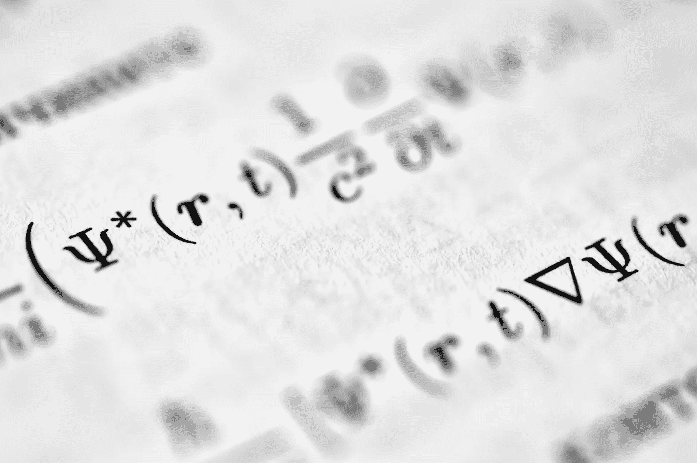

# 自动微分（AutoDiff）：带有示例的简要介绍

> 原文：[`towardsdatascience.com/automatic-differentiation-autodiff-a-brief-intro-with-examples-3f3d257ffe3b?source=collection_archive---------2-----------------------#2024-10-11`](https://towardsdatascience.com/automatic-differentiation-autodiff-a-brief-intro-with-examples-3f3d257ffe3b?source=collection_archive---------2-----------------------#2024-10-11)

## 介绍了自动微分（AutoDiff）的机制，探索其数学原理、实现策略以及在当前最常用框架中的应用

 [Ebrahim Pichka](https://ebrahimpichka.medium.com/?source=post_page---byline--3f3d257ffe3b--------------------------------)

·发表于 [Towards Data Science](https://towardsdatascience.com/?source=post_page---byline--3f3d257ffe3b--------------------------------) ·阅读时长 10 分钟·2024 年 10 月 11 日

--

图片来自 [Bozhin Karaivanov](https://unsplash.com/@bkaraivanov?utm_source=medium&utm_medium=referral) 于 [Unsplash](https://unsplash.com/?utm_source=medium&utm_medium=referral)

# 微分在现代机器学习优化中的基础作用

机器学习的核心在于优化损失/目标函数。这个优化过程在很大程度上依赖于计算这些函数相对于模型参数的梯度。正如 Baydin 等人（2018 年）在他们的全面调查中阐明的那样[1]，这些梯度引导了优化算法中的迭代更新，比如随机梯度下降（SGD）：

*θₜ₊₁ = θₜ - α ∇θ L(θₜ)*

其中：

+   θₜ 表示步骤 t 时的模型参数

+   α 是学习率

+   ∇_θ L(θₜ) 表示损失函数 L 相对于参数 θ 的梯度

这个简单的更新规则掩盖了在拥有数百万甚至数十亿参数的深度神经网络中计算梯度的复杂性。

# 2\. 微分三位一体
