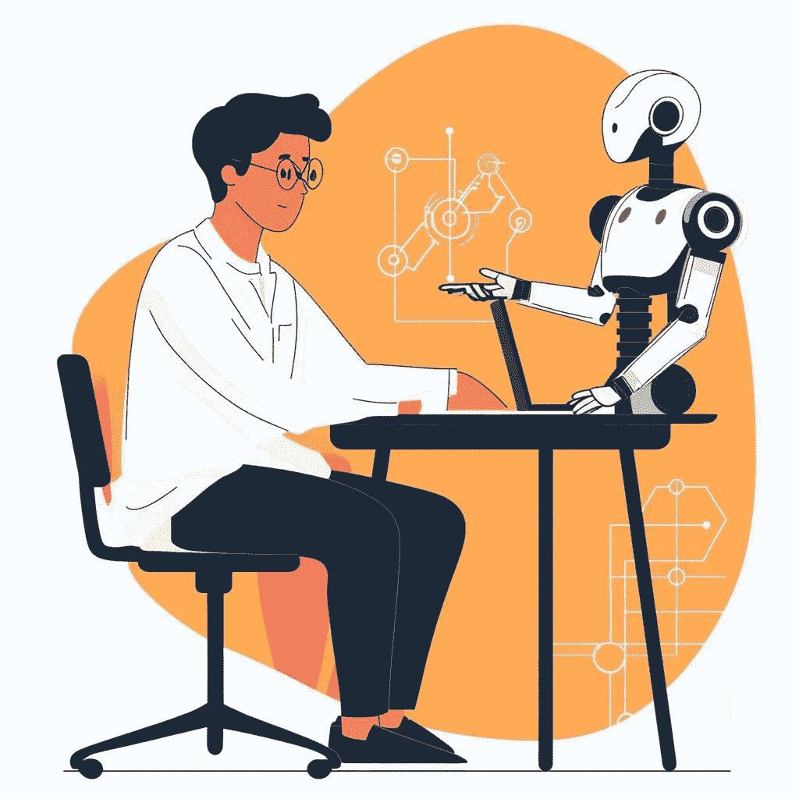

# 使用大型语言模型（LLMs）自动化研究工作流程

> 原文：[`towardsdatascience.com/automating-research-workflows-with-llms-c3092ee447a8?source=collection_archive---------13-----------------------#2024-09-10`](https://towardsdatascience.com/automating-research-workflows-with-llms-c3092ee447a8?source=collection_archive---------13-----------------------#2024-09-10)

图片由作者使用[midjourney](https://www.midjourney.com/)制作

## 使用 AI 的原子级应用来增强研究人员

 [Lucas Soares](https://lucas-soares.medium.com/?source=post_page---byline--c3092ee447a8--------------------------------)

·发表于[Towards Data Science](https://towardsdatascience.com/?source=post_page---byline--c3092ee447a8--------------------------------) ·阅读时间：13 分钟·2024 年 9 月 10 日

--

最近，我有幸在[伦敦开放数据科学大会](https://odsc.com/europe/)上主持了一次研讨会，讨论了我认为大型语言模型（LLMs）在通过自动化某些任务来增强学术和非学术研究人员的潜力，可能扮演的一个有趣角色。

***在这篇文章中，我想深入探讨在那个研讨会上讨论的核心概念，并讨论我认为人工智能通过与不同领域研究人员的整合，正在出现的一个令人着迷的新角色。***

# 增强什么？

我在研讨会上提出的问题是：

> 我们如何利用 LLMs 来增强或扩展研究工作流程，而不降低研究人员的认知参与度？

触及增强这一话题总是充满挑战，并且可能导致一些令人不舒服的对话，谈论人工智能如何在不久的将来取代人类。因此，为了更清晰地表达，我想**从更具体的角度开始定义它：**

> 增强 = 通过工具提升能力

增强的概念深深植根于道格拉斯·恩格尔巴特的工作中，他在某种程度上开创了这一思想的一个版本，即技术应该增强人类的能力……
