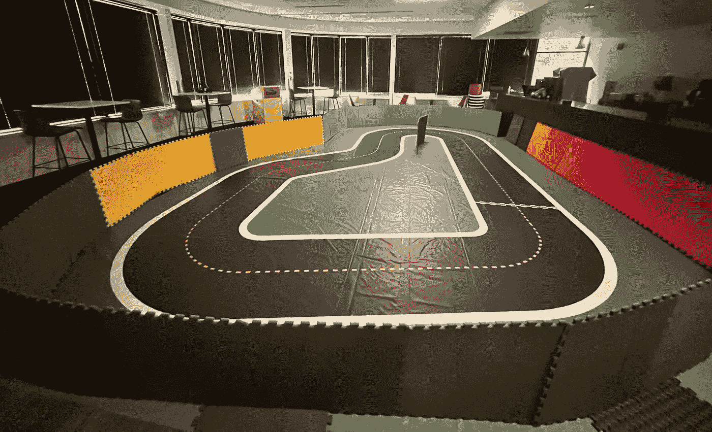
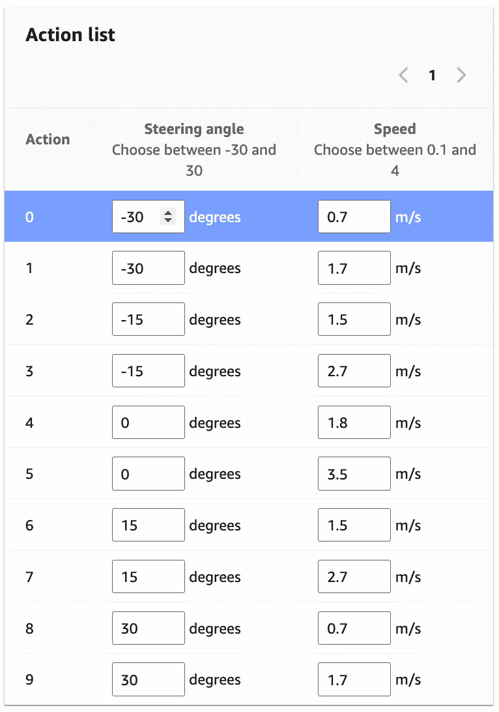
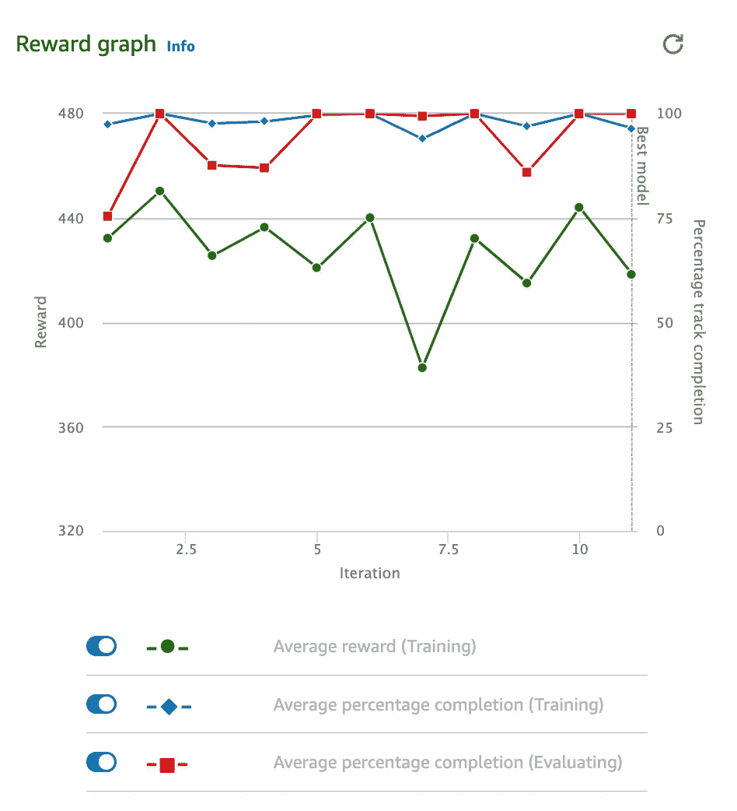
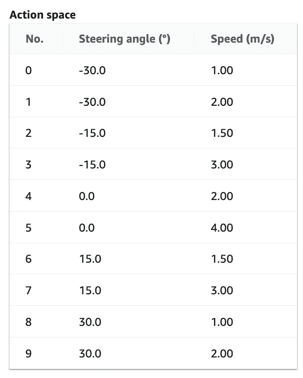
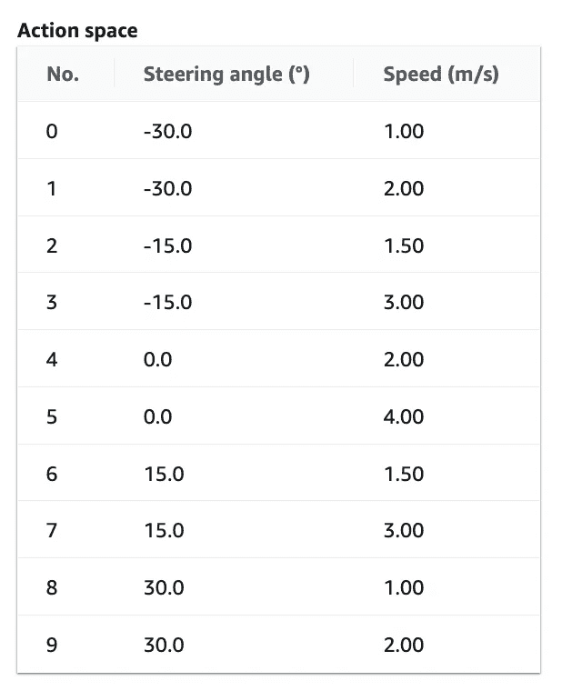

# AWS DeepRacer：减少 Sim2Real 差距的实用指南——第二部分 || 训练指南

> 原文：[`towardsdatascience.com/aws-deepracer-a-practical-guide-to-reducing-the-sim2real-gap-part-2-training-guide-e96805cd7141?source=collection_archive---------5-----------------------#2024-08-26`](https://towardsdatascience.com/aws-deepracer-a-practical-guide-to-reducing-the-sim2real-gap-part-2-training-guide-e96805cd7141?source=collection_archive---------5-----------------------#2024-08-26)

## 如何为不同的车辆行为选择动作空间、奖励函数和训练范式

[](https://shrey-pareek.medium.com/?source=post_page---byline--e96805cd7141--------------------------------)[](https://towardsdatascience.com/?source=post_page---byline--e96805cd7141--------------------------------) [Shrey Pareek, PhD](https://shrey-pareek.medium.com/?source=post_page---byline--e96805cd7141--------------------------------)

·发表于[Towards Data Science](https://towardsdatascience.com/?source=post_page---byline--e96805cd7141--------------------------------) ·11 分钟阅读·2024 年 8 月 26 日

--

本文描述了如何训练 AWS DeepRacer 在赛道上安全驾驶而不发生碰撞。目标并不是训练最快的赛车（尽管我会简要讨论这一点），而是训练一个可以学习保持在赛道上并顺利过弯的模型。下方的视频展示了所谓的“安全”模型：

DeepRacer 尝试通过跟随中心线保持在赛道上。视频由作者提供。

+   **第一部分（2024 年 8 月 20 日）**：赛道和周围环境设置。

+   [**第二部分（2024 年 8 月 26 日）**](https://medium.com/towards-data-science/aws-deepracer-a-practical-guide-to-reducing-the-sim2real-gap-part-2-training-guide-e96805cd7141): 动作空间和奖励函数设计，以及训练范式。

**GitRepo 链接：** [**https://github.com/shreypareek1991/deepracer-sim2rea**](https://github.com/shreypareek1991/deepracer-sim2real/tree/main)**l**

在[第一部分](https://shrey-pareek.medium.com/aws-deepracer-a-practical-guide-to-reducing-the-sim2real-gap-part-1-580fb1244229)中，我描述了如何准备赛道和周围环境，以最大化成功完成多圈驾驶 DeepRacer 的机会。如果你还没有阅读第一部分，我强烈建议你阅读它，因为它是理解影响 DeepRacer 性能的物理因素的基础。

我最初使用了[这篇指南](https://medium.com/@marsmans/how-i-got-into-the-top-2-in-aws-deepracer-32127a364212)，来自[Sam Marsman](https://medium.com/u/c7e8170f7240?source=post_page---user_mention--e96805cd7141--------------------------------)作为起点。它帮助我快速训练模拟模型，但它们在赛道上的成功率较低。话虽如此，我**强烈推荐**阅读他们的博客，因为它提供了关于如何逐步训练模型的极佳建议。

**注意：我们将首先训练一个慢速模型，然后稍后再提高速度。上方的视频是一个更快的模型，我将在最后简要解释。**

# 第一部分总结

在第一部分中，我们发现 DeepRacer 使用来自前置摄像头的灰度图像作为输入，以理解和导航其周围环境。我们强调了两个关键发现：

1\. DeepRacer 无法*识别*物体，而是学会保持在某些像素值上并避免其他像素值。汽车学会保持在*黑色*赛道表面上，避免越过*白色*赛道边界，并避免进入*绿色*（或者说是一种灰色调）赛道区域。

2\. 相机对环境光和背景干扰非常敏感。

通过减少环境光和放置五光十色的障碍物，我们尝试缓解上述问题。下面是我从第一部分复制的设置图片。



第一部分中描述的轨道和环境设置。使用五光十色的障碍物和减少环境光照是关键。图像由作者提供。

# 训练

在本文中，我不会详细讨论强化学习或 DeepRacer 训练环境。已有许多文章和来自[AWS 的指南](https://docs.aws.amazon.com/deepracer/latest/developerguide/deepracer-get-started.html)涵盖了这一内容。

简而言之，强化学习是一种技术，智能体试图学习一个**最大化标量奖励**的最优策略。换句话说，智能体学习一组基于情况的动作，以最大化奖励。那些导致*理想结果*的动作通常会得到*正向奖励*。相反，*不利的动作*则会被*惩罚*（负向奖励）或给予小额正向奖励。

相反，我的目标是提供一种训练策略，最大化汽车不发生碰撞地完成赛道的机会。我将从五个方面进行探讨：

1.  赛道 — 顺时针和逆时针方向

1.  超参数 — 降低学习率

1.  动作空间

1.  奖励函数

1.  训练范式/克隆模型

## 赛道

理想情况下，你希望在模拟环境中使用与现实中相同的赛道。我使用了[A To Z Speedway](https://www.amazon.com/Speedway-Printed-Track-DeepRacer-Matte/dp/B0BT8CGKTP)。此外，为了获得最佳性能，你需要反复在**顺时针和逆时针**方向上进行训练，以*最小化*过度训练的影响。

## 超参数

我使用了 AWS 的默认设置来训练前几个模型。**每 2–3 次迭代将学习率减半**，这样你可以对之前的最佳模型进行微调。

## 行动空间

这指的是 DeepRacer 为了在环境中导航而可以采取的一组动作。可以选择两种动作 — **转向角度（度）和油门（米/秒）**。

我建议使用**离散行动空间**而不是连续行动空间。虽然连续行动空间可以实现更平滑、更快速的行为，但它需要更长的训练时间，训练成本也会迅速增加。此外，离散行动空间提供了更多对特定行为执行的控制。例如，转弯时的较慢速度。

从以下行动空间开始。DeepRacer 的最大前进速度为 4 米/秒，但我们将**从更低的速度开始**。你可以稍后增加这一速度（我将展示如何增加）。**记住，我们的第一个目标是仅仅绕着赛道行驶。**

**慢而稳的行动空间**

慢而稳的模型，需要人类的轻推，但能够保持在轨道上。视频由作者提供。

首先，我们将训练一个非常慢的模型，但它可以绕着赛道行驶而不偏离轨道。**不用担心**如果汽车不断卡住。你可能需要给它一些小推力，但只要它能完成一圈 — *你就走在正确的道路上*（双关语）。确保选中了**高级配置**。



慢而稳模型的离散行动空间。图片由作者提供。

# 奖励函数

奖励函数可以说是最关键的因素，因此也是强化学习中最具挑战性的部分。它决定了智能体将学习到的行为，因此必须非常小心地设计。是的，你选择的学习模型、超参数等确实会影响智能体的整体行为 — 但它们都依赖于你的奖励函数。

设计一个好的奖励函数的关键是列出你希望智能体执行的行为，然后思考这些行为如何相互作用以及与环境的互动。当然，你无法涵盖所有可能的行为或互动，甚至即使能 — 智能体可能会学到完全不同的策略。

现在让我们列出我们希望汽车执行的期望行为以及它们对应的 Python 奖励函数。我将首先为**每个行为单独**提供奖励函数，然后稍后**将它们汇总在一起**。

**行为 1 — 保持在轨道上行驶**

这一点很简单。我们希望汽车保持在赛道上，避免驶出白色线条。我们通过以下两个子行为来实现这一点：

**#1 靠近中心线行驶：** 汽车越靠近赛道中心，发生碰撞的几率就越小。为此，当汽车靠近中心时，我们会给予较大的正奖励，而当它远离时，则给予较小的正奖励。我们会给予一个较小的正奖励，因为只要汽车仍在赛道内，偏离中心不一定是坏事。

```py
def reward_function(params):
    """
    Example of rewarding the agent to follow center line.
    """
    # set an initial small but non-negative reward
    reward = 1e-3

    # Read input parameters
    track_width = params["track_width"]
    distance_from_center = params["distance_from_center"]

    # Calculate 3 markers that are at varying distances away from the center line
    marker_1 = 0.1 * track_width
    marker_2 = 0.25 * track_width
    marker_3 = 0.5 * track_width

    # Give higher reward if the car is closer to center line and vice versa
    if distance_from_center <= marker_1:
        reward += 2.0  # large positive reward when closest to center
    elif distance_from_center <= marker_2:
        reward += 0.25
    elif distance_from_center <= marker_3:
        reward += 0.05  # very small positive reward when further from center
    else:
        reward = -20  # likely crashed/ close to off track

    return float(reward)
```

**#2 保持所有四个车轮在赛道上：** 在赛车中，如果汽车的四个车轮都偏离赛道，则圈速会被删除。为此，我们会对四个车轮都偏离赛道的情况施加**大幅负惩罚**。

```py
def reward_function(params):
    '''
    Example of penalizing the agent if all four wheels are off track.
    '''
    # large penalty for off track
    OFFTRACK_PENALTY = -20

    reward = 1e-3

    # Penalize if the car goes off track
    if not params['all_wheels_on_track']:
        return float(OFFTRACK_PENALTY)

    # positive reward if stays on track
    reward += 1

    return float(reward)
```

我们在这里的期望是，通过结合上述子行为，我们的代理会学会靠近赛道中心是一种期望的行为，而偏离中心会导致惩罚。

**行为 2 — 转弯时减速**

就像现实生活中一样，我们希望车辆在转弯时减速。此外，转弯越急，期望的速度越慢。我们通过以下方式实现：

1.  提供一个较大的正奖励，使得如果转向角度较大（即急转弯），速度低于某个阈值时，给予奖励。

1.  提供一个较小的正奖励，当转向角度较大且速度超过某个阈值时。

***非故意的曲折行为：***奖励函数设计是一种微妙的平衡艺术。没有免费的午餐。尝试训练某些期望的行为可能会导致意想不到和不希望发生的行为。在我们的案例中，通过强制代理靠近中心线，我们的代理将学会一种*曲折行驶*的策略。每当它偏离中心时，它会尝试通过向相反方向转向来纠正自己，循环会继续。我们可以通过**惩罚极端的转向角度**来减少这种情况，将最终奖励乘以 0.85（即减少 15%）。

> 顺便提一下，这也可以通过跟踪转向角度的变化并惩罚大的突然变化来实现。我不确定 DeepRacer API 是否提供访问先前状态的功能，以设计这样的奖励函数。

```py
def reward_function(params):
    '''
    Example of rewarding the agent to slow down for turns
    '''
    reward = 1e-3

    # fast on straights and slow on curves
    steering_angle = params['steering_angle']
    speed = params['speed']

    # set a steering threshold above which angles are considered large
    # you can change this based on your action space
    STEERING_THRESHOLD  = 15

    if abs(steering_angle) > STEERING_THRESHOLD:
        if speed < 1:
            # slow speeds are awarded large positive rewards
            reward += 2.0
        elif speed < 2:
            # faster speeds are awarded smaller positive rewards
            reward += 0.5
        # reduce zigzagging behavior by penalizing large steering angles
        reward *= 0.85

    return float(reward)
```

**把所有内容整合起来**

接下来，我们将以上所有内容结合起来，得到我们的最终奖励函数。[Sam Marsman](https://medium.com/u/c7e8170f7240?source=post_page---user_mention--e96805cd7141--------------------------------)的指南建议通过训练模型逐步学习一个奖励函数，然后再加入其他奖励，以逐步训练附加行为。你可以尝试这种方法。在我的情况下，这并没有带来太大变化。

```py
def reward_function(params):
    '''
    Example reward function to train a slow and steady agent
    '''
    STEERING_THRESHOLD = 15
    OFFTRACK_PENALTY = -20

    # initialize small non-zero positive reward
    reward = 1e-3

    # Read input parameters
    track_width = params['track_width']
    distance_from_center = params['distance_from_center']

    # Penalize if the car goes off track
    if not params['all_wheels_on_track']:
        return float(OFFTRACK_PENALTY)

    # Calculate 3 markers that are at varying distances away from the center line
    marker_1 = 0.1 * track_width
    marker_2 = 0.25 * track_width
    marker_3 = 0.5 * track_width

    # Give higher reward if the car is closer to center line and vice versa
    if distance_from_center <= marker_1:
        reward += 2.0
    elif distance_from_center <= marker_2:
        reward += 0.25
    elif distance_from_center <= marker_3:
        reward += 0.05
    else:
        reward = OFFTRACK_PENALTY  # likely crashed/ close to off track

    # fast on straights and slow on curves
    steering_angle = params['steering_angle']
    speed = params['speed']

    if abs(steering_angle) > STEERING_THRESHOLD:
        if speed < 1:
            reward += 2.0
        elif speed < 2:
            reward += 0.5
        # reduce zigzagging behavior
        reward *= 0.85

    return float(reward)
```

# 训练范式/模型克隆

训练成功模型的关键在于迭代地克隆和改进现有模型。换句话说，与其训练一个模型 10 小时，不如：

+   训练一个初始模型**几个小时**

+   克隆**最佳**模型

+   训练**一个小时**左右

+   克隆**最佳**模型

+   重复，直到在验证过程中获得**可靠的** 100% 完成度

+   在每次训练迭代中，**切换**时针方向和逆时针方向的赛道方向

+   **每 2-3 次迭代将学习率减少一半**

你要寻找的奖励图形应该像这样。如果你每次都没有达到 100%的完成度也是可以的。关键是保持一致性。



想要的奖励和完成百分比行为。图片来源：作者。

# 测试、重新训练、测试、重新训练、重复

机器学习和机器人技术都讲究反复迭代。没有*一刀切*的解决方案。所以你需要进行实验。

# （附加内容）训练一个更快的模型

一旦你的车能够安全地绕过赛道（即使它有时需要推一下），你就可以在动作空间和奖励函数中提高车速。

本页面顶部的视频是使用以下动作空间和奖励函数创建的。



这是一个在保持安全的情况下，可以让车速更快的动作空间。图片来源：作者。

```py
def reward_function(params):
    '''
    Example reward function to train a fast and steady agent
    '''
    STEERING_THRESHOLD = 15
    OFFTRACK_PENALTY = -20

    # initialize small non-zero positive reward
    reward = 1e-3

    # Read input parameters
    track_width = params['track_width']
    distance_from_center = params['distance_from_center']

    # Penalize if the car goes off track
    if not params['all_wheels_on_track']:
        return float(OFFTRACK_PENALTY)

    # Calculate 3 markers that are at varying distances away from the center line
    marker_1 = 0.1 * track_width
    marker_2 = 0.25 * track_width
    marker_3 = 0.5 * track_width

    # Give higher reward if the car is closer to center line and vice versa
    if distance_from_center <= marker_1:
        reward += 2.0
    elif distance_from_center <= marker_2:
        reward += 0.25
    elif distance_from_center <= marker_3:
        reward += 0.05
    else:
        reward = OFFTRACK_PENALTY  # likely crashed/ close to off track

    # fast on straights and slow on curves
    steering_angle = params['steering_angle']
    speed = params['speed']

    if abs(steering_angle) > STEERING_THRESHOLD:
        if speed < 1.5:
            reward += 2.0
        elif speed < 2:
            reward += 0.5
        # reduce zigzagging behavior
        reward *= 0.85

    return float(reward)
```

# 快速但易撞的模型——使用时请自担风险

[本系列第一部分中展示的视频](https://youtu.be/DRz1IV_g-Mg)经过训练后偏向于速度。没有对离开赛道或碰撞进行惩罚，反而给予了非常小的正向奖励。这导致了一个快速的模型，在模拟中完成了`10.337 秒`的时间。在实际操作中，它会频繁碰撞，但当它成功完成一圈时，十分令人满足。

这是你可以尝试的动作空间和奖励。



这是我能够管理的最快圈速的动作空间。使用这个空间时，车子会经常发生碰撞。图片来源：作者。

```py
def reward_function(params):
    '''
    Example of fast agent that leaves the track and also is crash prone.
    But it is FAAAST
    '''

 # Steering penality threshold
    ABS_STEERING_THRESHOLD = 15

    reward = 1e-3
    # Read input parameters
    track_width = params['track_width']
    distance_from_center = params['distance_from_center']

    # Penalize if the car goes off track
    if not params['all_wheels_on_track']:
        return float(1e-3)

    # Calculate 3 markers that are at varying distances away from the center line
    marker_1 = 0.1 * track_width
    marker_2 = 0.25 * track_width
    marker_3 = 0.5 * track_width

    # Give higher reward if the car is closer to center line and vice versa
    if distance_from_center <= marker_1:
        reward += 1.0
    elif distance_from_center <= marker_2:
        reward += 0.5
    elif distance_from_center <= marker_3:
        reward += 0.1
    else:
        reward = 1e-3  # likely crashed/ close to off track

    # fast on straights and slow on curves
    steering_angle = params['steering_angle']
    speed = params['speed']

    # straights
    if -5 < steering_angle < 5:
        if speed > 2.5:
            reward += 2.0
        elif speed > 2:
            reward += 1.0
    elif steering_angle < -15  or steering_angle > 15:
        if speed < 1.8:
            reward += 1.0
        elif speed < 2.2:
            reward += 0.5

 # Penalize reward if the car is steering too much
    if abs(steering_angle) > ABS_STEERING_THRESHOLD:
        reward *= 0.75

    # Reward lower steps
    steps = params['steps']
    progress = params['progress']
    step_reward = (progress/steps) * 5 * speed * 2

    reward += step_reward

    return float(reward)
```

# 结论

总结一下，记住两件事。

1.  从训练一个能成功绕过赛道的慢速模型开始，即使你有时需要推一下车子。完成这个后，你可以尝试在动作空间中增加车速。就像现实生活中一样，先从小步走开始。你也可以通过 DeepRacer 控制界面逐渐增加油门百分比，从**50%到 100%**，以管理车速。**在我的情况下，95%的油门效果最好。**

1.  逐步训练你的模型。从几个小时的训练开始，然后切换赛道方向（顺时针/逆时针），逐渐将训练时间减少到一个小时。你还可以每进行 2-3 次迭代，就将学习率减半，以精炼并改进以前的最佳模型。

最后，你必须根据你的物理设置**多次重复**。在我的案例中，我训练了*100+个模型*。希望通过本指南，你能够通过*15-20 个模型*得到类似的结果。*

感谢阅读。
