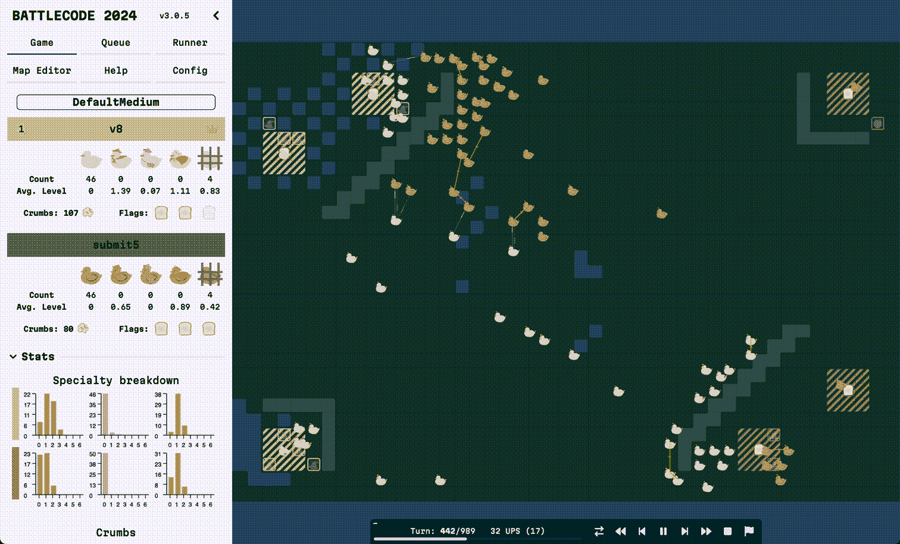
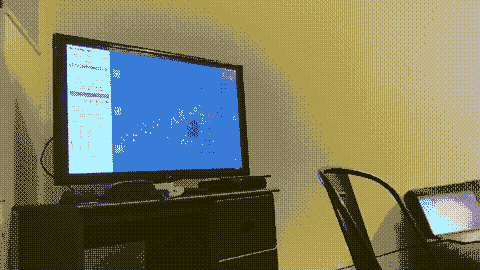
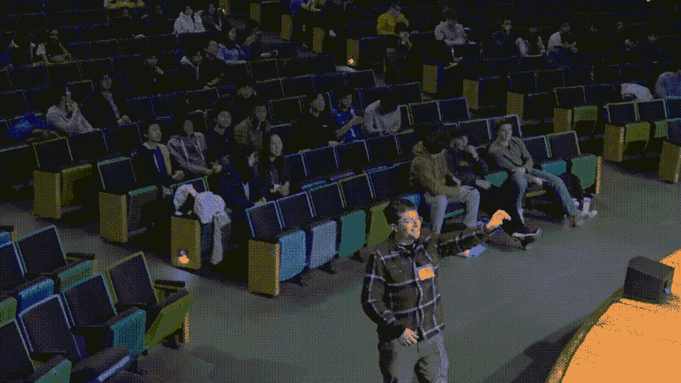

# MIT Battlecode 反思：一个首次进入决赛者的收获

> 原文：[`towardsdatascience.com/battlecode-2024-finalist-ad3166c1acd5?source=collection_archive---------11-----------------------#2024-11-07`](https://towardsdatascience.com/battlecode-2024-finalist-ad3166c1acd5?source=collection_archive---------11-----------------------#2024-11-07)

## 第一次参赛者的关键收获

 [David Teather](https://medium.com/@davidteather?source=post_page---byline--ad3166c1acd5--------------------------------)

·发表于[Towards Data Science](https://towardsdatascience.com/?source=post_page---byline--ad3166c1acd5--------------------------------) ·14 分钟阅读·2024 年 11 月 7 日

--

图片由作者制作，使用了[Battlecode 引擎](https://github.com/battlecode/battlecode24)

我是被我们的一位队友拉进了 Battlecode 2024 的。我之前从未听说过 Battlecode，但我很兴奋能尝试一下。我玩得很开心，也很高兴自己参与了，我们最终进入了决赛并获得了总排名第 13。所以我决定从第一次参赛者的角度写一篇博客，分享这次经历。

> 这篇文章也被发布在我的[博客](https://dteather.com/blogs/battlecode24/)上，如果你感兴趣，可以去那里查看更多内容。

# 什么是 Battlecode？

Battlecode 是一项比赛，你需要编写代码来控制一队机器人，完成某些任务。你可以在[这里](https://www.battlecode.org/)了解更多关于它的信息。

今年的游戏是一个以鸭子为基础的夺旗游戏，我们的目标是从对方那里夺取 3 面旗帜。游戏在一个网格上进行，每支队伍都有一个基地，在那里它们生成鸭子。鸭子可以在地图上移动、建造陷阱并攻击其他鸭子。游戏分为多个回合，每个回合鸭子都会获得一定量的字节码来执行它们的行动。

这是一个快速展示游戏样貌的片段

在[Battlecode 引擎](https://github.com/battlecode/battlecode24)中进行的示例比赛，由作者创建

那个动图里有很多内容，所以让我们稍微分析一下。

# 鸭子行动

每只鸭子有几个动作，可以帮助攻击或防守旗帜，这些动作每回合/回合内可以执行（如上面动图下方所示）。每个动作都有一个特定的冷却时间，所以你不能一遍又一遍地重复相同的动作。

+   移动到新方格

+   建设陷阱：水、炸弹、眩晕、挖水坑、填水坑

+   拿旗帜

+   攻击敌方小鸭子

+   治疗

+   复活

    - 当一只小鸭子死亡后，它将在大约 20 回合后从队伍的一个出生点复活

# 面包屑

还有一种叫做面包屑的货币，你可以通过两种方式获得：每回合在地图上会生成一些，你可以去捡，另外，你还可以通过在敌方领土上击杀敌鸭来获得。

建设陷阱的动作需要面包屑，这要求你在使用面包屑时必须有策略。

# 为什么这很困难

由于相同的代码会部署到所有小鸭子上，你必须编写能够应对各种不同情况的代码。也许你希望一些小鸭子专注于防守并围绕基地建造，可能你希望一些小鸭子被指定去捕旗，或者你希望一些小鸭子积极进攻敌方小鸭子。

一些让这项工作变得困难的因素：

+   每只小鸭子都有一个有限大小的共享数组，可以读取和写入

    - 这是你与队伍中的其他小鸭子之间沟通游戏状态的唯一方式

    - 这意味着你必须策略性地决定在数组中存储哪些信息以及如何使用这些信息，如果你让所有的小鸭子基于相同的信息执行相同的动作，你必须小心，因为否则它们会聚集在一起做相同的事，所以你需要小心如何分配任务

+   每只小鸭子每回合被分配 25K 字节码来执行

    - 这意味着每回合每只小鸭子可以执行一定数量的动作、计算以及内存读取和写入。

    - 如果你想要非常好的路径规划（而我们没有做到），你必须小心如何在这种密集的计算中使用字节码，否则你会用尽字节码，小鸭子就会停在那里什么都不做。

    - 幸运的是，我们不需要太担心这个问题，因为 25K 已经很大了，而且据说往年它要小得多。

我还觉得很难判断新的机器人是否比以前的版本更好，通常它在某些情况下更好，而在其他情况下则更差。与我通常从事的软件开发不同，我能很容易判断出你开发的东西是否比以前更好，因为如果你添加了新功能，它就比之前更好。

就此而言，我想说，我尝试开发的至少一半功能并没有很好地工作，最后我不得不放弃这些改动。有很多已经死掉的功能分支，根本没有成功。

# 比赛结构

好了，现在我们对游戏有了基本的了解，接下来我们来谈谈实际的比赛。

## 排行榜

排行榜是比赛中最重要的部分之一。它是一个半实时排行榜，显示了比赛中所有队伍的排名。每 4 小时，会有与排行榜上相邻队伍的比赛，如果获胜，你将获得更多的积分，失败则会失去积分。

此外，你可以手动排队与其他队伍进行排名比赛，只要他们允许。这一点很重要，因为你不能仅仅反复与同一个队伍排队比赛来刷分。

然而，你也可以排队进行与任何队伍的非排名游戏，这对测试你的机器人与其他队伍对抗的表现非常重要，这样你可以看到你所做的更改是否真的比之前更好，尤其是在与真实对手对战时。

## 冲刺赛

冲刺赛是比赛的一个独立部分，组织者会进行一系列的比赛并直播结果。冲刺赛是跨所有队伍进行的，不论它们是否在同一赛区。冲刺赛是一种有趣的方式，可以看到你的机器人与其他队伍的表现，同时也是观察其他队伍表现的好机会。

你在冲刺赛中的种子排名也是根据你在排行榜上的排名来确定的，因此如果你在排行榜上表现好，你在冲刺赛中的种子排名也会更高。

## 比赛

比赛也会进行直播，并在你所在赛区的队伍间进行，就像冲刺赛一样。你在比赛中的种子排名是根据你在排行榜上的排名来决定的，因此如果你在排行榜上表现良好，你在比赛中的种子排名也会更高。

在我们这一年中，排名前 12 的美国大学队伍和前 4 的国际队伍晋级到了决赛。此外，还有高中组和新加入的 Battlecode 队伍，它们有自己独立的比赛。

# 我们的机器人

好了，现在我们对 Battlecode 有了更多了解，也知道比赛的结构是怎样的，接下来我们来谈谈我们的机器人以及我们使用的一些策略。由于这是比赛结束大约两个月后写的，所以这一部分可能会有些模糊，我不记得我们做的所有事情。

## 我们的策略

在整个比赛过程中，我们尝试了几种不同的策略和机器人的变体，尤其是在游戏调整平衡和我们了解更多游戏细节后。

+   设置阶段

    - 在前 200 轮设置阶段中，我们让所有的鸭子随机移动，尽可能多地探索地图。

    - 在那之后，我们让我们的鸭子移动到地图的中心，并在分隔两侧地图的墙旁边建造陷阱。

+   基地防御

    - 我们指定了几只鸭子，始终驻守在保护我们的旗帜，并在我们的基地周围建造陷阱，尤其是在旗帜本身上，我们在旗帜上放置了炸弹和眩晕陷阱，这样如果敌人试图捡起旗帜，他们就会被眩晕，我们就可以攻击他们。

    - 我们还决定在我们的旗帜周围设置一个水池棋盘格图案，这样敌方的鸭子要么需要花费很多时间填充水池，要么只能通过对角线进攻，这确保了敌方的鸭子无法一次性完全包围我们的基地，并且让它们通过几个通道，这样我们的鸭子更容易进行防守。

    - 如果一只鸭子在守护旗帜时看到附近有敌方鸭子，它会在共享数组中设置一个全局变量，调用其他鸭子来协助防守旗帜。我们还确保当这些防守点被触发时，鸭子会优先在附近生成，以帮助防守旗帜。

    - 但我们必须小心这一点，因为如果我们调动太多鸭子来防守旗帜，就会没有足够的鸭子出去夺取敌方旗帜。

+   旗帜传递

    - 我们注意到我们的机器人经常会被困在围绕旗帜的鸭子周围，导致旗帜无法真正移动，因此我们实施了一种旗帜传递策略，旗帜会传递给另一只离目标位置更近的鸭子，以便旗帜能够被顺利捕获。

    - 我们在比赛后期才加入了这个策略，并且效果不错。

+   旗帜归还

    - 当鸭子返回旗帜时，我们有逻辑分配附近的鸭子来护送返回旗帜的鸭子，以确保它能安全返回基地。

    - 它也旨在返回到离旗帜携带者最近的基地

# 需要改进的地方

+   路径规划

    - 我们从前一年机器人的代码中借用了 BugNav 路径规划的代码，但由于当时字节码限制较小，所以我们有更多的字节码可以用于更智能的路径规划，但我们并没有进一步改进。

    - 我们的路径规划很糟糕，在冲刺过程中，我们经常因为无法顺利归还旗帜而卡住，常常因此输掉比赛，而解说员会取笑我们😭，但其实也挺好笑的，所以我不介意。

+   更好的专长分配

    - 有一件事我没提到的是，当鸭子做某个动作足够多次时，它会在这个动作上变得更高效并形成专长。这个专长也会限制它在其他动作上的最高效率，因此我们应该更加小心，因为在大部分比赛中，我们的大部分鸭子都专注于治疗，而我们其实并不需要那么多专注治疗的鸭子，因为这让我们在战斗中变得更弱。

    - 在最后，我确实稍微平衡了一下治疗者和战斗者之间的比例，但我认为我们应该以更有计划的方式来做这件事，以最大限度地发挥我们鸭子的优势。

+   被困的旗帜鸭子

    - 我们没有编写代码来处理鸭子捡起敌方旗帜后卡在某个地方，比如被水环绕的岛屿上，我们懒得修复这个问题，而且这种情况并不常发生，所以我们也没太在意。

+   鸭子对峙

    - 有时我们的鸭子会停在那里什么都不做，因为两组鸭子都计算出它们处于劣势，不应采取攻击性策略，这让人很烦恼，我们也没有一个好的方式来处理这种情况。

+   移动旗帜

    - 我们尝试在设置阶段移动地图上的旗帜，这样就可以更改旗帜的位置，但我们没有投入足够的时间，因此这个策略并未取得显著效果。

    其他队伍能够更有效地在地图上移动他们的旗帜，特别是当他们根据如旗帜周围的墙壁数量以及距离友方和敌方重生点的距离来评分地图的位置时。

    - 这绝对是我们应该花更多时间处理的一个功能，因为它对其他队伍来说非常有效。

你可以在[这里](https://github.com/shrimpkin/battlecode_24)找到我们的代码。

# 资格赛

我觉得这个视频很有趣，我们需要赢得这场比赛才能晋级决赛，当我们赢了时我们都非常兴奋。这是我们[赢得比赛](https://www.youtube.com/watch?v=-2-E2DP2t6A)的视频。

我们在直播中赢得资格赛的画面。视频由作者提供。

# 决赛

本部分主要讲述我们在波士顿参加决赛的经历，这段经历非常棒，不过如果你想跳过这一部分直接看下面的反思部分也完全没问题。

## 经历

决赛在波士顿的麻省理工学院举行，我们都飞到了那里参加这个活动，这是我记忆中第一次去波士顿，这座城市真的很漂亮。我们还住在了麻省理工学院的宿舍里，这很令人兴奋，因为我们在宿舍遇到了很多有趣的人。不过，如果让我再来一次，我可能会选择住酒店，因为宿舍毕竟是大学宿舍，环境没有那么干净，床也不够舒适。

我们还都受邀参加了决赛前的晚宴，在那里我们见到了其他队伍和组织者。很有趣的是，我们了解到大家来自哪里，此外，他们还为我们提供了非常好吃的晚餐。

## 结果

决赛在他们的礼堂举行，观看比赛真的很有趣，尽管我们以 0-2 的成绩结束了比赛，但我们最终排名第 13，这已经是一个巨大的成就，能走到这一步。

他们还举办了一个估算比赛，我们需要猜测某个问题的范围，我最终通过正确估计麻省理工学院宿舍居民的数量，赢得了一只鸭子作为奖励。这里有我抓鸭子的视频：

来自[Battlecode 决赛直播](https://www.youtube.com/watch?v=F0jzPA_6YB4)的视频

有个有趣的事实是，在我走到台上之前，我把一本笔记本放在了夹克下面，所以视频里看起来我走路的样子有点傻 😭

# 反思

我绝对不是 Battlecode 的专家，但我确实从这次经历中得到了一些关键的收获，如果我再做一次，有些地方我会做得更好。

**投入时间编写有条理且干净的代码**

尽管最初看起来这可能是一个相对简单的游戏，但即便在我们这一年比赛相对简单的情况下，与其他年份相比，投入大量时间编写有条理且干净的代码依然至关重要。

我们没有进行代码审查，也没有像应该的那样重构代码，结果在比赛的剩余阶段给我们带来了麻烦，因为我们不得不修复 bug，并试图理解我们的代码到底在做什么。这是我建议大家在开始阶段就花更多时间投入的部分，建立一个好的项目基础和结构，以便你能在此基础上进行扩展，并更轻松地进行修改。

我们没有这样做的部分原因是我们觉得必须赶在冲刺前推出功能，看看自己与其他队伍的对比表现，并且希望自己的比赛能出现在直播中。

**冲刺并非一切**

这引出了下一个要点，即冲刺并非一切，它们并不那么重要。你绝对应该专注于主要的比赛本身，而不是过于纠结于让你的机器人在冲刺中变得完美。

此外，如果你在冲刺中没有走得太远，也不意味着世界末日。我们从未让我们的比赛出现在冲刺直播中，也肯定没有赢得比赛。至少在我们那年，感觉我们所在的分组（美国大学组）相对较小，如果你没有在冲刺中走得很远，对你的队伍来说也不意味着一切结束，你依然可以晋级决赛。

**进行大量对抗赛**

正如我之前提到的，要判断你的新机器人是否比旧版本更好其实非常困难，因为你只能在本地与其他代码变体进行测试，在很多情况下，测试自己之前的机器人版本并不太有帮助，因为如果它们太相似，通常会经常平局，或者你会看到你所做的改动在某些情况下更好，而在另一些情况下则更差。

这也是为什么与其他队伍进行大量对抗性比赛非常重要，看看你的改动是否在实际对手面前比以前更好，尤其是这些对手是你在排名赛和锦标赛中可能会遇到的。

直到比赛结束时，另一支队伍分享了他们的做法，我才想到这个点。其实我认为这是一个非常好的主意，可以编写一个脚本，自动匹配其他队伍的比赛，并通过某种评估方式，看看你的改动是否真的比以前更好。一个脚本链接[在这里](https://github.com/chenyx512/battlecode24/blob/main/compare_bots.py)

即使你没有脚本来自动进行这些操作，手动匹配其他队伍的比赛仍然非常重要，这样你可以看到你的改动是否比以前更好。我们没有这样做，但我们仍然匹配了 818 场总计的非排名对抗赛，是所有队伍中第 8 多的。而总对抗赛数量为 1,294 场，是第 7 多的。

**观看你的比赛**

使用自动化脚本匹配比赛的一个缺点是，你可能不会那么频繁地观看自己的比赛。观看自己比赛的过程非常宝贵，因为你可以看到你的机器人在哪些情况表现得很好，哪些情况表现得很差。

这会给你很多关于如何改进你的机器人和策略的信息。

**观察其他队伍**

同样重要的是观看其他队伍的比赛（特别是如果他们关闭了自动训练的话），看看他们使用了哪些策略，他们的机器人表现如何。

如果你看到有队伍的表现比你强，或者看到他们使用了一些有趣的策略，不要害怕借鉴并增强他们的策略，使其更适合你的机器人，甚至可能比他们使用的方式更好。

**利用社区资源**

Battlecode 社区非常乐于助人，而且有很多资源可以帮助你入门并改善你的机器人。很多队伍分享了他们过去几年的代码和策略，这是一个很好的途径，可以帮助你了解其他队伍在做什么。

此外，过去几年的代码也有很多是每年都能使用的，这也是一个很好的起点，可以了解其他队伍在做什么。例如：共享数组通信、路径规划等。这些都是你可以在往年代码中找到并应用到自己机器人上的内容。

**给新手的建议**

开始接触 Battlecode 可能会让人感到不知所措，因为需要学习很多内容：游戏规范、比赛结构、策略、游戏中的限制、如何在你的机器人之间进行通信、如何本地运行比赛等等。

更不用说开始编写代码可能很困难，因为你必须熟悉现有的方法、可以执行的操作、能否访问某些信息以及如何与之交互，处理这些内容可能会让人感到有些棘手。我强烈建议你使用带有大量自动补全功能的集成开发环境（IDE），这样你可以预览所有可用的方法。它的感觉很像在使用像 Pandas 这样的库，有很多方法，你需要习惯它们的存在，感觉就像在使用一种全新的语言。

一开始这确实让我感到很沮丧，因为我只是想加入一些基本功能，但由于我们的项目组织不够完善，我对游戏不熟悉，也不知道如何为其编写代码，开始时确实有些烦人。但推自己一把，开始动手是值得的，因为它非常有趣，而且你会学到很多。
