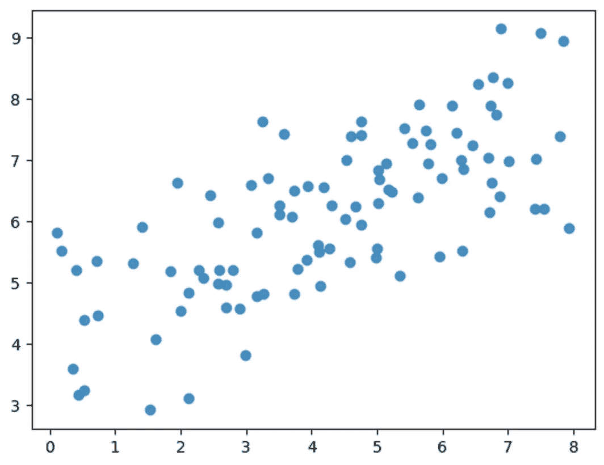
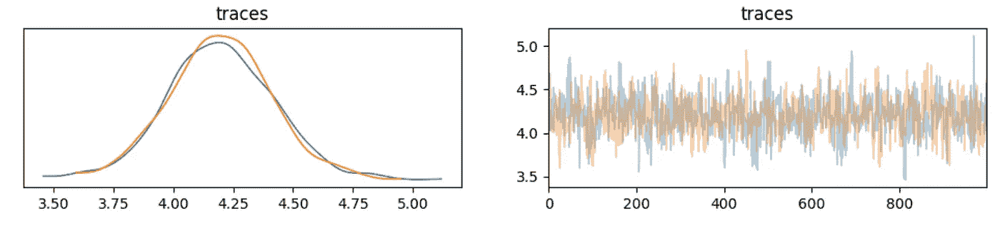
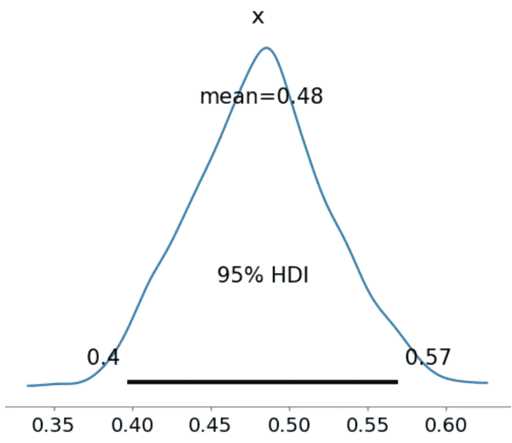
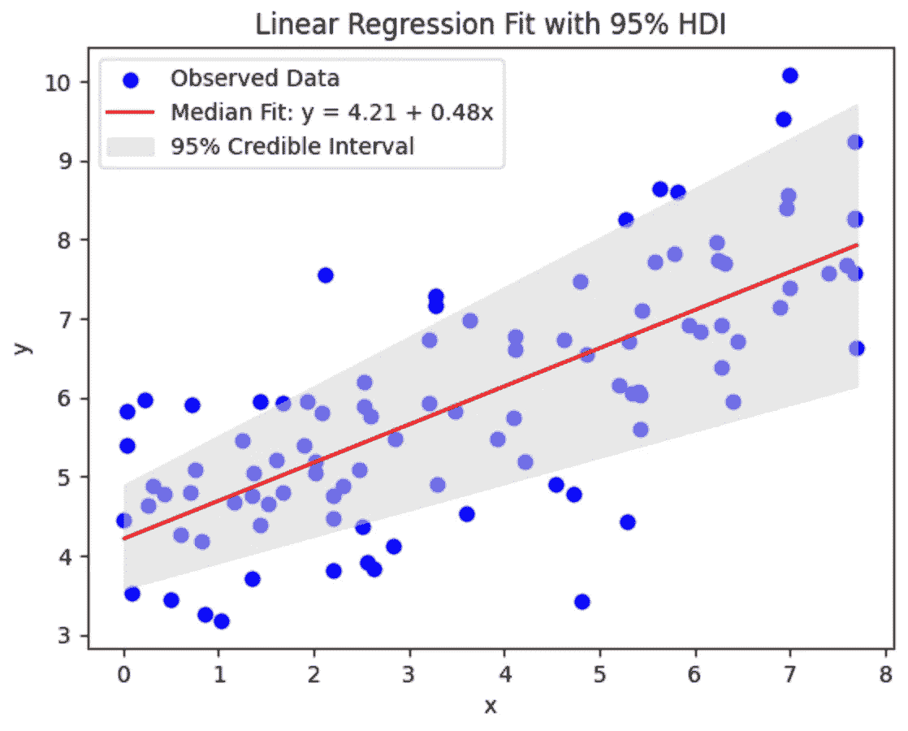

# 贝叶斯线性回归：完整的初学者指南

> 原文：[`towardsdatascience.com/bayesian-linear-regression-a-complete-beginners-guide-3a49bb252fdc?source=collection_archive---------1-----------------------#2024-09-14`](https://towardsdatascience.com/bayesian-linear-regression-a-complete-beginners-guide-3a49bb252fdc?source=collection_archive---------1-----------------------#2024-09-14)

## 使用**STAN**构建贝叶斯回归模型的工作流程和代码演示

[](https://medium.com/@samvardhanvishnoi2026?source=post_page---byline--3a49bb252fdc--------------------------------)[](https://towardsdatascience.com/?source=post_page---byline--3a49bb252fdc--------------------------------) [Samvardhan Vishnoi](https://medium.com/@samvardhanvishnoi2026?source=post_page---byline--3a49bb252fdc--------------------------------)

·发布于[Towards Data Science](https://towardsdatascience.com/?source=post_page---byline--3a49bb252fdc--------------------------------) ·阅读时间 9 分钟·2024 年 9 月 14 日

--

注意：查看我之前的[文章](https://medium.com/towards-data-science/a-practical-guide-to-becoming-a-bayesian-data-scientist-i-c4f7a1844825)，深入讨论为什么贝叶斯建模可能是你任务的正确选择。

本教程将重点讲解如何通过工作流程和代码演示，使用**STAN**这一概率编程语言构建贝叶斯回归模型。STAN 被广泛采用，并可以与你选择的编程语言（如 R、Python、shell、MATLAB、Julia、Stata 等）进行接口。请查看[安装指南](https://mc-stan.org/users/interfaces/)和[文档](https://mc-stan.org/users/documentation/)。

本教程将使用[Pystan](https://pystan.readthedocs.io/en/latest/)，因为我使用 Python 编程。即使你使用其他语言，我将讨论的贝叶斯实践和 STAN 语言语法也不会有太大差异。

对于更注重实践的读者，以下是本教程的[笔记本](https://github.com/samvardhan/stan_workshop/blob/main/stan_workshop.ipynb)链接，来自我在西北大学（2024 年 4 月）举办的贝叶斯建模工作坊的一部分。

让我们开始吧！

# 贝叶斯线性回归

让我们学习如何用贝叶斯方法构建一个简单的线性回归模型，这是任何统计学家日常使用的基础模型。假设有一个因变量**Y**和协变量**X**，我提出以下简单的模型：

**Y** = α + β * **X** + ϵ

其中⍺是截距，β是斜率，ϵ是一些随机误差。假设：

ϵ ~ 正态分布(0, σ)

我们可以证明

**Y** ~ 正态分布(α + β * **X**, σ)

我们将学习如何在 STAN 中编写这个模型形式的代码。

## **生成数据**

首先，让我们生成一些虚拟数据。

```py
#Model Parameters
alpha = 4.0  #intercept
beta = 0.5 #slope
sigma = 1.0 #error-scale
```

```py
#Generate fake data
x =  8 * np.random.rand(100)
y = alpha + beta * x
y = np.random.normal(y, scale=sigma) #noise
#visualize generated data
plt.scatter(x, y, alpha = 0.8)
```



线性回归生成的数据（图片来自作者代码）

# 模型字符串

现在我们有了一些数据来建模，让我们深入了解如何构建数据并将其与建模指令一起传递给 STAN。这是通过*model*字符串完成的，它通常包含 4 个（偶尔更多）块——*data*、*parameters*、*model*和*generated* *quantities*。让我们详细讨论这些块的每一个。

## **DATA 块**

```py
data {                    //input the data to STAN
    int<lower=0> N;
    vector[N] x;
    vector[N] y;
}
```

*data*块可能是最简单的，它告诉 STAN 应该预期什么数据，以及以什么格式。例如，这里我们传递-

**N**：我们的数据集大小，类型为*int*。*<lower=0>*部分声明 N≥0。（尽管在这里数据长度不可能为负是显而易见的，但声明这些边界是良好的标准做法，可以使 STAN 的工作更轻松。）

**x**：作为长度为 N 的向量的协变量。

**y**：作为长度为 N 的向量的因变量。

请参阅[文档](https://mc-stan.org/docs/reference-manual/types.html#:~:text=Stan%20provides%20three%20real%2Dvalued,vectors%2C%20and%20matrix%20for%20matrices.)以获取完整的支持数据类型范围。STAN 支持多种类型，如数组、向量、矩阵等。正如我们上面所看到的，STAN 还支持对变量进行**限制**编码。编码限制是推荐的做法！它有助于更好地指定模型，并简化底层的概率采样过程。

## 模型块

接下来是*model*块，我们在其中告诉 STAN 模型的结构。

```py
//simple model block 
model {                   
    //priors
    alpha ~ normal(0,10);
    beta ~ normal(0,1); 

    //model
    y ~ normal(alpha + beta * x, sigma);
}
```

模型块还包含一个重要且常常令人困惑的元素：*先验*指定。先验是贝叶斯建模的**核心**部分，必须根据采样任务适当指定。

请参阅我之前的[文章](https://medium.com/towards-data-science/a-practical-guide-to-becoming-a-bayesian-data-scientist-i-c4f7a1844825)，了解关于先验的角色和直觉。简而言之，*先验*是对参数值分布的假定功能形式——通常简称为*先验信念*。尽管先验**不需要**与最终解完全**匹配**，但它们必须允许我们从中**采样**。

在我们的示例中，我们使用均值为 0、方差不同的正态先验，这取决于我们对提供的均值的确信度：α的方差为 10（非常不确定），β的方差为 1（有点确定）。在这里，我提供了普遍的*信念*，即虽然α可以取一个广泛的范围的不同值，但斜率通常会更受限制，并且不会有很大的幅度。

> 因此，在上面的示例中，α的先验比β的“弱”。

随着模型变得更加复杂，采样解决方案空间扩展，提供信念变得更加重要。否则，如果没有强烈的直觉，好的做法是向模型中提供较少的信念，即使用**弱信息性**先验，并保持对数据的灵活性。

y 的形式，你可能已经认出来了，是标准的线性回归方程。

## 生成的量

最后，我们有了*生成的量*的代码块。在这里，我们告诉 STAN 我们想要计算并作为输出接收哪些量。

```py
generated quantities {    //get quantities of interest from fitted model
    vector[N] yhat;
    vector[N] log_lik;
    for (n in 1:N){
        yhat[n] = normal_rng(alpha + x[n] * beta, sigma);             
        //generate samples from model
        log_lik[n] = normal_lpdf( y[n] | alpha + x[n] * beta, sigma); 
        //probability of data given the model and parameters
        }
}
```

注意：STAN 支持将向量直接传入方程中，或者作为每个元素 n 的迭代 1:N。在实践中，我发现这种支持会随着 STAN 的不同版本而变化，因此，如果向量化版本无法编译，最好尝试使用迭代声明。

在上面的例子中——

**yhat:** 根据拟合的参数值生成 y 的样本。

**log_lik:** 生成在给定模型和拟合参数值的情况下数据的概率。

这些值的用途将在我们讨论模型评估时更加明确。

# 将所有内容整合在一起

总的来说，我们现在已经完全指定了我们的第一个简单贝叶斯回归模型：

```py
model = """
data {                    //input the data to STAN
    int<lower=0> N;
    vector[N] x;
    vector[N] y;
}
```

```py
parameters {              
    real alpha;
    real beta;
    real<lower=0> sigma;
}model {                   
    alpha ~ normal(0,10);
    beta ~ normal(0,1);   
    y ~ normal(alpha + beta * x, sigma);
}generated quantities {    
    vector[N] yhat;
    vector[N] log_lik;

    for (n in 1:N){ yhat[n] = normal_rng(alpha + x[n] * beta, sigma);             
        log_lik[n] = normal_lpdf(y[n] | alpha + x[n] * beta, sigma); }
}
"""
```

剩下的工作就是编译模型并运行采样。

```py
#STAN takes data as a dict
data = {'N': len(x), 'x': x, 'y': y}
```

STAN 以字典的形式接收输入数据。重要的是，这个字典必须包含我们在模型数据块中告诉 STAN 预期的所有变量，否则模型将无法编译。

```py
#parameters for STAN fitting
chains = 2
samples = 1000
warmup = 10
# set seed
```

```py
# Compile the model
posterior = stan.build(model, data=data, random_seed = 42)
# Train the model and generate samples
fit = posterior.sample(num_chains=chains, num_samples=samples)The .sample() method parameters control the Hamiltonian Monte Carlo (HMC) sampling process, where —
```

+   **num_chains:** 是我们重复采样过程的次数。

+   **num_samples:** 是每条链中要抽取的样本数。

+   **warmup:** 是我们丢弃的初始样本数（因为在达到解空间的一般范围之前需要一些时间）。

> 知道这些参数的正确值依赖于我们模型的复杂性以及可用资源。

更大的采样规模当然是理想的，但对于一个不适定的模型，它们只是浪费时间和计算资源。从经验来看，我曾经有过需要等待一周才能完成的大型数据模型，结果发现模型并没有收敛。重要的是在运行完整的采样之前，先慢慢开始并对模型进行合理性检查。

## 模型评估

生成的量用于

+   评估拟合的优度，即收敛性，

+   预测

+   模型比较

**收敛性**

评估模型的第一步，在贝叶斯框架下，是可视化的。我们观察[哈密顿蒙特卡洛](https://en.wikipedia.org/wiki/Hamiltonian_Monte_Carlo)（HMC）采样过程的采样结果。



模型收敛：通过独立采样链的重叠情况进行可视化评估（图片来自作者代码）

简单来说，STAN 会迭代地抽取参数值的样本并对其进行评估（HMC 做的工作要复杂得多，但那超出了我们当前的范围）。对于一个良好的拟合，样本抽取必须**收敛**到某个共同的区域，这个区域理想情况下应该是全局**最优解**。

上图展示了我们模型在两个独立链（红色和蓝色）上的采样结果。

+   在左侧，我们绘制了拟合的参数值的整体分布，即**后验分布**。如果模型及其参数**指定得当**，我们期望看到一个**正态**分布。(*为什么*会这样？好吧，正态分布意味着对于参数存在一个最佳拟合值的特定范围，这支持了我们选择的模型形式)。此外，如果模型收敛到最优解，我们还应当期望不同链之间有相当大的**重叠**。

+   在右侧，我们绘制了每次迭代中实际绘制的样本（仅仅是为了*额外*确认）。在这里，我们希望看到的不仅仅是一个**狭窄**的范围，同时也希望看到绘制样本之间有很大的**重叠**。

并非所有评估指标都是可视化的。Gelman 等人[1]还提出了**Rhat**诊断，它本质上是一个数学度量，用于评估不同链之间样本的相似性。通过 Rhat，可以定义一个临界值，超过该值时，两个链被认为过于不同，无法收敛。然而，由于过程的迭代性质和变化的预热期，临界值很难定义。

> 因此，视觉比较是一个至关重要的组成部分，无论是诊断测试与否。

你可能会有一个频率主义的想法：“那么，如果我们只有链和分布，实际的参数值是什么呢？”这正是关键所在。贝叶斯的公式只处理**分布**，而非带有难以解释的测试统计量的**点**估计。

话虽如此，后验分布仍然可以通过**可信**区间来总结，比如**高密度区间（HDI）**，它包括所有 x%的最高概率密度点。



95% HDI 对β的估计（图片来源：作者代码）

对比贝叶斯**可信**区间和频率主义**置信**区间是很重要的。

+   可信区间为**参数**的**可能值**提供了一个**概率**分布，即给定数据时，参数在某个区间内取每个值的概率。

+   置信区间将**参数**值视为**固定的**，而是估计**反复**随机**抽样**数据时，结果会有多大可能**匹配**。

因此，

> 贝叶斯方法允许参数值是流动的，并且直接根据数据的表面意义来进行推断，而频率主义方法则要求存在唯一的真实参数值……如果我们能接触到所有历史数据的话。

呼，稍微消化一下，再读一遍，直到完全理解。

使用可信区间的另一个重要含义，换句话说，允许参数是**可变的**，就是我们所做的预测能够捕捉到这种**不确定性**，并且具有**透明性**，有一定的 HDI 百分比指示最佳拟合线。



95% HDI 最佳拟合线（图片来源：作者代码）

**模型比较**

在贝叶斯框架中，渡边-赤池信息量度（**WAIC**）得分是进行模型比较的广泛接受的选择。WAIC 得分的简单解释是，它估计模型的**似然**，同时对模型参数的数量进行**正则化**。简单来说，它可以帮助解决过拟合问题。这也是贝叶斯框架的一个主要优势——并不一定**需要**持有一个模型**验证**数据集。因此，

> 当数据稀缺时，贝叶斯建模提供了一个重要的优势。

WAIC 得分是一个**比较**性指标，即只有在跨不同模型进行比较时，它才具有意义，这些模型试图解释相同的基础数据。因此，在实践中，只要 WAIC 增加，就可以继续增加模型的复杂性。如果在这个增加复杂性的过程中，WAIC 开始下降，那么可以停止——任何更多的复杂性在描述基础数据分布时将不会提供信息上的优势。

## **结论**

总结来说，STAN 模型块只是一个字符串。它向 STAN 解释你将提供给它什么（模型）、需要找出什么（参数）、你认为发生了什么（模型），以及它应该返回什么（生成的量）。

当开启时，STAN 简单地转动机器并给出其输出。

> 真实的挑战在于定义一个合适的模型（参考先验分布），合理构建数据，准确地向 STAN 提出需求，并评估其输出的合理性。

一旦我们掌握了这一部分，我们就可以深入探讨 STAN 的真正力量，在这里，指定越来越复杂的模型变成了一个简单的语法任务。事实上，在我们的下一篇教程中，我们将正是这样做。我们将在这个简单的回归示例基础上，探索贝叶斯**层次**模型：行业标准，最先进的技术，事实上的标准…你可以自己定义。我们将看到如何将组级的随机效应或固定效应加入到模型中，并惊叹于在贝叶斯框架中增加复杂性同时保持可比性的容易程度。

如果这篇文章对你有帮助，请订阅，并继续关注更多内容！

## 参考文献

[1] Andrew Gelman, John B. Carlin, Hal S. Stern, David B. Dunson, Aki Vehtari 和 Donald B. Rubin (2013). *贝叶斯数据分析，第三版*。Chapman and Hall/CRC。
