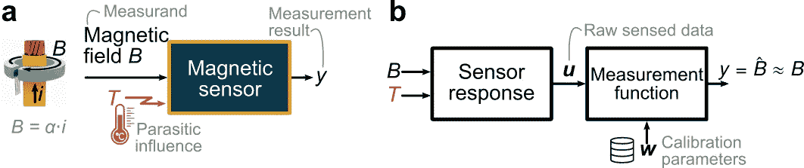
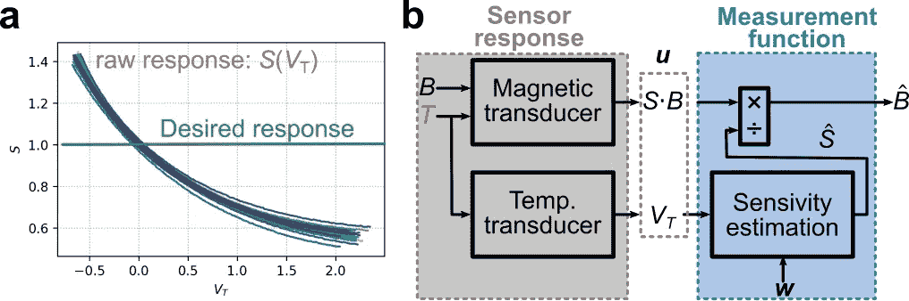
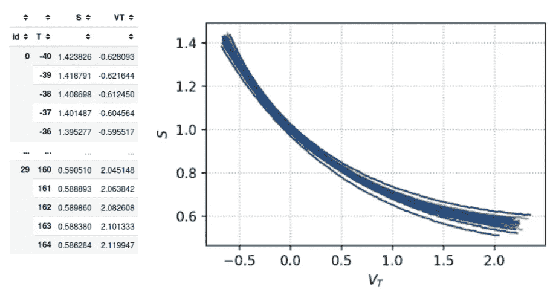
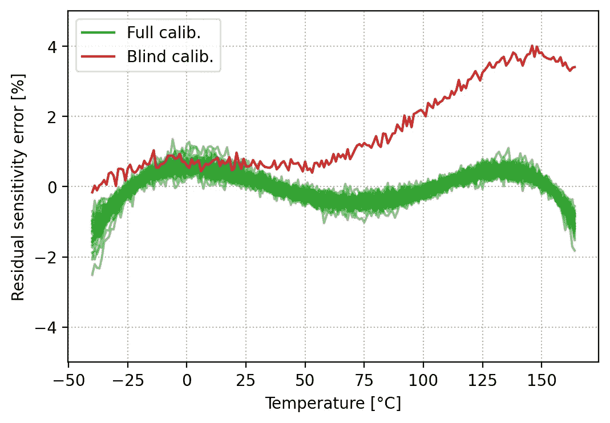
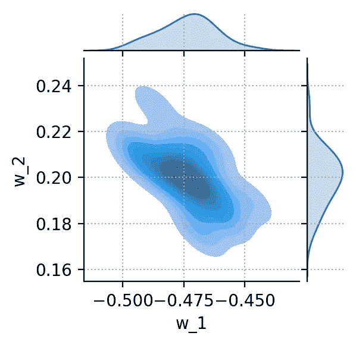
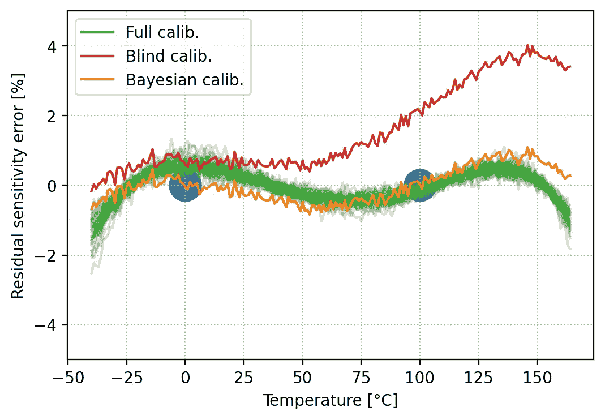
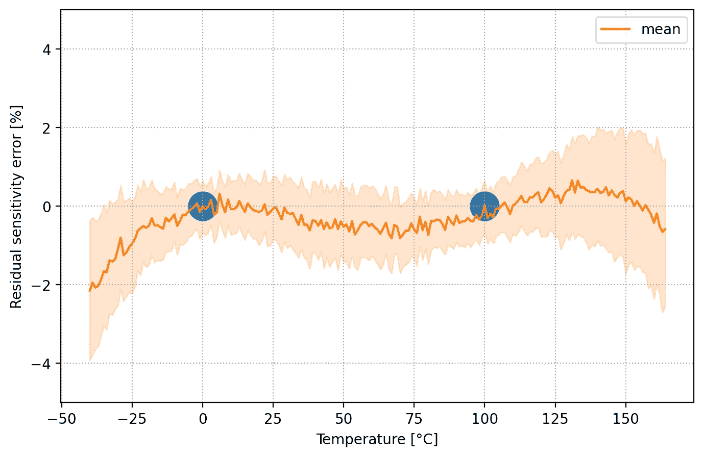

# 贝叶斯传感器校准

> 原文：[`towardsdatascience.com/bayesian-sensor-calibration-9ef53e6c6271?source=collection_archive---------5-----------------------#2024-05-01`](https://towardsdatascience.com/bayesian-sensor-calibration-9ef53e6c6271?source=collection_archive---------5-----------------------#2024-05-01)

## 面向传感器工程师的 Python 实践教程

[](https://gcl-75380.medium.com/?source=post_page---byline--9ef53e6c6271--------------------------------)[](https://towardsdatascience.com/?source=post_page---byline--9ef53e6c6271--------------------------------) [Gael Close](https://gcl-75380.medium.com/?source=post_page---byline--9ef53e6c6271--------------------------------)

·发表于[Towards Data Science](https://towardsdatascience.com/?source=post_page---byline--9ef53e6c6271--------------------------------) ·阅读时长 9 分钟·2024 年 5 月 1 日

--

作者：[Moritz Berger](https://orcid.org/0000-0003-3282-9609)的贡献。

> 贝叶斯传感器校准是一项新兴技术，结合了统计模型和数据，以最优方式校准传感器——这是一个至关重要的工程程序。本教程提供了使用现有库并要求最低数学背景的 Python 代码，来数值地执行这种校准。作为案例研究的示例，我们考虑一个受温度影响的磁场传感器，其灵敏度会发生漂移。

**术语表。** 粗体词汇在《国际计量学词汇》（即“[VIM 定义](https://jcgm.bipm.org/vim/en/)”）中有定义。仅首次出现的术语使用粗体。

**代码可用性。** 本教程的可执行 Jupyter 笔记本可在 Github 上获取。可以通过[nbviewer](https://nbviewer.org/gist/gael-close/fc2a30b37bacc82a9713f69da1f81bf7/2307-sensor-calib.ipynb#)访问。

# 介绍

**背景。** 物理传感器提供了使系统能够理解其环境的主要输入。它们测量物理量，如温度、电流、功率、速度或光强度。**测量结果**是对被测量值（即所谓的**测量对象**）的真实值的估计。传感器从来不是完美的。非理想因素、零件间的差异和随机噪声都可能导致传感器误差。传感器**校准**及其后续的**调整**是减少传感器**测量不确定性**的关键步骤。贝叶斯方法提供了一个数学框架来表示不确定性。特别地，如何通过“智能”校准结合关于过去样本的先验知识和校准所提供的新证据来减少不确定性。即使在简单的情况下，其中传感器响应被建模为带噪声的多项式传递函数，精确的解析解的数学推导也可能让人畏惧（Berger 2022）。幸运的是，Python 库的开发便于贝叶斯统计建模。因此，贝叶斯模型对于工程师而言变得越来越可接近。尽管已有实践教程（Copley 2023; Watts 2020）甚至教科书（Davidson-Pilon 2015; Martin 2021），但它们缺少传感器校准的示例。

**目标。** 本文旨在重现一个简化的案例，灵感来源于（Berger 2002）并在下图中进行了说明。传感器用于通过测量与电流直接成正比的磁场*B*来测量通过电线的电流*i*。我们专注于磁传感器，并考虑以下几种非理想因素。（1）温度*B*是一个寄生的**影响量**，会干扰测量。（2）传感器响应因零件之间的制造差异而有所不同。（3）传感器数据受到**随机误差**的污染。通过贝叶斯方法和高层次的[PyMC](https://www.pymc.io/welcome.html) Python 库，我们旨在计算给定校准数据集的最佳校准参数集。



(a) 电流传感器应用。(b) 功能视图（图片来自作者）。

# 数学公式

我们假设磁性传感器由一个磁性和温度传感器组成，可以将其建模为具有系数的多项式传递函数，这些系数根据正常的概率分布在不同传感器之间变化。原始感测数据（在 VIM 中称为“**指示值**”），由向量***u***表示，包含线性感测的磁场*S(T)*⋅*B*和一个无量纲的感测量*V_T*，指示温度。我们使用特定形式*S(T)*⋅*B*来突出显示灵敏度*S*受温度的影响。温度的寄生影响在下面的图（a）中有所说明。理想情况下，灵敏度应当与温度和*V_T*无关。然而，存在一个多项式依赖关系。这个案例灵感来源于实际的磁性霍尔传感器，在温度范围[−40°C, +165°C]内，灵敏度可以在室温值的基础上变化±40%。此外，由于部件间的差异，存在一组*S*与*V_T*的曲线，而不仅仅是一条曲线。从数学上讲，我们希望识别出一个测量函数，该函数能够准确地估计磁场的真实值——如图（b）所示。从概念上讲，这相当于反转传感器响应模型。这归结为估算温度依赖性灵敏度，并使用此估算值*Ŝ*通过除法从感测场中恢复磁场。



(a) N=30 个传感器的原始响应。(b) 阻抗图（图像来自作者）。

对于我们的简化案例，我们假设*S(T)*和*VT(T)*是二次多项式。假设多项式系数围绕其标称值变化，符合正态分布。另一个随机噪声项被添加到两个感测信号中。从物理上讲，*S*是相对于室温值的灵敏度，而*VT*是来自温度传感器的归一化电压。这代表了一类大型传感器，其中主传感器是线性的，但依赖于温度，而补充的温度传感器用于修正这种寄生依赖关系。同时，两个传感器都有噪声。我们假设在*VT*中的三次多项式是适合用来估计灵敏度*Ŝ*的候选函数：

*Ŝ = w_0 + w_1*⋅Δ*T + w_2*⋅Δ*T*² *+ w_3*⋅Δ*T*³，其中Δ*T* = *T*−25°C。

权重向量***w***聚合了多项式的 4 个系数。这些是需要根据标定结果调整的标定参数。

# Python 公式

我们使用（Close, 2021）中介绍的代码约定。我们定义一个数据字典`dd`来存储参数的标称值。此外，我们定义概率密度函数来捕获参数的变异性。传感器响应被建模为传递函数，就像（Close 2021）中介绍的约定一样。

```py
# Data dictionary: nominal parameters of the sensor response model
def load_dd():
  return Box({
    'S'  : {
      'TC'   :   [1, -5.26e-3, 15.34e-6],
      'noise':   0.12/100,  },
    'VT': {
      'TC':      [0, 1.16e-3, 2.78e-6],
      'noise':   0.1/100,}  
  })

# Probability density functions for the parameter variations
pdfs = {
    'S.TC': (norm(0,1.132e-2), norm(0,1.23e-4), norm(0,5.40e-7)),
    'VT.TC'   : (norm(0,7.66e-6), norm(0,4.38e-7))
}

# Sensor response model
def sensor_response_model(T, sensor_id=0, dd={}, delta={}):
    S=np.poly1d(np.flip((dd.S.TC+delta.loc[sensor_id]['S.TC'])))(T-25)
    S+=np.random.normal(0, dd.S.noise, size=len(T))

    VT = 10*np.poly1d(np.flip(dd.VT.TC+np.r_[0,delta.loc[sensor_id]['VT.TC'].values]))(T-25)
    VT+= np.random.normal(0, dd.VT.noise, size=len(T))

    return {'S': S, 'VT': VT} 
```

然后，我们可以通过从指定的概率分布中抽样，模拟一组*N*=30 个传感器，并生成合成数据`df1`，以通过构建函数`build_sensors(ids=[..])`测试不同的标定方法。

```py
df1,_=build_sensors_(ids=np.arange(30))
```



由概率传感器响应模型生成的合成数据（图片来自作者）。

# **经典方法**

我们首先考虑两种不依赖贝叶斯框架的经典标定方法。

## 完全回归

第一个标定方法是一种暴力方法。为每个传感器收集全面的数据集，校准点数多于未知数。每个传感器的标定参数***w***（4 个未知数）通过回归拟合来确定。当然，这种方法在残差误差方面提供了最佳的结果。然而，实际上这种方法非常昂贵，因为它需要对每个单独的传感器进行全面表征。以下函数执行完全标定，并将权重作为列表存储在数据框中以方便使用。

```py
def full_calibration(df):
    W = df.groupby("id").apply(
        lambda g: ols("S ~ 1 + VT + I(VT**2)+ I(VT**3)", data=g).fit().params
    )
    W.columns = [f"w_{k}" for k, col in enumerate(W.columns)]
    df["w"] = df.apply(lambda X: W.loc[X.name[0]].values, axis=1)

df1, W=full_calibration(df1)
```

## 盲标定

盲标定代表了另一个极端。在这种方法中，首先对一组参考传感器进行完全标定，如上所述。接下来的传感器不单独标定。相反，直接“盲目”地使用参考组的平均标定参数***w0***。

```py
w0 = W.mean().values

df2,_=build_sensors_(ids=[0])
def blind_calibration(df):
    return df.assign(w=[w0]*len(df))
df2 = blind_calibration(df2)
```

以下图表展示了两种方法的残差灵敏度误差 *Ŝ*−*S*。回想一下，标定前的误差高达 40%。绿色曲线表示参考组中*N*=30 个传感器的灵敏度误差。除了残余的四阶误差（由于灵敏度估计器阶数有限，这是不可避免的），拟合效果令人满意（<2%）。红色曲线表示盲标定传感器的残差灵敏度误差。由于部件间差异，平均标定参数只能提供近似的拟合，残差误差不令人满意。



N=30 个完全标定和 N=1 个盲标定传感器的残差灵敏度误差（图片来自作者）。

# 贝叶斯标定

贝叶斯标定是一种有趣的折衷方法，介于之前的两种极端方法之间。一组参考传感器像上面一样被完全标定。这组参考传感器的标定参数构成了一些先验知识。参考组的平均值***w0***和协方差矩阵***Σ***编码了传感器响应的相关知识。权重不是独立的，一些组合比其他组合更有可能。这样的知识应该在智能标定中加以利用。可以使用 Pandas 和 Seaborn 库计算并绘制覆盖矩阵（仅针对两个权重）。

```py
Cov0 = W.cov(ddof=len(W) - len(w0))
sns.jointplot(data=W.apply(pd.Series),x='w_1', y='w_2', kind='kde', fill=True, height=4)
```



两个权重 w_1 和 *w_2* 的双变量图（图片来自作者）。

贝叶斯框架使我们能够捕捉这种先验知识，并在后续样本的校准中加以利用。我们从之前同样被盲目校准的样本开始。我们模拟了一个情况，即每个新传感器仅收集两个校准数据点，分别是 0°C 和 100°C，从而通过新证据丰富我们的知识。在硬件校准成本昂贵的实际工业场景中，这种校准方法非常具成本效益。参考集在初次收集时已充分表征，以便获得先验知识。随后样本，可能是该批次的大部分生产样本，仅在几个点上进行表征。在贝叶斯术语中，这被称为“推断”，而 PyMC 库提供了[高级函数](https://www.pymc.io/projects/examples/en/latest/variational_inference/variational_api_quickstart.html)来执行推断。这是一个计算密集型的过程，因为后验分布是通过应用贝叶斯定理，将先验知识和新证据结合起来获得的，只能通过采样获得。对于获得的概率密度函数没有解析近似。

下文对比了校准结果，蓝点表示贝叶斯方法使用的两个校准点。通过仅添加两个额外的点，并利用参考集中的先验知识，贝叶斯校准传感器的误差几乎没有退化，相较于昂贵的暴力方法，表现得更为优越。



三种校准方法的对比。

**可信区间**

在贝叶斯方法中，所有变量都被不确定性所表征。传感器模型的参数、校准参数，以及[后验预测](https://www.pymc.io/projects/docs/en/stable/learn/core_notebooks/posterior_predictive.html#prediction)。然后我们可以构建一个±1σ的可信区间，覆盖由模型生成的 68%合成观测数据，针对估算的灵敏度*Ŝ*。此图捕捉了校准和调整的本质：在*T*=0°C 和*T*=100°C 两个校准点周围的不确定性已被减少。剩余的不确定性源于测量噪声。



可信区间（图源：作者）。

# 结论

本文展示了一个用于模拟贝叶斯传感器校准的 Python 工作流程，并将其与广为人知的经典方法进行了对比。该数学和 Python 公式适用于广泛类别的传感器，能够帮助传感器设计探索各种方法。该工作流程可以总结如下：

1.  **传感器响应建模**通过传递函数及其参数（标称值和统计变动）进行建模。为一批传感器生成相应的合成原始传感数据。

1.  **定义测量函数的形式**，从原始传感器变量开始。通常，这是一个多项式，校准应为每个传感器确定该多项式的最佳系数***w***。

1.  **获取一些先验知识**，通过对一个具有代表性的传感器子集进行全面表征。以平均校准参数和协方差矩阵的形式编码这些知识。

1.  **获取有限的新证据**，以每个传感器特定的一小部分校准点的形式进行。

1.  **执行贝叶斯推断**，将这些新的稀疏证据与先验知识合并，使用 PyMC 数值计算找到此新传感器最可能的校准参数。

在传感器校准对生产成本有显著影响的频繁情况下，贝叶斯校准展现出巨大的商业优势。考虑一批 1'000 个传感器。可以通过对例如仅 30 个传感器进行完整表征，获得代表性的先验知识。然后对于其他 970 个传感器，只需使用少量的校准点。在经典方法中，这些额外的校准点会导致一个不确定的方程组。在贝叶斯框架下，先验知识填补了这一空白。

# 参考文献

(Berger 2022) M. Berger, C. Schott, 和 O. Paul, “贝叶斯传感器校准，”*IEEE Sens. J.*, 2022 年。[`doi.org/10.1109/JSEN.2022.3199485.`](https://doi.org/10.1109/JSEN.2022.3199485.)

(Close, 2021): G. Close, “Python 中的信号链分析：硬件工程师的案例研究，”*Towards Data Science*, 2021 年 2 月 22 日。可用：`towardsdatascience.com/signal-chain-analysis-in-python-84513fcf7db2.`

(Copley 2023) C. Copley, “使用 PyMC 进行贝叶斯分析导航，”*Towards Data Science*, 2023 年 6 月。[`charlescopley.medium.com/navigating-bayesian-analysis-with-pymc-87683c91f3e4`](https://charlescopley.medium.com/navigating-bayesian-analysis-with-pymc-87683c91f3e4)

(Davidson-Pilon 2015) C. Davidson-Pilon, “黑客的贝叶斯方法：概率编程和贝叶斯推断，”*Addison-Wesley Professional*, 2015 年。[`www.amazon.com/Bayesian-Methods-Hackers-Probabilistic-Addison-Wesley/dp/0133902838`](https://www.amazon.com/Bayesian-Methods-Hackers-Probabilistic-Addison-Wesley/dp/0133902838)

(Martin 2021) O. A. Martin, R. Kumar, 和 J. Lao, “Python 中的贝叶斯建模与计算，”Chapman and Hall/CRC, 2021 年。[`www.amazon.com/Bayesian-Modeling-Computation-Chapman-Statistical/dp/036789436X`](https://www.amazon.com/Bayesian-Modeling-Computation-Chapman-Statistical/dp/036789436X)

(Watts 2020) A. Watts, “PyMC3 和贝叶斯推断在参数不确定性量化中的应用：非线性模型的探索：第二部分，”*Towards Data Science*，2022 年 6 月。`towardsdatascience.com/pymc3-and-bayesian-inference-for-parameter-uncertainty-quantification-towards-non-linear-models-a03c3303e6fa`
