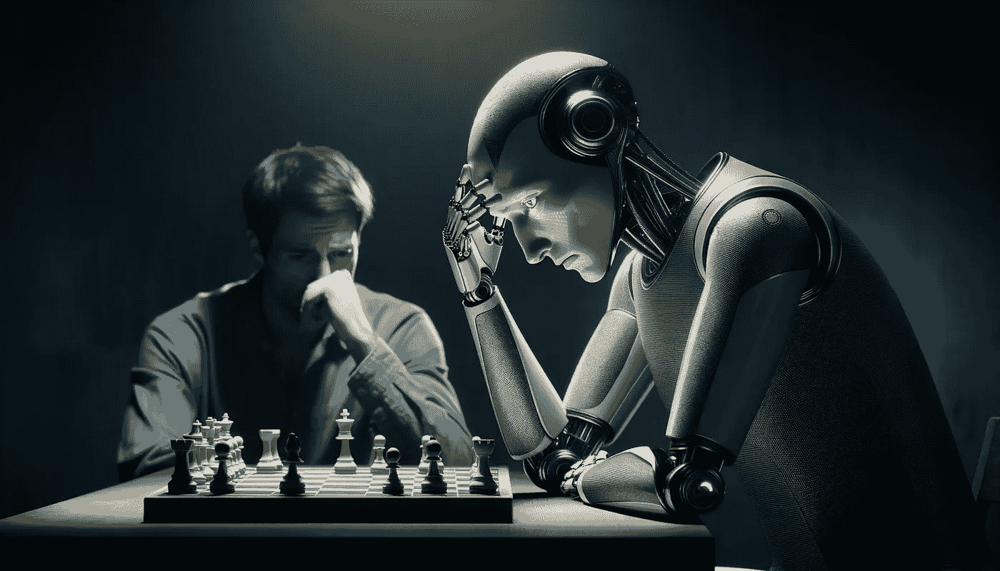

# 使用混合 AI 模型击败 ChatGPT 4 下棋

> 原文：[`towardsdatascience.com/beating-chatgpt-4-in-chess-with-a-hybrid-ai-model-ffb91bd4db50?source=collection_archive---------10-----------------------#2024-01-22`](https://towardsdatascience.com/beating-chatgpt-4-in-chess-with-a-hybrid-ai-model-ffb91bd4db50?source=collection_archive---------10-----------------------#2024-01-22)

## LLM 能多好地解决复杂问题

 [Octavio Santiago](https://octaviobomfim.medium.com/?source=post_page---byline--ffb91bd4db50--------------------------------)

·发表于 [Towards Data Science](https://towardsdatascience.com/?source=post_page---byline--ffb91bd4db50--------------------------------) ·阅读时长 7 分钟·2024 年 1 月 22 日

--

图片由作者提供：使用 DALLE-3 生成的机器人下棋场景

ChatGPT 真的能下棋吗？这是激励我让 ChatGPT 和我的混合 AI 模型——一个国际象棋专家机器人——进行对弈的原因。第一局比赛是与 GPT 3.5 对弈，在这场比赛中，我发现了 OpenAI LLM 模型的几个局限性——由于 ChatGPT 对国际象棋规则的理解不足，很多非法走法和错误分析，使得整场比赛非常难以进行下去，直到比赛结束。

这个分析对于理解大型语言模型（LLMs）的局限性、它们的长期推理能力和分析能力非常重要。通过深入了解模型的行为，我们可以找到解决其缺陷并增强其优势的方法。作为 AI 工程师，我们必须始终设置不同的实验来分析模型的真实行为，并计划在我们的项目中进行适应和改进。大型语言模型技术仍然非常新，必须不断探索和研究，以确保其最佳使用和理解。

在这篇文章中，您可以找到关于第一次比赛的更多细节：
