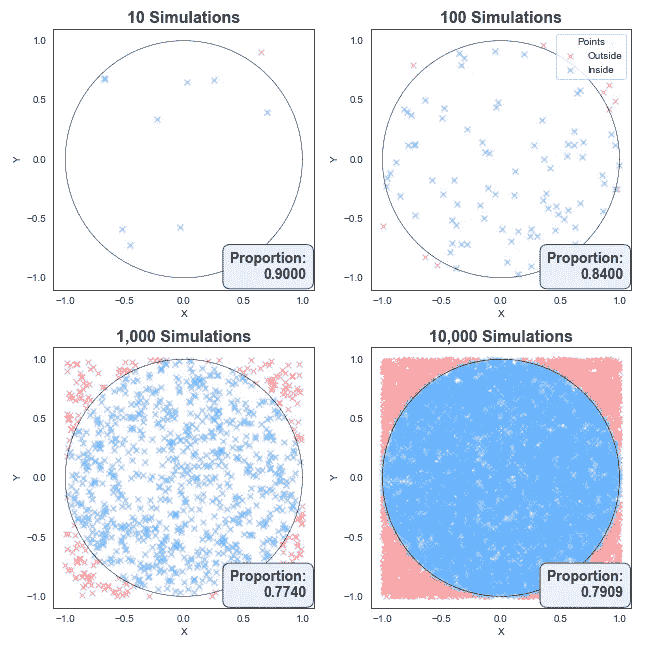
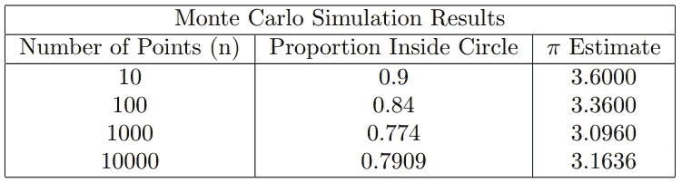
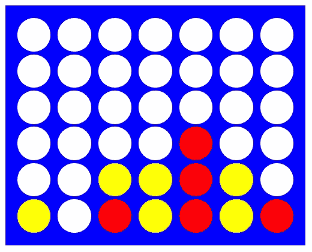
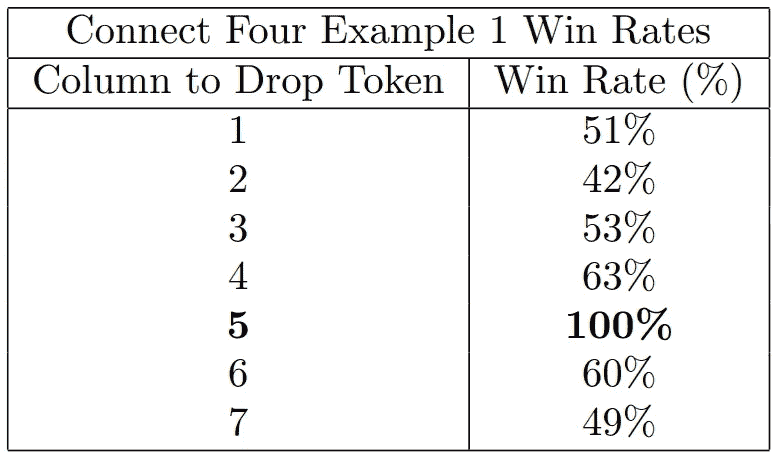
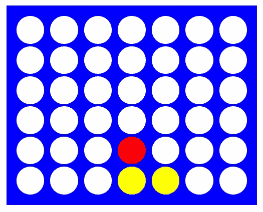
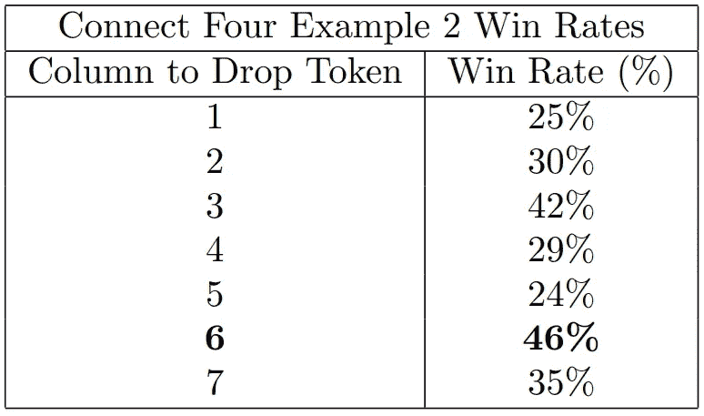

# 用人工智能击败四子连珠

> 原文：[`towardsdatascience.com/beating-connect-four-with-ai-b88b220ff0f0?source=collection_archive---------5-----------------------#2024-08-28`](https://towardsdatascience.com/beating-connect-four-with-ai-b88b220ff0f0?source=collection_archive---------5-----------------------#2024-08-28)

## 使用蒙特卡罗模拟的简单方法

[](https://medium.com/@rhyscook92?source=post_page---byline--b88b220ff0f0--------------------------------)[](https://towardsdatascience.com/?source=post_page---byline--b88b220ff0f0--------------------------------) [Rhys Cook](https://medium.com/@rhyscook92?source=post_page---byline--b88b220ff0f0--------------------------------)

·发表于 [Towards Data Science](https://towardsdatascience.com/?source=post_page---byline--b88b220ff0f0--------------------------------) ·阅读时间 8 分钟·2024 年 8 月 28 日

--

我喜欢游戏。国际象棋、拼字游戏，你能想到的都喜欢。然而，我非常糟糕的游戏之一就是简单的四子连珠。出于某种原因，再加上我想尝试数据科学更实际的一面，这让我萌生了构建一个能够高水平玩四子连珠游戏的简单人工智能的想法。

这里显而易见的问题是，如果我在四子连珠游戏中表现很糟糕，那我怎么能构建一个能玩好这个游戏的人工智能呢？这就引出了蒙特卡罗模拟。蒙特卡罗模拟是数据科学中的一种强大工具，使用随机采样来估算复杂的结果。这种稳健的方法有着出乎意料的广泛应用，从数值积分到金融建模，甚至我们将要探讨的四子连珠游戏。

在本文中，我将简要介绍蒙特卡罗模拟，然后深入探讨如何将其应用于四子连珠游戏，最后将所有内容整合并分享一些代码。如果你愿意，我还会给你一个机会亲自与人工智能对战，看看你的表现如何。

出发吧！


图片由作者提供。（AI 生成）

# 蒙特卡罗方法介绍：

蒙特卡罗采样法的想法其实很简单——如果你有一个无法通过解析方法解决的问题，为什么不进行随机实验并尝试估算一个数值答案呢？如果现在这还不太理解，别担心，我们很快就会看一个例子。但在此之前，让我们先把历史搞清楚。

蒙特卡罗方法的背景故事相当有趣。该方法的主要开发者是物理学家斯坦尼斯瓦夫·乌拉姆，他非常著名，曾参与曼哈顿计划开发原子弹。与我们故事相关的是斯坦尼斯瓦夫的叔叔，他有一个不幸的赌博习惯，这导致斯坦尼斯瓦夫将这种新计算方法命名为“蒙特卡罗”，以此纪念摩纳哥著名的蒙特卡罗赌场。

现在，回到我之前承诺给你们的关于生成随机样本的例子。

## 一个实际示例

假设我们想要找到半径为 1 的圆内的面积。这个圆的实际面积当然是我们熟悉的公式πr²，由于 r 是 1，面积就是π。但如果我们不知道π呢？我们如何通过生成随机实验来按照蒙特卡罗方法得到这个答案？

首先，在区域 -1 < x < 1 和 -1 < y < 1 中模拟随机点。然后，对于每个点，记录它是否在圆内或圆外。下面我为 10 个、100 个、1000 个和 10,000 个随机坐标创建了这样的模拟。

你可以看到，只有 10 个点时，圆的面积（或其占据的比例）非常粗略，但随着我们添加更多的点，位于圆内的点的比例变得越来越一致。



图片由作者提供。随着点数的增加，我们得到的圆占据的总空间比例测量值更加精确。

现在你可能会问，好吧，这些图表都很漂亮，但是实际的收获是什么呢？这是一个很好的问题。

注意，我们最终得到的是在圆内的模拟比例的估算吗？好吧，我们知道正方形的面积将是 2 x 2 = 4，接下来我们可以通过将这个比例乘以 4 来估算π，因为圆的面积就是π。

下表总结了结果。注意，随着模拟次数的增加，π的估算值越来越接近真实值。



图片由作者提供

我们当然可以通过更多的模拟做得更好。以下代码片段运行一亿个样本，通常能给出一个精确到小数点后三位的结果：

```py
import numpy as np

n = 100_000_000
points = np.random.rand(n, 2)
inside_circle = np.sum(points[:,0]**2 + points[:,1]**2 <= 1)
pi_estimate = (inside_circle / n) * 4

print(pi_estimate) # prints 3.141x
```

这里的关键收获是，通过生成随机模拟（我们的坐标对），我们可以为一个已知的量得到一个出奇精确的估算！这是我们第一个关于蒙特卡罗方法的实际示例。

# 游戏方法的翻译

这个方法很棒，但我们并不想计算π，我们想制作一个能够玩“四子棋”的 AI！幸运的是，我们刚刚用来计算π的逻辑也可以应用于四子棋游戏。

在上面的示例中，我们做了两件事，首先我们生成了随机样本（坐标对），然后第二，我们近似了一个量（π）。

好的，我们将在这里做同样的事情。首先，我们像之前那样生成随机样本，但这次这些随机样本将选择随机行动，从而模拟整个四子棋游戏。

然后，第二步，我们将再次近似一个数量，但我们追求的数量是每个行动的获胜概率。

## 规则简要回顾

在我们开始创建模拟之前，先快速回顾一下四子棋的规则。玩家轮流将彩色棋子放入 7x6 棋盘上任何未填充的列中。游戏在任意一方玩家的棋子连续排成四个时结束，或者当棋盘填满且未分胜负时，游戏以平局结束。

## 四子棋的蒙特卡罗方法

好的，现在我们已经掌握了理论，是时候将其付诸实践，教 AI 玩四子棋了。为了在四子棋游戏中找到正确的行动，我们：

1.  随机抽取每一个可能的合法行动。（选择将棋子放入哪一列）。

1.  然后，从这个位置模拟整个游戏，假设双方玩家的行动*完全随机*。

1.  跟踪每场随机游戏的结果，以计算每个行动的胜率。

1.  最终，选择胜率最高的行动。

听起来很简单，实际上也是如此！

为了实际展示这个方法，以下是我编写的四子棋游戏 Python 实现。这里有些复杂的部分，但不用担心，如果一时没弄明白——实际的实现细节并不如概念本身重要！

话说回来，对于那些感兴趣的人，这种方法利用了面向对象编程，包含一个能够在棋盘类（Board class）上执行行动的玩家类（Player class）。

实际操作是这样的：我们从一系列可能的有效行动开始，并从中随机选择。对于每一个行动，我们调用`_simulate_move`函数，它将从该点开始模拟整局游戏并返回获胜符号。如果该符号与 AI 玩家的符号匹配，我们便增加胜利次数。在进行大量模拟后，我们计算每个行动的胜率，最终返回胜率最高的行动。

```py
def _get_best_move(self, board: Board, num_sims: int):

    # Get a list of all viable moves
    win_counts = {column: 0 for column in range(board.width) if board.is_valid_move(column)}
    total_counts = {column: 0 for column in range(board.width) if board.is_valid_move(column)}

    valid_moves = list(win_counts.keys())
    for _ in range(num_sims):
        column = random.choice(valid_moves) # Pick a move a random
        result = self._simulate_move(board, column) # Simulate the game after making the random move
        total_counts[column] += 1
        if result == self.symbol: # Check whether the AI player won
            win_counts[column] += 1

    win_rates = {column: win_counts[column] / total_counts[column] if total_counts[column] > 0 else 0 for column in valid_moves}
    best_move = max(win_rates, key=win_rates.get) # Find the move with the best win rate
    return best_move
```

总结来说，通过模拟随机行动并跟踪游戏进程，这种蒙特卡罗方法帮助 AI 开始做出比单纯猜测更聪明的决策。

## 一些实际示例：

好吧，代码说完了！让我们来测试一下 AI，看看它在几种不同的局面下会表现如何。接下来我们将通过两个不同的局面，展示上述代码块的结果。第一个局面非常简单，第二个则稍微复杂一些。



作者插图

现在轮到红方了，显而易见最好的行动是将棋子放在第 5 列。如果我们使用上述方法从这个位置模拟 1000 场随机游戏，AI 玩家得到了以下胜率。将棋子放在第 5 列每次都能获胜（正如预期的那样！），因此选择了这个行动。



作者提供的结果表格。此表显示了基于采样走法的随机游戏的胜率。加粗的走法是由人工智能玩家选择的。

太棒了！我们的人工智能可以在有机会时识别出获胜的走法。这个场景很简单，是的，但老实说，我之前在游戏中错过了很多获胜的机会……

现在，让我们来看另一个局面。这一局稍微复杂一点。你能想到红方该如何下棋，才能防止黄方获得获胜的优势吗？



图片由作者提供。

这里的关键是要防止黄方形成一个有开放边的三连排布局，因为那样会导致胜利。红方需要通过在第 3 列或第 6 列下棋来阻挡这一点！我们从这个位置模拟 1000 局游戏，得到了如下的胜率。注意，人工智能正确地识别出这两种阻挡走法（第 3 列和第 6 列）具有最高的胜率。而且，它还意识到第 6 列的获胜机会最大，因此选择了第 6 列。



作者提供的结果表格。此表显示了基于采样走法的随机游戏的胜率。加粗的走法是由人工智能玩家选择的。

# 实际效果如何呢？

亲自体验一下吧！你可以在这里挑战人工智能：[`fourinarowgame.online/`](https://fourinarowgame.online/)。难度是根据模拟次数来调整的。简单模式模拟 50 局，中等模式模拟 500 局，困难模式模拟 1500 局。就个人而言，我通常能够在简单模式下获胜，但仅此而已！

# 结论

好的，让我们将这些内容综合起来。在写这篇文章时，我真的想做两件事。首先，我想展示蒙特卡洛方法在像通过模拟随机坐标来估算π这样直接计算中的强大能力。

接下来，更有趣的是，我想展示相同方法在棋盘游戏中的强大效果。有趣的是，尽管对四连棋的策略一无所知，完全可以通过模拟随机游戏，最终得到一个能够以相当高水平进行对弈的人工智能对手！

一如既往，感谢阅读，下次见。
