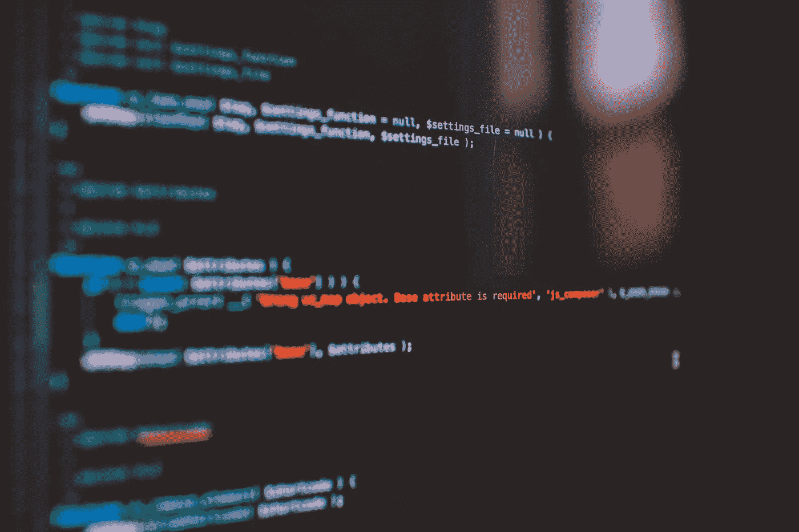

# 成为一名数据科学家：如果我必须重新开始，我会做什么

> 原文：[`towardsdatascience.com/becoming-a-data-scientist-what-i-would-do-if-i-had-to-start-over-655f0476b462?source=collection_archive---------0-----------------------#2024-12-03`](https://towardsdatascience.com/becoming-a-data-scientist-what-i-would-do-if-i-had-to-start-over-655f0476b462?source=collection_archive---------0-----------------------#2024-12-03)

## 进入数据科学：好与坏，以及 Python 中的错误

 [Philippe Ostiguy, M. Sc.](https://ostiguyphilippe.medium.com/?source=post_page---byline--655f0476b462--------------------------------)

·发布于[Towards Data Science](https://towardsdatascience.com/?source=post_page---byline--655f0476b462--------------------------------) ·10 分钟阅读·2024 年 12 月 3 日

--

图片由[Markus Spiske](https://unsplash.com/@markusspiske?utm_source=medium&utm_medium=referral)提供，拍摄于[Unsplash](https://unsplash.com/?utm_source=medium&utm_medium=referral)

马丁·路德·金博士因其演讲**“**[我有一个梦想](https://en.wikipedia.org/wiki/I_Have_a_Dream)**”**而闻名。他于 1963 年 8 月 28 日在华盛顿特区的林肯纪念堂前，向约 250,000 人发表了这篇演讲。这被认为是 20 世纪最重要的演讲之一。它在美国黑人民权运动中发挥了至关重要的作用。

在这次演讲中，他说他梦想着有一天，他的四个孩子能生活在一个这样一个国家，在那里，人们不会因为皮肤的颜色而被评判，而是根据他们的品格来评判。

几年前我也有一个梦想。虽然它不像马丁·路德·金的梦想那样光辉灿烂或重塑了历史进程，但我渴望成为一名数据科学家。

我从来不是为了声望或因为这是一种时尚（至今依然如此），而是因为我真心喜欢处理数据，解决复杂问题，并利用洞察力推动业务成果。成为一名数据科学家是我的独特技能和热情交汇的地方。你知道的，就是那个[通向充实职业的甜蜜点](https://medium.com/towards-data-science/the-one-mindset-change-that-launched-me-into-data-science-3f72bd1df46f)。

我的旅程并不简单。我不知道从哪里开始，也不知道接下来该做什么。我参加了各种课程，其中许多最终证明并没有什么帮助。我还阅读了无数关于数据科学的文章。虽然成为一名数据科学家需要付出艰苦的努力，但我却花了很多时间在一些最终并不必要的事情上。

我希望有人在我开始分享的这些指导建议之前就曾给我一些帮助。这就是本文的目的。好消息是？遵循这些步骤并不能保证你能找到数据科学家的工作，但它们会显著提高你的机会……即使没有博士学位！我认识一些没有博士学位的专业人士，他们在数据科学领域表现出色。这个领域的成功主要依赖于毅力和实践经验。

# 从某个地方开始，现在就开始

> “[开始是任何工作中最重要的部分](https://en.wikiquote.org/wiki/Plato).”
> 
> —— 柏拉图

[研究表明](https://pmc.ncbi.nlm.nih.gov/articles/PMC3591461/)一个幼儿在 2 到 3 个月内，每天大约走 14,000 步，经历 100 次跌倒，直到掌握走路技巧。然而，他们依然坚持，根本没有考虑放弃。

相比之下，作为成年人，我们往往做的是相反的事情。我们一遇到障碍就会放弃。一个成年人可能会看到 100 次失败，而一个婴儿却看到 100 个学习的机会。婴儿不会过度分析自己的失败，也不会过度计算风险。它只是开始，尝试，跌倒，然后再试一次！

考虑一下 Justin Kan 的故事，他是 Twitch 的联合创始人。他的创业之旅并不是从一场轰动的成功开始的。它始于他所谓的“[糟糕的第一个创业公司](https://www.linkedin.com/posts/justinkan_shitty-first-startups-activity-6870154231052025856-gzFV/)”，一个名为 Kiko 的在线日历应用。Kiko 曾与 Google Calendar 等巨头竞争，但最终它在 eBay 上以 258,100 美元的价格卖出！

接下来，他推出了 Justin.tv，一个 24/7 直播自己生活的平台。Justin.tv 最终变成了 Twitch，一个专注于游戏的直播平台。在 2014 年，亚马逊以 9.7 亿美元收购了 Twitch！

正如 Justin Kan 所说：“[不要等待，赶紧建立你第一个糟糕的创业公司。](https://www.linkedin.com/posts/justinkan_shitty-first-startups-activity-6870154231052025856-gzFV/)”

这一建议同样适用于你进入数据科学的旅程。从某个地方开始。现在就开始你的学习过程。即使你第一次尝试觉得“糟糕”，而且你不确定从哪里开始，也没关系。你可以在初步的努力基础上不断发展，随着进展调整方向，没人能阻止你。你需要现在就开始，并从某个地方开始。

图片由[Vlad Bagacian](https://unsplash.com/@vladbagacian?utm_source=medium&utm_medium=referral)提供，来自[Unsplash](https://unsplash.com/?utm_source=medium&utm_medium=referral)

# 那么……我从哪里开始呢？

法国的[博韦大教堂](https://en.wikipedia.org/wiki/Beauvais_Cathedral)原本计划在 13 世纪成为世界上最高的教堂。其雄心勃勃的设计突破了哥特式建筑的极限。然而，1284 年发生了一次显著的倒塌事故，合唱团的拱顶由于基础不充分和结构支撑不足而坍塌。至今未完成。

这为你进入数据科学的旅程提供了强有力的类比。你可能会忍不住（我们大家都有过）直接跳到那些令人兴奋的部分，比如深度学习模型、大型语言模型（LLM）或最新的机器学习框架。但就像博韦大教堂一样，如果没有坚实的基础，你的雄心勃勃的计划也许会失败。首先学习基础知识至关重要，以确保你的知识足够牢固，能够支持更高级的概念。

## **数学：你的通用语言**

将数学视为模式的语言。数学无处不在。老实说，如果你不喜欢数学，也许数据科学的职业道路并不适合你。

你不需要成为数学家，但你确实需要理解以下关键概念：

+   **线性代数**（矩阵、向量等）：将矩阵和向量视为数据交流的语言。理解这些概念使你能够操控数据结构以适应机器学习算法。

+   **微积分**（微分、积分、梯度等）：它们对于优化模型至关重要，比如在训练神经网络时使用的梯度。

+   **统计学**（分布、描述性统计等）：这是你学习如何解读数据所讲述的故事的地方。理解分布和描述性统计等概念让你能够基于数据中的模式做出明智的决策。

## 深入编程

在拥有数学基础后，编程将让你的想法得以实现。虽然有人主张在数据科学中学习 R，但 Python 凭借其多功能性和在行业中的广泛应用脱颖而出。此外，我认识的大多数人都在使用 Python。它对于大多数应用场景已经足够好了。专注于：

+   **基本语法和函数**：了解 Python 的基本工作原理。这就像在写故事之前学习字母表。

+   **数据结构**：列表、字典、元组——了解如何使用它们。它们对于处理现实世界中的数据至关重要。

+   **控制流语句**：掌握“if 语句”，“for 循环”和“while 循环”。这些语句让你能够实现逻辑，从而解决复杂的问题。使用简单的语句，你能做成比你想象的更多的事！

+   **面向对象编程**：理解类、函数和对象的概念。这让你能够编写高效、可重用的代码，同时也促进与他人的协作。

## SQL：你的数据库语言

数据通常存储在数据库中，你需要访问和操作这些数据。SQL 是你与这些数据交互的语言。

+   **与数据库交互**：学习基本的 SQL 命令，以便检索、更新和管理数据。

## **机器学习：将数据转化为洞察**

接下来，在理解了数学、编程和数据处理之后，你可以开始学习机器学习。重点是：

+   **理解算法**：从学习线性回归、决策树和聚类方法等基础算法开始。这些是更复杂模型的基础。

+   **监督学习与非监督学习**：理解这两种核心机器学习类型之间的区别。监督学习是用标注数据训练模型，而非监督学习则使用未标注数据。

+   **模型评估**：学习如何使用诸如分类模型的 F1 分数、语音识别的词错误率或时间序列分析的 RMSE 等指标来评估模型的表现。

+   **特征工程**：这是一门将原始数据转换成模型能够理解的形式的艺术。通常，这比使用复杂的算法更能带来显著的影响。你可以在[这里](https://levelup.gitconnected.com/want-to-decrease-your-models-prediction-errors-by-20-follow-this-simple-trick-97354102098e)看到一个示例。

+   **库和框架**：熟悉一些流行的 Python 机器学习库，如 scikit-learn、TensorFlow 和 PyTorch。

记住，机器学习不仅仅是应用算法。它是关于理解你要解决的问题，并选择正确的方法。

## 商业敏锐度：将技术技能转化为商业影响力

很多人联系我，想要开始数据科学的职业生涯。他们通常拥有令人印象深刻的资历，如博士学位和扎实的数学背景。然而，即便有这些出色的资历，许多人仍然难以进入这个领域。原因是什么？他们缺乏商业敏锐度。

技术技能至关重要。然而，事实是，如果一个 AI 模型不能解决业务问题，它的价值为 0。我见过许多才华横溢的数据科学家失败，因为他们构建了没人使用的复杂模型。关键是什么？学会像一个企业主一样思考。

例如：

+   **将业务问题转化**：与其仅仅构建一个预测模型，不如问问自己，“这个模型如何支持业务中的决策制定？”

+   **优先考虑影响**：专注于数据科学能产生最大价值的问题，而不是追求那些不能解决业务问题的复杂解决方案。

## 聚焦于核心要素

[维尔弗雷多·帕累托](https://en.wikipedia.org/wiki/Vilfredo_Pareto)是意大利的多面手，他在经济学、社会学等多个领域做出了贡献。他为人熟知的概念之一是帕累托最优性。它描述了一种资源分配最经济高效的情况，任何人都不能在不使别人更糟的情况下变得更好。

然而，他最著名的观察之一是在研究意大利的财富分配时发现的。他发现 20%的人口拥有 80%的土地。他还在普鲁士、英格兰、法国等地注意到同样的模式。

这一观察结果导致了我们今天所知道的帕累托原则，或称 80/20 法则。换句话说，20%的原因导致了 80%的结果。

例如，在商业中，通常观察到 80%的销售来自 20%的客户。在质量控制中，80%的问题由 20%的缺陷引起。在职场中，20%的任务贡献了 80%的工作成果。我们往往使用我们拥有的物品中的 20%来完成 80%的工作。而这个规律还在不断延续。

同样的思路也适用于你成为数据科学家的旅程。与其试图掌握所有可能的主题，不如专注于每个关键领域上一门课程：数据科学的数学、Python、SQL、机器学习和商业分析。就这样。专注于核心的 20%的技能（甚至更少），这将产生 80%的成果。

记住，不要陷入“教程地狱”的陷阱，即不断消费新的内容，却从未真正理解所学的东西。成为一名熟练的数据科学家，和任何其他工作一样，最重要的是积累经验。这意味着将你学到的东西应用到现实项目中。

当你不理解某个问题时，去查找它，学习它，然后再回到你的项目中。重复这一过程，直到你的知识和技能得到了足够的巩固。

图片由[Austin Distel](https://unsplash.com/@austindistel?utm_source=medium&utm_medium=referral)提供，来源于[Unsplash](https://unsplash.com/?utm_source=medium&utm_medium=referral)

# 创建你自己的工作经验

> “[经验是万物的老师](https://en.wikipedia.org/wiki/Ut_est_rerum_omnium_magister_usus)。”
> 
> — 朱利叶斯·凯撒

完成基础课程后，通过将所学知识应用到实际项目中，提升你的技能。

在任何领域建立专业知识都需要巨大的奉献精神和实践。埃里克森、克拉姆普和特施-罗默的[研究](https://psycnet.apa.org/buy/1993-40718-001)指出，发展任何领域的专业技能通常需要大约 10,000 小时的刻意练习。顶级表演者，如音乐会音乐家和职业运动员，通常每天会投入约四小时的专注练习来完善他们的技能。

这个原则同样适用于数据科学。掌握一门技能不是一蹴而就的，它需要持续的努力和经验积累。通过每天花时间应用你学到的知识并解决现实问题，你离成为该领域的专家会越来越近。

## 好吧……但我该如何积累经验呢？

这比大多数人想象的要简单。然而，很多人会因为无法找到“完美”的起点而陷入困境。正如我之前所说，最关键的一步是现在开始，并且从某个地方开始。犯错并根据学习调整方法是完全可以的。

你的职业背景并不是限制，即使它不是数据科学相关的。实际上，恰恰相反，它是一项资产。

每个领域，无论是市场营销、医疗、金融还是法律，都有可以通过数据解决的问题。市场营销人员可能会分析客户参与模式。拥有金融背景的人可能希望预测股市。

我曾经建议过一个有金融背景的学员，他不知道从哪里开始。我建议他创建一个 ARIMA 模型来预测加拿大房价（ARIMA 是一个相当简单的模型）。

这并不是什么突破性的东西，但它是真实且相关的。它不仅利用了他的领域专长和技术技能，而且这个人专注于一个需求量大的话题（加拿大房价）。

如果你仍然不确定，从你真正喜欢的事情开始。这是关键。当你真正感兴趣时，你很可能会经历我们之前讨论的那 10,000 小时的练习。你也更可能以决心应对挑战，将挫折视为学习的机会，而不是放弃的理由。

它可以是任何事情。如果你是艺术家，你可能会使用计算机视觉分析视觉模式，或者用神经网络创造生成艺术。医疗工作者可能希望预测病人的结局。环境科学领域的人可能使用大型数据集来模拟气候变化的影响。例子不胜枚举。

如果可能，考虑使用大型语言模型（LLMs）。这绝对不是强制性的。然而，LLMs 最近变得非常流行，尤其是在 2022 年底 ChatGPT 发布之后。公司们正在迅速采纳它。它为在这一前沿领域中发展专业技能提供了极好的机会。

有几个框架可以用来构建基于 LLM 的应用程序。其中之一是 [LangChain](https://python.langchain.com/docs/introduction/)。但再次强调，LLM 应该是对你基本机器学习理解的补充，而不是替代。如果你觉得 LLM 太复杂，可以从简单的东西开始。

一旦你创建了某个东西，就与世界分享。可以在 Medium 上写文章，或者将你的代码发布在 GitHub 上。这将展示你的工作。从一个基本模型或项目开始，然后逐步改进。

例如，你可以从一个简单的 ARIMA 模型开始，预测房价。然后，你可以转向一个更复杂的多变量模型（如基于 Transformer 的时间序列模型）。你可以加入如利率、收入与负债比率、失业率等特征。最后，你可以将该模型与基准模型进行比较。

当你加入额外的功能或完善算法时，请更新你的 GitHub 仓库并写后续文章，记录你的进展。这展示了你的技能和对持续学习的承诺。这是学习和展示你能力的最佳（如果不是最好的）方式之一。

# 结论

感谢阅读本文！再次提醒，正如伏尔泰明智地所说，“[完美是优秀的敌人。](https://en.wikipedia.org/wiki/Perfect_is_the_enemy_of_good)”现在就开始，在哪里开始都可以。你无需等待完美的项目或想法才能采取行动。随着你获得实践经验，你将会更加清楚下一步该做什么。

# 喜欢这篇文章吗？支持一下吧！

👏 鼓掌 50 次

🤝 [在 LinkedIn 上与我连接](https://www.linkedin.com/in/philippe-ostiguy/)，保持联系并讨论机会。
