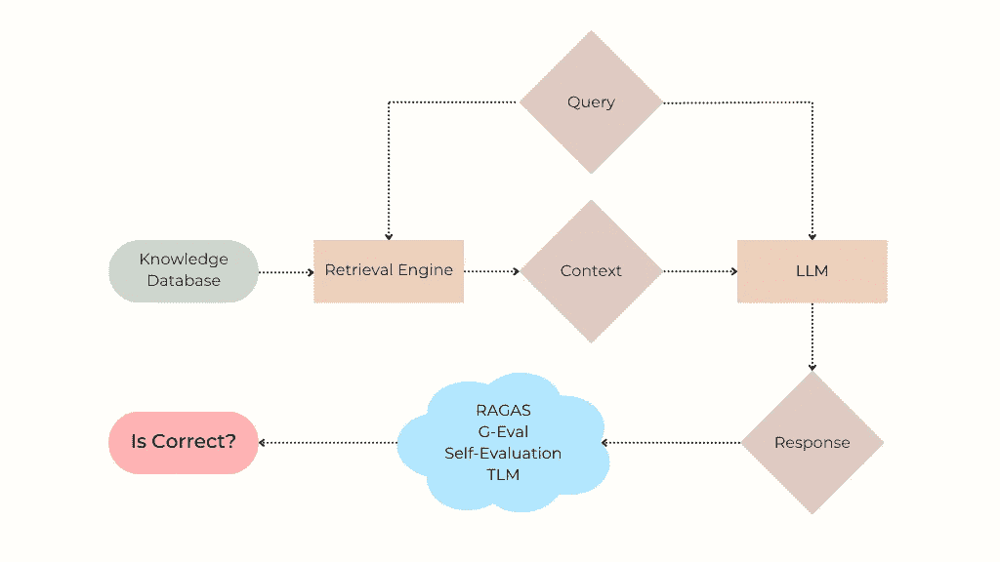
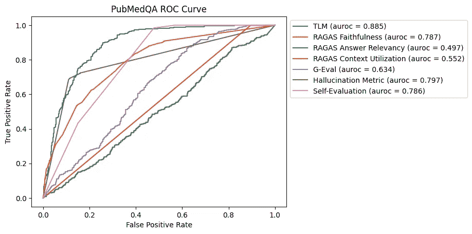
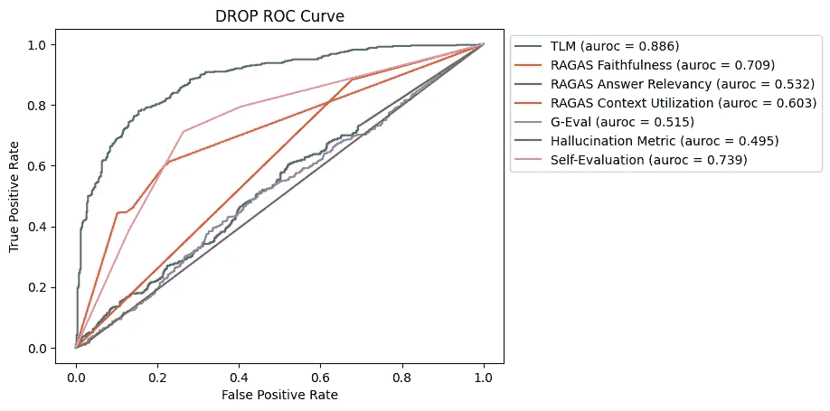
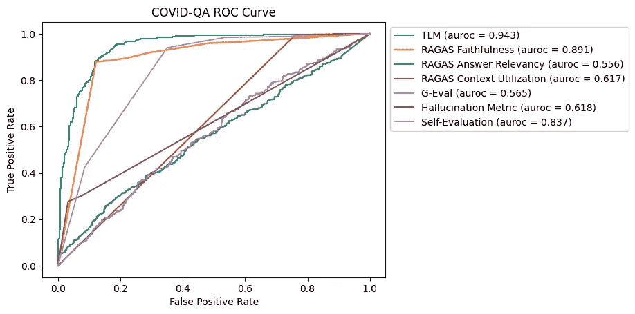
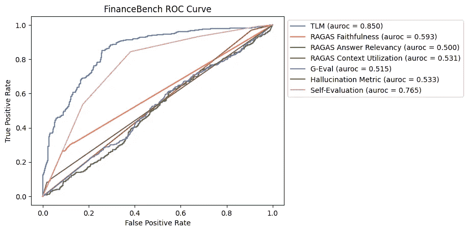

# RAG 中的幻觉检测方法基准测试

> 原文：[`towardsdatascience.com/benchmarking-hallucination-detection-methods-in-rag-6a03c555f063?source=collection_archive---------0-----------------------#2024-09-09`](https://towardsdatascience.com/benchmarking-hallucination-detection-methods-in-rag-6a03c555f063?source=collection_archive---------0-----------------------#2024-09-09)

## 评估提升 LLM 生成响应可靠性的方法。

 [Hui Wen Goh](https://medium.com/@hwgoh?source=post_page---byline--6a03c555f063--------------------------------)

·发布于 [Towards Data Science](https://towardsdatascience.com/?source=post_page---byline--6a03c555f063--------------------------------) ·9 分钟阅读·2024 年 9 月 9 日

--

幻觉问题依然是当前检索增强生成（RAG）应用中的一个重大问题。本研究评估了流行的幻觉检测器在 4 个公开 RAG 数据集上的表现。通过使用 AUROC 以及精确度/召回率，我们报告了像 G-eval、Ragas 和可信语言模型等方法在**自动标记不正确的 LLM 响应**方面的表现，*效果如何*。

使用各种幻觉检测方法识别 RAG 系统中的 LLM 错误。

我目前在 Cleanlab 担任机器学习工程师，参与了本文所讨论的可信语言模型的开发工作。我很高兴在接下来的基准测试中介绍这一方法，并将其与其他方法进行评估。

# 问题：RAG 系统中的幻觉与错误

大型语言模型（LLM）在面对未充分支持其训练数据中的问题时，常常会产生*幻觉*，即错误的回答。检索增强生成（RAG）系统通过为 LLM 增加从特定知识数据库中*检索*上下文和信息的能力来缓解这一问题。尽管组织正在迅速采用 RAG，将 LLM 的强大功能与他们自己的专有数据结合使用，但幻觉和逻辑错误仍然是一个大问题。在一起广泛报道的案例中，一家大型航空公司（加拿大航空）因其 RAG 聊天机器人出现了关于退款政策的关键信息幻觉而输掉了官司。

为了理解这个问题，让我们首先回顾一下 RAG 系统是如何工作的。当用户提出问题（例如“这个能退吗？”），*检索*组件会在知识数据库中搜索相关信息，以便准确地作出回应。最相关的搜索结果被格式化为*上下文*，然后与用户的问题一起输入到 LLM 中，由 LLM*生成*最终呈现给用户的回应。由于企业级 RAG 系统通常比较复杂，最终的回应可能因多种原因不准确，包括：

1.  大型语言模型（LLMs）是脆弱的，容易产生幻觉。即使检索到的上下文包含正确答案，LLM 也可能无法生成准确的回应，尤其是在生成回应时需要对上下文中的不同事实进行推理时。

1.  由于检索不充分、文档分块/格式不良或知识数据库中缺乏相关信息，检索到的上下文可能不包含准确回应所需的信息。在这种情况下，LLM 仍然可能尝试回答问题，并产生不正确的回应。

尽管有些人使用“幻觉”一词仅指某些类型的 LLM 错误，但在这里我们将其与*不正确回应*同义使用。对 RAG 系统的用户而言，重要的是答案的准确性以及能够信任这些答案。与评估系统多种属性的 RAG 基准不同，我们只研究：**不同检测器在回应不准确时，能多有效地提醒 RAG 用户**。

一个 RAG（检索增强生成）答案可能因*检索*或*生成*过程中的问题而不正确。我们的研究侧重于后者的问题，这源于 LLM 的根本不可靠性。

# 解决方案：幻觉检测方法

假设现有的检索系统已经提取了与用户问题最相关的*上下文*，我们考虑使用算法来检测**基于这个上下文生成的 LLM 回应不应被信任**的情况。这类幻觉检测算法在医学、法律或金融等高风险应用中至关重要。除了标记不可信的回应供人工进一步审查外，这些方法还可以用来判断何时值得执行更昂贵的检索步骤（例如，搜索额外的数据源、重写查询等）。

以下是我们研究中考虑的幻觉检测方法，所有方法都基于使用 LLM 来评估生成的回应：

**自我评估（"Self-eval"）**是一种简单的技术，LLM 会被要求评估生成的答案，并按 1 到 5 的等级评定其信心。我们利用*思维链*（CoT）提示来改进这一技术，要求 LLM 在给出最终评分之前，先解释其信心。以下是使用的具体提示模板：

> *问题：{question}
> 
> 答案：{response}*
> 
> 评估你对给定答案是否是一个良好且准确的回应的信心程度。
> 
> 请使用以下 5 分制评分标准进行评分：
> 
> 1: 你对答案是否能回答问题完全没有信心，答案可能完全跑题或与问题无关。
> 
> 2: 你对答案能否回答问题的信心较低，对于答案的准确性有疑问和不确定性。
> 
> 3: 你对答案是否能够回答问题有中等信心，答案看起来合理准确并且与主题相关，但仍有改进的空间。
> 
> 4: 你对答案能回答问题有较高的信心，答案提供了准确的信息，解答了大部分问题。
> 
> 5: 你非常自信答案能够回答问题，答案极其准确、相关，并有效地全面解答了问题。
> 
> 输出应严格使用以下模板：解释：[提供你用来推导评分的简短理由]，然后在最后一行写上“评分: <rating>”。

[**G-Eval**](https://docs.confident-ai.com/docs/metrics-llm-evals)（来自 DeepEval 包）是一种使用 CoT（链式推理）自动制定多步骤标准来评估给定响应质量的方法。在 G-Eval 论文（Liu 等人）中，发现该技术与多个基准数据集上的人工判断具有相关性。质量可以通过多种方式进行衡量，这些方式在 LLM 提示中有所规定，在这里我们指定应根据响应的事实正确性进行评估。以下是用于 G-Eval 评估的标准：

> *判断输出在给定上下文下是否事实正确。*

[**幻觉度量**](https://docs.confident-ai.com/docs/metrics-hallucination)（来自 DeepEval 包）估计幻觉的可能性，即 LLM 响应与上下文的矛盾/不一致的程度，评估由另一个 LLM 进行。

[**RAGAS**](https://docs.ragas.io/en/stable/)是一个专为 RAG（检索增强生成）设计的、由 LLM 驱动的评估工具套件，提供多种评分，可以用来检测幻觉现象。我们会考虑以下每一项 RAGAS 评分，这些评分通过使用 LLM 估算所需的数量来生成：

1.  [忠实度](https://docs.ragas.io/en/stable/concepts/metrics/faithfulness.html) — 答案中由提供的上下文支持的陈述的比例。

1.  [答案相关性](https://docs.ragas.io/en/stable/concepts/metrics/answer_relevance.html)是指答案中的三个 LLM 生成问题的向量表示与原始问题向量表示的平均余弦相似度。这里的向量表示是来自`BAAI/bge-base-en 编码器`的嵌入向量。

1.  [上下文利用率](https://docs.ragas.io/en/latest/concepts/metrics/context_utilization.html)衡量在 LLM（大语言模型）响应中对上下文的依赖程度。

[**可信语言模型（TLM）**](https://cleanlab.ai/blog/trustworthy-language-model/)是一种模型不确定性评估技术，用于评估 LLM 回应的可信度。它通过自我反思、多次采样回应的一致性和概率度量的组合来识别错误、矛盾和幻觉。以下是用于提示 TLM 的提示模板：

> *仅使用以下信息回答问题
> 
> CONTEXT: {context}
> 
> 问题：{question}*

# 评估方法

我们将在 4 个公共的上下文-问题-回答数据集上比较上述幻觉检测方法，这些数据集涵盖了不同的 RAG 应用。

对于我们基准中的每个用户*问题*，现有的检索系统会返回一些相关的*上下文*。然后，用户查询和上下文会输入到一个*生成器* LLM（通常还会包含特定应用的系统提示）中，以生成用户的回答。每种检测方法都会输入{用户查询，检索到的上下文，LLM 回应}，并返回一个介于 0 和 1 之间的分数，表示幻觉的可能性。

为了评估这些幻觉检测器，我们考虑当 LLM 的回答错误与正确时，这些分数在何种程度上可靠地取较低值。在我们的每个基准测试中，都有关于每个 LLM 响应正确性的真实标注，这些标注仅供评估使用。我们基于**AUROC**来评估幻觉检测器，AUROC 被定义为在从 LLM 错误响应子集抽取的示例中，其分数低于从 LLM 正确响应子集抽取的示例的概率。AUROC 值较大的检测器可用于**更精确/更高召回率地捕捉生产系统中的 RAG 错误**。

所有考虑的幻觉检测方法本身都由 LLM 提供支持。为了公平比较，我们将所有方法中的 LLM 模型固定为`gpt-4o-mini`。

# 基准结果

我们将在下文描述每个基准数据集及其相应结果。这些数据集来自流行的[HaluBench](https://huggingface.co/datasets/PatronusAI/HaluBench)基准套件（我们没有包括该套件中的其他两个数据集，因为我们发现它们的真实标注存在重大错误）。

# PubMedQA

[PubMedQA](https://huggingface.co/datasets/PatronusAI/HaluBench/viewer/default/test?f%5Bsource_ds%5D%5Bvalue%5D=%27pubmedQA%27)是一个基于 PubMed 摘要的生物医学问答数据集。数据集中的每个实例包含一段来自 PubMed（医学出版物）摘要的文本，一个基于该段文本提出的问题，例如：`9 个月的治疗是否足够治疗结核性肠炎？`，以及一个生成的答案。

PubMedQA 数据集的 ROC 曲线

在这个基准测试中，TLM 是最有效的幻觉识别方法，其次是 Hallucination Metric、Self-Evaluation 和 RAGAS Faithfulness。在这三种方法中，RAGAS Faithfulness 和 Hallucination Metric 在高精度地捕捉错误答案方面更为有效（RAGAS Faithfulness 的平均精度为`0.762`，Hallucination Metric 的平均精度为`0.761`，Self-Evaluation 的平均精度为`0.702`）。

# DROP

[DROP](https://huggingface.co/datasets/PatronusAI/HaluBench/viewer/default/test?f%5Bsource_ds%5D%5Bvalue%5D=%27DROP%27)，即“段落上的离散推理”，是一个基于维基百科文章的高级问答数据集。DROP 的难度在于问题要求对文章中的上下文进行推理，而不仅仅是提取事实。例如，给定一个描述“海鹰队与 49 人队”足球比赛中达阵的维基百科段落，问题可能是：`有多少次达阵跑的总距离为 5 码或更短？` 这要求 LLM 读取每次达阵的跑动并将长度与 5 码的要求进行比较。

DROP 数据集的 ROC 曲线

由于 DROP 数据集需要复杂的推理，大多数方法在检测幻觉时面临挑战。TLM 在这个基准测试中表现最为有效，其次是 Self-Evaluation 和 RAGAS Faithfulness。

# COVID-QA

[COVID-QA](https://huggingface.co/datasets/PatronusAI/HaluBench/viewer/default/test?f%5Bsource_ds%5D%5Bvalue%5D=%27covidQA%27)是一个基于与 COVID-19 相关的科学文章的问答数据集。数据集中的每个实例包括一段与 COVID-19 相关的科学内容和一个基于该内容提出的问题，例如：`SARS-COV-2 基因组序列与 SARS-COV 的相似性有多少？`

与 DROP 相比，这是一个更简单的数据集，因为它只需要从文章中提取基本信息来回答更直接的问题。

COVID-QA 数据集的 ROC 曲线

在 COVID-QA 数据集中，TLM 和 RAGAS Faithfulness 在检测幻觉方面表现强劲。Self-Evaluation 也表现良好，但其他方法，包括 RAGAS Answer Relevancy、G-Eval 和 Hallucination Metric，结果不一。

# FinanceBench

[FinanceBench](https://huggingface.co/datasets/PatronusAI/HaluBench/viewer/default/test?f%5Bsource_ds%5D%5Bvalue%5D=%27FinanceBench%27)是一个包含有关公共财务报表和上市公司信息的数据集。数据集中的每个实例都包含大量提取的纯文本财务信息、与该信息相关的问题，例如：`Kraft Heinz 2015 财年的净营运资本是多少？`，以及像这样的数字答案：`$2850.00`。

FinanceBench 数据集的 ROC 曲线

在这个基准测试中，TLM 在识别幻觉方面最为有效，其次是自我评估。其他大多数方法在提供比随机猜测更显著的改进方面表现不佳，这突显了该数据集中的挑战，数据集包含大量的上下文和数值数据。

# 讨论

我们对各种 RAG 基准测试中幻觉检测方法的评估揭示了以下关键见解：

1.  **可信语言模型（TLM）**始终表现优异，通过自我反思、一致性和概率性度量，展现了在识别幻觉方面的强大能力。

1.  **自我评估**在检测幻觉方面表现出一致的有效性，尤其在较简单的上下文中，LLM 的自我评估可以准确衡量。虽然它的表现可能不总是与 TLM 相匹配，但它仍然是评估响应质量的一个直接而有用的技术。

1.  **RAGAS 忠诚度**在回答准确性与检索上下文密切相关的数据集（如 PubMedQA 和 COVID-QA）中展现了强大的性能。它特别擅长识别答案中的声明是否得到了提供的上下文支持。然而，其效果会根据问题的复杂性有所不同。默认情况下，RAGAS 使用 `gpt-3.5-turbo-16k` 进行生成，使用 `gpt-4` 作为评论 LLM，这比我们在此报告的使用 `gpt-4o-mini` 结果要差。由于句子解析逻辑的问题，RAGAS 无法在我们基准测试中的某些例子上运行，我们通过在没有标点符号的答案末尾添加句号（.）来解决此问题。

1.  **其他方法**，如 G-Eval 和幻觉度量，结果参差不齐，在不同的基准测试中表现差异较大。它们的表现不够稳定，表明可能需要进一步的完善和适应。

总体而言，TLM、RAGAS 忠诚度和自我评估在 RAG 应用中是更可靠的幻觉检测方法。对于高风险应用，结合这些方法可能会提供最佳的结果。未来的工作可以探索混合方法和有针对性的改进，以便在特定用例中更好地进行幻觉检测。通过整合这些方法，RAG 系统可以实现更高的可靠性，确保更加准确和可信的响应。

*除非另有说明，所有图片均由作者提供。*
