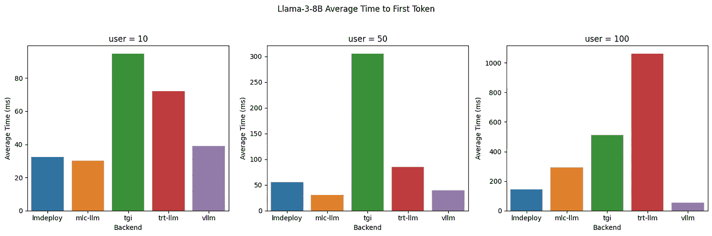
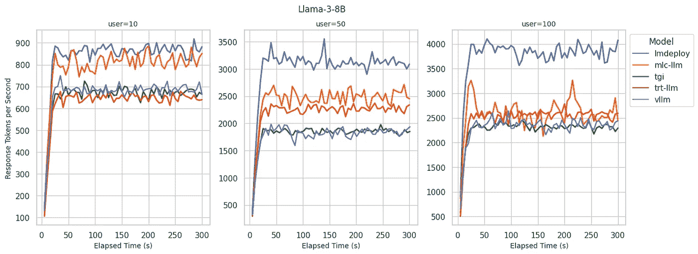
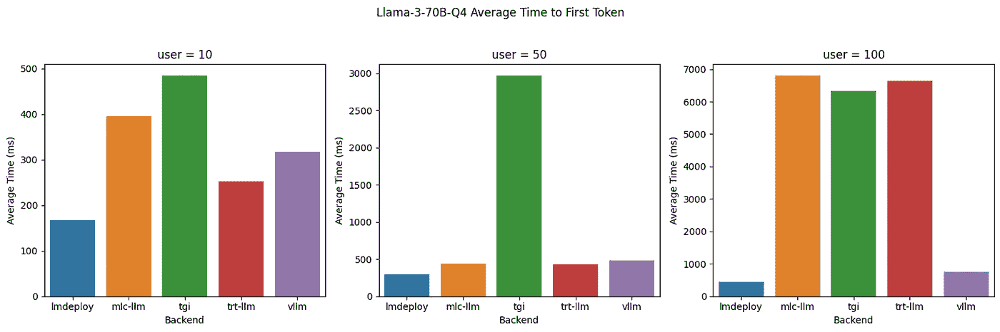
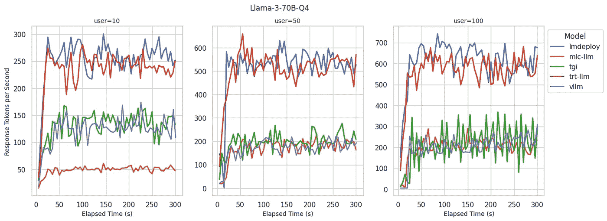

# 基准测试 LLM 推理后端

> 原文：[`towardsdatascience.com/benchmarking-llm-inference-backends-6c8ae46e72e4?source=collection_archive---------0-----------------------#2024-06-17`](https://towardsdatascience.com/benchmarking-llm-inference-backends-6c8ae46e72e4?source=collection_archive---------0-----------------------#2024-06-17)

## 比较 Llama 3 在 vLLM、LMDeploy、MLC-LLM、TensorRT-LLM 和 TGI 上的服务性能

 [Sean Sheng](https://medium.com/@ssheng?source=post_page---byline--6c8ae46e72e4--------------------------------)

·发表于 [Towards Data Science](https://towardsdatascience.com/?source=post_page---byline--6c8ae46e72e4--------------------------------) ·阅读时间 10 分钟 ·2024 年 6 月 17 日

--

为大语言模型（LLM）选择合适的推理后端至关重要。它不仅能确保通过快速生成速度提供最佳的用户体验，还能通过高令牌生成率和资源利用率提高成本效益。如今，开发人员有多种选择，可以选择由知名研究和行业团队创建的推理后端。然而，选择适合特定用例的最佳后端可能是一个挑战。

为了帮助开发人员做出明智的决策，[BentoML](https://bentoml.com/) 工程团队对 Llama 3 的服务性能进行了全面的基准测试，涉及的推理后端包括 [vLLM](https://github.com/vllm-project/vllm)、[LMDeploy](https://github.com/InternLM/lmdeploy)、[MLC-LLM](https://github.com/mlc-ai/mlc-llm)、[TensorRT-LLM](https://github.com/NVIDIA/TensorRT-LLM) 和 [Hugging Face TGI](https://github.com/huggingface/text-generation-inference)，测试是在 [BentoCloud](https://cloud.bentoml.com/) 上进行的。这些推理后端通过两个关键指标进行了评估：

+   **首次令牌生成时间 (TTFT)**：衡量从发送请求到生成第一个令牌所需的时间，单位为毫秒。TTFT 对于需要即时反馈的应用程序至关重要，例如互动聊天机器人。更低的延迟可以提高感知性能和用户满意度。

+   **令牌生成率**：评估模型在解码过程中每秒生成多少令牌，单位为令牌每秒。令牌生成率是模型处理高负载能力的指标。更高的生成率表明模型能够高效地处理多个请求并迅速生成响应，适用于高并发环境。

# 主要基准结果

我们在 BentoCloud 上的 A100 80GB GPU 实例（`gpu.a100.1x80`）上，使用 Llama 3 8B 和 70B 4 位量化模型进行基准测试，测试了三个不同的推理负载级别（10、50 和 100 个并发用户）。以下是我们的一些关键发现：

## Llama 3 8B

Llama 3 8B：不同后端的首个令牌时间（TTFT）

Llama 3 8B：不同后端的令牌生成速率

+   **LMDeploy**：在令牌生成速率方面提供了最佳的解码性能，对于 100 个用户，每秒最多可生成 4000 个令牌。对于 10 个用户，达到了业内最佳的 TTFT。尽管随着用户数量的增加，TTFT 逐渐上升，但它仍然保持在较低水平，并始终位居最佳行列。

+   **MLC-LLM**：在 10 个用户下提供了与 LMDeploy 相似的解码性能。对于 10 个和 50 个用户，达到了业内最佳的 TTFT。然而，在非常高的负载下，它难以保持这种效率。当并发用户数增加到 100 时，解码速度和 TTFT 未能跟上 LMDeploy 的表现。

+   **vLLM**：在所有并发用户级别上实现了业内最佳的 TTFT。但与 LMDeploy 和 MLC-LLM 相比，解码性能较差，令牌生成速率为每秒 2300-2500 个令牌，类似于 TGI 和 TRT-LLM。

## Llama 3 70B 4 位量化

Llama 3 70B Q4：不同后端的首个令牌时间（TTFT）

Llama 3 70B Q4：不同后端的令牌生成速率

+   **LMDeploy**：在服务 100 个用户时，提供了最佳的令牌生成速率，每秒最多可生成 700 个令牌，同时在所有并发用户级别中保持了最低的 TTFT。

+   **TensorRT-LLM**：在令牌生成速率方面展现出与 LMDeploy 相似的表现，并且在低并发用户数下维持了较低的 TTFT。然而，当并发用户数达到 100 时，TTFT 显著增加，超过了 6 秒。

+   **vLLM**：在所有并发用户级别下展现了一贯的低 TTFT，类似于我们在 8B 模型中观察到的情况。与 LMDeploy 和 TensorRT-LLM 相比，vLLM 的令牌生成速率较低，这可能是由于缺乏针对量化模型的推理优化。

我们发现令牌生成速率与推理后端实现的 GPU 利用率密切相关。能够维持高令牌生成速率的后端也表现出接近 100%的 GPU 利用率。相反，GPU 利用率较低的后端似乎在 Python 进程中存在瓶颈。

# 除了性能之外

在选择推理后端为 LLM 提供服务时，除了性能之外，其他因素也在决策中扮演着重要角色。以下列表突出了我们认为在选择理想推理后端时应考虑的关键维度。

## 量化

量化通过使用较低位数的整数表示权重，在性能和精度之间进行权衡。这种技术结合推理后端的优化，使得推理速度更快，并且占用更少的内存。因此，我们能够在单个 A100 80GB GPU 上加载 70B 参数的 Llama 3 模型的权重，而在没有量化的情况下，通常需要多个 GPU。

+   **LMDeploy**: 支持 4 位 AWQ、8 位量化和 4 位 KV 量化。

+   **vLLM**: 目前尚不完全支持。用户需要通过 AutoAWQ 对模型进行量化，或者在 Hugging Face 上找到预量化的模型。性能尚未优化。

+   **TensorRT-LLM**: [通过 modelopt 支持量化](https://github.com/NVIDIA/TensorRT-LLM/blob/main/examples/quantization/README.md#ptq-post-training-quantization)，请注意并非所有模型都实现了量化数据类型。

+   **TGI**: 支持 AWQ、GPTQ 和 bits-and-bytes 量化

+   **MLC-LLM**: 支持 3 位和 4 位分组量化。AWQ 量化支持仍处于实验阶段。

## 模型架构

能够在不同的模型架构之间使用相同的推理后端，为工程团队提供了灵活性。这使得他们可以随着新改进的出现，在各种大型语言模型之间切换，而无需迁移底层推理基础设施。

+   **LMDeploy**: [TurboMind 引擎支持的 20 多种模型](https://github.com/InternLM/lmdeploy/blob/main/docs/en/supported_models/supported_models.md)。目前，像 Mistral、Qwen 1.5 这样的需要滑动窗口注意力的模型尚不完全支持。

+   **vLLM**: [支持 30 多种模型](https://docs.vllm.ai/en/latest/models/supported_models.html)

+   **TensorRT-LLM**: [支持 30 多种模型](https://nvidia.github.io/TensorRT-LLM/reference/support-matrix.html)

+   **TGI**: [支持 20 多种模型](https://huggingface.co/docs/text-generation-inference/en/supported_models)

+   **MLC-LLM**: [支持 20 多种模型](https://github.com/mlc-ai/mlc-llm/tree/main/python/mlc_llm/model)

## 硬件限制

能够在不同的硬件上运行提供了成本节约，并且能够根据推理需求选择合适的硬件。同时，在当前 GPU 短缺的情况下，它也提供了替代方案，有效地帮助解决供应瓶颈问题。

+   **LMDeploy**: 仅针对 Nvidia CUDA 进行了优化

+   **vLLM**: 支持 Nvidia CUDA，AMD ROCm，AWS Neuron，CPU

+   **TensorRT-LLM**: 仅支持 Nvidia CUDA

+   **TGI**: Nvidia CUDA，AMD ROCm，Intel Gaudi，AWS Inferentia

+   **MLC-LLM**: 支持 Nvidia CUDA，AMD ROCm，Metal，Android，IOS，WebGPU

# 开发者体验

为生产环境设计的推理后端应提供稳定的版本发布，并便于简化的持续部署工作流。此外，开发者友好的后端应具有明确定义的接口，支持快速开发和高代码可维护性，这对于构建由大型语言模型（LLMs）驱动的 AI 应用至关重要。

+   **稳定版本**：LMDeploy、TensorRT-LLM、vLLM 和 TGI 都提供了稳定版本。MLC-LLM 目前没有稳定的标记版本，只有夜间构建版本；一种可能的解决方案是从源代码构建。

+   **模型编译**：TensorRT-LLM 和 MLC-LLM 在推理后端准备就绪之前，需要进行显式的模型编译步骤。这个步骤可能在部署时引入额外的冷启动延迟。

+   **文档**：LMDeploy、vLLM 和 TGI 都具有易于学习的文档和示例。MLC-LLM 的学习曲线适中，主要是因为需要理解模型编译步骤。TensorRT-LLM 是在我们的基准测试中设置最具挑战性的。由于缺乏足够的优质示例，我们不得不阅读 TensorRT-LLM、*tensorrtllm_backend*和 Triton Inference Server 的文档，转换检查点，构建 TRT 引擎，并编写大量配置。

# 概念

## Llama 3

[Llama 3](https://ai.meta.com/blog/meta-llama-3/)是 Llama LLM 系列的最新迭代，提供多种配置。我们在基准测试中使用了以下模型大小。

+   **8B**：该模型具有 80 亿个参数，使其在计算资源方面既强大又易于管理。使用 FP16 时，它大约需要 16GB 的内存（不包括 KV 缓存和其他开销），可以在单个 A100–80G GPU 实例上运行。

+   **70B 4 位量化**：该 70 亿参数模型经过 4 位量化后，显著减少了其内存占用。量化通过减少每个参数的位数来压缩模型，提供更快的推理速度，并在性能损失最小的情况下降低内存使用。使用 4 位 AWQ 量化时，加载模型权重大约需要 37GB 内存，可以在单个 A100–80G 实例上运行。在单个 GPU 设备上提供量化权重通常能够实现模型的最佳吞吐量，相较于在多个设备上提供。

## 推理平台

我们确保使用[BentoML](https://github.com/bentoml/BentoML)提供的推理后端相比原生 Python 推理仅增加了最小的性能开销。这个开销源于提供了用于扩展、可观察性和 IO 序列化的功能。使用 BentoML 和[BentoCloud](https://bentoml.com/)为不同的推理后端提供了统一的 RESTful API，简化了基准测试的设置和操作。

## 推理后端

不同的后端提供了多种服务 LLM 的方式，每种方式都有其独特的功能和优化技术。我们测试的所有推理后端都遵循 Apache 2.0 许可证。

+   [LMDeploy](https://github.com/InternLM/lmdeploy)：一个推理后端，专注于提供高解码速度和高效处理并发请求。它支持各种量化技术，适合部署具有较低内存要求的大型模型。

+   [vLLM](https://github.com/vllm-project/vllm)：一个高性能的推理引擎，专门优化用于服务 LLM。它因高效利用 GPU 资源和快速解码能力而闻名。

+   [TensorRT-LLM](https://github.com/NVIDIA/TensorRT-LLM)：一个推理后端，利用 NVIDIA 的 TensorRT，一个高性能的深度学习推理库。它优化了在 NVIDIA GPU 上运行大模型，提供快速推理并支持诸如量化等高级优化。

+   [Hugging Face 文本生成推理（TGI）](https://github.com/huggingface/text-generation-inference)：一个用于部署和服务 LLM 的工具包。它在 Hugging Face 的生产环境中用于驱动 Hugging Chat、推理 API 和推理端点。

+   [MLC-LLM](https://github.com/mlc-ai/mlc-llm)：一个为 LLM 量身定制的 ML 编译器和高性能部署引擎。它建立在 Apache TVM 之上，在服务模型之前需要进行编译和权重转换。

将 BentoML 与各种推理后端集成以自托管 LLM 是非常简单的。BentoML 社区在 GitHub 上提供了以下示例项目，帮助你完成整个过程。

+   vLLM: [`github.com/bentoml/BentoVLLM`](https://github.com/bentoml/BentoVLLM)

+   MLC-LLM: [`github.com/bentoml/BentoMLCLLM`](https://github.com/bentoml/BentoMLCLLM)

+   LMDeploy: [`github.com/bentoml/BentoLMDeploy`](https://github.com/bentoml/BentoLMDeploy)

+   TRT-LLM: [`github.com/bentoml/BentoTRTLLM`](https://github.com/bentoml/BentoTRTLLM)

+   TGI: [`github.com/bentoml/BentoTGI`](https://github.com/bentoml/BentoTGI)

# 基准测试设置

## 模型

我们测试了 Meta-Llama-3–8B-Instruct 和 Meta-Llama-3–70B-Instruct 的 4 位量化模型。对于 70B 模型，我们进行了 4 位量化，使其能够在单个 A100–80G GPU 上运行。如果推理后端支持原生量化，我们使用推理后端提供的量化方法。例如，对于 MLC-LLM，我们使用了`q4f16_1`量化方案。否则，我们使用了来自 Hugging Face 的 AWQ 量化`casperhansen/llama-3-70b-instruct-awq`模型。

请注意，除了启用常见的推理优化技术，如连续批处理、闪存注意力和前缀缓存外，我们没有为每个独立的后端微调推理配置（GPU 内存使用、最大序列数、分页 KV 缓存块大小等）。这是因为随着我们服务的 LLM 数量的增加，这种方法不可扩展。提供一组最优的推理参数是后端性能和易用性的隐性衡量标准。

## 基准客户端

为了准确评估不同 LLM 后端的性能，我们创建了一个自定义基准测试脚本。该脚本通过变化用户负载并在不同的并发级别下发送生成请求，模拟了实际场景。

我们的基准测试客户端可以在 20 秒内启动目标用户数量，之后通过发送带有随机选择提示词的并发生成请求来对 LLM 后端进行压力测试。我们测试了 10、50 和 100 个并发用户，以评估系统在不同负载下的表现。

每次压力测试持续 5 分钟，在此期间我们每隔 5 秒收集一次推理指标。这个持续时间足以观察到潜在的性能下降、资源利用瓶颈或其他在短时间测试中可能未能显现的问题。

欲了解更多信息，请参见[我们的基准测试客户端的源代码](https://github.com/bentoml/llm-bench)。

## 提示词数据集

我们测试的提示词来自[databricks-dolly-15k 数据集](https://github.com/bentoml/openllm-bench/blob/main/common.py#L294)。在每次测试会话中，我们从该数据集中随机选择提示词。我们还测试了有无系统提示词的文本生成。一些后端可能通过启用前缀缓存来优化常见的系统提示词场景。

## 库版本

+   **BentoML**: 1.2.16

+   **vLLM**: 0.4.2

+   **MLC-LLM**: mlc-llm-nightly-cu121 0.1.dev1251（尚无稳定版）

+   **LMDeploy**: 0.4.0

+   **TensorRT-LLM**: 0.9.0（与 Triton v24.04 一起使用）

+   **TGI**: 2.0.4

## 推荐

LLM 推理优化领域正在迅速发展并且受到广泛研究。今天可用的最佳推理后端可能很快会被新兴技术所超越。根据我们在撰写时进行的基准测试和可用性研究，我们有以下建议，帮助选择在各种场景下最适合 Llama 3 模型的后端。

## Llama 3 8B

对于 Llama 3 8B 模型，**LMDeploy**在所有用户负载下始终提供低 TTFT 和最高的解码速度。其易用性也是一个显著优势，因为它可以即时将模型转换为 TurboMind 引擎格式，从而简化部署过程。在撰写时，LMDeploy 对使用滑动窗口注意力机制的模型（如 Mistral 和 Qwen 1.5）支持有限。

**vLLM**即使在用户负载增加的情况下，也始终保持较低的 TTFT，适合需要保持低延迟的场景。vLLM 提供了易于集成、广泛的模型支持和广泛的硬件兼容性，所有这些都得到强大的开源社区的支持。

**MLC-LLM**提供了最低的 TTFT，并在较低的并发用户情况下维持较高的解码速度。然而，在极高用户负载下，MLC-LLM 在维持顶级解码性能方面表现较差。尽管面临这些挑战，MLC-LLM 凭借其机器学习编译技术展现出巨大的潜力。如果能够解决这些性能问题并实施稳定的版本发布，将极大提升其效能。

## Llama 3 70B 4 位量化

对于 Llama 3 70B Q4 模型，**LMDeploy**在所有用户负载下展现了卓越的性能，具有最低的 TTFT。它还保持了较高的解码速度，适用于低延迟和高吞吐量都至关重要的应用场景。LMDeploy 还以其易用性脱颖而出，因为它能够快速转换模型，无需大量的设置或编译，非常适合快速部署场景。

**TensorRT-LLM**在吞吐量上与 LMDeploy 相匹配，但在高用户负载场景下，其 TTFT 延迟表现不如预期。得益于 Nvidia 的支持，我们预计这些差距将会得到迅速解决。然而，它对模型编译的固有需求以及对 Nvidia CUDA GPU 的依赖是有意的设计选择，这在部署过程中可能会带来一些限制。

**vLLM**即使在用户负载增加的情况下，也能保持较低的 TTFT，其易用性对许多用户来说是一个显著的优势。然而，在撰写本文时，后端缺乏对 AWQ 量化的优化，导致量化模型的解码性能不尽如人意。

# 致谢

本文及相关基准测试是与我尊敬的同事 Rick Zhou、Larme Zhao 和 Bo Jiang 共同合作完成的。本文中展示的所有图片均由作者创作。
