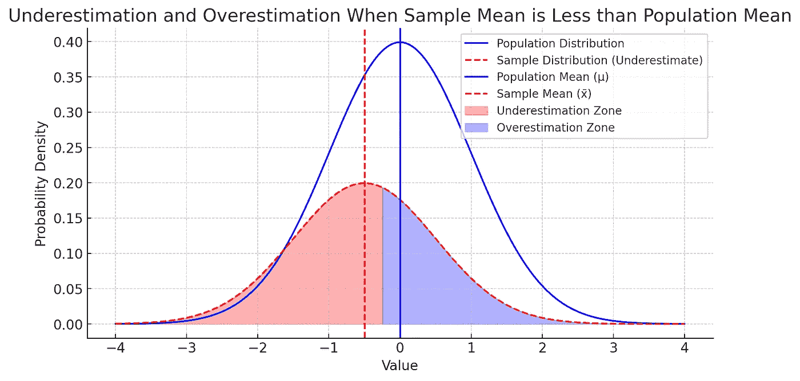
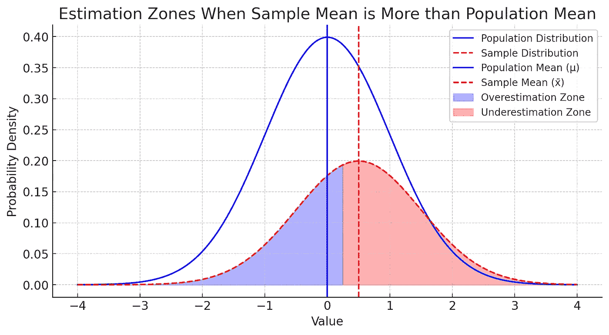
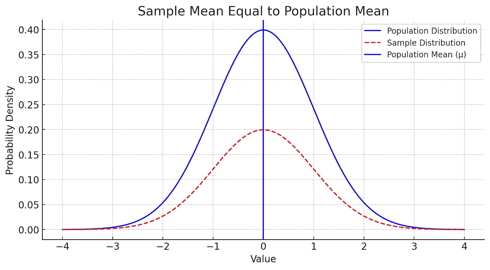

# 贝塞尔修正：为什么在样本方差中我们除以 n−1 而不是 n？

> 原文：[`towardsdatascience.com/bessels-correction-why-do-we-divide-by-n-1-instead-of-n-in-sample-variance-30b074503bd9?source=collection_archive---------1-----------------------#2024-11-11`](https://towardsdatascience.com/bessels-correction-why-do-we-divide-by-n-1-instead-of-n-in-sample-variance-30b074503bd9?source=collection_archive---------1-----------------------#2024-11-11)

## 理解总体方差的无偏估计

 [Aman Agrawal](https://medium.com/@amannagrawall002?source=post_page---byline--30b074503bd9--------------------------------)

·发表于 [Towards Data Science](https://towardsdatascience.com/?source=post_page---byline--30b074503bd9--------------------------------) ·阅读时间 8 分钟 ·2024 年 11 月 11 日

--

在统计学中，许多学习者常常困惑的一个问题是，为什么在计算样本方差时要除以 n−1，而不是直接使用样本中的观察数 n。这个选择看起来很小，但它是一个重要的调整，用来修正从样本估计总体方差时出现的自然偏差。我们用简单的语言通过一些例子来讲解，为什么除以 n−1（称为贝塞尔修正）是必要的。

贝塞尔修正的核心概念是我们倾向于修正我们的估计，但一个明确的问题是，我们估计的是什么？因此，通过应用贝塞尔修正，我们倾向于修正从假设的样本均值计算出的偏差估计值，而我们的假设样本均值很少与实际的总体均值完全一致，因此可以安全假设，在 99.99%的情况下（在实际中甚至更多），我们的样本均值不会等于总体均值。我们所有的计算都是基于这个假设的样本均值进行的，即我们通过该样本的均值来估计总体参数。

继续阅读博客下文，你会直观地明白为什么在所有 99.99%的情况下（除了那个样本均值=总体均值的情况），我们倾向于低估实际偏差，因此为了弥补这个低估误差，除以比’n’更小的数就能解决问题，因此除以 n-1 而不是 n，正是为了弥补在计算样本均值偏差时的低估。

*从这里开始阅读，你最终会理解……*

# 样本方差与总体方差

当我们拥有整个数据总体时，方差是通过首先计算均值（平均值），然后确定每个数据点偏离该均值的程度，平方这些偏差，求和，最后除以 n（总体中的数据点总数）来计算的。这给我们的是**总体方差**。

然而，如果我们没有整个总体的数据，而是仅仅使用一个样本，我们需要估算总体方差。但问题在于：当只使用样本时，我们不知道真实的总体均值（记作μ），所以我们使用**样本均值**（x_bar）代替。

# 低估问题

要理解为什么在样本情况下我们除以 n−1，我们需要仔细观察使用样本均值而非总体均值时会发生什么。对于实际应用来说，依赖样本统计是我们唯一的选择。下面是其工作原理：

当我们计算样本方差时，我们会找到每个数据点与样本均值的偏差，平方这些偏差，然后取这些平方偏差的平均值。然而，样本均值通常不等于总体均值。由于这种差异，使用样本均值倾向于**低估**总体的实际分布或方差。

让我们通过所有可能发生的情况（共三种不同情况）来分析，我会详细讲解第一种情况，其他两种情况遵循相同的原理，详细解析已给出第一种情况。

## 1\. 当样本均值小于总体均值（x_bar < 总体均值）

如果我们的样本均值（x_bar）小于总体均值（μ），那么样本中的许多数据点将比它们距离μ更接近 x_bar。因此，距离（偏差）均值的距离平均来说会更小，从而导致更小的方差计算。这意味着我们低估了实际的方差。

以下图的解释——较小的正态分布是我们的样本，而较大的正态分布是我们的总体（在上面的情况中，x_bar < 总体均值），图形如下所示。

由于我们只能收集样本中的数据点，无法收集总体的所有数据点，因为那是不可能的。在我们的样本数据点中，从负无穷大到 x_bar 和总体均值的中点，样本点与总体均值之间的绝对差异或平方差（偏差）会大于样本点与样本均值之间的绝对差异或平方差，在中点右侧直到正无穷大，基于样本均值计算的偏差会大于基于总体均值计算的偏差。下图显示了上述情况的区域，由于正态曲线的对称性，我们可以肯定地说，低估区间会大于高估区间，这也在下图中得到了突出显示，这导致偏差的总体低估。

因此，为了弥补低估，我们将偏差除以一个小于样本大小 ’n’ 的数字，即 ‘n-1’，这被称为贝塞尔修正。

由 Python 代码使用 matplotlib 库生成的图，图片来源（作者）

## 2\. 当样本均值大于总体均值时

如果样本均值大于总体均值，我们会遇到相反的情况：样本中较低端的数据点会比 μ 更接近 x_bar，仍然导致方差的低估。

基于以上的细节，很明显在这种情况下，低估区间也大于高估区间，因此我们在这种情况下也会通过将偏差除以 ‘n-1’ 而不是 n 来弥补这种低估。

由 Python 代码使用 matplotlib 库生成的图，图片来源（作者）

## 3\. 当样本均值与总体均值完全相等时（0.000001%）

这种情况比较少见，只有当样本均值与总体均值完全对齐时，我们的估计才是无偏的。然而，这种对齐几乎从未偶然发生，因此我们通常假设我们在低估。

显然，计算的样本点相对于样本均值的偏差与计算的相对于总体均值的偏差完全相同，因为样本均值和总体均值是相等的。这将不会产生低估或高估区间。

由 Python 代码使用 matplotlib 库生成的图，图片来源（作者）

总之，任何样本均值 x_bar 和总体均值 μ 之间的差异（几乎总是发生的）都会导致我们低估方差。这就是为什么我们需要通过除以 n−1 来进行修正，以弥补这种偏差。

# 为什么除以 n−1 可以纠正这种偏差：贝塞尔修正

除以 n−1 称为**贝塞尔修正**，它补偿了样本方差中自然的低估偏差。当我们除以 n−1 时，实际上是在做一个小的调整，使我们的方差估计更接近真实的总体方差。

这一切也可以与自由度相关联，从自由度的角度理解这些知识是需要一定自由度知识的。

在样本中，一个自由度被“消耗”用于计算样本均值。这使得我们只剩下 n−1 个独立的数据点来提供关于方差的信息，这也是为什么我们要用 n−1 而不是 n 来除。

# 为什么这种调整在小样本中更为重要？

如果我们的样本量非常小，除以 n 与除以 n−1 之间的差异会变得更加显著。例如，如果你的样本量是 10：

+   如果除以 n，意味着除以 10，这样可能会大大低估方差。

+   除以 n−1 或 9，能够提供更好的估计，弥补小样本带来的偏差。

但是如果你的样本量很大（比如 10,000），除以 10,000 或 9,999 的差异微乎其微，因此贝塞尔修正的影响也就非常小。

# 不使用贝塞尔修正的后果

如果我们不使用贝塞尔修正，我们的样本方差通常会低估总体方差。这可能会产生连锁反应，尤其是在统计建模和假设检验中，准确的方差估计对于得出可靠结论至关重要。

例如：

+   **置信区间**：方差估计会影响围绕样本均值的置信区间宽度。低估方差可能导致置信区间过窄，从而给人一种过于精确的错误印象。

+   **假设检验**：许多统计检验，如 t 检验，依赖于准确的方差估计来确定观察到的效应是否显著。低估方差可能会让我们更难发现真正的差异。

# 为什么不除以 n−2 或 n−3？

选择除以 n−1 并非随意。虽然我们这里不会深入证明，但这一选择是基于数学理论的。从样本计算总体方差时，除以 n−1 能够提供无偏的估计。其他调整，比如 n−2，会过度修正并导致方差的高估。

# 一个实际的例子来说明贝塞尔修正

假设你有一个小的群体，平均体重为 70 公斤。现在假设你从这个群体中抽取了 5 个人作为样本，他们的体重（单位：公斤）分别是 68、69、70、71 和 72。样本均值恰好是 70 公斤——与总体均值完全一致，这是巧合。

现在假设我们计算方差：

1.  如果不使用贝塞尔修正：我们将把平方偏差的总和除以 n=5。

1.  使用贝塞尔修正时：我们除以 n−1=4。

以这种方式使用贝塞尔修正会稍微增加我们对方差的估计，使其更接近如果我们从整个总体计算方差时的值，而不是仅仅从样本中计算。

# 结论

在计算样本方差时使用 n−1 进行除法，可能看起来只是一个小变化，但它对于获得无偏的总体方差估计至关重要。这个调整，即贝塞尔修正，弥补了由于依赖样本均值而不是总体均值导致的低估问题。

总结：

+   使用 n−1 补偿了我们基于样本均值计算方差的事实，而样本均值往往低估了真实的变异性。

+   当样本量较小时，贝塞尔修正尤为重要，因为直接用 n 除法会显著扭曲方差估计。

+   这一做法是统计学中的基础，影响从置信区间到假设检验的各个方面，是可靠数据分析的基石。

通过理解和应用贝塞尔修正，我们确保我们的统计分析能够反映我们研究数据的真实特征，从而得出更准确、更可信的结论。
