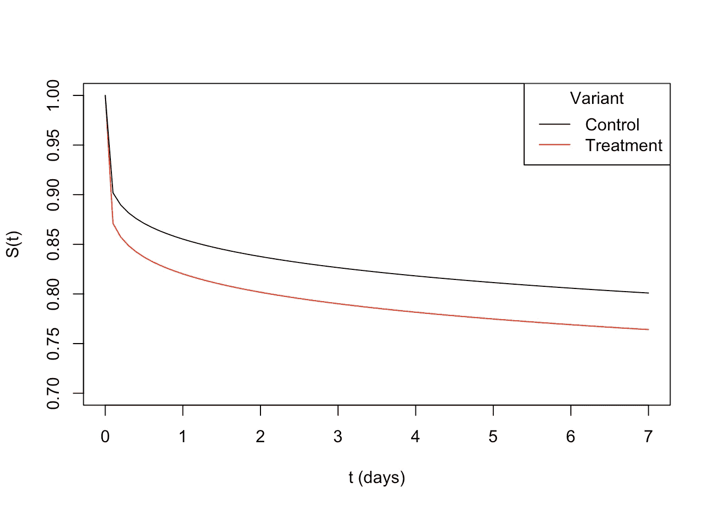
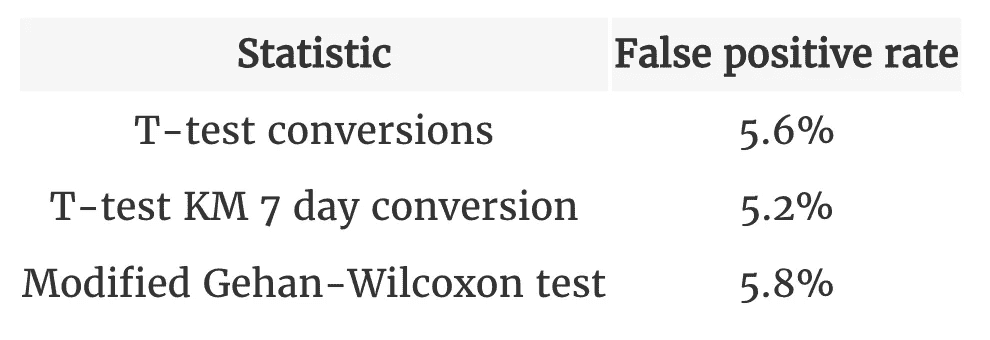
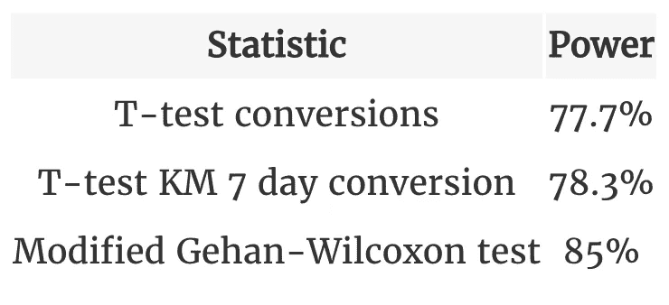

# 使用生存分析改善 A/B 测试

> 原文：[`towardsdatascience.com/better-a-b-testing-with-survival-analysis-6205c3a2dc51?source=collection_archive---------12-----------------------#2024-07-31`](https://towardsdatascience.com/better-a-b-testing-with-survival-analysis-6205c3a2dc51?source=collection_archive---------12-----------------------#2024-07-31)

## *进行实验时——别忘了带上你的生存工具包*

[](https://iyarlin.medium.com/?source=post_page---byline--6205c3a2dc51--------------------------------)[](https://towardsdatascience.com/?source=post_page---byline--6205c3a2dc51--------------------------------) [Iyar Lin](https://iyarlin.medium.com/?source=post_page---byline--6205c3a2dc51--------------------------------)

·发布于 [Towards Data Science](https://towardsdatascience.com/?source=post_page---byline--6205c3a2dc51--------------------------------) ·阅读时间：5 分钟·2024 年 7 月 31 日

--


图片来源：作者，使用 DALL-E 3

我在几篇博客中已经阐述过这个观点（[这里](https://iyarlin.github.io/2022/06/08/better_churn_modeling/)、[这里](https://iyarlin.github.io/2022/10/31/better_churn_modeling_part_2/) 和 [这里](https://www.linkedin.com/pulse/better-churn-prediction-part-3-iyar-lin-ov5af/)），即使用生存分析可以改善流失预测。

在这篇博客中，我将展示生存分析如何在常见的实践中发挥作用的另一个案例：A/B 测试！

# 常见 A/B 测试实践中的问题

通常在进行 A/B 测试时，分析师会将用户随机分配到不同的变体，并根据每个变体中的转化数量与用户数量的比例来衡量转化率。刚进入测试的用户和在测试中已有两周的用户会被赋予相同的权重。

这种方法对于那些在分配到变体后短时间内发生转化或不发生转化的情况（例如完成入职流程）是足够的。

然而，很多时候转化是分布在较长的时间框架内。例如，第一次访问网站着陆页后的首次订单。这样的转化可能在几分钟内发生，但很大一部分可能会在首次访问后几天发生。

在这种情况下，业务 KPI 通常会被“限定”在某个特定的时间段内——例如，“7 天内的转化”或“1 个月内的流失”。

在这些情况下，不考虑时间因素地衡量转化率有两个主要缺陷：

1.  它使我们所测量的统计量变得难以理解——任何时间点的平均转换率无法转换为任何有界的度量。事实上，随着测试的继续，转换率将会增加，仅仅是因为用户有更多的时间进行转换。因此，实验结果将难以与业务 KPI 关联。

1.  它丢弃了可能影响结果的时间信息，相比于考虑了转换时间的其他方法，这可能导致功效降低。

为了展示第 2 点，我们将运行一个小的模拟研究

我们将让用户在 30 天内随机加入实验。用户的转换时间将从 Weibull 分布中模拟，规模参数𝜎=30,000，控制组的𝛼_ctrl=0.18，处理组的𝛼_trt=0.157。

下面是对应的生存曲线：

```py
alpha_ctrl <- 0.18 
alpha_trt <- 0.157 
sigma <- 30000 
conv_7d_ctrl <- format_pct(pweibull(7, alpha_ctrl, sigma)) 
conv_7d_trt <- format_pct(pweibull(7, alpha_trt, sigma)) 
t <- seq(0, 7, 0.1) 
surv_ctrl <- 1 - pweibull(t, alpha_ctrl, sigma) 
surv_trt <- 1 - pweibull(t, alpha_trt, sigma) 
plot(t, surv_trt, type = "line", col = "red", ylab = "S(t)", xlab = "t (days)",
  ylim = c(0.7, 1)) lines(t, surv_ctrl, col = "black") 
legend("topright", col = c("black", "red"), 
  legend = c("Control", "Treatment"), lty = 1, title = "Variant" )
```



图片来源：作者

假设我们关注的是 7 天内的转换，控制组的真实（未知）转换率为 19.9%，而处理组的转换率为 23.6%。

下面是生成模拟数据的函数：

```py
n <- 2000 
test_duration <- 30 
gen_surv_data <- function(m, alpha){ 
  set.seed(m) 
  tstart <- runif(n, 0, test_duration) 
  tconvert <- rweibull(n, alpha, sigma) 
  status <- as.integer(tstart + tconvert < test_duration) 
  tstatus <- ifelse(status == 0, test_duration - tstart, tconvert) 
  return(data.frame(tstatus=tstatus, status=status)) 
}
```

为了展示在 A/B 测试中使用生存分析的好处，我们将比较 3 种检验统计量的功效：

1.  转换的 T 检验（常见程序）

1.  基于 7 天转换的 T 检验（使用 Kaplan-Meier 曲线估算）

1.  Peto & Peto 修改版的 Gehan-Wilcoxon 检验

下面是实现上述内容的代码：

```py
run_simulation <- function(m, alpha1, alpha2){ 
  data_1 <- gen_surv_data(m, alpha1) 
  data_2 <- gen_surv_data(m+1, alpha2) 
  # T-test on conversions (the common procedure): 
  p1_hat <- mean(data_1$status) 
  p1_var <- p1_hat*(1-p1_hat)/length(data_1$status) 
  p2_hat <- mean(data_2$status) 
  p2_var <- p2_hat*(1-p2_hat)/length(data_2$status) 
  stat <- abs(p2_hat - p1_hat)/sqrt(p1_var + p2_var) 
  ans1 <- pnorm(stat, lower.tail = F)*2 
  # T-test on 7 day conversion (estimated using a Kaplan-Meier curve): 
  data_1$variant <- "control" 
  data_2$variant <- "treatment" 
  surv_data <- rbind(data_1, data_2) 
  surv_model <- summary(survfit(Surv(tstatus, status)~variant, 
    data = surv_data), times = 7, extend = T) 
  p1_hat <- 1 - surv_model$surv[1] 
  p1_var <- surv_model$std.err[1]² 
  p2_hat <- 1 - surv_model$surv[2] 
  p2_var <- surv_model$std.err[2]² 
  stat <- abs(p2_hat - p1_hat)/sqrt(p1_var + p2_var) 
  ans2 <- pnorm(stat, lower.tail = F)*2 
  # Peto & Peto modification of the Gehan-Wilcoxon test: 
  mgw_test <- survdiff(Surv(tstatus, status)~variant, data = surv_data, 
    rho = 1) 
  ans3 <- mgw_test$pvalue 
  return(data.frame(
    `T-test conversions` = ans1, 
    `T-test KM 7 day conversion` = ans2, 
    `Modified Gehan-Wilcoxon test` = ans3, check.names = F)) 
}
```

在衡量功效之前，我们需要验证我们的统计量在两个变体转换率相同的情况下，是否满足期望的假阳性率𝛼=0.05（5%）：

```py
alpha <- 0.05 
M <- 500 
res <- Reduce("rbind", lapply(1:M, function(m) 
  run_simulation(m, alpha_ctrl, alpha_ctrl))) 
res <- data.frame(Statistic = names(res), 
  `False positive rate` = format_pct(sapply(res, function(x) mean(x<=alpha))), 
  check.names = F, row.names = NULL) 
knitr::kable(res, align = "c")
```



图片来源：作者

接下来，我们来检查功效：

```py
M <- 2000 
res <- Reduce("rbind", lapply(1:M, function(m) 
  run_simulation(m, alpha_ctrl, alpha_trt))) 
res <- data.frame(
  Statistic = names(res), 
  Power = sapply(res, function(x) mean(x<=alpha)), 
  check.names = F, row.names = NULL) 
uplift_logrank <- format_pct((res[3,2] - res[1,2])/res[1,2]) 
uplift_km <- format_pct((res[2,2] - res[1,2])/res[1,2]) 
res$Power <- format_pct(res$Power) knitr::kable(res, align = "c")
```



图片来源：作者

虽然基于 Kaplan-Meier 曲线的 7 天转换 T 检验比常规的转换 T 检验（常见程序）更能与业务 KPI 相关，但其功效提升仅为边际性。

另一方面，修改版的 Gehan-Wilcoxon 统计量显著提升了功效，同时仅与业务 KPI（如常规的转换 T 检验）有较弱的相关性。

需要注意的是，功效提升的程度会根据在生存曲线上比较的点、实际的生存曲线形状、实验持续时间等因素有所不同。

在未来的文章中，我希望在更广泛的场景和测试统计量下进一步探讨这个话题（R 的[ComparisonSurv](https://cran.r-project.org/web/packages/ComparisonSurv/index.html?trk=article-ssr-frontend-pulse_little-text-block)包看起来很有前景）。

在进行 A/B 测试时，如果转换时间有所不同——通常应用生存分析以利用时间维度是非常有用的。可以比较生存曲线上的某个兴趣点，使结果能够直接与业务 KPI 相关，或者使用修改版的 Gehan-Wilcoxon 统计量以提高功效。

*最初发布于* [*https://www.linkedin.com*](https://www.linkedin.com/pulse/better-ab-testing-survival-analysis-iyar-lin-o5cpf/?trackingId=fH3Lxwa%2FSEGg4WIp6DBomQ%3D%3D)*.*
