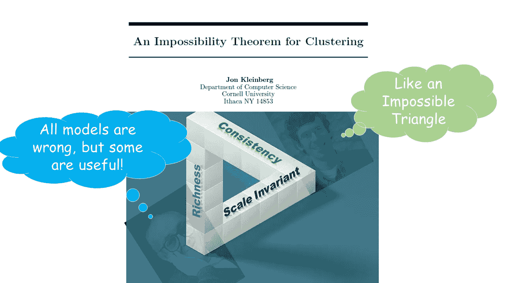

# 超越 Kleinberg 的聚类不可能定理：我对一个务实的聚类评估框架的学习笔记

> 原文：[`towardsdatascience.com/beyond-kleinbergs-impossibility-theorem-of-clustering-a-pragmatic-clustering-evaluation-framework-3b25eccf37f2?source=collection_archive---------10-----------------------#2024-06-21`](https://towardsdatascience.com/beyond-kleinbergs-impossibility-theorem-of-clustering-a-pragmatic-clustering-evaluation-framework-3b25eccf37f2?source=collection_archive---------10-----------------------#2024-06-21)

## 本文探讨了在 Kleinberg 聚类不可能定理约束下的务实聚类评估框架

 [Michio Suginoo](https://deeporigami.medium.com/?source=post_page---byline--3b25eccf37f2--------------------------------)

·发表于[Towards Data Science](https://towardsdatascience.com/?source=post_page---byline--3b25eccf37f2--------------------------------)·12 分钟阅读·2024 年 6 月 21 日

--

由作者处理

在他 2002 年发表的论文“**聚类的不可能定理**”中，Jon Kleinberg 阐述了没有任何聚类模型可以同时满足聚类的三个理想公理：尺度不变性、丰富性和一致性。（Kleinberg, 2002）

那三个公理是什么意思？这里是对这三个公理的解释。

+   *尺度不变*意味着：聚类算法应该在所有数据点之间的距离按一个常数因子缩放时，生成相同的结果。

+   丰富性意味着：聚类算法应该展示出高效能，能够生成给定数据集的所有可能划分。

+   一致性意味着：当我们通过增加类间距离并减少类内距离来增强一组聚类时，聚类算法应该生成相同的结果。

长话短说，Kleinberg 证明了一个数学上令人满意的聚类算法是不存在的。

对于一些理论主义者来说，这可能是聚类分析的（或许是）死亡宣判。

尽管如此，我遇到了一篇挑战克莱因伯格“不可能定理”有效性的学术论文。我不会进入那个领域。但如果你对这个话题感兴趣，给你这里：“[*关于克莱因伯格的聚类公理与 k-means 聚类算法行为之间的差异*](https://arxiv.org/pdf/1702.04577)。”

无论真实情况如何，自从克莱因伯格发布了他的“不可能定理”以来，许多来自工程学领域的方法（例如应用数学、信息理论等）被提出用于聚类评估。

追求务实主义，填补理论/科学限制与实际功能之间的空白，这是工程学的领域。

事实上，似乎没有任何普遍接受的科学理论能够解释为什么飞机能够飞行。这里有一篇关于此的[文章](https://www.scientificamerican.com/video/no-one-can-explain-why-planes-stay-in-the-air/)。在缺乏科学理论的情况下，凭借工程学的艺术，我已顺利完成了许多次飞行。

由[博物馆维多利亚](https://unsplash.com/@museumsvictoria?utm_source=medium&utm_medium=referral)拍摄，[来自 Unsplash](https://unsplash.com/?utm_source=medium&utm_medium=referral)

在欣赏工程务实精神时，我需要一个合理的框架来填补克莱因伯格“不可能定理”和我们日常聚类分析实践应用之间的空白。

如果飞机能够在没有普遍接受的科学理论的情况下飞行，那么我们也可以进行聚类！

也许……为什么不呢！

说起来容易做起来难，在克莱因伯格的“不可能定理”下：

+   我们如何评估聚类算法的结果？

+   我们如何选择最适合给定目标的算法？

对这些非常简单问题的全面理解仍然难以捉摸，至少对我而言是如此。

在这种背景下，我遇到了一篇由 Palacio-Niño 和 Berzal（2019）撰写的论文，“[*无监督学习算法的评估指标*](https://arxiv.org/abs/1905.05667)”，在其中他们概述了一个聚类验证框架，试图在“无法定理”提出的数学限制下，更好地评估聚类性能的质量。是的，他们在制定框架时非常清楚克莱因伯格的“不可能定理”。

为了促进我们对聚类算法的务实使用，我认为在这篇文章中分享我关于务实评估框架的学习笔记会是建设性的。

由于这是我的笔记，在其中我根据个人需求进行了许多修改，偏离了 Palacio-Niño 和 Berzal 所写论文的细节。此外，因为本文更多的是打算勾画出所提出的聚类验证框架的整体结构，并未深入细节。如果你愿意，可以阅读[他们原始论文的全文](https://arxiv.org/abs/1905.05667)，以填补我文章与他们原始论文之间的空白。

作为最后的预防措施，我并不声称这是一个全面的或标准的聚类验证框架指南。但我希望聚类分析的新手能将其作为一个有用的指南，帮助他们构建自己的聚类验证框架。

不多，也不少。

现在，让我们开始吧。

# ***聚类验证的整体框架***

这是它们框架的结构。我们可以看到四个验证阶段：

+   初步评估，

+   内部验证，

+   外部验证，

+   相对验证。

让我们逐一检查它们。

## *1\. 初步评估：*

这个过程的目标只是简单地确认数据集中的簇的存在。

这个过程应用了假设检验框架来评估数据集中是否存在聚类倾向。此过程设定了零假设，即数据集是纯随机的，因此数据集中没有聚类倾向。

由于假设检验可以视为一个独立的主题，我将从本文中将其单独剔除。

## *2\. 内部验证或无监督验证*

内部验证的目标是仅基于给定数据集评估聚类结构的质量，而不使用任何关于真实标签的外部信息。换句话说，当我们没有任何关于真实标签的高级知识时，内部验证是唯一的选择。

聚类内部验证的典型目标是发现那些最大化簇内相似度并最小化簇间相似度的簇。为此，设计了内部标准来衡量簇内相似度和簇间离散度。简单！

话虽如此，有一个问题：

“*在内部标准上的良好评分不一定能转化为在应用中的良好效果。*”（Manning 等，2008）

在内部标准上得分更高并不一定能保证结果模型的更好效果。内部验证是不够的！

那么，我们该怎么做呢？

这正是我们确实需要外部验证的原因。

## 3\. 外部验证或监督验证

与内部验证相比，外部验证需要外部类别标签：理想情况下是地面真实标签，如果没有，可能是其代表性替代。因为我们使用无监督聚类算法的第一个原因是因为我们根本不知道标签，外部验证的概念看起来荒谬、矛盾，或者至少是违反直觉的。

然而，当我们有关于类别标签的外部信息时 — 例如来自基准模型或黄金标准模型的一组结果 — 我们可以实施外部验证。

因为我们使用参考类别标签进行验证，外部验证的目标自然会收敛到监督分类分析的一般验证框架。

在更广泛的范围内，这个类别包括模型选择和人类判断。

## 4\. 相对验证：

接下来，相对验证。

这里是相对验证的示例。

特别是对于分区聚类（例如 K-Means）类别，确定簇的数量是确定算法配置的重要起点，因为这会实质性地影响聚类结果。

换句话说，对于这类聚类算法，簇的数量是算法的一个超参数。在这种情况下，簇的数量需要从算法参数的角度进行优化。

这里的问题是优化需要与决定算法配置的其他超参数同时实施。

它需要比较来了解一组超参数设置如何影响算法配置。这种相对验证通常在参数优化领域内处理。由于机器学习算法的参数优化是机器学习培训（模型开发）的一个重要主题，我将在本文中将其搁置。

到目前为止，我们对他们的验证框架的整体概况有了一个公平的了解。

接下来，一个相关的问题是“我们应该为每个验证使用什么样的度量标准？”

在这种情况下，我收集了一些度量标准作为内部验证和下一节外部验证的示例。

# 用于内部和外部验证的度量标准

现在，让我们专注于内部验证和外部验证。下面，我将列出我选择的一些度量标准，并提供超链接，您可以在其中详细了解它们的定义和公式。

由于我不会涵盖这些度量标准的公式，建议读者点击下面提供的超链接查找！

## A. 用于内部验证的度量标准

内部验证的目标是仅基于给定数据集建立聚类结构的质量。

*内部评估方法分类：*

内部验证方法可以根据聚类方法的类别进行分类。聚类的典型分类可以如下表述：

+   划分方法（例如：K-means），

+   分层方法（例如：聚合聚类），

+   密度基方法（例如：DBSCAN），以及

+   其余部分

这里，我介绍前两种方法：划分聚类和层次聚类。

***a) 划分方法：例如 K-means***

对于划分方法，评估度量的三个基础是：凝聚力、分离度及其混合。

*凝聚力：*

凝聚力评估簇内数据结构的紧密程度。凝聚力度量值越低，聚类质量越好。凝聚力度量的一个例子是：

+   SSW：簇内平方误差之和。

*分离度：*

分离度是一个簇间度量，评估簇间数据结构的离散程度。分离度度量的核心思想是最大化簇之间的距离。凝聚力度量的一个例子是：

+   SSB：簇间平方误差之和。

*凝聚力和分离度的混合：*

混合类型度量在一个度量中量化了分离度和凝聚力的水平。以下是一些例子：

i) [轮廓系数](https://scikit-learn.org/stable/modules/generated/sklearn.metrics.silhouette_score.html)：范围为[-1, 1]

该度量是邻近簇之间的簇间距离的相对度量。

这是该度量的一般解释：

+   最佳值：1

+   最差值：-1。

+   值接近 0：簇重叠。

+   负值：样本被分配到错误簇的可能性较高。

这是该度量的一个使用案例：[`www.geeksforgeeks.org/silhouette-index-cluster-validity-index-set-2/?ref=ml_lbp`](https://www.geeksforgeeks.org/silhouette-index-cluster-validity-index-set-2/?ref=ml_lbp)

ii) [Calinski-Harabasz 系数](https://scikit-learn.org/stable/modules/generated/sklearn.metrics.calinski_harabasz_score.html)：

该度量也被称为方差比准则，衡量所有簇的簇间离散度与簇内离散度的比率。

对于给定的簇分配，度量值越高，聚类结果越好：因为较高的值表示结果簇紧凑且分离良好。

这是该度量的一个使用案例：[`www.geeksforgeeks.org/dunn-index-and-db-index-cluster-validity-indices-set-1/?ref=ml_lbp`](https://www.geeksforgeeks.org/dunn-index-and-db-index-cluster-validity-indices-set-1/?ref=ml_lbp)

iii) [Dunn 指数](https://github.com/jqmviegas/jqm_cvi/tree/master)：

对于给定的簇分配，较高的 Dunn 指数表示更好的聚类效果。

这里有一个该指标的使用案例：[`www.geeksforgeeks.org/dunn-index-and-db-index-cluster-validity-indices-set-1/?ref=ml_lbp`](https://www.geeksforgeeks.org/dunn-index-and-db-index-cluster-validity-indices-set-1/?ref=ml_lbp)

iv) [Davies Bouldin Score](https://scikit-learn.org/stable/modules/generated/sklearn.metrics.davies_bouldin_score.html#sklearn.metrics.davies_bouldin_score):

该指标衡量了簇内相似性与簇间相似性的比例。从逻辑上讲，较高的指标值意味着簇内结构更加密集，簇间结构更加分离，因此聚类结果更好。

这里有一个该指标的使用案例：[`www.geeksforgeeks.org/davies-bouldin-index/`](https://www.geeksforgeeks.org/davies-bouldin-index/)

***b) 层次方法：例如凝聚聚类算法***

i) 基于树状图的可视化表示进行人工判断。

尽管 Palacio-Niño 和 Berzal 没有包括人工判断，但它仍然是基于树状图的层次聚类内部验证最有用的工具之一。

相反，合著者列出了以下两个专门用于评估层次聚类结果的相关系数指标。

对于这两个指标，它们的较高值表示更好的结果。两者的取值范围在[-1, 1]之间。

ii) [共现相关系数](https://docs.scipy.org/doc/scipy/reference/generated/scipy.cluster.hierarchy.cophenet.html)（CPCC）：[-1, 1]

它衡量由联接定义的层次聚类中观测值之间的距离。

iii) Hubert 统计量：[-1, 1]

更高的 Hubert 值对应着更好的数据聚类效果。

***c) 潜在类别：自监督学习***

自监督学习可以生成用于聚类的特征表示。自监督学习的数据集没有明确的标签，而是使用输入数据本身作为学习的标签。Palacio-Niño 和 Berzal 没有在这一部分中包括自监督框架，如自编码器和生成对抗网络（GANs）。嗯，它们本身不是聚类算法。尽管如此，我会将这个特定领域暂时留待我的笔记。时间会证明这个领域是否会出现任何专门的度量。

在结束内部验证部分之前，以下是 Gere（2023）的一个警告。

“*选择合适的层次聚类算法和聚类数始终是一个关键问题……在许多情况下，研究人员并未公开选择某一特定距离度量和连接规则及聚类数量的原因。背后的原因可能是不同的聚类验证和比较技术在大多数情况下给出了相互矛盾的结果……验证方法的结果偏离，表明聚类结果在很大程度上依赖于数据集本身。尽管欧几里得距离、Ward 方法似乎是一个安全的选择，但强烈建议测试和验证不同的聚类组合。*”

是的，这是一个艰难的任务。

现在，让我们进入外部验证的部分。

## B. 外部验证使用的指标

一再强调，内部标准的更好得分不一定能保证结果模型的更高效性。（Manning 等人，2008）在这种情况下，我们必须探索外部验证。

与内部验证不同，外部验证需要外部类标签。当我们拥有这样的外部信息——作为一种理想选项的真实标签或作为实际选项的替代标签，例如基准模型的结果——聚类的外部验证目标就会设计成与监督学习的目标一致。

共同作者列出了三类外部验证方法：匹配集、点对点相关性和信息理论。

所有这些方法或多或少都在比较两组集群结果：一组是来自待评估聚类算法的结果，称之为*C*；另一组，称之为*P*，来自外部参考——另一个基准算法，或者如果可能的话，来自真实类别的结果。

1.  ***匹配集：***

这一类方法识别了每个预测集群在***C***与其对应外部参考集群***P***之间的关系。其中一些是监督分类中常用的验证指标。我将列出这一类别中的一些指标，详情请查看它们的超链接。

a) [分类准确率](https://stackoverflow.com/questions/34047540/python-clustering-purity-metric):

b) [纯度](https://stackoverflow.com/questions/34047540/python-clustering-purity-metric):

c) [精确度](https://scikit-learn.org/stable/modules/generated/sklearn.metrics.precision_score.html#precision-score):

d) [召回率](https://scikit-learn.org/stable/modules/generated/sklearn.metrics.recall_score.html#recall-score):

e) [F-measure](https://scikit-learn.org/stable/modules/generated/sklearn.metrics.f1_score.html):

***2\. 点对点相关性：***

这类度量标准是两种不同方法得到的等价分区之间的相似性度量，***C***和***P***。逻辑上，相似性越高，聚类结果越好：预测的聚类类别类似于参考类标签。

a) [Jaccard Score](https://scikit-learn.org/stable/modules/generated/sklearn.metrics.jaccard_score.html): [0, 1]

它通过测量外部参考类标签与预测标签之间的重叠来比较这两组：交集大小与两个标签集合并大小的比率。

指标越高，这两组之间的相关性越强。

b) [Rand Index](https://clusteringjl.readthedocs.io/en/latest/randindex.html): [0, 1]

“[*从数学角度来看，Rand 指数与准确性有关，但即使在不使用类标签的情况下也适用.*](https://clusteringjl.readthedocs.io/en/latest/randindex.html)”

这里是如何解释度量结果的。

+   值为 0：聚类结果的两组***C***和***P***之间没有一致性。

+   值为 1：两组之间完全一致。

这里是度量标准的一个用例示例：

[`www.geeksforgeeks.org/rand-index-in-machine-learning/?ref=ml_lbp`](https://www.geeksforgeeks.org/rand-index-in-machine-learning/?ref=ml_lbp)

c) [福尔克斯-马洛斯系数](https://scikit-learn.org/stable/modules/generated/sklearn.metrics.fowlkes_mallows_score.html#sklearn.metrics.fowlkes_mallows_score)

它衡量了“[*精确率和召回率的几何平均*](https://scikit-learn.org/stable/modules/generated/sklearn.metrics.fowlkes_mallows_score.html#sklearn.metrics.fowlkes_mallows_score)*.*”

这里是度量标准的一个用例示例：

[`www.geeksforgeeks.org/ml-fowlkes-mallows-score/`](https://www.geeksforgeeks.org/ml-fowlkes-mallows-score/)

***3\. 信息论：***

现在，我们有来自信息论的另一类度量标准。这类度量标准有两个基础：熵和互信息。

熵是“*一种允许我们测量聚类结果中混乱程度的纯度的倒数度量.*”

互信息度量“*在已知先前分区的情况下，关于聚类结果的不确定性减少.*”

我们还有以下度量标准作为示例。

+   [调整后的互信息分数](https://scikit-learn.org/stable/modules/generated/sklearn.metrics.adjusted_mutual_info_score.html#sklearn.metrics.adjusted_mutual_info_score)

+   [信息变差](https://clusteringjl.readthedocs.io/en/latest/varinfo.html)

+   [V-Measure](https://clusteringjl.readthedocs.io/en/latest/vmeasure.html)

4\. ***模型选择度量：***

对于外部验证，我还想从另一个参考文献（Karlsson 等，2019）中添加以下模型选择度量标准。

+   [阿凯克信息准则（AIC）](https://www.statsmodels.org/stable/generated/statsmodels.tools.eval_measures.aic.html)

+   [汉南–奎因信息准则 (HQC)](https://www.statsmodels.org/dev/generated/statsmodels.tools.eval_measures.hqic.html) 和

+   [贝叶斯信息准则 (BIC)](https://www.statsmodels.org/dev/generated/statsmodels.tools.eval_measures.bic.html)

我们可以使用它们来比较多个结果中的各项指标的值。那些在这些指标上得分最低的结果被认为是最合适的。然而，单独使用这些指标无法评估单一结果的质量。

这是使用这些模型选择指标的一个警告。为了使任何这些信息准则在评估模型时有效，需要满足一组特定的前提条件：低多重共线性、足够的样本量以及模型拟合良好、R 平方值较高。当任何一个条件没有满足时，这些指标的可靠性可能会大大降低。（Karlsson 等，2019）

本文到此为止。

我并不声称我在这里所涵盖的内容是全面的，甚至是黄金标准。事实上，有不同的方法。例如，R 语言有一个名为 [***clValid***](https://cran.r-project.org/web/packages/clValid/vignettes/clValid.pdf) 的聚类验证包，它使用不同的方法：从“内部”、 “稳定性”到“生物学”模式。而且我认为***clValid***是一个非常棒的工具。

鉴于此，我希望这篇文章能为初学者在构建自己的聚类评估框架时提供一个有用的起点指南。

一再强调，这篇文章的目的是在克莱因伯格的聚类不可能定理所定义的理论限制下，概述一种可能务实的聚类评估框架。

最后但同样重要的是，请记住以下格言：

“[所有模型都是错的，但有些是有用的](https://www.lacan.upc.edu/admoreWeb/2018/05/all-models-are-wrong-but-some-are-useful-george-e-p-box/)”

这个格言在我们处理任何模型时都应该继续在我们心中回响。顺便提一下，这个格言常常与历史上著名的统计学家乔治·E·P·博克斯（George E. P. Box）联系在一起。

鉴于我们所生活的环境并不完美，让我们共同推动以亚里士多德式的[*实践智慧*](https://en.wikipedia.org/wiki/Phronesis#:~:text=Phronesis%20(Ancient%20Greek%3A%20%CF%86%CF%81%CF%8C%CE%BD%CE%B7%CF%83%E1%BF%90%CF%82%2C,discussion%20in%20ancient%20Greek%20philosophy.)的精神传播实际知识。

感谢阅读。

杉野道夫

# 参考文献

+   *Davies_bouldin_score*. (n.d.). Scikit-Learn. 检索日期：2024 年 6 月 20 日，来自 [`scikit-learn/stable/modules/generated/sklearn.metrics.davies_bouldin_score.html`](https://scikit-learn/stable/modules/generated/sklearn.metrics.davies_bouldin_score.html)

+   Gere, A. (2023). 消费者感官项目中验证层次聚类的建议。*食品科学当前研究*，*6*，100522\. [`doi.org/10.1016/j.crfs.2023.100522`](https://doi.org/10.1016/j.crfs.2023.100522)

+   Karlsson, P. S., Behrenz, L., & Shukur, G. (2019). 当变量条件不良时模型选择标准的表现。*计算经济学*，*54*(1)，77–98\. [`doi.org/10.1007/s10614-017-9682-8`](https://doi.org/10.1007/s10614-017-9682-8)

+   Kleinberg, J. (2002). 聚类的不可能性定理。*神经信息处理系统进展*，*15*。

+   Manning, C. D., Raghavan, P., & Schütze, H. (2008). *信息检索导论/ 平面聚类/ 聚类评估*。[Https://Nlp.Stanford.Edu/IR-Book.](http://Https://Nlp.Stanford.Edu/IR-Book.) [`nlp.stanford.edu/IR-book/html/htmledition/evaluation-of-clustering-1.html`](https://nlp.stanford.edu/IR-book/html/htmledition/evaluation-of-clustering-1.html)

+   Palacio-Niño, J.-O., & Berzal, F. (2019). *无监督学习算法的评估指标* (arXiv:1905.05667)。arXiv. [`arxiv.org/abs/1905.05667`](http://arxiv.org/abs/1905.05667)
