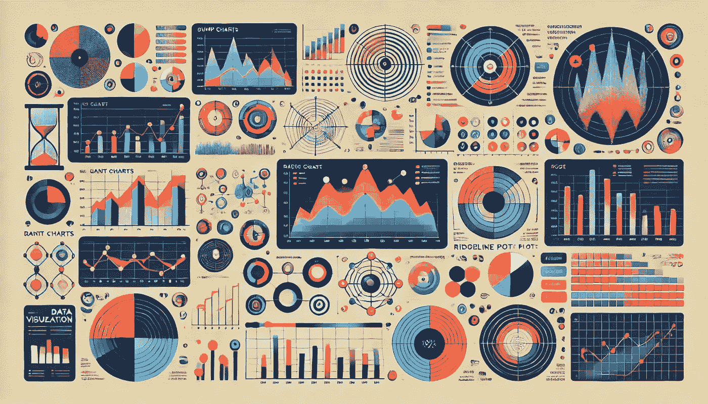

# 超越折线图和条形图：7 种不太常见但强大的可视化类型

> 原文：[`towardsdatascience.com/beyond-line-and-bar-charts-7-less-common-but-powerful-visualization-types-0503fbaa4131?source=collection_archive---------3-----------------------#2024-09-26`](https://towardsdatascience.com/beyond-line-and-bar-charts-7-less-common-but-powerful-visualization-types-0503fbaa4131?source=collection_archive---------3-----------------------#2024-09-26)

## 通过这些富有创意和洞察力的可视化提升你的数据讲故事能力

 [Yu Dong](https://ydong029.medium.com/?source=post_page---byline--0503fbaa4131--------------------------------)

·发表于[Towards Data Science](https://towardsdatascience.com/?source=post_page---byline--0503fbaa4131--------------------------------) ·12 分钟阅读·2024 年 9 月 26 日

--

在上一篇文章中，我分享了自 2018 年以来每周制作一个可视化的旅程——现在我已经在我的[Tableau Public](https://public.tableau.com/app/profile/yu.dong/vizzes#!/)个人主页上发布了 350 多个可视化作品！毫不意外，在所有可视化类型中，我使用得最多的还是条形图和折线图。它们简单，但在讲述故事时非常有效且直观。然而，我有时会感到制作相似的图表让人厌倦，它们也可能无法展示复杂的数据模式。

**在这篇文章中，我将介绍七种不太常见但非常强大的可视化类型。**我将讨论它们的具体应用场景，分享我的可视化示例，分析它们的优缺点，并向你展示如何在像 Tableau 这样的可视化工具中创建它们。

图像由 DALL·E 创作

# 1. 碰撞图：跟踪排名随时间变化

碰撞图是一种特殊类型的折线图，用于可视化多个类别的排名随时间变化的情况。它的 y 轴表示类别排名，因此可以显示各类别如何随着时间的推移相互“碰撞”并上下浮动。因此，它非常适合展示类别之间的竞争。
