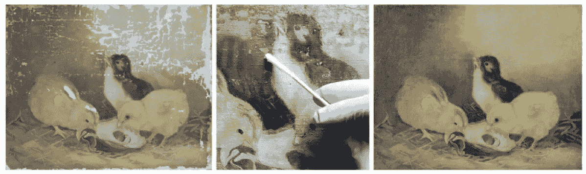
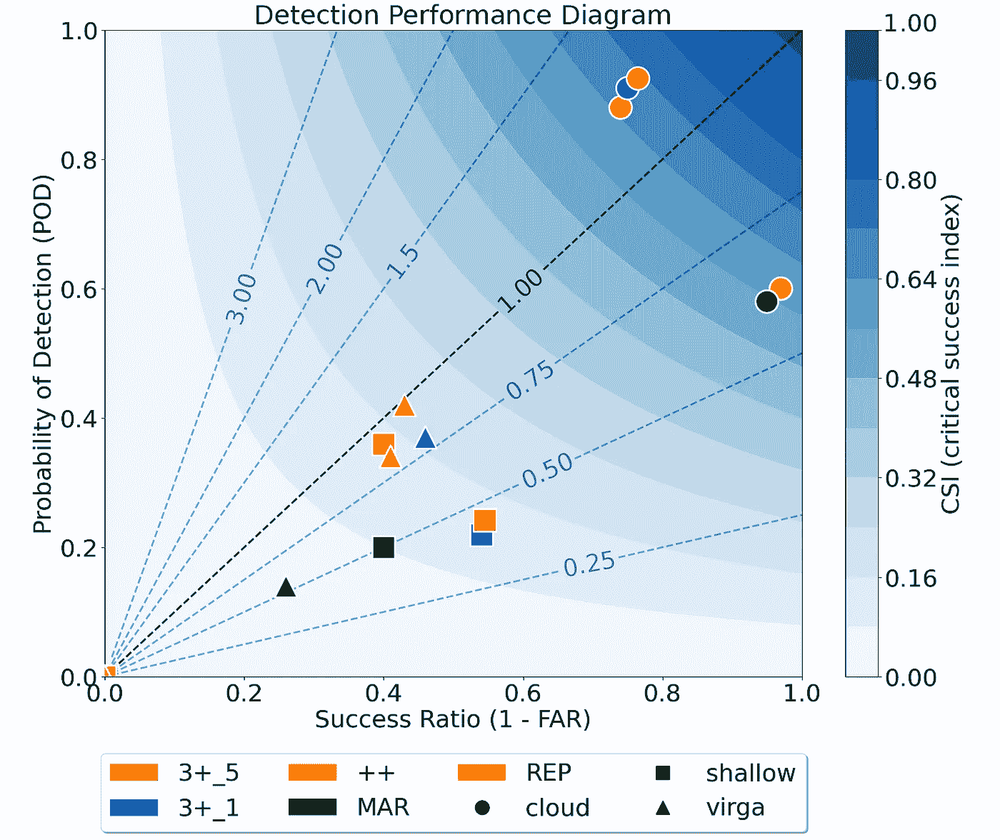

# 超越盲区

> 原文：[`towardsdatascience.com/beyond-the-blind-zone-706ba4b171c5?source=collection_archive---------10-----------------------#2024-04-05`](https://towardsdatascience.com/beyond-the-blind-zone-706ba4b171c5?source=collection_archive---------10-----------------------#2024-04-05)

## 使用深度学习修复雷达盲区

[](https://medium.com/@frasertheking?source=post_page---byline--706ba4b171c5--------------------------------)[](https://towardsdatascience.com/?source=post_page---byline--706ba4b171c5--------------------------------) [Fraser King](https://medium.com/@frasertheking?source=post_page---byline--706ba4b171c5--------------------------------)

·发表于 [Towards Data Science](https://towardsdatascience.com/?source=post_page---byline--706ba4b171c5--------------------------------) ·19 分钟阅读·2024 年 4 月 5 日

--


# 概述

在本文中，我们回顾了最近关于雷达盲区图像修复的工作中的高层次细节。我们讨论了主要的科学问题、修复技术、模型架构决策、准确性指标、不确定性，并最后分析了模型的可解释性（XAI），希望这些信息能够帮助他人在规划未来类似项目时提供帮助。此项工作最近发表在美国气象学会的《地球科学人工智能（AIES）》期刊中， [`doi.org/10.1175/AIES-D-23-0063.1`](https://doi.org/10.1175/AIES-D-23-0063.1)，我们建议读者查看以获取更多项目细节。

# 动机

雷达观测是进行降水预测等任务的强大信息来源。这些系统每天被数百万用户使用，帮助他们规划生活，并且它们的预测准确性对农业、旅游业和户外休闲产业具有巨大经济影响。但这些系统是如何工作的呢？简而言之，这些预测模型将降水率与雷达信号与大气中降水气象物体相互作用时的回波功率测量联系起来（图 1）。通过足够大的参考数据集，我们可以利用雷达资料（以及一些大气状态变量）反推出地面降水的估计值。


**图 1：** a) 反射率剖面图，显示云层反向散射的功率；b) 云中降雪率估算的垂直剖面；c) 从 b)所示最低降水云层推算出的地面降雪率。图片来自 King 等人，2020 年（[`doi.org/10.1029/2019EA000776`](https://doi.org/10.1029/2019EA000776)）。

与垂直指向的地面雷达仪器静止不动不同，卫星在太空中没有限制，并且由于其轨道可以提供更丰富、全面的全球降水模式视图。然而，与地面雷达不同，卫星仪器由于指向地球而表现出一种独特的测量问题：雷达盲区。顾名思义，盲区是卫星无法直接观察的雷达剖面的一部分。当向下指向的雷达信号到达地球表面时，来自地面的反向散射产生的信号被衰减，并且饱和在噪声中（因此无法观察到）。图 2 展示了地面雷达与空间雷达之间的比较（以及相应的盲区）。


**图 2：** 多面板的垂直反射率剖面图，来自地面雷达、CloudSat 和全球降水测量任务，以及它们各自的雷达盲区。图片来自 Kidd 等人，2021 年（[`doi.org/10.3390/rs13091708`](https://doi.org/10.3390/rs13091708)）。

尽管盲区的大小可能会有所不同，但它是活动空间系统（例如 GPM、CloudSat）上常见的问题，并将在未来的地球观测任务（例如 EarthCARE 和 AOS）中持续作为不确定性的来源。此外，尽管该区域仅占整个剖面的一小部分（例如，仅占 CloudSat 垂直范围的约 4%），但大气的 0-2 公里范围内可能包含大量降水云（Lamer 等人，2020）。因此，通过掩盖该区域，我们可能会遗漏大量雪（或在虚幻雨的情况下高估雪量），从而进一步增加已经存在的不确定性的地面积雪量估算误差。

> *…盲区导致反射率被低估最多 1 dB，事件数量变化幅度为+/- 5%，降水量低估了 9 到 11 个百分点（Maahn 等人，2014）。*

**我们能做些什么？**

# 我们的解决方案

从本质上讲，图像修复的思想已经存在数十年，应用于图像修复（例如，去除家庭照片上的划痕）或物体移除（例如，去除你度假时照片中的游客）（Guillemot 和 Le Meur，2013）。最初，这种类型的修复是一项昂贵的工作，需要由受过训练的艺术家手工完成（图 2），但近年来越来越明显的是，计算机也非常擅长这项任务（与人类相比，训练时间短得多）！



**图 3：** 由受过训练的专业人士手工修复画作。图片由 Ana Alba 提供。

尽管这些技术的早期迭代，如基于结构的线性插值、基于纹理合成的 Efros 插值，以及基于扩散的拉普拉斯或纳维-斯托克斯插值，在某些情况下可以很好地工作，但在处理大面积缺失时往往效果不佳。图 4 展示了这些技术之间的差异，其中大象的掩模被填充到图像的中心。这些技术通常严重依赖于目标修复区域边缘的图像信息/模式，并且在进行智能预测时，往往无法有效利用场景的全局上下文信息。


**图 4：** 物体移除应用 a) 不同类别方法的掩模和修复结果；b) 各向异性扩散，c) 示例基础；d) 补丁稀疏表示，e) 与全局能量最小化的混合；f) 补丁偏移。图片来源：Guillemot 和 Le Meur, 2013 ([`doi.org/10.1109/MSP.2013.2273004`](https://doi.org/10.1109/MSP.2013.2273004))。

然而，近年来计算机视觉领域迅猛发展，主要得益于计算能力的提升和更新、更高效的机器学习技术的出现。例如，使用生成对抗网络（GAN）的生成方法近年来非常流行，OpenAI 的 [DALL-E](https://openai.com/dall-e-2) 或 Stability.ai 的 [Stable Diffusion](https://stability.ai/blog/stable-diffusion-public-release) 可以基于简单的文本提示生成令人惊叹的真实图像。之前也有一些尝试使用类似方法进行修复的工作，但在修复任务中，现实感与保真度/稳定性之间存在一定的权衡（Lugmayr 等，2017；Geiss 和 Hardin，2021）。

例如，虽然你可能生成了一个从人眼来看非常不错的图像区域，但如果与参考图像进行比较，实际的像素值不一定是正确的，并且可能会根据提供的随机噪声/种子变化较大（图 5）。不过，这并不令人意外，因为这些技术并非以此类约束为设计目标，而是为其他目的而存在。


**图 5：** 来自*Lugmayr 等人，2017 年（[`doi.org/10.1109/CVPR52688.2022.01117`](https://doi.org/10.1109/CVPR52688.2022.01117)）的图像修复项目的去噪扩散概率模型（DDPM）示例集。

相反，在本工作中我们专注于另一种机器学习架构：U-Net。U-Net 是一类卷积神经网络（CNN），它以图像（通常是图像）的形式输入信息，并生成与输入相同维度的输出。U-Net 通常用于图像分割，其编码器-解码器架构使得模型能够学习图像的局部和全局特征（这种上下文对于正确解读图像内容，特别是在图像修复过程中，通常非常有价值）。我们将使用这种架构来教导模型学习高空云中的潜在特征，以预测前述雷达盲区的近地面反射率数据。

# 数据

本项目使用的数据主要来自两个来源：

1.  [**ARM KaZR CloudSat 对准反射率**](https://www.arm.gov/capabilities/science-data-products/vaps/kazrarsclcloudsat)

1.  [**ERA-5**](https://www.ecmwf.int/en/forecasts/dataset/ecmwf-reanalysis-v5)

这两个数据集是公开可用的（由[知识共享署名 4.0 国际版（CC BY 4.0）](https://creativecommons.org/licenses/by/4.0/)授权），并位于美国阿拉斯加北部的两个北极地点——北坡和奥利克托克点（图 6）。由于我们关注的是降雪，因此我们将观测限制在 2 摄氏度以下的寒冷时期。此外，为了避免由于自相关导致的过拟合，数据被划分为连续的训练/验证/测试块，如图 6.c 所示。我们使用来自 ARM KaZR 的雷达反射率数据，以及来自 ERA-5 的温度、比湿、u 分量风和 v 分量风数据。


**图 6：** a) 研究地点位置；b) NSA 和 OLI 的地面气象温度时间序列；c) 用于模型训练的数据拆分方法。图像由作者提供。

# 我们的模型

在此任务中应使用哪种类型的 U-Net？我们在本项目中尝试了多种不同的 U-Net，包括 Zhou 等人，2018 年的 UNet++模型和 Huang 等人，2020 年的 3Net+。但让我们先聊聊模型架构。例如，为什么使用这些方法而不是传统的 U-Net？首先，我们回顾一下 U-Net 是如何工作的。

U-Net 通常被认为由三个部分组成：编码器路径、瓶颈层和解码器路径。编码器负责处理最初的高分辨率图像，通过一系列卷积和池化步骤，将空间信息转换为丰富的特征信息（学习图像的潜在上下文）。根据网络的深度，这些潜在特征在 U 形网络底部的最低维瓶颈层中被最密集地编码。在这一点上，图像数组的大小可能只有原始图像的一个小部分，尽管你已经丧失了大部分空间信息，但模型已经识别出一组嵌入，代表它认为的关键元素。然后，在解码器路径中，反向过程发生。瓶颈层中低分辨率、特征丰富的数组会被下采样，直到特征信息被转化回空间信息（生成一个最终图像，其尺寸与原始图像相同）。

U-Net、U-Net++ 和 3Net+ 之间的关键区别之一在于每种变体如何处理跳跃连接（图 7）。跳跃连接允许这些模型直接将一些数据从编码器路径跳跃到解码器中使用，这有助于在解码过程中传递低级特征信息，并生成一个更稳定的模型，使其能够以有意义的方式收敛。例如，在一个普通的 U-Net 中，这些连接只是将来自收缩编码器路径的特征图与解码扩展路径中相应的层连接起来。


**图 7：** a) U-Net；b) U-Net++；以及 c) 3Net+ 模型架构的比较。图像来源于 Huang 等人，2020（[`doi.org/10.48550/arXiv.2004.08790`](https://doi.org/10.48550/arXiv.2004.08790)）。

UNet++ 引入了一系列嵌套和密集的跳跃路径，试图解决传统 U-Net 中最优架构的未知深度问题。UNet++ 不仅仅是从编码器到解码器有直接连接，它有多个跳跃路径。对于编码器中的每个层级，都有跳跃连接到解码器中的所有后续层级，形成一个密集的连接集。这些嵌套的跳跃连接旨在比普通的 U-Net 更有效地捕捉和融合不同语义层次的特征，然而这也带来了模型变大（更多参数）和训练时间增加的代价。

3Net+基于前述技术的思想，并且是我们最终模型（图 8）中使用的架构。该方法将跳跃连接分解为一系列跨跳跃连接（类似于经典的 U-Net）、跳跃间连接和跳跃内连接。这些跳跃间和跳跃内连接通过传递信息，结合特征图中的低级细节与高级语义，有效利用了场景中的多尺度特征，同时相比于 U-Net++模型，使用了更少的参数。


**图 8：** a) 128x128 大小的 KaZR 和 ERA-5 输入变量块；b) 我们模型的 3Net+架构及深度监督层。图像由作者提供。

此外，我们的模型利用深度监督从解码器每一层的全尺度聚合特征图中学习层次化表示。这帮助模型通过检查场景的更广泛上下文来正确定位盲区中的云。在接下来的部分中，我们将比较仅在反射率上训练的 3Net+模型（以下简称为 3+_1），另一个在反射率和 ERA5 数据上训练的版本（3+_5），以及两种使用重复外推（REP）和滑动平均（MAR）方法的线性修补技术。有关这些方法如何实现的更多细节，请参考我们的 AIES 论文。

# 保真度

为了全面评估模型在盲区重建准确性方面的表现，我们将首先检查一些常见的案例，随后对整个测试数据集进行更一般性的统计分析。请注意，从此以后展示的所有结果均严格来源于未见的测试集观测数据。

## 案例研究

展示了 REP、MAR、3+_1 和 3+_5 模型的盲区反射率值的示例（取自 NSA 和 OLI），以及对应的目标 KaZR VAP 产品（即地面真实值）在最左侧列中的数据，见图 9/10。

这第一组示例突出显示了在两个位置都常见的近地表反射率梯度和云隙的情况。黑色虚线表示 1.2 公里的盲区阈值（低于此值的区域被遮蔽并由各模型重建），阴影区域表示在 U-Net 预测中修补部分的高不确定性区域（后续将在蒙特卡罗丢弃部分详细讨论）。


**图 9：** 展示了 REP、MAR、3+_1 和 3+_5 模型的盲区反射率值的示例（取自 NSA 和 OLI），以及对应的目标 KaZR VAP 产品（即地面真实值）在最左侧列中的数据。这组示例突出显示了近地表反射率梯度和云隙的情况。图像由作者提供。

我们发现，线性模型（REP 和 MAR）在深层均匀系统中表现良好，但在更复杂的情况下表现不佳。此外，由于它们依赖于盲区阈值反射率，REP 和 MAR 未能捕捉到反射率梯度（垂直和水平），而这些梯度通常是通过 U-Net 捕捉到的。最后，浅层的北极混合相云也可以通过 U-Net 解决，包括云隙和雨丝的情况（图 10），这令人兴奋，因为这对地面降雪量有着重要的影响。


**图 10：** 与图 9 相同，现在关注于每个模型的补全预测中的浅层降雪和雨丝情况。图像由作者提供。

准确建模最具挑战性的情况是那些具有稀疏反射率剖面和遥远云层的情况。例如，考虑图 11 中展示的两个在不同年份发生在 NSA 的类似案例。从人的眼睛来看，这两个地点的云结构非常相似，然而一个在盲区内有一个浅层近地面云，而另一个则没有。线性补全技术在这里显然已超出了它们的舒适区，并且总是产生与 a)中所见相同的“无云”输出。然而，U-Net 模型仍然能够解决此类情况中的云存在问题，3+_5 模型通过使用来自 ERA-5 的附加上下文，更好地理解在这种情况下，大气条件可能导致盲区云的形成。


**图 11：** a) 一个例子，展示了一个高空云（其平均反射率约为-20 dBZ），在盲区内没有近地面活动；b) 一个与 a)类似的云结构，除了在这种情况下，确实存在一个近地面反射率带，在浅层云中，通过 3+_5 模型能够正确识别。图像由作者提供。

## 稳健性

如图 12 a)所示，U-Net 的 PSD 曲线与观测值相比，较线性方法更接近。此外，非线性重建产生了更为真实的最低云回波高度（如 b)中的概率密度图所示），这表明我们能更好地捕捉云的位置。最后，整个盲区结构在 c)-g)中得到了总结，其中线性方法能够捕捉到反射率的宏观尺度趋势，但未能捕捉到精细尺度的变化。我们注意到，U-Net 模型在-60 dBZ 附近存在轻微的“冷”偏差，这是由于它们倾向于给出更接近“无云”更为“安全”的估计，而高强度的降雪事件则较为罕见。


**图 12：** 云结构度量，包括：a) 垂直功率谱密度曲线；b) 最低反射率回波层概率密度图；c) 2D 反射率直方图。图像由作者提供。

此外，改善我们对地面降雪和虚假降雪情况的预测将对水文产生重大影响，并减少我们对雪积量的不确定性。因此，我们进行了检查，看看我们的模型在使用探测概率（POD）和误报率（FAR）时如何重建三个情况：

1.  盲区云层存在（即是否检测到任何云层）

1.  浅层降雪（即地面上有降雪，但在盲区阈值以下没有降雪）

1.  虚假降雪（即在盲区阈值上检测到降雪，但在地面没有降雪）

每个指标的关键成功指数（CSI）如下面的性能图（图 13）所示，其中 3+_5 模型的整体表现最佳。浅层降雪的情况通常是最难重建的，因为我们看到这些情况通常很难准确重建（图 11）。



**图 13：** 各模型的云层、浅层降雪和虚假降雪检测性能图。图片来源：作者。

# 可解释性

为了进一步增加对模型决策过程的信任，我们还进行了系列的[可解释人工智能（XAI）](https://wiki.example.org/what-is-explainable-ai-xai-afc56938d513#:~:text=Explainable%20AI%20refers%20to%20methods,be%20understood%20by%20human%20experts.)测试（即以机械化的方式理解模型行为）。这些测试旨在将模型行为与逻辑的物理过程联系起来，以激发对模型的信心，并为可能改善未来的回收提供额外的见解。如果我们能够发现数据中以前未知的关联，这将非常有价值！另外，每个单独的 XAI 方法给出的是“局部”的决策过程解释，因此结合多种测试以获得更稳健的理解是很有用的。

## 特征图

我们考虑的第一个、最基本的测试是特征/激活图。通过检查图 8.b 中编码器路径不同层次的 reLU 激活值，我们可以大致了解模型在给定输入的图像中注视的位置。如下面图 14 所示，3+_5 模型的 e1 编码器层通常关注云层边缘、反射率梯度以及盲区阈值的位置。


**图 14：** a) 输入到 3+_5 模型的反射率示例；b) 模型 e1 编码器层生成的 32 个特征图。图片来源：作者。

## 丢弃通道重要性

该项目的一个最大问题是 ERA-5 是否为模型提供了有用的背景。如果我们能够使用一个更简单的 U-Net 模型，仅依赖反射率（例如 3+_1 模型），那么我们应该这样做，因为这样更具计算效率。然而，如果 ERA-5 的额外大气状态变量为模型提供了有用的背景来涂色复杂系统，那么使用这个更复杂的模型可能是有必要的。

由于在本例中我们只有少量的输入（1 个必需的（雷达）和 4 个辅助的（温度、湿度、u-风和 v-风）），我们可以对输入空间进行穷举搜索，以评估它们对准确性的边际贡献。更正式地说，这种丢弃通道方法使用下面的公式（公式 1 / 公式 2）来计算提供的输入的边际重要性贡献。请注意，这种技术并未考虑输入之间可能的非线性相互作用。


**公式 1 / 公式 2：** 用于计算来自 N 个输入的边际重要性。图片来源：作者。

如果我们执行一系列此类测试运行（25 个周期），并检查验证损失的变化，我们可以大致了解哪些输入最有用。这些测试的结果如下图 15 所示，我们注意到随着我们添加更多 ERA-5 输入，验证损失呈下降趋势（这表明没有任何输入完全不重要）。此外，边际贡献到验证损失的结果表明，风数据总体上是最具影响力的。我们认为这种重要性可能源于这样一个事实：在对流层上层，风模式可以暗示中尺度大气动力学，如高压或低压系统、锋面和急流（这些当然与云/水气象的形成有关）。


**图 15：** 输入通道组合对 3Net+ 模型涂色性能的贡献。图片来源：作者。

## 显著性图

最后，我们还检查了一些案例的显著性图（图 16），以进一步比较 3+_5 和 3+_1 模型之间的重要性差异。这些像素归因的原生梯度显著性图灵感来自 Simonyan 等人（2014）的工作，并为模型识别为涂色准确性贡献重要信息的区域提供了额外的洞察。这些显著性图是通过将图像输入到网络中，然后提取基于输入在所有通道上输出的梯度来生成的。尽管这种方法简化，但它对于可视化观察图像中哪些部分在涂色盲区反射值时最有价值非常有用，允许直接绘制激活梯度。


**图 16：** 3+_1 和 3+_5 模型的原始梯度显著性图，以及在 NSA 的一些案例中对应的 ERA5 大气状态变量。图片由作者提供。

对于与盲区切割区域交叉的多层云（例如图 16.a），两个模型都聚焦于云的顶部和 1.2 公里的边界阈值，因为这些系统通常会延伸至地面，并具有相似的反射率强度。两个模型通常还会关注并围绕深层系统中的云间隙（例如图 16.b），然而，3+_5 模型中明显出现了一个重要的环带，指向平流层。这一反复出现的特征可能将上层对流层的风和湿度数据纳入了对近地面反射率的预测。有趣的是，3+_1 模型并不仅仅专注于场景中高反射率区域，还关注云周围的区域。

# 应用

本工作的主要目标是最终将训练好的表面 U-Net 应用于空间观测。尽管在这两个系统之间的分辨率匹配方面还需要完成额外的工作，但我们已针对靠近 NSA 的重合 CloudSat-CPR 观测进行了早期测试。这里的想法是，尽管这两个系统（虽然并未完全重叠）将观测到相同风暴系统的相似部分。我们考虑了一些示例，并在下方包括了一个浅层积云降雪案例。


**图 17：** a) 显示 CloudSat 过境颗粒路径（红色）、128 步站点重合的 CloudSat 足迹以及显示最接近站点的观测轮廓的白色点（黑圆圈代表站点周围 50 公里的半径）；b) 浅层积云系统的 CloudSat 反射率轮廓，两个虚线之间的区域表示 a) 中的蓝色（重合）部分，白色阴影区域显示卫星盲区；c) 垂直 NSA KaZR 反射率轮廓，b) 中的对应过境时期显示在两个虚线之间的区域；d) 来自 c) 的 KaZR CloudSat 重合轮廓的特写；e) 来自 b) 的 CloudSat-NSA 重合轮廓；f-h) 分别为提供 e) 作为输入时的 REP、MAR 和 3+_1 修复盲区场景。图片由作者提供。

在这个例子中，我们注意到，空间 borne 和地面雷达都观测到大约 3 公里高的浅层云（然而 CloudSat 因表面杂波错过了盲区下方的反射率梯度增加）。当使用传统技术和我们的 U-Net 重建该区域时，我们发现 U-Net 是唯一能够准确表示大约 1 公里范围内反射率增加带的方法。更正式地说，如果我们查看最接近该站点的 CloudSat 观测值（白色虚线）与每个最接近重建区域之间的结构，使用 U-Net 时 Pearson 相关性显著提高（r_MAR=0.13 到 r_3+_1=0.74）。

尽管这些示例并未构成一个全面的分析，无法让我们对整体性能做出结论，但它们确实表明我们观察到的技能与我们在查看模拟的表面盲区时所注意到的一致。进一步的空间 borne 仪器应用工作正在进行中。

# 最终备注

在结束这篇已经很长的文章之前，我想强调一些我们在模型中加入的其他特性，并为那些有兴趣开发自己修补模型的人提供一些训练代码示例。

## 蒙特卡洛 Dropout

与传统的贝叶斯方法不同，我们并没有直接使用 U-Net 来生成基于物理的无关度估计。为了大致了解模型的信心和稳定性，我们决定在推理层引入 Dropout，基于 Gal 和 Ghahramani 2016 年的研究，这使我们能够为每个测试案例生成修补预测的分布。这些分布使我们能够为每个修补的像素生成置信区间，并进一步精细化我们的估计，聚焦于模型在修补时更有信心的区域。下图 17 展示了一个例子。


**图 18：** 蒙特卡洛 Dropout 示例输出（n=50 次迭代）。图像由作者提供。

我们通常对每个案例使用 N=50 次迭代，正如我们上面看到的，通常具有最高不确定性的区域是云边缘和云隙，因为模型在定位这些特征时常常会出现幻觉。

## 训练统计

本项目的模型训练在两种硬件环境中完成，包括基于 Linux 的 GPU 计算集群（托管在 Microsoft Azure 上）和一台运行 Windows 11 的高性能桌面计算机（更多系统细节见表 1）。在两天的时间里，还进行了广泛的贝叶斯超参数搜索。此外，在训练过程中应用了批量归一化、早停（n=20）、dropout 和 L2 正则化（岭回归）来帮助缓解过拟合问题。学习率衰减也在两个周期（450 和 475）应用，使模型能够更容易地在训练阶段结束时接近局部损失最小值。所有的训练运行和超参数搜索结果都通过[Weights & Biases 云存储选项](https://wandb.ai)在线保存，以便监控模型的学习率和稳定性。


**表 1：** 用于模型训练的硬件摘要详情。图片由作者提供。

## 示例代码

GitHub 链接如下：[`github.com/frasertheking/blindzone_inpainting`](https://github.com/frasertheking/blindzone_inpainting)

但是，我想为那些有兴趣尝试的人提供一个实际的 3Net+实现概览（具有可变深度），该实现是基于 Tensorflow 的。

```py
def conv_block(x, kernels, kernel_size=(3, 3), strides=(1, 1), padding='same', is_bn=True, is_relu=True, n=2, l2_reg=1e-4):
    for _ in range(1, n+1):
        x = k.layers.Conv2D(filters=kernels, kernel_size=kernel_size,
                            padding=padding, strides=strides,
                            kernel_regularizer=tf.keras.regularizers.l2(l2_reg),
                            kernel_initializer=k.initializers.he_normal(seed=42))(x)
        if is_bn:
            x = k.layers.BatchNormalization()(x)
        if is_relu:
            x = k.activations.relu(x)
    return x

def unet3plus(input_shape, output_channels, config, depth=4, training=False, clm=False):

    """ Prep """
    interp = config['interpolation']
    input_layer = k.layers.Input(shape=input_shape, name="input_layer")
    xpre = preprocess(input_layer, output_channels)

    """ Encoder """
    encoders = []
    for i in range(depth+1):
        if i == 0:
            e = conv_block(xpre, config['filters']*(2**i), kernel_size=(config['kernel_size'], config['kernel_size']), l2_reg=config['l2_reg'])
        else:
            e = k.layers.MaxPool2D(pool_size=(2, 2))(encoders[i-1])
            e = k.layers.Dropout(config['dropout'])(e, training=True)
            e = conv_block(e, config['filters']*(2**i), kernel_size=(config['kernel_size'], config['kernel_size']), l2_reg=config['l2_reg'])
        encoders.append(e)

    """ Middle """
    cat_channels = config['filters']
    cat_blocks = depth+1
    upsample_channels = cat_blocks * cat_channels

    """ Decoder """
    decoders = []
    for d in reversed(range(depth+1)):
        if d == 0 :
            continue
        loc_dec = []
        decoder_pos = len(decoders)
        for e in range(len(encoders)):
            if d > e+1:
                e_d = k.layers.MaxPool2D(pool_size=(2**(d-e-1), 2**(d-e-1)))(encoders[e])
                e_d = k.layers.Dropout(config['dropout'])(e_d, training=True)
                e_d = conv_block(e_d, cat_channels, kernel_size=(config['kernel_size'], config['kernel_size']), n=1, l2_reg=config['l2_reg'])
            elif d == e+1:
                e_d = conv_block(encoders[e], cat_channels, kernel_size=(config['kernel_size'], config['kernel_size']), n=1, l2_reg=config['l2_reg'])
            elif e+1 == len(encoders):
                e_d = k.layers.UpSampling2D(size=(2**(e+1-d), 2**(e+1-d)), interpolation=interp)(encoders[e])
                e_d = k.layers.Dropout(config['dropout'])(e_d, training=True)
                e_d = conv_block(e_d, cat_channels, kernel_size=(config['kernel_size'], config['kernel_size']), n=1, l2_reg=config['l2_reg'])
            else:
                e_d = k.layers.UpSampling2D(size=(2**(e+1-d), 2**(e+1-d)), interpolation=interp)(decoders[decoder_pos-1])
                e_d = k.layers.Dropout(config['dropout'])(e_d, training=True)
                e_d = conv_block(e_d, cat_channels, kernel_size=(config['kernel_size'], config['kernel_size']), n=1, l2_reg=config['l2_reg'])
                decoder_pos -= 1
            loc_dec.append(e_d)
        de = k.layers.concatenate(loc_dec)
        de = conv_block(de, upsample_channels, kernel_size=(config['kernel_size'], config['kernel_size']), n=1, l2_reg=config['l2_reg'])
        decoders.append(de)

    """ Final """
    d1 = decoders[len(decoders)-1]
    d1 = conv_block(d1, output_channels, kernel_size=(config['kernel_size'], config['kernel_size']), n=1, is_bn=False, is_relu=False, l2_reg=config['l2_reg'])
    outputs = [d1]

    """ Deep Supervision """
    if training:
        for i in reversed(range(len(decoders))):
            if i == 0:
                e = conv_block(encoders[len(encoders)-1], output_channels, kernel_size=(config['kernel_size'], config['kernel_size']), n=1, is_bn=False, is_relu=False, l2_reg=config['l2_reg'])
                e = k.layers.UpSampling2D(size=(2**(len(decoders)-i), 2**(len(decoders)-i)), interpolation=interp)(e)
                outputs.append(e)
            else:
                d = conv_block(decoders[i - 1], output_channels, kernel_size=(config['kernel_size'], config['kernel_size']), n=1, is_bn=False, is_relu=False, l2_reg=config['l2_reg'])
                d = k.layers.UpSampling2D(size=(2**(len(decoders)-i), 2**(len(decoders)-i)), interpolation=interp)(d)
                outputs.append(d)

    if training:
        for i in range(len(outputs)):
            if i == 0:
                continue
            d_e = outputs[i]
                d_e = k.layers.concatenate([out1, out2, out3])
            outputs[i] = merge_output(input_layer, k.activations.linear(d_e), output_channels)

    return tf.keras.Model(inputs=input_layer, outputs=outputs, name='UNet3Plus')
```

# 未来

我知道这篇文章很长，我们涵盖了很多内容，但我想快速总结一下我们讨论的所有内容，特别是对那些读到这里的读者（或者跳到最后的读者）。

卫星雷达盲区是卫星地球观测降水任务中的一个持续问题，对全球水能预算计算有重要影响。为了克服传统线性插值方法在填补该区域时常见的问题，我们选择了使用非线性、深度监督的 U-Net 进行雷达盲区插值。U-Net 在几乎所有评估指标上都优于线性技术，甚至能够重建复杂的云结构，如多层云、云隙和浅层云。此外，通过使用各种可解释人工智能（XAI）技术，我们发现位于盲区阈值附近以及对流层顶沿线（尤其是风信息）的数据对模型的决策过程非常有用。尽管我们不建议这些模型完全替代当前基于物理的解决方案，但我们认为它们提供了一个独特的新视角，可以在未来的任务中补充其他回收方法。

我们目前正在进行一个跟进项目，直接应用于 CloudSat-CPR 观测。

# 参考文献

Gal, Y., & Ghahramani, Z. (2016). Dropout 作为贝叶斯近似：在深度学习中表示模型不确定性（arXiv:1506.02142）。arXiv. [`doi.org/10.48550/arXiv.1506.02142`](https://doi.org/10.48550/arXiv.1506.02142)

Geiss, A., & Hardin, J. C. (2021). 使用深度学习修复雷达缺失数据区域。大气测量技术，14(12)，7729–7747\. [`doi.org/10.5194/amt-14-7729-2021`](https://doi.org/10.5194/amt-14-7729-2021)

Guillemot, C., & Le Meur, O. (2014). 图像修复：概述与最新进展。*IEEE 信号处理杂志*，*31*(1)，127–144\. [`doi.org/10.1109/MSP.2013.2273004`](https://doi.org/10.1109/MSP.2013.2273004)

Huang, H., Lin, L., Tong, R., Hu, H., Zhang, Q., Iwamoto, Y., Han, X., Chen, Y.-W., & Wu, J. (2020). UNet 3+: 一种全规模连接的 UNet 医学图像分割方法 (arXiv:2004.08790)。arXiv. [`doi.org/10.48550/arXiv.2004.08790`](https://doi.org/10.48550/arXiv.2004.08790)

Kidd, C., Graham, E., Smyth, T., & Gill, M. (2021). 使用表面雷达和微雨雷达观测评估卫星观测的浅层/轻度降水反演的影响。遥感，13(9)，文章 9\. [`doi.org/10.3390/rs13091708`](https://doi.org/10.3390/rs13091708)

King, F., & Fletcher, C. G. (2020). 使用 CloudSat-CPR 检索估算加拿大北极地区的积雪量。地球与空间科学，7(2)，e2019EA000776\. [`doi.org/10.1029/2019EA000776`](https://doi.org/10.1029/2019EA000776)

Lamer, K., Kollias, P., Battaglia, A., & Preval, S. (2020). 注意差距 — 第一部分：利用卫星雷达准确定位温暖海洋边界层云和降水。大气测量技术，13(5)，2363–2379\. [`doi.org/10.5194/amt-13-2363-2020`](https://doi.org/10.5194/amt-13-2363-2020)

Lugmayr, A., Danelljan, M., Romero, A., Yu, F., Timofte, R., & Van Gool, L. (2022). RePaint: 使用去噪扩散概率模型进行图像修复。2022 年 IEEE/CVF 计算机视觉与模式识别大会（CVPR），11451–11461\. [`doi.org/10.1109/CVPR52688.2022.01117`](https://doi.org/10.1109/CVPR52688.2022.01117)

Maahn, M., Burgard, C., Crewell, S., Gorodetskaya, I. V., Kneifel, S., Lhermitte, S., Van Tricht, K., & van Lipzig, N. P. M. (2014). 太空雷达盲区如何影响极地地区衍生的地表降雪统计数据？《地球物理研究：大气》, 119(24), 13,604–13,620\. [`doi.org/10.1002/2014JD022079`](https://doi.org/10.1002/2014JD022079)

Simonyan, K., Vedaldi, A., & Zisserman, A. (2014). 深入卷积神经网络：可视化图像分类模型与显著性图 (arXiv:1312.6034)。arXiv. [`doi.org/10.48550/arXiv.1312.6034`](https://doi.org/10.48550/arXiv.1312.6034)

Zhou, Z., Siddiquee, M. M. R., Tajbakhsh, N., & Liang, J. (2018). UNet++：一种用于医学图像分割的嵌套 U-Net 架构 (arXiv:1807.10165)。arXiv. [`doi.org/10.48550/arXiv.1807.10165`](https://doi.org/10.48550/arXiv.1807.10165)
