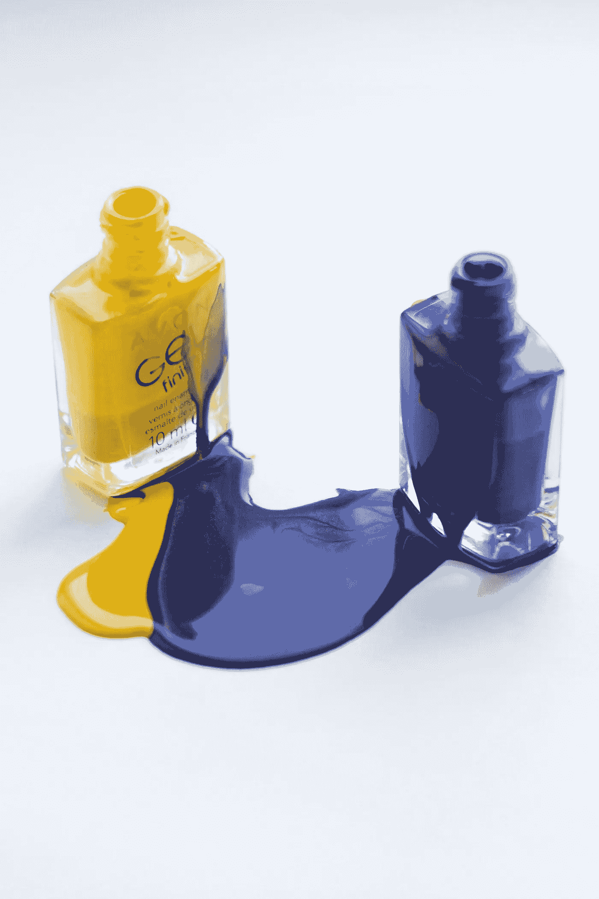

# 超越炒作：当生成性 AI 并非总是答案时

> 原文：[`towardsdatascience.com/beyond-the-hype-when-generative-ai-isnt-always-the-answer-3ddbb19ce70f?source=collection_archive---------5-----------------------#2024-10-01`](https://towardsdatascience.com/beyond-the-hype-when-generative-ai-isnt-always-the-answer-3ddbb19ce70f?source=collection_archive---------5-----------------------#2024-10-01)

## 为什么预测性 AI 可能仍然是你的最佳选择

 [JL Marechaux](https://jlmarechaux.medium.com/?source=post_page---byline--3ddbb19ce70f--------------------------------)

·发布于[Towards Data Science](https://towardsdatascience.com/?source=post_page---byline--3ddbb19ce70f--------------------------------) ·阅读时间 8 分钟·2024 年 10 月 1 日

--

图片由[Maria Lupan](https://unsplash.com/@luandmario?utm_source=medium&utm_medium=referral)提供，来自[Unsplash](https://unsplash.com/?utm_source=medium&utm_medium=referral)

我在谷歌的解决方案与思想领导团队（即 S&TL）工作。我们的职责是帮助大型公司采用 AI 技术，以提高它们的业绩并进行创新。在过去三年中，我与北美不同的 AI 团队和决策者合作，构建并测试针对特定业务需求的定制 AI 模型。

到了 2024 年，我注意到我与企业利益相关者的互动发生了显著变化。**他们都希望使用生成性 AI**来解决他们的业务问题。

对于其中一些客户，如果我问他们为什么选择生成性 AI，他们通常会带着好奇的目光看着我。他们并不完全理解这个问题。对于另一些客户，他们提到的是董事会或 C 级高管确定的战略目标。但往往，生成性 AI 并不是解决他们业务优先事项的最佳答案。

# **不，AI 并不是在 2022 年 11 月才被发明的**

当 OpenAI 在 2022 年 11 月发布 ChatGPT 3.5 时，全球数百万的人开始玩这个引人入胜的新工具。我的邻居、杂货店的店员、我的叔叔和我的小侄女。AI 用户无处不在，人人谈论。
