# 二分类

> 原文：[`towardsdatascience.com/binary-classification-unpacking-the-real-significance-and-limitations-of-traditional-metrics-810069be630c?source=collection_archive---------11-----------------------#2024-01-12`](https://towardsdatascience.com/binary-classification-unpacking-the-real-significance-and-limitations-of-traditional-metrics-810069be630c?source=collection_archive---------11-----------------------#2024-01-12)

## 拆解传统指标的真正意义与局限性

 [gabriel costa](https://medium.com/@costaleirbag?source=post_page---byline--810069be630c--------------------------------)

·发表于 [Towards Data Science](https://towardsdatascience.com/?source=post_page---byline--810069be630c--------------------------------) ·9 分钟阅读·2024 年 1 月 12 日

--

# 介绍

分类工作的本质可以看作是将结构的复杂性总结为有限的类别，这种方法常常对简化生活非常有用，使我们能够将复杂的结构简化为*两种单一类型*。这些标签可能有明显的解释，比如我们通过收入这一独特且合理的特征来区分统计学家和数据科学家；也可能是压抑的尝试，将实验证据简化为一句话，用来接受或拒绝零假设。拥抱元语言，我们将分类标签归属于将信息总结成两种不同类型的工作：**二分类**。本工作旨在对这一特定标签进行更深的描述，*为决策过程带来概率解释，并分析我们用来评估结果的指标。*

# 将种群建模为分布

当我们试图描述并区分一个对象时，我们的目标是找到突出其独特性的特征。*预计对于许多属性，这种差异在整个种群中并不总是准确一致的。*

对于一个常见的具有不同 n 个特征（V1, … Vn）的二分类问题，我们可以查看这些特征值的分布，并试图从中得出结论：

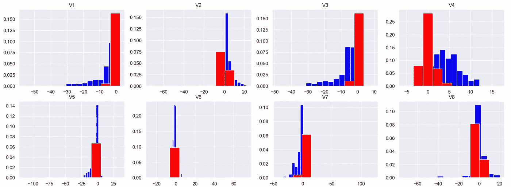

图 1：两类（负类：红色；正类：蓝色）不同特征 Vn 的分布。此数据来自于 Kaggle 挑战，文末有相关引用。

如果任务是使用这些特征中的一个来指导我们的决策过程，给定个体的 *v_n* 值来决定，

预测类别时，直觉上可以选择频率最高的类别（或者如果我们的直方图是良好的分布估计器，则选择概率最高的类别）。例如，如果某个个体的 v4 测量值大于 5，那么它很可能是正类。

然而，*我们可以做得更多*，利用不同的特征，将信息合成成一个单一的分布。**这正是得分函数 *S(x)* 的任务**。得分函数将进行回归，将特征分布压缩到一个唯一的分布 ***P(s, y)***，并且可以根据每个类别进行条件化，***P(s|y=0)* 表示负类** *(y=0)* 和 ***P(s|y=1)* 表示正类** *(y=1)*。

从这个单一的分布中，**我们选择** **一个决策阈值 t**，该阈值决定我们对给定点的估计——用 *ŷ* 表示——是正类还是负类。**如果 s 大于 *t*，我们就赋予正类标签；否则，赋予负类标签。**

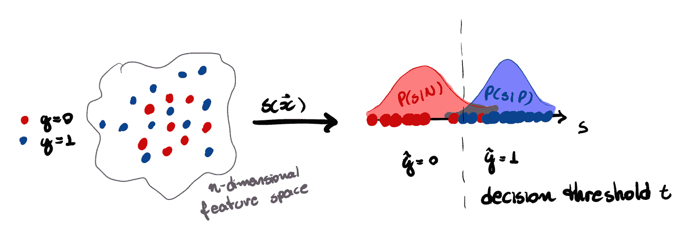

图 2：二分类过程的图示。得分函数将 n 维特征空间压缩为分布 P(s, y)。

***给定分布******P(s, y, t)*** *其中 s、y 和 t 分别代表分数、类别和阈值的值，* ***我们就得到了分类器的完整描述。***

# 我们分类器的度量标准（边际和条件分布）

*为我们的分类器开发度量标准可以看作是量化 p(s|P) 和 p(s|N) 区分能力的追求。*

通常情况下，两个分布 *p(s|P)* 和 *p(s|N)* 会有重叠，导致无法完美分类。因此，给定一个阈值，我们可以问一下 *p(s > t|N)* — 假阳性率（FPR） — 也就是我们将负类个体错误分类为正类的概率，例如。

当然，我们可以堆砌大量的度量标准，甚至给它们起名——尽管这些命名可能不一致——但为了所有的目的，我们只需定义四个概率及其相关的比率来表示分类器的性能：

1.  **真正阳性率 (*tpr*)**: *p(s > t|P) = TP/(TP+FN)*;

1.  **假阳性率 (*fpr*):** *p(s > t|N) = FP/(FP+TN)*;

1.  **真正阴性率 (*tnr*):** *p(s ≤ t|N) = TN/(FP+TN)*;

1.  **假阴性率 (*fnr*):** *p(s ≤ t|P) = FN/(TP+FN)*.

如果你已经熟悉这个主题，你可能会注意到，*这些是我们从分类器的混淆矩阵中定义的度量标准*。因为该矩阵是为每个选择的决策阈值定义的，我们可以将其视为条件分布 *P(ŷ, y|t)* 的一种表示，其中这些对象是完全描述我们分类器性能的混淆矩阵类别的一部分。

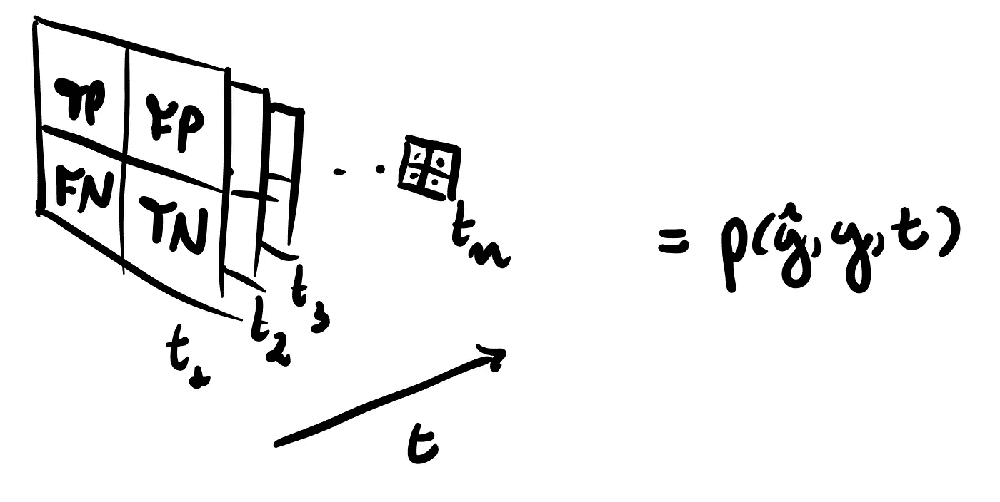

图 3：每个混淆矩阵可以视为一个条件 *p(ŷ, y|t)，并且* 所有可能的混淆矩阵组成一个完整的分类器性能描述。

因此，错误比率 *fpr* 和 *fnr* 是量化两个条件得分分布交集方式和交集程度的指标：

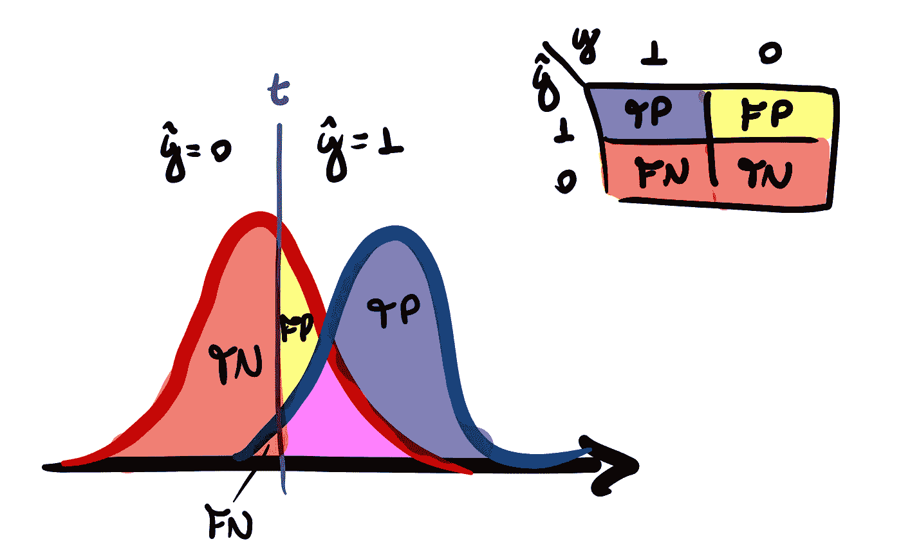

图 4：分类器的性能估计量是不同的度量，用来描述两个分布 p(s|P) 和 p(s|N) 之间的重叠或分离。

## 性能总结：ROC 曲线

*由于比率受到 *tpr* + *fnr* = 1 和 *fpr* + *tnr* = 1 的约束*，这意味着我们只有 2 个自由度来描述我们的性能*。

ROC 曲线是由 *t* 参数化的曲线，用 *(x(t), y(t)) = (fpr(t), tpr(t))* 表示为与正交轴相对的点。这将为我们提供一个简明的总结，来可视化分类器在所有不同阈值下的性能，而不仅仅是一个单一的阈值。

> 最佳的 ***t*** 值通常是未知的，必须作为分类器构建的一部分来确定。——《连续数据的 ROC 曲线》(2009, Chapman and Hall)。

我们的目标是探索将概率分布作为处理对象的概念，因此让我们想象一下*对于一个完全无效的分类器，基本情形会是什么样的*。由于我们预测的有效性依赖于判别性质，*p(s|P)* 和 *p(s|N)*，当 *p(s|P) = p(s|N) = p(s)* 时，我们就遇到了这种无效性的典型例子。

如果我们进行将每个条件视为均值分离不同值的高斯模型化的练习，我们可以清晰地看到性能是如何变化的：

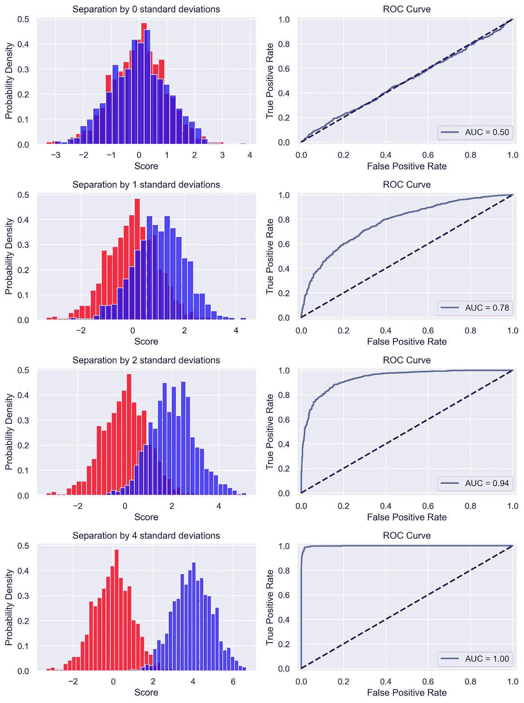

图 5：当得分分布变得更加具备判别力时，分类器的性能提高。

这种可视化将作为一个宝贵的辅助工具，帮助我们理解一个关键分类器度量的概率解释——称为曲线下面积（AUC），我们稍后将深入探讨这一点。

## ROC 曲线的一些特性

ROC 曲线可以描述为函数 *y = h(x)*，其中 *x* 和 *y* 分别是真阳性率和假阳性率，而它们又由 *t* 参数化，形式为 *x(t) = p(s > t|N)* 和 *y(t) = p(s > t|P)*。

我们可以利用这一点推导出以下特性：

1.  ***y = h(x) 是一个单调递增的函数，位于由 (0, 0) 和 (1, 1) 定义的直线之上；***

1.  ***如果分类得分经过严格递增的变换，ROC 曲线不会改变；***

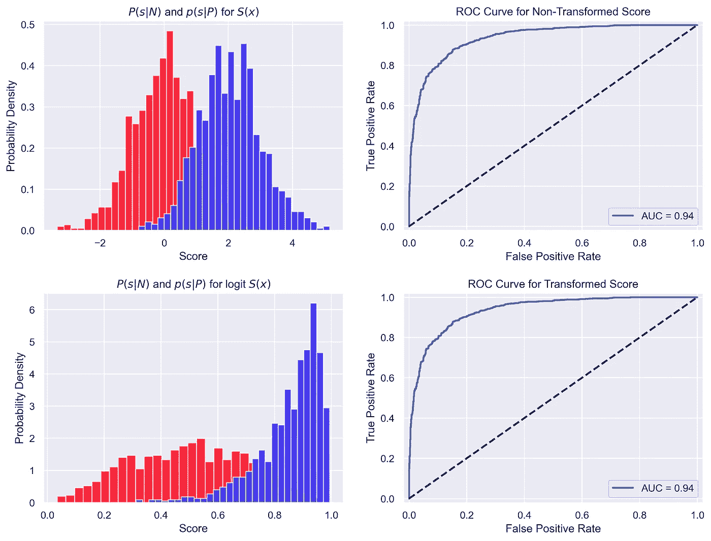

图 6：对得分分布施加单调递增的变换不会改变 ROC 曲线，因为它保持了回归的顺序。

**这个特性使得分类器的校准过程成为可能。**

3\. ***对于阈值 t 点的 ROC 曲线的明确斜率：***

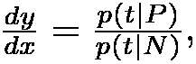

***其中 p(t|P)表示累积分布 p(s ≤ t | P)的密度分布（对于 p(t|N)也是如此）。***

## 二元分类作为假设检验：为我们的方法提供正当性

当从贝叶斯推理的角度来看分类过程时，我们的目标是推导后验概率*p(P|t)*，它表示一个具有阈值*t*的点属于正类的概率。因此，**定义在属性 3 上的斜率导数可以看作是似然比*L(t)。***

> 这个比率*[L(t)]*告诉我们，分类器的 t 值在总体 P 中比在总体 N 中发生的可能性有多大，这反过来可以解释为分配到总体 P 的置信度度量。——《连续数据的 ROC 曲线》(2009 年，Chapman 和 Hall)。

这是一个重要的事实，因为通过建立二元分类过程和假设检验之间的等价关系，我们为为什么基于阈值进行分类提供了正当性。

如果我们用*零假设 H0（个体属于总体 N）对立于备择假设 H1（个体属于总体 P）*来表述分类问题，我们可以得出以下关系：

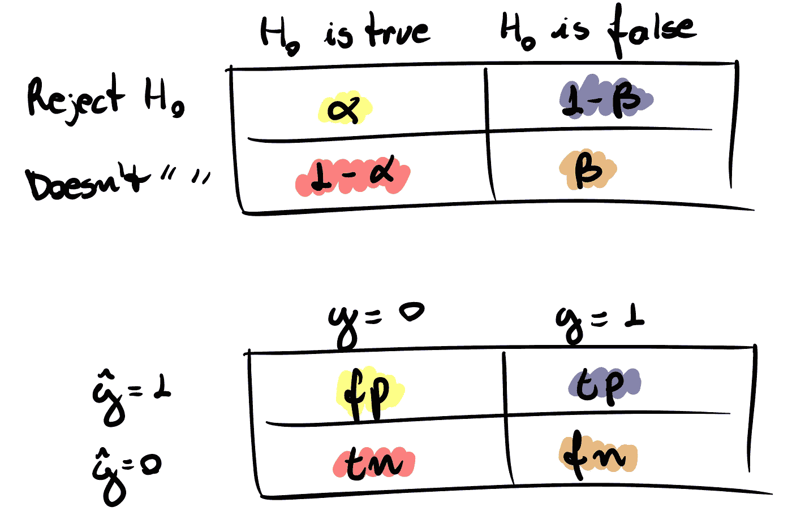

图 7：二元分类过程与假设检验之间的联系通过混淆矩阵可视化。边际比率度量与假设检验中的标准α和β值相关。

**Neyman-Pearson 引理**确立了最强检验——即具有最高*1-β*值的检验——在显著性水平*α*下，拥有一个包含所有* s *值的区域*R*，该区域满足：

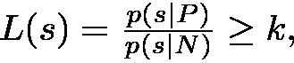

其中*α*足以通过条件*p(s* ∈ *R|N) = α*来确定*k*。

这意味着，当我们以*L(s)*单调递增的方式对总体进行评分时，*s*和*k*之间的一一对应关系确保选择一个超过特定阈值的规则是最佳决策。

对于我们虚构的案例，其中分类器为每个类别分配正态分布，似然直接满足这一条件：

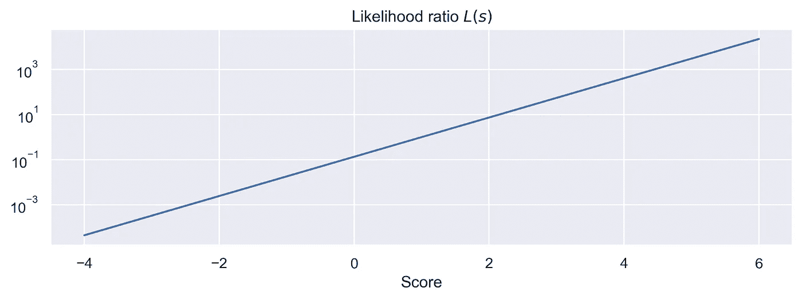

图 8：对于分数的双正态分布情况，似然比是严格递增的（更精确地说，是指数级递增）。

在现实问题中，情况并非总是如此，因为评分分布不一定在此意义上表现良好。我们可以使用*Kaggle*数据集来理解这一点，通过核密度估计（KDE）来估算条件概率的密度。

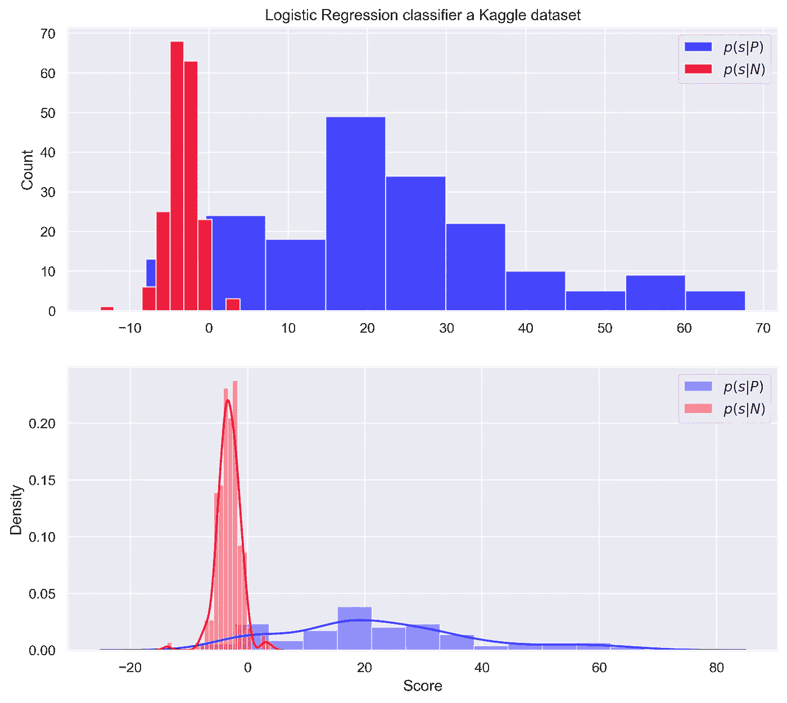

图 9：这是在平衡数据情况下，逻辑回归模型给出的评分分配。该分类器在没有参数调整的情况下进行了训练。

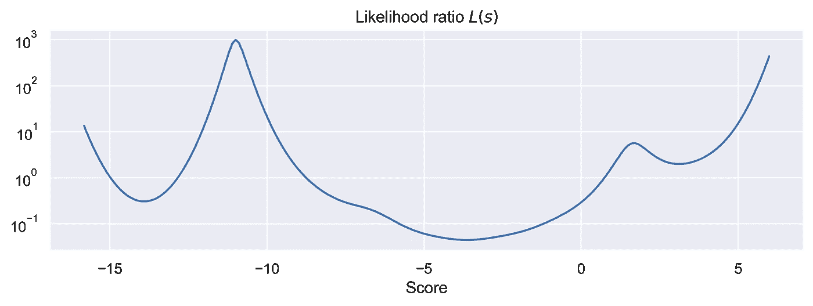

图 10：对于一个实际案例（Kaggle 数据集），我们可以看到，似然比并不一定是单调递增的。

> **这意味着较高的分数不一定与个体属于正类的概率增加相关。**

# **ROC-AUC 的概率解释，以及为什么我们需要谨慎对待它**

*曲线下面积 (AUC)* 可能是最广泛使用的值，用于总结 ROC 曲线表达的结果。*它被定义为从 0 到 1 的 y(x)积分*，正如其名称所示。值得注意的是，完美分类器的表现由正交轴上的点(0, 1)体现，表示零概率的负类误分类，并明确保证正确分类正类。

图 5 中的处理方法给我们提供了一个提示，即良好拟合的概率解释必须与为正类个体分配较高的分数和值为负类个体分配较低的分数的连贯性相关。这正是情况所在，因为有证明——如[1]中提到——*AUC 等同于正类个体的得分（Sp）高于负类个体得分（Sn）的概率：*

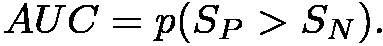

关键要考虑的一点是：AUC 旨在提供一个单一的数字来估算分类器的表现。然而，在实际决策时，必须选择一个适合你问题特定需求的阈值 *t*。挑战在于，如前所述，基于阈值的最佳决策发生在似然比单调递增时，而在实践中这并不总是如此。

*因此，即使你拥有一个接近 1 的高 AUC 值，也不足以确定你的分类器是否能够基于决策边界进行最佳分类。在这种情况下，* ***单单达到一个高 AUC 值并不能保证分类器在实际决策情境中的有效性。***

# 结论

二分类的这种概率解释可能提供了对该过程复杂性更深刻的理解。通过将人群建模为分布，我们可以基于个体属于某个特定类别的概率做出明智的决策。ROC 曲线作为一个有价值的工具，**总结**了阈值选择如何影响分类效率。此外，**二分类与假设检验之间的联系强调了我们为什么通过阈值来进行分类**。需要记住的是，尽管曲线下面积（AUC）是常用的性能评估指标，**它并不总能保证最佳的实际决策**，这突显了选择正确阈值的重要性。**这种概率解释丰富了我们对二分类的理解，使其成为解决实际问题的强大框架。**

# 致谢

特别感谢 Renato Vicente，他让我通过混淆矩阵空间来可视化分类器，并鼓励我撰写本文。

*所有图片和图表均由作者提供。*

*另外，你可以在* [***Linkedin***](https://www.linkedin.com/in/gcosta98/)*找到我。*

# 参考文献

[1] Krzanowski, Wojtek J., and David J. Hand. *连续数据的 ROC 曲线*。Crc Press，2009 年

[2] Muschelli, John (2019–12–23). “ROC 和 AUC 与二元预测变量：一个可能具有误导性的指标”。*分类学期刊*。Springer Science and Business Media LLC. **37** (3): 696–708\. [doi](https://en.wikipedia.org/wiki/Doi_(identifier)):[10.1007/s00357–019–09345–1](https://doi.org/10.1007%2Fs00357-019–09345–1)。 [ISSN](https://en.wikipedia.org/wiki/ISSN_(identifier)) [0176–4268](https://www.worldcat.org/issn/0176-4268)。

# 数据集

[信用卡欺诈 (kaggle.com)](https://www.kaggle.com/datasets/joebeachcapital/credit-card-fraud)
