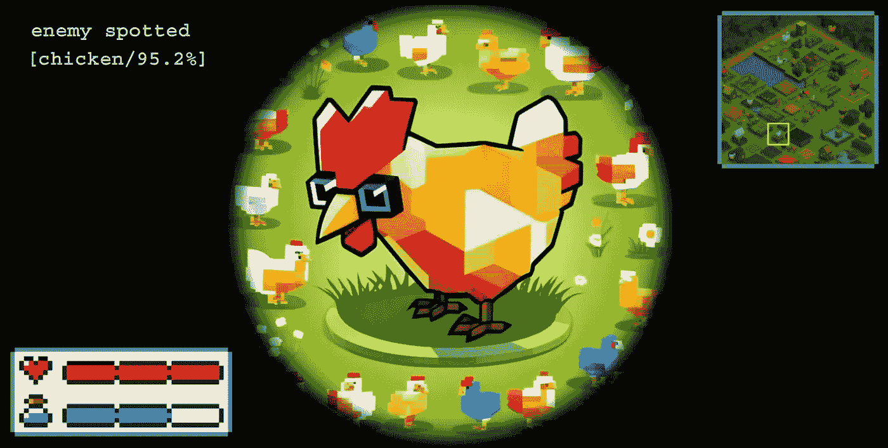
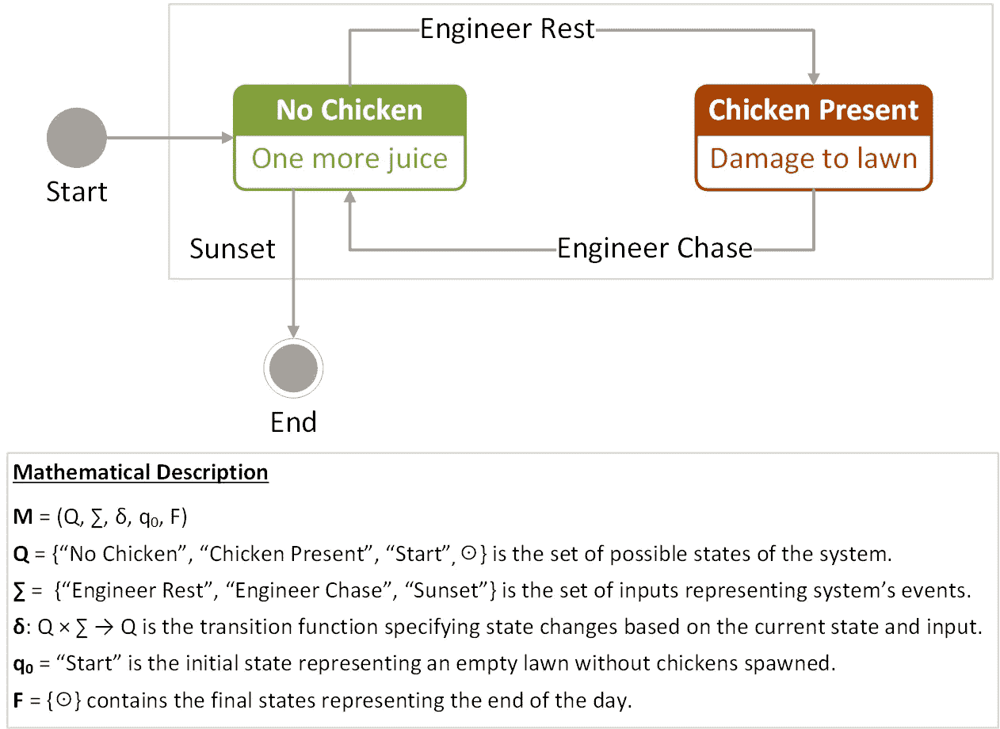
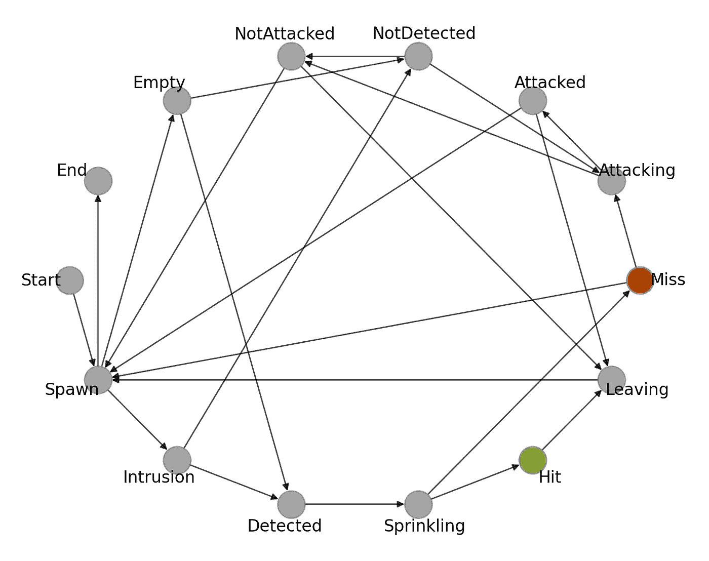

# 有限自动机仿真在利用 AI 辅助系统中的应用

> 原文：[`towardsdatascience.com/bird-by-bird-using-finite-automata-9d50b36bcbd3?source=collection_archive---------9-----------------------#2024-02-13`](https://towardsdatascience.com/bird-by-bird-using-finite-automata-9d50b36bcbd3?source=collection_archive---------9-----------------------#2024-02-13)

## [鸟类技术逐步推进](https://towardsdatascience.com/tagged/bird-by-bird-tech)

## 使用有限状态机设计、建模和仿真现实世界的 AI 系统，以提高物体检测任务的性能

[](https://slipnitskaya.medium.com/?source=post_page---byline--9d50b36bcbd3--------------------------------)[](https://towardsdatascience.com/?source=post_page---byline--9d50b36bcbd3--------------------------------) [Sofya Lipnitskaya](https://slipnitskaya.medium.com/?source=post_page---byline--9d50b36bcbd3--------------------------------)

·发表于 [Towards Data Science](https://towardsdatascience.com/?source=post_page---byline--9d50b36bcbd3--------------------------------) ·阅读时间 13 分钟·2024 年 2 月 13 日

--



图片由作者提供

# 背景

## **问题理解**

最近，我看到一个非常棒的案例，展示了如何利用 Raspberry Pi 和 Python 创建一个基于计算机视觉的物体检测系统。简而言之，一位工程师制作了一个设备，可以把邻居家的鸡赶离他的土地。在跟随 [Reddit 线程](https://www.reddit.com/r/interestingasfuck/comments/y6cp1y/using_a_raspberry_pi_3b_python_opencv_and_machine)之后，很明显这个问题非常普遍，并不限于某些鸟类。如果有的话，它更像是一个普遍现象。最受欢迎的评论包括：

> “我需要这个来对付邻居喂养的鸭子，它们总是在我草坪上拉屎。” *— Light_Beard*
> 
> “我晚上需要这个设备来赶走院子里的猫。” *— Buddha_*
> 
> “这个可以用来吓跑万圣节时的孩子们吗？替朋友问的。” *— HardPawns*

好吧，有人可能会争辩说这个问题并不那么重要，并且很有道理地建议直接问邻居解决这些鸡的问题。然而，这显然不是一个工程师应有的解决方式。假设你已经建立了一个 AI 辅助的鸟类检测系统，并配备了一个喷水器来把不受欢迎的鸡赶出院子。问题是，现有版本的操作效果不如预期，导致依然会明显浪费水资源用于浇洒和草坪清理。因此，鸡继续跑动，水费依旧居高不下。如何解决这个挑战呢？

## 基于模型的复杂系统工程

在这里，我们将通过设计一个计算模型来模拟完整的“鸡在草地上”循环，并随后优化其参数，以减少水的消耗。为此，我们将采用包括自动机理论和随机算法在内的多种技术。

本文特别关注建模和仿真方面，以便你学习如何描述一个真实系统的行为，并设计一个反映其动态的有限状态机。然后，你将探索如何在 Python 中实现这些系统，并通过优化其在物体检测上的表现，发现如何利用基于计算机视觉的模型。这应该很有趣！

***免责声明：*** *本工作是“**鸟语鸟*”系列的一部分，致力于使用有限自动机对计算机视觉应用中的真实系统进行建模和仿真。所有的参与者、状态、事件和输出仅是 FSM 设计过程中的产物，出于教育目的。任何与实际人物、鸟类或真实事件的相似之处纯属巧合。*

# 介绍相关工作

## 用于建模和仿真的有限状态机

有限状态机（FSM）或有限自动机是一种数学模型，可以通过描述离散状态、状态之间的转换以及触发这些转换的规则集来表示和分析系统的动态行为。

有限状态机的历史可以追溯到 20 世纪中期，这一时期标志着自动机理论和计算理论的重要里程碑。艾伦·图灵（Alan Turing）和约翰·冯·诺依曼（John von Neumann）等先驱的早期贡献奠定了基础，但在 1950 年代和 1960 年代，FSM 取得了显著进展。特别是，爱德华·F·摩尔（Edward F. Moore）和乔治·H·米利（George H. Mealy）分别独立地提出了两种主要类型的 FSM——摩尔机和米利机。

这两种 FSM 类型在方法上有所不同：摩尔机仅基于当前状态来确定下一个状态，而米利机则将输出与当前状态和输入关联，提供更强的适应性。最初用于数字电路中，特别是米利机由于其对外部输入信号的响应，已经在设计复杂系统中得到广泛应用，这些系统伴随着我们的日常生活。

有限状态机（FSM）广泛应用于硬件和软件中。四处看看——几乎所有电子和计算设备都有某种形式的有限自动机——从自动售货机到中央处理单元（CPU），从基本的电子设备到智能家居自动化的可编程逻辑控制器。它们也被广泛应用于软件和游戏开发中，当然，也可以用于创建实时物体检测的自适应 AI 辅助系统。

## 离散数学的回归

从本质上讲，确定性有限自动机包括状态、输入和转移函数。状态表示系统的不同条件，而输入触发状态之间的切换。转移函数定义了机器如何在状态之间转换的规则。从数学角度看，这样的状态机可以用一个五元组表示，记作 M=(Q, Σ, δ, q₀, F)，其中：

+   Q 是一个表示系统不同配置的状态集合。

+   Σ 是一个由触发状态变化的事件组成的输入集合。

+   转移函数 δ 决定了系统在给定输入的情况下如何在状态之间切换（δ:Q×Σ→Q）。

+   初始状态 q₀ 是系统初始化时的起始状态，其中 q₀∈Q。

+   F 是 Q 的子集（F⊆Q），由最终状态组成。

通过这种方式，对于任何给定的状态和特定的输入符号，转移函数 δ 将确定一个唯一的下一个状态，通常通过状态转换表或图来表示，指定当前状态和输入的组合下的状态转移。

## FSM 设计过程

有限状态机（FSM）的设计过程包括识别状态（以及在适用的情况下识别输入）、定义转移函数，并指定初始状态和最终状态。可以采用以下方法论将复杂系统转化为易于理解的模型，从而有助于后续的分析、设计和实施阶段。5 步 FSM 设计过程包括：

1.  理解问题，分析系统的结构。

1.  为设计一个概念模型定义关键组件。

1.  创建状态图或定义状态转换表。

1.  实现机器的状态、输入和输出，以及转移逻辑。

1.  测试并通过实验验证 FSM。

这个迭代过程使得我们能够设计出简洁的真实系统行为的表示，允许在过程中进行近似和细化。例如，在实现 FSM（第 4 步）后，你可能希望进一步验证并更新规格（第 2 步和第 3 步），同样也适用于从实验阶段（第 5 步）回到问题定义阶段（第 1 步），以创建一个足够详细且有用的工作模型来解决特定问题。

## **状态机示例**

让我们以一个简单的“鸡在草地”场景为例，其中一只鸟可以出现在草地上，也可以不在草地上**，**这取决于由工程师发起的外部刺激，工程师可以选择休息或赶走侵入其财产的“不速之客”。因此，控制对象（工程师）旨在补偿独立行为者（鸡）参数的不确定性。在这个例子中，最终状态集合 F 只包含一个系统终止的状态，例如在一天结束时没有鸡在周围。这样：

+   Q = {q₀, q₁, q₂, ⊙}: 表示没有鸡/有鸡的状态集合。

+   Σ = {α₀, α₁, α₂}: 输入事件集合 — 工程师休息/追赶，以及日落。

+   F = {⊙} 包含表示一天结束的最终状态。

图 1 提供了一个状态转换图，其中的节点（状态）通过边（下一状态转换）连接，弧线上的标签指定触发转换的输入事件。



图 1. 简单状态机的图形表示（图片来源：作者）

这种表示法捕捉了问题的二元性质，其中鸡可以出现在草坪上，也可以不在草坪上。系统响应由工程师或日落触发的事件。在图中，初始状态和最终状态由圆圈表示。该有限状态机（FSM）的转移函数δ也可以以表格形式表示，展示系统的状态转换和控制操作，如表 1 所示。

```py
 Table 1\. State-transition table for the chicken-on-the-lawn FSM example

+========================+========================+========================+
| Current State          | Input Event            | Next State             |
+========================+========================+========================+
| q₀ ≡ ”No Bird”         | α₀ ≡ ”Engineer Rest”   | q₁                     |
+------------------------+------------------------+------------------------+
| q₁ ≡ ”Bird Present”    | α₁ ≡ ”Engineer Chase”  | q₀                     |
+------------------------+------------------------+------------------------+
| q₀                     | α₂ ≡ ”Sunset”          | ⊙                     |
+------------------------+------------------------+------------------------+
```

因此，通过完成五个简单步骤，我们设计了一个简单的状态机。现在，一切都已经解释清楚，最后让我们创建一个基于 FSM 的模型，来表示我们在草坪上与鸟类的挑战。

# 处理草坪上的鸟类挑战

## 它们在草坪上的活动

正如你在上一节中学到的，有限自动机可以用来模拟几乎任何过程。想象一下，今天下午你家后院有一些鸡在跳来跳去。它们在做什么？只要观察一下就知道。它们总是在动，唱歌，或互动。它们经常飞翔、探测或觅食。有时，它们会展示或做一些引起我们注意的事，比如那些邻居家的鸡把草弄得一团糟，但我们现在先把这些细节放一边。好吧，最终，所有的鸟都在拉屎（没有冒犯，羽毛朋友们）。对于 FSM 设计，我们不会涉及更细致的部分，而是通过逻辑提取出模拟所需的基本组件。让 FSM 将水的冒险提升到下一个玩法的高度！

## 系统描述

关于鸡的部分，在这里，我们将描述系统，以反映我们的实际场景，目的是优化物体检测系统的参数并减少草坪清洁的水费。为了参考，可以再看看之前的 FSM 示例。这个简单的机器与现实生活中的系统在一些特定方面有所不同。首先，我们希望将控制对象实际化，包含一个基于人工智能的设备，用于检测和驱赶鸟类，这次通过高压喷洒枪实现（这样工程师就可以“自循环”回到休息状态）。

其次，我们需要更新和/或扩展可能的状态、事件和转换集合，以反映更新系统设置的复杂性。对于后者，我们为何不考虑可以被计算机视觉模型识别的额外鸟类类别（例如火鸡），使它们成为我们 FSM 的潜在独立参与者。此外，假设鸟类的体型在物种间有所不同，灌溉控制系统需要更强的水流和/或压力，才能成功地将体型较大的火鸡赶离草坪，而不像对待鸡那样简单。因此，为了简洁起见，我们将鸡与火鸡在草坪上的问题简称为 CaT 问题。

## 概念建模

为了建模对象检测系统需要监视、分类并与闯入物业的物体互动的场景，我们将定义状态、事件和转换，表示这一情况的不同方面。我们的目标是捕捉对象检测系统和鸡可能处于的各种状态，以及触发状态转换的事件。

对于逻辑设计场景，考虑到在任何时刻，一只鸟可以进入院子，弄乱草坪（或不弄乱），并且离开物业，不论是它自己离开，还是被基于 AI 的草坪安保系统成功检测并赶走。现在，让我们定义一些 FSM 仿真模拟的主要组成部分。

**状态**表示反映 CaT 场景的可能条件：

+   对于跳跃的目标：生成和入侵状态、攻击及其结果、离开草坪。

+   对于 AI 系统：检测状态、喷洒状态。

+   初始状态“开始”与仿真模拟的入口点相关。

+   终止状态“结束”表示仿真模拟的终点。

**状态转换**决定了系统如何根据输入在不同状态之间切换。例如，AI 模型可能忽略一只鸟并错过喷洒过程，从而导致草坪上的一系列后果。以下是我们可以预见的一些其他场景和条件：

+   从“入侵”到“目标检测”在“检测”事件上转换。

+   从“目标检测”到“鸟离开”事件，通过“喷洒”和“击中”事件的序列，在闯入的鸟被检测到并成功被水喷头击中后。

+   从“鸟出现”到“攻击”，如果系统在目标检测和预测步骤中失败，而鸟实际上就在草坪上。在鸟被检测到但系统未能成功击中时，也会发生相同的事件。

通过这种方式，有限状态机（FSM）将在 AI 系统与四处跳跃的鸡互动时动态地从一个状态转移到另一个状态。为了简化任务并减少出错的可能性，我们创建了一个结合状态转换和条件的表格：

```py
Table 2\. FSM inputs describing the events triggering state changes

+====+==================================+==================+================+
| ID | Input Description                | Defence System   | Enemy Tactics  |
|    |                                  | Operation Mode   | and Waypoints  |
+====+==================================+==================+================+
| X₁ | Bird is present on the lawn      |                  | Hopping        |
+----+----------------------------------+ Object detection +----------------+
| X₂ | Bird intrudes the lawn           |                  | Start hopping  |
+----+----------------------------------+------------------+----------------+
| X₃ | AI-powered detector spots a bird | Start sprinkling | Hopping (still)|
+----+----------------------------------+------------------+----------------+
| X₄ | Bird is hit successfully¹        |                  |                |
+----+----------------------------------+        -         | Intimidation   |
| X₅ | Target is susceptible²           |                  |                |
+----+----------------------------------+------------------+----------------+
| X₆ | Bird spoiled the lawn            |                  | Hopping merrily|
+----+----------------------------------+ Object detection +----------------+
| X₇ | Bird leaves the lawn             |                  | Retreat        |
+----+----------------------------------+------------------+----------------+
| X₈ | Simulation period ends (sunset)  |        -         | -              |
+----+----------------------------------+------------------+----------------+
ID - input identifier
¹ - aiming and sprinkling modules operated correctly
² - water flow rate is strong enough to chase the bird away
```

## **状态转换表**

现在，在识别了状态和事件后，我们将编写一个结合状态转换表，并使用布尔表达式表示下一个状态。在表 3 中，我们可以看到表 2 中描述的输入如何引导模拟状态之间的转换。

```py
Table 3\. FSM state transition table with next-stage transition logic

+========================+========================+========================+
| Current State          | Transition Formula     | Next State             |
+========================+========================+========================+
| Start                  | TRUE                   | Spawn                  |
+------------------------+------------------------+------------------------+
|                        | X₁ ∨ X₂                | Intrusion              |
|                        |------------------------+------------------------+
| Spawn                  | ¬X₁ ∧ ¬X₂              | Empty lawn             |
+                        |------------------------+------------------------+
|                        | X₈                     | End                    |
+------------------------+------------------------+------------------------+
|                        | X₃                     | Target detected        |
| Intrusion              |------------------------+------------------------+
|                        | ¬X₃                    | Not detected           |
+------------------------+------------------------+------------------------+
|                        | X₃                     | Target detected        |
| Empty lawn             |------------------------+------------------------+
|                        | ¬X₃                    | Not detected           |
+------------------------+------------------------+------------------------+
| Target detected        | TRUE                   | Sprinkling             |
+------------------------+------------------------+------------------------+
|                        | X₁                     | Attacking              |
| Not detected           |------------------------+------------------------+
|                        | ¬X₁                    | Not attacked           |
+------------------------+------------------------+------------------------+
|                        | ¬X₁ ∨ ¬X₄ ∨ ¬X         | Miss                   |
| Sprinkling             |------------------------+------------------------+
|                        | X₁ ∧ X₄ ∧ X₅           | Hit                    |
+------------------------+------------------------+------------------------+
|                        | ¬X₁                    | Spawn                  |
| Miss                   |------------------------+------------------------+
|                        | X₁                     | Attacking              |
+------------------------+------------------------+------------------------+
| Hit                    | TRUE                   | Bird leaves            |
+------------------------+------------------------+------------------------+
|                        | ¬X₆                    | Not attacked           |
| Attacking              |------------------------+------------------------+
|                        | X₆                     | Bird attacked          |
+------------------------+------------------------+------------------------+
|                        | ¬X₇                    | Spawn                  |
| Not attacked           |------------------------+------------------------+
|                        | X₇                     | Bird leaves            |
+------------------------+------------------------+------------------------+
|                        | ¬X₇                    | Spawn                  |
| Bird attacked          |------------------------+------------------------+
|                        | X₇                     | Bird leaves            |
+------------------------+------------------------+------------------------+
| Bird leaves            | TRUE                   | Spawn                  |
+------------------------+------------------------+------------------------+
```

在大多数情况下，一个输入决定了下一个状态。然而，我们需要同时考虑多个条件来切换“生成”或“喷洒”状态。你也可以注意到，对于某些状态，转换不依赖外部信息，例如“开始”或“击中”。这些状态要么是特殊的（如“开始”），要么是触发辅助动作的状态。后者对我们模拟的故事没有直接影响（即在这方面，它们可以与后续状态结合使用），但对于收集模拟统计数据非常重要。

最后，让我们来看一下它的可视化表示。图 3 展示了对应于 CaT 系统生命周期内状态转换的图。你或许已经能看到它们之间的联系了。接下来的文章中，你将学习如何在 Python 中实现这个 FSM，以及如何利用它来优化 AI 辅助鸟类检测系统的参数，以减少水费开销。



图 2. 表示 AI 辅助草坪安全系统的 FSM 状态转换图（图片来自作者）

# 结论

在本文中，我们探讨了如何在实践中应用有限状态机（FSM），构建一个模型来解决 CaT 问题，从而实现高层次的问题分析和解决方案设计。

我们通过将 FSM 形式化应用于个体参与者及其相互作用，描述了复杂的庭院过程，从而创造了一个全面的视角，展示了我们必须处理的现实世界情况，其中我们不得不应对邻里鸟类闯入我们的领地。

这使我们能够创建一个模拟，反映了 AI 辅助安全系统的运作，系统配备了喷洒用的水压控制器，旨在进行物体检测并驱赶破坏草坪的不速之客。

# 接下来是什么？

在接下来的系列文章中，我们将进一步研究使用 FSM 模拟现实场景的主题，以及它在解决水费优化问题中的实际应用。

具体来说，下一篇文章将包括一个 Python 教程，教你如何从头开始实现一个 FSM 驱动的模拟，并将其作为随机优化流程的一部分来使用。基于创建的模拟，我们接下来将探讨如何利用它，通过应用蒙特卡洛和可解释 AI（XAI）技术，优化基于计算机视觉的鸟类检测子系统的性能，从而提高我们草坪安全系统的资源效率。

想继续了解更多内容吗？在以下链接保持更新 — [`github.com/slipnitskaya/computer-vision-birds`](https://github.com/slipnitskaya/computer-vision-birds) 和 [`medium.com/@slipnitskaya`](https://medium.com/@slipnitskaya)。

# 参考文献

1.  Moore, Edward F. “关于顺序机器的思想实验。”《自动机研究》34 (1956): 129–153。

1.  Mealy, George H. “一种合成顺序电路的方法。”《贝尔系统技术杂志》34.5 (1955): 1045–1079。

1.  Sipser, M. “计算理论导论。”第二版，Thomson Course Technology (2006)。
