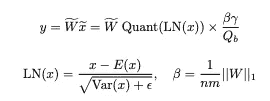

# Bit-LoRA 作为 BitNet 和 1.58 位神经网络技术的应用

> 原文：[`towardsdatascience.com/bit-lora-as-an-application-of-bitnet-and-1-58-bit-neural-network-technologies-17ee80bf79f9?source=collection_archive---------2-----------------------#2024-06-03`](https://towardsdatascience.com/bit-lora-as-an-application-of-bitnet-and-1-58-bit-neural-network-technologies-17ee80bf79f9?source=collection_archive---------2-----------------------#2024-06-03)

## 摘要：将约 1 位变换器技术应用于 LoRA 适配器，使我们能够实现与全精度 LoRA 相当的性能，同时将 LoRA 适配器的大小缩小了 30 倍。这些微小的 LoRA 适配器能够改变基础模型的性能，揭示 LLM 个性化的新机会。

[](https://medium.com/@r.smirnov.mailbox?source=post_page---byline--17ee80bf79f9--------------------------------)[](https://towardsdatascience.com/?source=post_page---byline--17ee80bf79f9--------------------------------) [Roman S](https://medium.com/@r.smirnov.mailbox?source=post_page---byline--17ee80bf79f9--------------------------------)

·发表于[Towards Data Science](https://towardsdatascience.com/?source=post_page---byline--17ee80bf79f9--------------------------------) ·13 分钟阅读·2024 年 6 月 3 日

--

# ***1.58 位是什么？***

现在有一种名为“LLM”的技术非常流行。LLM 代表大型语言模型。这些 LLM 能够解决相当复杂的任务，使我们更接近我们想象中的 AI。LLM 通常基于变换器架构（虽然也有一些替代方法，但它们仍在开发中）。变换器架构需要相当昂贵的计算资源，因为这些 LLM 是**大型**的，计算需要大量的时间和资源。例如，现如今 LLM 的较小规模大约为 70-80 亿个参数——这就是我们在模型名称中看到的数字（例如 Llama3**–8B**或 Llama2**–7B**）。除了数量庞大，为什么计算如此昂贵呢？其中一个原因是计算的精度——常规的训练和推理过程中使用的是 16 位或 32 位精度，这意味着模型中的每个参数在内存中需要 16 或 32 位，而所有计算都以这种精度进行。简而言之，一般来说，位数越多——存储和计算所需的资源就越多。

量化是减少每个参数使用的位数，从而减少所需资源（缩短推理时间）的一种众所周知的方法，代价是牺牲一定的准确性。实现量化有两种方式：后训练量化和量化感知训练。在第一种情况中，我们在模型训练完成后进行量化——这是简单但有效的方法。然而，如果我们想要一个更加准确的量化模型，我们应该进行量化感知训练。

关于量化感知训练的一些话，当我们进行量化感知训练时，我们强制模型在低精度下产生输出，假设是 4 位而不是原来的 32 位：简单的类比，我们计算 3.4 + x，期望的正确答案（目标）是 5.6（浮点精度），在这种情况下我们知道（训练后模型也知道）x = 2.2（3.4+2.2=5.6）。在这个简单的类比中，后训练量化类似于在我们知道 x 是 2.2 后应用四舍五入操作——我们得到 3 + 2 = 5（尽管目标仍然是 5.6）。但是量化感知训练试图找到一个 x，使我们能够更接近真实目标（5.6）——我们在训练过程中应用“伪”量化，简而言之——进行四舍五入——我们得到 3 + x = 6，x = 3。关键在于，6 比 5.6 更接近目标值，而不是 5。这个例子在技术上并不完全准确，但可以为我们提供一些见解，为什么量化感知训练通常比后训练量化更准确。这个例子中不准确的一个技术细节是，量化感知训练过程中我们使用量化的模型权重进行预测（前向传播），但是在反向传播过程中我们仍然使用高精度来保持模型的平滑收敛（这就是为什么它被称为“伪”量化）。这与我们在 fp16 混合精度训练中做的操作非常相似：我们使用 16 位精度进行前向传播，但在进行梯度计算和权重更新时，使用主模型的 fp32（32 位）精度。

好的，量化是一种使模型更小且资源更高效的方法。好的，量化感知训练似乎比后训练量化更准确，但我们能在这些量化的基础上走多远呢？有两篇论文我想提一下，它们指出我们可以将量化精度降到低于 2 位，并且训练过程仍然保持稳定：

1.  [BitNet：扩展 1 比特变换器以支持大语言模型](https://arxiv.org/pdf/2310.11453)。作者提出了一种方法，使所有权重都处于 1 比特精度：只有 1 或-1（而激活值则处于 8 比特精度）。这种低精度仅在前向步骤中使用，而在反向传播中使用高精度。

1.  [1 比特 LLM 的时代：所有大语言模型都处于 1.58 位](https://arxiv.org/pdf/2402.17764)。这篇论文基于 BitNet 论文，不过这里的作者使用{-1; 0; 1}作为模型中每个参数的可能取值，而不仅仅是 1 和-1。

当我第一次看到这些论文时，我相当怀疑——我不相信如此低精度的模型能够达到与全精度 LLM 相当或更好的准确度。而且我依然持怀疑态度。对我来说，这听起来好得令人难以置信。另一个问题是——我没有看到任何一款按照这些论文训练的 LLM 可以让我操作并证明其性能与全精度模型相当。但我能自己训练出这样的 LLM 吗？嗯，我怀疑——我没有足够的资源从头开始训练一个 LLM，尤其是在使用这些技术的情况下。然而，当我们处理 LLM 时，我们通常进行微调，而不是从头开始训练，而且有一种微调模型的技术叫做 LoRA，即我们初始化一些额外的模型权重并从零开始调整它们。

# ***2\. 什么是 LoRA，为什么使用它？***

LoRA 是一种参数高效模型微调（PEFT）技术。其主要思想是，我们只微调由一对线性层组成的适配器的附加权重，而基本模型保持不变。这对于我尝试使用 1.58 位技术的工作非常重要。关键是，我可以从零开始训练这些适配器，并查看是否能获得与全精度适配器训练相当的 LLM 性能。剧透：在我的实验中，低精度适配器训练的结果略差一些，但这种训练方法有一些不同的好处和潜在的应用——在我看来，主要是在个性化领域。

# ***3\. 实验***

在实验中，我使用了我专有的文本生成任务数据。数据本身在这里并不重要，我只是想说它是用于训练指令跟随 LLM 的指令数据集的一个小子集。作为基础模型，我决定使用 [microsoft/Phi-3-mini-4k-instruct](https://huggingface.co/microsoft/Phi-3-mini-4k-instruct) 模型。我进行了 3 个 Epoch 的 LoRA 适配器微调，使用了 Huggingface Trainer 的 fp16 混合精度训练，并在评估中测量了损失。之后，我实现了 BitNet（替换 LoRA 适配器中的线性层）和 1.58 位 LoRA 训练，并报告了结果。我在训练中使用了 BitsAndBytes 进行 4 位基础模型量化，并采用了 Q-LoRA 配置。

以下 LoRA 超参数被使用：rank = 32, alpha = 16, dropout = 0.05。

***3.1\. 经典 LoRA 训练***

在所有 LoRA 实验中，使用了 [QLoRA](https://arxiv.org/pdf/2305.14314) 方法，涉及基础模型量化部分使用了 NF4，并将 LoRA 应用于基础模型的所有线性层。优化器是 Paged AdamW，具有预热和余弦退火，直到最大学习率的 90%。最大学习率为 2e-4。训练/测试集是随机划分的，测试集占整个数据集的 10%。

***3.2\. LoRA BitNet 实现***

对于 BitNet LoRA 训练，采用了“[BitNet: Scaling 1-bit Transformers for Large Language Models](https://arxiv.org/pdf/2310.11453)”中的方法，并使用了[其实现的代码](https://github.com/kyegomez/BitNet)。根据 BitNet 论文，LoRA 层的权重经过了二值化处理，并进行了缩放：


图片来源于论文[BitNet: Scaling 1-bit Transformers for Large Language Models](https://arxiv.org/pdf/2310.11453)

与此同时，激活函数也应根据论文中的方法进行量化：



图片来源于论文[BitNet: Scaling 1-bit Transformers for Large Language Models](https://arxiv.org/pdf/2310.11453)

根据提供的公式，可以看到每个参数都经过符号函数的转换，变为 +1 或 -1，这些参数与量化和归一化的输入 X 相乘，并通过层参数的均值绝对值进行缩放。代码实现：

```py
from torch import nn, Tensor
import torch.nn.functional as F

# from https://github.com/kyegomez/zeta
class SimpleRMSNorm(nn.Module):
   """
   SimpleRMSNorm

   Args:
       dim (int): dimension of the embedding

   Usage:
   We can use SimpleRMSNorm as a layer in a neural network as follows:
       >>> x = torch.randn(1, 10, 512)
       >>> simple_rms_norm = SimpleRMSNorm(dim=512)
       >>> simple_rms_norm(x).shape
       torch.Size([1, 10, 512])

   """

   def __init__(self, dim):
       super().__init__()
       self.scale = dim**-0.5

   def forward(self, x):
       """Forward method of SimpleRMSNorm"""
       return F.normalize(x, dim=-1) * self.scale

def activation_quant(x: Tensor):
   """Per token quantization to 8bits. No grouping is needed for quantization

   Args:
       x (Tensor): _description_

   Returns:
       _type_: _description_
   """
   scale = 127.0 / x.abs().max(dim=-1, keepdim=True).values.clamp_(min=1e-5)
   y = (x * scale).round().clamp_(-128, 127) / scale
   return y

def weight_quant(w: Tensor):
   scale = w.abs().mean()
   e = w.mean()
   u = (w - e).sign() * scale
   return u

class BitLinear(nn.Linear):
   """
   Custom linear layer with bit quantization.

   Args:
       dim (int): The input dimension of the layer.
       training (bool, optional): Whether the layer is in training mode or not. Defaults to False.
       *args: Variable length argument list.
       **kwargs: Arbitrary keyword arguments.

   Attributes:
       dim (int): The input dimension of the layer.

   """

   def forward(self, x: Tensor) -> Tensor:
       """
       Forward pass of the BitLinear layer.

       Args:
           x (Tensor): The input tensor.

       Returns:
           Tensor: The output tensor.
       """
       w = self.weight
       x_norm = SimpleRMSNorm(self.in_features)(x)

       # STE using detach
       # the gradient of sign() or round() is typically zero
       # so to train the model we need to do the following trick
       # this trick leads to "w" high precision weights update 
       # while we are doing "fake" quantisation during the forward pass
       x_quant = x_norm + (activation_quant(x_norm) - x_norm).detach()
       w_quant = w + (weight_quant(w) - w).detach()
       y = F.linear(x_quant, w_quant)
       return y
```

上述所有代码均来自[`github.com/kyegomez/BitNet`](https://github.com/kyegomez/BitNet) GitHub 仓库。

在 LoRA 训练后，由于每个 LoRA 适配器仅由一对线性层组成且不包含偏置和非线性激活函数，因此可以将适配器权重与基础模型合并。激活函数的归一化（LN(x)）和在该方法中的量化使得 LoRA 适配器的合并变得更加困难（合并后，LoRA 适配器与基础模型的线性层共享相同的输入——这些层处理的激活没有任何额外的修改），因此进行了没有归一化和激活量化的额外实验，**并且取得了更好的性能**。为了进行这种修改，我们只需修改 BitLinear 类的前向方法：

```py
 def forward(self, x: Tensor) -> Tensor:
       """
       Forward pass of the BitLinear layer.

       Args:
           x (Tensor): The input tensor.

       Returns:
           Tensor: The output tensor.
       """
       w = self.weight
       #x_norm = SimpleRMSNorm(self.in_features)(x)

       # STE using detach
       #x_quant = x_norm + (activation_quant(x_norm) - x_norm).detach()
       x_quant = x
       w_quant = w + (weight_quant(w) - w).detach()
       y = F.linear(x_quant, w_quant)
       return y
```

所提供的代码是量化感知训练，因为每个 BitLinear 层的主权重仍然保持高精度，而我们在前向传播时对权重进行二值化（同样的方法也可以用于模型推理）。唯一的问题是，我们额外有一个“scale”参数，它是每个层特有的并且具有高精度。

获取 BitLinear 层后，我们需要用这些新的线性层替换 LoRA 适配器中的线性层，以将 BitLinear 修改应用到经典的 LoRA 中。为此，我们可以重写 LoraLayer 类（peft.tuners.lora.layer.LoraLayer）中的“update_layer”方法，使用 BitLinear 层代替 Linear 层：

```py
from peft.tuners.lora.layer import LoraLayer
import torch
import torch.nn.functional as F
from torch import nn

class BitLoraLayer(LoraLayer):
   def update_layer(
       self, adapter_name, r, lora_alpha, lora_dropout, init_lora_weights, use_rslora, use_dora: bool = False
   ):
       if r <= 0:
           raise ValueError(f"`r` should be a positive integer value but the value passed is {r}")

       self.r[adapter_name] = r
       self.lora_alpha[adapter_name] = lora_alpha
       if lora_dropout > 0.0:
           lora_dropout_layer = nn.Dropout(p=lora_dropout)
       else:
           lora_dropout_layer = nn.Identity()

       self.lora_dropout.update(nn.ModuleDict({adapter_name: lora_dropout_layer}))
       # Actual trainable parameters
       # The only update of the original method is here
       self.lora_A[adapter_name] = BitLinear(self.in_features, r, bias=False)
       self.lora_B[adapter_name] = BitLinear(r, self.out_features, bias=False)

       if use_rslora:
           self.scaling[adapter_name] = lora_alpha / math.sqrt(r)
       else:
           self.scaling[adapter_name] = lora_alpha / r

       if isinstance(init_lora_weights, str) and init_lora_weights.startswith("pissa"):
           self.pissa_init(adapter_name, init_lora_weights)
       elif init_lora_weights == "loftq":
           self.loftq_init(adapter_name)
       elif init_lora_weights:
           self.reset_lora_parameters(adapter_name, init_lora_weights)

       # check weight and qweight (for GPTQ)
       for weight_name in ("weight", "qweight"):
           weight = getattr(self.get_base_layer(), weight_name, None)
           if weight is not None:
               # the layer is already completely initialized, this is an update
               if weight.dtype.is_floating_point or weight.dtype.is_complex:
                   self.to(weight.device, dtype=weight.dtype)
               else:
                   self.to(weight.device)
               break

       if use_dora:
           self.dora_init(adapter_name)
           self.use_dora[adapter_name] = True
       else:
           self.use_dora[adapter_name] = False

       self.set_adapter(self.active_adapters)
```

在创建此类之后，我们可以用新方法替换原始 LoraLayer 的 update_layer 方法：

```py
import importlib

original = importlib.import_module("peft")
original.tuners.lora.layer.LoraLayer.update_layer = (
    BitLoraLayer.update_layer
)
```

***3.3\. 1.58 位 LoRA***

在此实验中，采用了“[The Era of 1-bit LLMs: All Large Language Models are in 1.58 Bits](https://arxiv.org/pdf/2402.17764)”中的方法。其概念上的区别在于，论文中作者提出将权重量化为 -1、0 和 +1，以提高准确性，而不是将其二值化为 +1 和 -1。


图片来自[《1-bit LLM 时代：所有大型语言模型都在 1.58 比特内》](https://arxiv.org/pdf/2402.17764)论文

作者将激活缩放从实验中的流水线中排除，因为它在与基础模型合并时造成了额外的困难。在我们的实验中，我们还从流水线中移除了激活量化，以简化 LoRA 适配器的合并。

要使用这种方法调整 LoRA 适配器，我们只需更新`weight_quant`函数，如下所示：

```py
def weight_quant(w: Tensor):
   scale = w.abs().mean()
   adjustment = 1e-4 + scale / 2
   w_quant = w / adjustment
   return torch.clip(input=torch.round(w_quant), min=-1, max=1)*scale
```

对于 1.58 比特实现，我使用了[《Binary Magic: Building BitNet 1.58bit Using PyTorch from Scratch》](https://medium.com/@theseriousprogrammer/binary-magic-building-bitnet-1-58bit-using-pytorch-from-scratch-01fa6289db6f)这篇文章作为起点。

# ***4. 结果***

结果是，四个模型使用不同的方法训练，旨在实现 LoRA 线性层：

+   经典 LoRA（LoRA）；

+   启用激活规范化、量化和缩放的 BitNet（BitNet-original）；

+   没有任何激活修改的 BitNet（BitNet-noact）；

+   根据 1.58 比特（1.58Bit）的方法。

所有实验的训练超参数保持不变，唯一不同的是 LoRA 线性层的实现。在使用 Weights&Biases（Wandb）记录的训练统计中：


作者提供的图片：训练损失

至于 1.58Bit 的紫色线，它在上面的图像中不可见，因为被蓝色和绿色线覆盖：


作者提供的图片：在 Wandb 中选择的 1.58Bit 模型的训练损失


作者提供的图片：训练过程中 3 个 epoch 的梯度变化


作者提供的图片：*训练过程中 3 个 epoch 的学习率余弦退火*

除了 BitNet-original，所有实验的训练表现相同。我认为 BitNet-original 表现较差是因为该方法中使用了激活量化。评估损失被用作整体性能质量的指标。除了 BitNet-original，其他三种方法在评估中的表现相似（损失越低越好）：


作者提供的图片：评估损失（选择的损失是在第二个 epoch 之后）

最好的结果是在第二个 epoch 训练之后得到的。两个有趣的观察结果：

+   1.58Bit 和 BitNet-noact 表现非常相似；

+   在第二个 epoch 之后看到的过拟合现象，在经典 LoRA 中比在量化线性层中更加明显。

总体而言，结论可能是这样的：1 比特实现的性能是否与全精度模型相当或更好——否，它们略微逊色（在呈现的实验中，只有 LoRA 层使用了低精度，可能如文献中所述的全 1 比特 transformers 效果更好）。同时，这些低精度实现与全精度 LoRA 实现相比，差距并不大。

# ***5\. 定性结果***

在训练了 LoRA 适配器后，我们已经将适配器以 pytorch 格式单独保存。为了分析性能，我们使用了为 BitNet-noact 实验保存的适配器。根据上面提供的代码，我们在前向传播过程中进行了量化，同时权重以全精度保存。如果我们执行 torch.load 加载适配器文件，我们会看到参数是高精度的（如预期）：

```py
tensor([[-9.4658e-03,  1.8515e-02,  2.4467e-02,  ...,  8.9979e-03]])
```

但是，在我们对这些权重应用与前向步骤相同的量化函数后，我们得到了以下张量：

```py
tensor([[-0.0098,  0.0098,  0.0098,  ...,  0.0098]])
```

这些权重被用于前向步骤，因此这些权重应该与基础模型合并。使用量化函数，我们可以转换所有适配器层，并将更新后的适配器与基础模型合并。还可以注意到，提供的张量可以用-1 和 1 的值表示，并且该缩放因子——0.0098——对于每一层的所有权重都是相同的。

该模型在一个数据集上进行了训练，其中有几个样本的回答中包含了助手的名字“Llemon”——这个名字对于普通英语来说并不常见，因此基础模型可能不知道它。在将 BitNet-noact 转换后的权重与基础模型合并后，回答问题“Who are you what’s ur name?”的结果是：“Hello! I’m Llemon, a small language model created...”。这样的结果表明模型训练、适配器权重转换和合并工作正常。

同时我们发现，根据评估损失，所有低精度训练结果稍微比高精度训练差一些，那么为什么要进行低精度 LoRA 适配器训练（除了基于某些研究论文的低精度模型实验实现以检查性能）呢？量化模型权重远小于全精度模型权重，而低权重 LoRA 适配器则能发现进行 LLM 个性化的新机会。应用于 3B 基础模型所有线性层的原始 LoRA 适配器权重在高精度下大约为 200MB。为了优化保存的文件大小，我们首先可以分别存储每一层的尺度和权重（经过二值化）：尺度以高精度存储，权重以整数精度存储（每个值 8 位）。进行这种优化后，我们得到的文件约为 50MB，因此它比原文件小 4 倍。在我们的案例中，LoRA 排名为 32，所以每个权重矩阵的大小为（*, 32）或（32, *），在转置后第二种类型可表示为（*, 32）。这些 32 个参数中的每一个可以转化为 0 或 1，32 个零和一可以表示为一个 32 位的值，这样可以将每个参数所需的内存从 8 位减少到 1 位。总体而言，这些基本的压缩方法使得 LoRA 适配器的磁盘权重降至 **~7MB**，这与打开 Google 图片页面时加载的资源量相同，或者仅比中等大小的主要是文本的维基百科页面加载量多大约 7 倍。

## 本文未使用 ChatGPT 或任何其他大型语言模型（LLMs）来创建。
