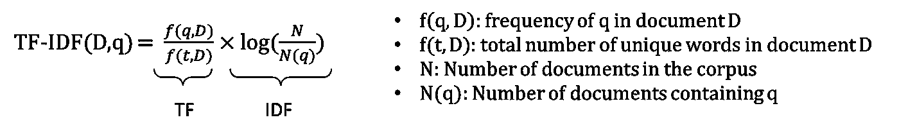

# BM25S — BM25 算法在文档检索中的效能提升

> 原文：[`towardsdatascience.com/bm25s-efficacy-improvement-of-bm25-algorithm-in-document-retrieval-7c27ba665b7e?source=collection_archive---------11-----------------------#2024-08-12`](https://towardsdatascience.com/bm25s-efficacy-improvement-of-bm25-algorithm-in-document-retrieval-7c27ba665b7e?source=collection_archive---------11-----------------------#2024-08-12)

## bm25s 是 BM25 算法在 Python 中的实现，利用 Scipy 提高文档检索速度。

 [Chien Vu](https://medium.com/@chienvu?source=post_page---byline--7c27ba665b7e--------------------------------)

·发表于 [Towards Data Science](https://towardsdatascience.com/?source=post_page---byline--7c27ba665b7e--------------------------------) ·阅读时长 10 分钟·2024 年 8 月 12 日

--

图片来源：作者

# BM25 算法背景

BM25，即最佳匹配 25，是一种流行的基于向量的文档检索算法。BM25 旨在通过根据文档中的词频和长度对文档进行评分，从而提供准确且相关的搜索结果。

BM25 使用词频和逆文档频率作为其公式的一部分。词频和逆文档频率是 TF-IDF 的核心。

首先，让我们快速浏览一下 TF-IDF 公式。

TF-IDF 公式（作者提供的图片）

在 TF-IDF 中，单词的重要性与该单词在文档中出现的频率成正比，但会受到该单词在语料库中的频率的抵消。第一部分，词频（TF），表示一个术语在特定文档中出现的频率。如果术语在文档中出现得更频繁，它更可能是重要的。然而，它会通过文档总数来进行归一化……
