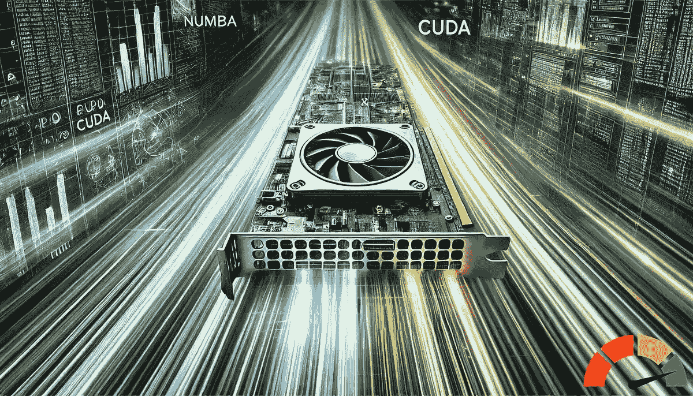

# 使用 CUDA 加速你的 Python 代码

> 原文：[`towardsdatascience.com/boost-your-python-code-with-cuda-8bbdd08fc51e?source=collection_archive---------0-----------------------#2024-11-20`](https://towardsdatascience.com/boost-your-python-code-with-cuda-8bbdd08fc51e?source=collection_archive---------0-----------------------#2024-11-20)

图像来源：AI (Dalle-3)

## 轻松使用 Numba 的 CUDA JIT 来定位 GPU

 [Thomas Reid](https://medium.com/@thomas_reid?source=post_page---byline--8bbdd08fc51e--------------------------------)

·发表于 [Towards Data Science](https://towardsdatascience.com/?source=post_page---byline--8bbdd08fc51e--------------------------------) ·阅读时间 11 分钟·2024 年 11 月 20 日

--

我之前写过关于 Python 库 Numba 的文章。你可以通过以下链接查看我的文章，

 [## Python 增强版：Numba 加速

### 轻松加速你的代码

ai.gopubby.com](https://ai.gopubby.com/python-on-steroids-the-numba-boost-d3c35fbde47f?source=post_page-----8bbdd08fc51e--------------------------------)

上面的 TL;DR（简短总结）是我展示了如何使用 Numba 实现显著的 Python 代码加速。Numba 是一个高性能的 Python 库，旨在优化代码速度。它的核心是一个即时编译器（Just-In-Time, JIT），可以将 Python 和 NumPy 代码的子集转换为快速的机器代码。这个过程是自动且动态的，让 Python 开发者能够在最小修改原始代码的情况下，获得真实的性能提升。

普通的 Numba JIT 编译器主要用于优化 CPU 上代码的运行时间，但如果你有幸能够使用 GPU，本文将向你展示如何再次使用 Numba，这次是利用它的 CUDA JIT，通过将代码运行到 GPU 上来进一步加速你的 Python 代码。

## 前提条件
