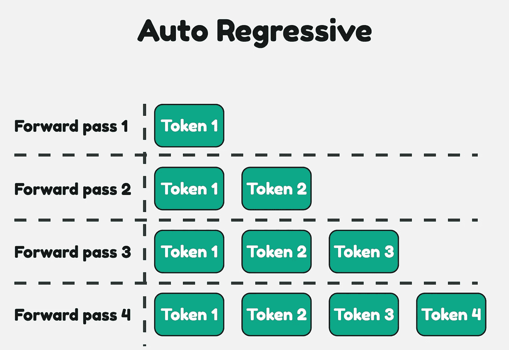

# 使用推测性解码提升大语言模型推理速度

> 原文：[`towardsdatascience.com/boosting-llm-inference-speed-using-speculative-decoding-0cb0bf36d001?source=collection_archive---------8-----------------------#2024-08-27`](https://towardsdatascience.com/boosting-llm-inference-speed-using-speculative-decoding-0cb0bf36d001?source=collection_archive---------8-----------------------#2024-08-27)

## 使用前沿优化技术加速推理的实用指南

 [Het Trivedi](https://medium.com/@het.trivedi05?source=post_page---byline--0cb0bf36d001--------------------------------)

·发表于 [Towards Data Science](https://towardsdatascience.com/?source=post_page---byline--0cb0bf36d001--------------------------------) ·6 分钟阅读·2024 年 8 月 27 日

--

图片由 Flux Schnell 生成

## 介绍

大型语言模型非常耗电，需要大量的 GPU 资源才能有效运行。然而，变换器架构并未充分利用 GPU 的优势。

GPU 从设计上来说能够并行处理任务，但变换器架构是自回归的。为了生成下一个标记，必须查看所有之前的标记。变换器不允许你并行预测下一个 `n` 个标记。最终，这使得大型语言模型（LLM）的生成过程非常缓慢，因为每个新标记**必须**按顺序生成。推测性解码是一种新颖的优化技术，旨在解决这一问题。

每次前向传递会生成一个新的标记，由大型语言模型生成

> 推测性解码有几种不同的方法。本文所描述的技术使用的是两模型方法。

## 推测性解码

推测性解码的工作原理是使用两个模型，一个是大型的**主**模型，另一个是...
