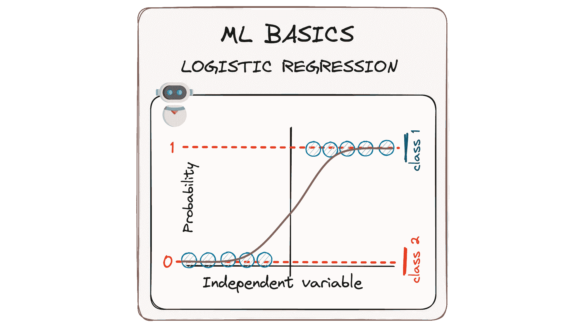

# 将逻辑回归拆解到最基本的部分

> 原文：[`towardsdatascience.com/breaking-down-logistic-regression-basics-ml-machine-learning-algorithm-classification-a81f54ed6163?source=collection_archive---------2-----------------------#2024-01-21`](https://towardsdatascience.com/breaking-down-logistic-regression-basics-ml-machine-learning-algorithm-classification-a81f54ed6163?source=collection_archive---------2-----------------------#2024-01-21)

## MLBasics #2：用逻辑回归的简洁性揭开机器学习算法的神秘面纱

 [Josep Ferrer](https://medium.com/@rfeers?source=post_page---byline--a81f54ed6163--------------------------------)

·发表于[Towards Data Science](https://towardsdatascience.com/?source=post_page---byline--a81f54ed6163--------------------------------) ·阅读时长 7 分钟·2024 年 1 月 21 日

--

图像由作者提供。ML 基础。逻辑回归。

在数据和计算机程序的世界里，机器学习的概念可能听起来像是一个难解的难题，充满了复杂的数学和抽象的概念。

这就是为什么今天我想放慢速度，看看使这一切工作的基本内容，并通过我的[MLBasics 系列](https://medium.com/towards-data-science/mlbasics-simple-linear-regression-machine-learning-algorithm-predict-programming-8d83cac9873a)来讨论。

我们将重新审视这些简单但极为重要的模型，它们是机器学习的基础。可以把它当作从一个大拼图的简单部分开始。我们回到简单的东西，从中轻松理解正在发生的事情。

所以跟随我一起，拆解并清晰地理解它。

让我们一起一步步深入了解逻辑回归！👇🏻🤓

# #1. 从数据到决策的路径

在众多机器学习算法中，逻辑回归是解决二分类问题的最佳模型之一。

当我们面临分类性数据且目标是做出决策时，逻辑回归是我们信赖的路径。

逻辑回归不仅仅是一个统计工具，它还是一个讲故事的工具…
