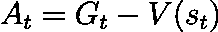
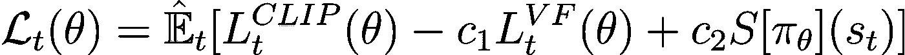

# JAX 中近端策略优化（PPO）的实用指南

> 原文：[`towardsdatascience.com/breaking-down-state-of-the-art-ppo-implementations-in-jax-6f102c06c149?source=collection_archive---------7-----------------------#2024-05-01`](https://towardsdatascience.com/breaking-down-state-of-the-art-ppo-implementations-in-jax-6f102c06c149?source=collection_archive---------7-----------------------#2024-05-01)

## 所有你希望了解的关于 PPO 的技巧和细节

[](https://medium.com/@ryanpegoud?source=post_page---byline--6f102c06c149--------------------------------)[](https://towardsdatascience.com/?source=post_page---byline--6f102c06c149--------------------------------) [Ryan Pégoud](https://medium.com/@ryanpegoud?source=post_page---byline--6f102c06c149--------------------------------)

·发表于 [Towards Data Science](https://towardsdatascience.com/?source=post_page---byline--6f102c06c149--------------------------------) ·9 分钟阅读·2024 年 5 月 1 日

--


图片来自 [Lorenzo Herrera](https://unsplash.com/@lorenzoherrera?utm_source=medium&utm_medium=referral) 在 [Unsplash](https://unsplash.com/?utm_source=medium&utm_medium=referral) 上

自从 OpenAI 在 [2017 年的论文](https://arxiv.org/pdf/1707.06347.pdf) 中发布以来，近端策略优化（PPO）被广泛认为是强化学习领域最先进的算法之一。实际上，PPO 在各种任务中都表现出了显著的性能，从 [在 Dota 2 中取得超人类表现](https://openai.com/research/openai-five) 的团队到使用单个机器人手臂 [解 Rubik’s Cube](https://openai.com/research/solving-rubiks-cube)，同时保持三个主要优势：简洁性、稳定性和样本效率。

然而，从零开始实现强化学习（RL）算法非常困难且容易出错，因为有许多错误源和实现细节需要注意。

在本文中，我们将重点分析在 JAX 中流行的 PPO 实现中使用的巧妙技巧和编程概念。具体来说，我们将聚焦于 [PureJaxRL 库中的实现](https://github.com/luchris429/purejaxrl/blob/main/purejaxrl/ppo.py)，该库由 [Chris Lu](https://chrislu.page) 开发。

*免责声明：本文并未深入探讨理论，而是聚焦于在 PPO 的流行实现版本中所使用的实际实现细节和（众多）技巧。如果你需要回顾 PPO 的理论，请参考本文末尾的“****参考文献****”部分。此外，所有代码（不包括新增的注释）均直接复制自 PureJaxRL，旨在教学目的。*

[](https://github.com/luchris429/purejaxrl/tree/main?source=post_page-----6f102c06c149--------------------------------) [## UGitHub - luchris429/purejaxrl: 超快的端到端 Jax 强化学习实现

### 超快的端到端 Jax 强化学习实现。通过创建一个账户，贡献代码至 luchris429/purejaxrl 开发项目...

github.com](https://github.com/luchris429/purejaxrl/tree/main?source=post_page-----6f102c06c149--------------------------------)

# **演员-评论家架构**

近端策略优化（Proximal Policy Optimization，PPO）被归类为策略梯度算法家族，其中包括演员-评论家方法。‘演员-评论家’这一名称反映了模型的双重组件：

+   **演员网络**根据环境当前状态生成一个**行动分布**，并从该分布中采样一个行动。这里，演员网络包括三层全连接层，这些层之间由两层激活层（可以是 ReLU 或双曲正切）隔开，并且最终有一个应用**softmax**函数的分类层来计算分布。

+   **评论家网络** **估算当前状态的价值函数**，换句话说，它评估在某一时刻特定行动的好坏。其架构几乎与演员网络相同，唯一的区别是最终的 softmax 层。实际上，评论家网络在处理回归任务时，并不会对最后一层全连接层的输出应用任何激活函数。


演员-评论家架构，如 PureJaxRL 中定义的（插图由作者制作）

此外，该实现特别注意**权重初始化**在全连接层中的应用。实际上，所有全连接层都通过**正交矩阵**与特定系数进行初始化。该初始化策略已被证明在前向传播和反向传播过程中能够**保持梯度范数**（即尺度），从而实现**更平滑的收敛**，并限制梯度消失或爆炸的风险[1]。

正交初始化与特定的缩放系数一起使用：

+   **2 的平方根**：该因子用于两个网络的前两层全连接层，旨在**补偿 ReLU 激活导致的方差减少**（因为负值输入会被设为 0）。对于 tanh 激活函数，Xavier 初始化是一个流行的替代方案[2]。

+   **0.01：** 用于演员网络的最后一层密集层，该因子有助于**最小化 logit 值的初始差异**，在应用 softmax 函数之前。这将减少动作概率的差异，从而**鼓励早期探索**。

+   **1：** 由于评论员网络执行的是回归任务，我们不会缩放初始权重。

演员-评论员网络（来源：PureJaxRL, Chris Lu）

# 训练循环

训练循环分为 3 个主要部分，这些部分共享类似的编码模式，充分利用 JAX 的功能：

1.  **轨迹收集：** 首先，我们将与环境交互若干步骤，并收集观测值和奖励。

1.  **广义优势估计（GAE）：** 然后，我们通过计算广义优势估计来近似每个轨迹的期望回报。

1.  **更新步骤：** 最后，我们将计算损失的梯度，并通过梯度下降更新网络参数。

在详细介绍每个模块之前，这里简要提醒一下`jax.lax.scan`函数，它将在代码中多次出现：

## Jax.lax.scan

JAX 中常见的编程模式是定义一个作用于单个样本的函数，并使用`jax.lax.scan`来**迭代地将其应用于序列或数组的元素**，同时携带某些状态。

例如，我们将其应用于`step`函数，以在连续 N 次步骤中推进环境，同时在每次迭代中传递环境的新状态。

在纯 Python 中，我们可以按以下方式进行：

```py
trajectories = []

for step in range(n_steps):
  action = actor_network(obs)
  obs, state, reward, done, info = env.step(action, state)
  trajectories.append(tuple(obs, state, reward, done, info))
```

然而，为了性能考虑（因为纯 Python 循环与 JIT 编译不兼容），我们避免在 JAX 中编写此类循环。替代方法是`jax.lax.scan`，其等效于：

```py
def scan(f, init, xs, length=None):
  """Example provided in the JAX documentation."""
  if xs is None:
    xs = [None] * length

  carry = init
  ys = []
  for x in xs:
    # apply function f to current state
    # and element x
    carry, y = f(carry, x) 
    ys.append(y)
  return carry, np.stack(ys)
```

使用`jax.lax.scan`比使用 Python 循环更高效，因为它允许对转换进行优化，并作为单一的编译操作执行，而不是在运行时解释每个循环迭代。

我们可以看到，`scan`函数接受多个参数：

+   **f：** 在每个步骤应用的函数。它接受当前状态和`xs`的一个元素（如果`xs`为`None`，则使用占位符），并返回更新后的状态和输出。

+   **init：** `f`在第一次调用时使用的初始状态。

+   **xs：** 一个输入序列，它将被`f`逐步处理。如果`xs`为`None`，则该函数模拟一个具有`length`次迭代的循环，并将每次迭代的输入设置为`None`。

+   **length：** 如果`xs`为`None`，指定迭代的次数，确保函数在没有明确输入的情况下仍能操作。

此外，`scan`返回：

+   **carry：** 所有迭代后的最终状态。

+   **ys：** 对应于每个步骤应用`f`的输出数组，堆叠以便于分析或进一步处理。

最后，`scan`可以与`vmap`结合使用，在多个维度上并行扫描一个函数。正如我们在下一节中将看到的，这使得我们能够并行与多个环境交互，从而快速收集轨迹。


在步长函数上下文中，展示了 vmap、scan 和 scan + vmap 的示意图（作者制作）

# 1\. 轨迹收集

如前一节所述，轨迹收集块由`step`函数跨 N 次迭代扫描组成。这个`step`函数依次执行：

+   使用演员网络选择一个动作

+   执行环境步长

+   将转移数据存储在`transition`元组中

+   将模型参数、环境状态、当前观察值和随机数生成器键存储在`runner_state`元组中

+   返回`runner_state`和`transition`

扫描这个函数将返回最新的`runner_state`和`traj_batch`，后者是一个包含`transition`元组的数组。实际上，为了提高效率，转移数据是从多个环境中并行收集的，如使用`jax.vmap(env.step, …)`所示（有关向量化环境和`vmap`的更多详细信息，请参阅我的[上一篇文章](https://medium.com/towards-data-science/vectorize-and-parallelize-rl-environments-with-jax-q-learning-at-the-speed-of-light-49d07373adf5)）。

env 步长函数（来源：PureJaxRL，Chris Lu）

# 2\. 广义优势估计

收集完轨迹后，我们需要计算**优势函数**，这是 PPO 损失函数的一个关键组成部分。优势函数衡量一个特定动作在给定状态下，相较于平均动作的表现如何：



其中**Gt**是时间***t***时刻的回报，**V(St)**是时间***t***时刻状态***s***的值。

由于回报通常是未知的，我们必须对优势函数进行近似。一个流行的解决方案是**广义优势估计**[3]，其定义如下：


其中**γ**是折扣因子，**λ**是控制偏差与方差权衡的参数，***δt***是时间***t***时刻的时序差异误差：


如我们所见，GAE 在时间*t*的值依赖于未来时间步的 GAE。因此，我们从轨迹的末端开始反向计算。例如，对于一个包含 3 个转移的轨迹，我们将得到：


这等价于以下递归形式：


再次，我们对轨迹批次使用`jax.lax.scan`（这次是逆序）来迭代计算 GAE。

广义优势估计（来源：PureJaxRL，Chris Lu）

注意，该函数返回`advantages + traj_batch.value`作为第二个输出，这相当于本节第一个方程中的回报。

# 3. 更新步骤

训练循环的最后一部分定义了损失函数，计算其梯度，并在 minibatches 上执行梯度下降。与前面几节类似，更新步骤是按层次顺序排列的多个函数的组合：

```py
def _update_epoch(update_state, unused):
  """
  Scans update_minibatch over shuffled and permuted 
  mini batches created from the trajectory batch.
  """

  def _update_minbatch(train_state, batch_info):
    """
    Wraps loss_fn and computes its gradient over the 
    trajectory batch before updating the network parameters.
    """
    ...

    def _loss_fn(params, traj_batch, gae, targets):
      """
      Defines the PPO loss and computes its value.
      """
      ...
```

让我们逐一拆解它们，从更新步骤中最内层的函数开始。

## 3.1 损失函数

这个函数旨在定义和计算 PPO 损失，最初定义为：



其中：


然而，PureJaxRL 的实现与原始 PPO 论文[4]相比，具有一些技巧和差异：

+   论文中定义的 PPO 损失是基于梯度上升的，而实际实现采用了梯度下降。因此，每个损失组件的符号被反转。

+   值函数项被修改，包含了一个额外的截断项。这可以看作是使值函数更新更为保守的一种方式（就像截断的替代目标一样）：


+   GAE 被标准化。

这是完整的损失函数：

PPO 损失函数（来源：PureJaxRL, Chris Lu）

## 3.2 更新 Minibatch

`update_minibatch` 函数本质上是一个包装器，用于计算在轨迹批次上对 `loss_fn` 的梯度，并更新存储在 `train_state` 中的模型参数。

更新 minibatch（来源：PureJaxRL, Chris Lu）

## 3.3 更新 Epoch

最后，`update_epoch` 封装了 `update_minibatch` 并在 minibatch 上应用它。同样，`jax.lax.scan` 被用来迭代地对所有 minibatch 应用更新函数。

更新 epoch（来源：PureJaxRL, Chris Lu）

# 结论

从这里开始，我们可以将所有先前的函数封装在一个 `update_step` 函数中，并使用 `scan` 最后一次迭代 N 步以完成训练循环。

训练循环的全局视图大致如下：

训练脚本总结（来源：PureJaxRL, Chris Lu）

我们现在可以使用 `jax.jit(train(rng))` 运行一个完全编译的训练循环，或者使用 `jax.vmap(train(rng))` 并行训练多个代理。

到此为止！我们涵盖了 PPO 训练循环的基本构建块以及 JAX 中常见的编程模式。

若想深入了解，强烈建议详细阅读 [完整训练脚本](https://github.com/luchris429/purejaxrl/blob/main/purejaxrl/ppo.py)，并在 PureJaxRL 仓库上运行示例笔记本。

[](https://github.com/luchris429/purejaxrl?source=post_page-----6f102c06c149--------------------------------) [## GitHub - luchris429/purejaxrl: 真正快速的端到端 Jax 强化学习实现

### 真正快速的端到端 Jax 强化学习实现。通过创建一个账户来贡献于 luchris429/purejaxrl 的开发…

github.com](https://github.com/luchris429/purejaxrl?source=post_page-----6f102c06c149--------------------------------)

非常感谢您的支持，期待下次再见 👋

## 参考文献：

[完整训练脚本](https://github.com/luchris429/purejaxrl/blob/main/purejaxrl/ppo.py)，PureJaxRL，Chris Lu，2023

[1] [***解释和说明递归神经网络的正交初始化***](https://smerity.com/articles/2016/orthogonal_init.html)，Smerity，2016

[2] [***初始化神经网络***](https://www.deeplearning.ai/ai-notes/initialization/index.html)，DeepLearning.ai

[3] ***强化学习中的广义优势估计***，Siwei Causevic，Towards Data Science，2023

[4] [***近端策略优化算法***](https://arxiv.org/pdf/1707.06347)，Schulman 等，OpenAI，2017
