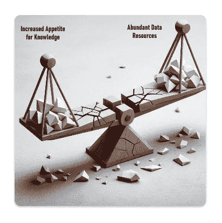
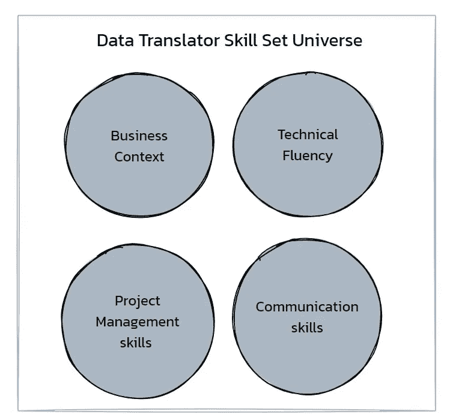
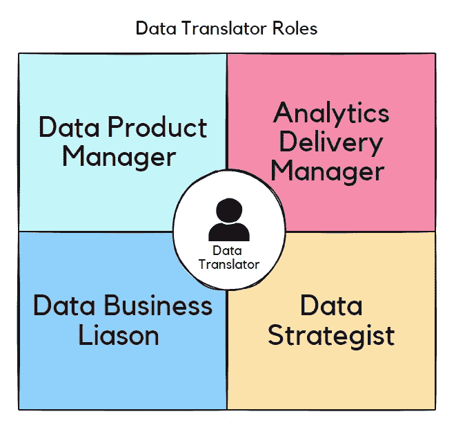

# 弥合数据素养鸿沟

> 原文：[`towardsdatascience.com/bridging-the-data-literacy-gap-2d9284d33f96?source=collection_archive---------4-----------------------#2024-12-06`](https://towardsdatascience.com/bridging-the-data-literacy-gap-2d9284d33f96?source=collection_archive---------4-----------------------#2024-12-06)

## **“数据翻译者”的出现、演变及现状**

 [Nithhyaa Ramamoorthy](https://medium.com/@nithhyaa_talks_data?source=post_page---byline--2d9284d33f96--------------------------------)

·发表于 [Towards Data Science](https://towardsdatascience.com/?source=post_page---byline--2d9284d33f96--------------------------------) ·13 分钟阅读·2024 年 12 月 6 日

--

# **简介**

随着数据被不断推崇为组织可以拥有的最宝贵资产，领导者和决策者始终在寻找有效的方法将数据洞察付诸实践。每当客户与数字产品互动时，都会生成数百万个数据点，如果不利用这些数据点来打造更好的产品、优化收入生成、改善客户足迹，其带来的机会损失是显而易见的，无法忽视。“数据翻译者”这一角色开始在分析和数据科学招聘网站上出现，旨在帮助弥合商业团队与数据团队之间的知识鸿沟，使组织能够变得更加数据驱动。过去十年中，这一角色逐渐发展，涵盖了更多与数据驱动决策相关的方面，并为企业领导层提供了急需的背景信息和翻译支持。这个角色还在与市场营销、产品、战略等利益相关方的对接中发挥着重要作用，帮助将所有决策转向数据驱动。随着这一角色的重要性被广泛接受，以及其所承担的职责灵活性，所有数据从业者都必须培养“数据翻译”能力，才能在工作和职业生涯中脱颖而出，取得成功并不断进步。

# **解决数据知识鸿沟**

决策一直是各行业成功商业故事的基石。著名的管理理论与实践专家彼得·德鲁克曾说过：“每一个决策都是有风险的：它是将当前资源承诺给一个不确定和未知的未来。”在大多数现代组织中，数据中心化和数据驱动的决策已经被普遍认同为减少风险和模糊性、提高商业决策成功率的有效途径。数据和市场营销高管每天都需要做出一系列决策，这些决策对组织的日常运作和长期优先事项有着深远的影响。尽管当前数据资源丰富，利用这些资源的过程依然充满挑战。根据甲骨文公司（Oracle）最近发布的《决策困境》研究报告（2023 年 4 月），72%的商业领导者表示，海量的数据和数据源的可信度及不一致性让他们无法做出决策，89%的领导者认为，数据源数量的增加限制了他们组织的成功，尽管他们明白，缺乏数据支持的决策往往不够准确、不够成功且更容易出错。

数据驱动决策无疑不是一个新概念，实际上，基于数据和统计原则的第一个决策模型早在 1953 年由厄尔温·D·J·布罗斯（Irwin D.J Bross）提出，他区分了真实和象征性有效性，并阐明了测量和验证的重要性。多年来，组织不断发展，进行数据投资，制定战略，将数据作为其风险缓解和决策努力的核心。尽管拥有这些资源，组织当前面临的独特问题是如何平衡对高质量可操作性洞察的需求和资源的可用性。可以用一个简单的“跷跷板”类比来描述这种商业状况。过度追求知识和可操作性洞察，加上数据资源不足，可能会导致数据领导者依赖过去的决策、轶事证据和直觉来做决策。另一方面，数据资源充足，但对知识的需求较低，最终可能会导致构建不必要的数据解决方案和过多的自助式仪表盘，而没有明确的战略来使这些资源变得有用。

来源：图像由作者使用 AI 提示生成。

尽管有丰富的数据资源，数据知识差距却越来越明显。我们正日益观察到一个独特的“断裂跷跷板”现象，数据资源和知识需求并存，但由于缺乏将数据团队所提供价值转化为业务领导者可理解的努力，跷跷板的两端都变得过载，最终导致长期的决策过程破裂和低效。宝贵的数据创造影响力，其他的一切都沉睡在仪表盘中。

**数据素养是答案吗？**

是的，和不完全是。

数据素养迅速成为关于数据洞察和交付的讨论重点，因为组织意识到为员工提供理解和有效利用数据的技能是多么重要。随着研究凸显了商业专业人士在解读数据时存在的显著技能差距，这一运动获得了动力。强调对用户进行数据解读培训的同时，往往忽略了培养批判性思维、以帮助风险规避的方式解读数据证据所需要的陡峭学习曲线。

技术障碍是数据团队与业务利益相关者之间的另一个瓶颈。我们可以将这一瓶颈分解为两个部分。首先，数据分析工具堆栈不足可能会妨碍非高级数据用户有效利用数据和进行沟通。其次，缺乏相关培训往往会导致误解，并与其他数据源不一致，从而阻碍建立单一数据源的可能性。这最终影响了数据团队的可信度。

当前对数据素养的强调存在一个显著缺点，那就是往往过分将数据产品的失败归咎于用户的技能或理解不足。当数据产品未能提供价值或遭遇抵制时，反应性回应往往是假定用户缺乏技能或理解。这种看法忽视了商业素养和业务背景在有效传达数据洞察方面所扮演的重要角色，无论是在验证还是反驳商业假设时。数据素养是一条双向街道。许多时候，数据团队成员有责任从业务的角度来看待任务，并理解他们为什么需要关注数据团队所传递的信息。承认并解决这些不足，将数据计划与业务目标对齐，可以促成更有效、更和谐的数据驱动文化。

# **数据翻译员的出现——他们当时是谁，现在又是谁？**

数据行业为解决数据与知识之间的差距以及数据素养努力的不足，已采取了引入“数据翻译员”角色的解决方案。数据翻译员的角色多年来经历了显著的演变，反映了组织在利用数据分析方面的变化。最初作为数据科学家与业务部门之间的桥梁出现，该角色的设计旨在确保复杂的数据洞察能够转化为可执行的业务战略。

在早期阶段，数据翻译员主要被视为能够将技术性发现传达给非技术性利益相关者的中介，帮助优先解决业务问题，并确保分析解决方案与业务目标保持一致。随着数据驱动决策需求的增长，这一角色的重要性也逐步提升。到 2019 年，这一角色变得更加普遍，大约三分之一的公司设有符合数据翻译员描述的职位。其职责不仅扩展到了沟通，还包括确保分析工具在企业中得到广泛应用，并实现数据的民主化。近年来，角色逐渐向更广泛的职能整合，例如数据产品负责人，反映出这一角色向更加全面的职能转变，涵盖了技术和战略责任。这一变化突显了有效将数据洞察与业务成果链接的角色持续需求。

图 1：数据翻译员技能集宇宙中的主导主题。来源：作者插图。

图 2：数据翻译员技能所支持的各类角色。来源：作者插图。

数据翻译员的角色根据其服务的组织性质可能承担多种责任。例如，咨询公司通常会指定一名专职数据翻译员，负责将提供的数据解决方案转化为业务领域的语言。被聘用到公司的专业人士通常是以专职数据翻译员、数据产品经理或分析交付经理的形式存在，负责确保数据团队的工作能够合理地用于关键的业务决策。尽管有不同的职位名称，数据翻译员的核心任务是证明数据团队所驱动的价值和影响力。他们通过关注以下几个关键领域来完成这一任务：

## **1\. 成本控制：**

数据翻译员作为业务领导与数据团队之间的联络人，通过持续量化数据团队交付项目的影响，并权衡数据资源的合理分配。例如，他们可以通过记录数据团队支持的决策和财务影响来做到这一点。这些记录在评估新战略项目所需资源时常常非常有用，并且作为可以在新背景下复制的数据解决方案的参考。

## **2\. 策略和优先级排序：**

数据翻译员对业务目标和优先级有深刻理解，并致力于将团队的努力与更广泛的业务目标对齐。这个过程通常包括识别那些不仅能利用团队技能，而且有可能影响战略结果的项目。优先排序的一种流行方法是使用评估项目潜在影响和可行性的框架。通过简化数据团队的任务接受系统，并聚焦于那些承诺带来显著回报或解决关键业务问题的举措，数据团队可以最大化其效用和生产力。在一篇解释数据产品经理和数据翻译员特质的文章中，《哈佛商业评论》指出，商业背景、广泛的技术流利度、项目管理技能、创业精神，以及将数据需求和战略向其他组织成员解释的能力，是成功的关键。

## **3\. 弥合数据素养差距**

数据翻译员与组织内的治理团队合作，建立共同的数据语言、定义和标准，以确保所有团队在理解和解释数据时保持一致。这确保了所有数据工作能够协同合作，建立一个单一的事实来源。

## **4\. 利益相关者参与**

确定并优先考虑关键利益相关者对于数据团队至关重要，以确保其工作与组织的战略目标保持一致。数据翻译员通常通过使用一种名为“利益 — 影响矩阵”的项目管理技术来实现这一点。该过程首先通过将利益相关者映射到两个维度来进行：他们对数据项目的兴趣程度以及他们对决策的影响力。高兴趣和高影响力的利益相关者被视为关键角色，应优先与其保持定期沟通和合作。与这些人建立稳固的关系至关重要，因为他们可以推动数据项目，帮助确保资源，并消除障碍。对于影响力较小的利益相关者，保持定期联系可以确保他们了解最新情况，同时不至于过度消耗团队资源。这种深思熟虑的参与方式使数据团队能够将精力集中在能够产生最大影响的地方，从而为整个组织创造价值。

## **5\. 内部推广与外联**

在一个日益以数据为中心的环境中，数据团队的角色变得至关重要，但它们常常被误解。数据翻译者通常创建路演、演示文稿和教育材料，分享数据团队的成就和提供的价值，以便在整个组织内建立和维护可信度与信任。

## **构建数据翻译能力**

观察数据翻译者角色的历史和发展表明，除了数据流利度外，领域知识、商业背景以及对组织微妙差异的深刻理解（如目标、预期结果和有效的利益相关者合作）是成功担任此角色的关键。这个角色的灵活性不容忽视。在过去几十年里，来自数据生态系统的各类专业人士以不同方式被纳入“数据翻译者”的职责范围。为了为数据职业生涯做好未来准备，并始终如一地为组织带来成功与价值，数据专业人员必须培养“数据翻译者”能力。

# **分析师可以遵循的实用技巧，以增强他们成为数据翻译者的能力**

下面详细列出了一些实用技巧，帮助分析师成为数据翻译的专家，列表非详尽无遗。

## **知识的诅咒**

知识的诅咒是一种认知偏误，发生在一个具有专门知识的人假设其他人也拥有相同知识时。这种偏误使得知识渊博的人难以想象缺乏他们专业知识的情境。假设每个人都共享相同的理解和背景知识，会导致误解、错误假设和低效沟通。特别是在与市场营销和产品等团队合作时，这种现象尤为突出，因为这些利益相关者不一定精通数据，但数据在他们的项目和广告活动的高效性及成果中起着重要作用。数据翻译者必须具备独特的能力，将问题陈述解构并映射到可用的数据点上，建立联系，找到答案，并以通俗易懂的语言向利益相关者解释。以下是一个市场分析的示例：

**声明 1（分析师）：** 查看渠道归因图表，似乎大多数广告活动的 ROAS 是负数，但看起来流失率较低，参与度更高，这并非完全是无用功。

**声明 2（数据翻译者）：** 在评估了营销投入与回报后，似乎您的广告活动在短期内亏损。但是从大局来看，通过您的营销活动获得的用户参与度更高，并且回归频率更高，因此创造了长期价值。

数据翻译版本的陈述清晰地解释了发现的结果，并说明了广告活动的长期影响，而没有使用数据分析术语。

## **从商业问题转向商业目标。**

许多分析师将自己局限于工作职责范围内，单纯专注于回答业务问题。有时，这种现象也是组织范围内数据素养努力的一个意外副作用。回答业务问题将见解局限于一个特定问题，而聚焦于整体业务结果则为数据团队和业务团队提供了一个机会，可以从更全面的角度审视数据见解。数据素养与业务素养是相辅相成的。数据翻译员始终被期望具备一定的业务结果知识，以便他们能够将见解与总体目标联系起来。

例如，

**业务问题：** 我新推出的品牌活动效果如何？

**回答（分析师）：** 我们在 3 天内获得了 6000 次展示，比去年同期进行类似活动时高出 50%。

**回答（数据翻译员）：** 这个活动的预期结果是提升品牌知名度。我们通过此次活动吸引了 3000 名新用户访问我们的网站。我们还通过对这些特定用户进行调查，测量了品牌认知度的变化，结果显示他们对品牌产品的认识和看法有所提升。

**学会放眼全局**

学会放眼全局，看到大局，并能够将个别任务与整体优先事项联系起来，帮助数据翻译员将精力集中在有影响力的举措上。这项技能还使他们能够学会构建可扩展的分析解决方案，这些解决方案可以重新利用，最终节省时间并提高洞察的速度。

## **成为一个优秀的数据故事讲述者**

*“我没有时间写一封短信，所以我写了一封长信。”*

*― 马克·吐温*

数据故事讲述既是科学也是艺术。它是数据翻译员工具包中的一个基本工具。它要求对问题和解决方案有透彻的理解，构建一个清晰、简洁、易于理解的叙事，并以可以付诸实践的建议和见解结束。每一个数据故事都需要一个主导思想，且大致遵循一个情节。安排分析故事的一个有效方法是按问题、问题的影响、发现、建议和下一步行动的顺序进行排列。这可以确保你的数据故事容易理解，并且即使你不在场讲解，整个故事也能自我说明。

在重复性任务中，如常规的绩效更新或回顾总结，顺序可能会有所不同。但对于需要数据见解以支持决策的典型请求，这个顺序是一个很好的起点。在这一阶段，最重要的是确保数据准确且相关，能够清晰支持你的故事。除此之外，我还有一些小技巧可以帮助你将分析方案整理得更为简洁。这些细节对展示效果大有帮助，并且能够帮助观众记住关键见解。

· 清楚地指明分享的关键数据点是一个好兆头还是坏兆头，可以通过使用箭头和颜色来表示。（示例：较低的跳出率是一个好兆头，但较低的转化率是一个坏兆头。）

· 在幻灯片中分享任何数字（数据点）时，总是需要通过提供基准数据或趋势分析来添加背景信息。（示例：本月的转化率为 12%，与同一产品线中的其他 SKU 一致，并且高于过去三年相同月份的平均转化率。）

· 在每一张幻灯片中，将洞察与原始业务问题、目标和结果关联起来。

· 包括样本大小、分析时间框架和脚注中的重要注释等细节，有助于建立信任和可信度。

从本质上讲，数据故事被认为是有效的，当它能够让观众了解信息并激励他们采取行动时。

## **结论**

数据翻译员在数据和业务团队之间发挥着至关重要的桥梁作用。他们的技能在证明数据投资的价值和影响、促进数据素养、优先处理高影响力的举措，以及保护分析师免于从事低价值任务方面起着重要作用。通过鼓励、融入和培养具有数据翻译技能的团队成员，组织和数据团队可以获得互利共赢的好处。

**关于作者：**

Nithhyaa Ramamoorthy 是一位数据领域的专家，拥有超过 12 年的分析和大数据经验，特别是在医疗保健和消费者行为的交集领域。她拥有信息科学硕士学位，并且最近获得了 CSPO 认证以及其他多个专业认证。她热衷于利用自己的分析技能推动业务决策，创造以同理心为基础的包容性和公平的数字产品。
