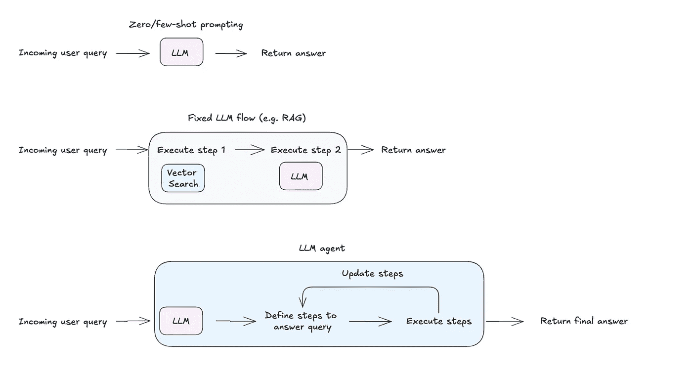

# 如何构建一个通用的大型语言模型（LLM）智能体

> 原文：[`towardsdatascience.com/build-a-general-purpose-ai-agent-c40be49e7400?source=collection_archive---------0-----------------------#2024-12-05`](https://towardsdatascience.com/build-a-general-purpose-ai-agent-c40be49e7400?source=collection_archive---------0-----------------------#2024-12-05)

## 一步步指南

[](https://medium.com/@mayamurad?source=post_page---byline--c40be49e7400--------------------------------)[](https://towardsdatascience.com/?source=post_page---byline--c40be49e7400--------------------------------) [Maya Murad](https://medium.com/@mayamurad?source=post_page---byline--c40be49e7400--------------------------------)

·发表于 [Towards Data Science](https://towardsdatascience.com/?source=post_page---byline--c40be49e7400--------------------------------) ·阅读时间 11 分钟·2024 年 12 月 5 日

--


**LLM 智能体的高级概览。** （图片由作者提供）

**为什么要构建一个通用智能体？** 因为它是一个出色的工具，可以快速原型化你的使用案例，并为设计你自己的定制智能架构奠定基础。

在我们深入之前，先简要介绍一下 LLM 智能体。*可以随时跳过。*

# 什么是 LLM 智能体？

> LLM 智能体是一种程序，其执行逻辑由其底层模型控制。



**从独立的 LLM 到智能系统。** （*图片由作者提供*）

LLM 智能体与类似少量提示（few-shot prompting）或固定工作流的方法的区别在于它能够定义并适应执行用户查询所需的步骤。通过访问一组工具（如代码执行或网页搜索），智能体可以决定使用哪种工具，如何使用它，并根据输出对结果进行迭代。这种适应性使系统能够在最少配置的情况下处理多样化的使用场景。


**智能架构的谱系。** （图片由作者提供）

代理架构存在一个谱系，从固定工作流的可靠性到自主代理的灵活性。例如，像检索增强生成（[RAG](https://research.ibm.com/blog/retrieval-augmented-generation-RAG)）这样的固定流程可以通过自我反思循环进行增强，使得程序能够在初始响应不足时进行迭代。或者，像[ReAct](https://www.promptingguide.ai/techniques/react)这样的代理可以装备固定流程作为工具，提供一种灵活而结构化的方法。架构的选择最终取决于使用场景和可靠性与灵活性之间的权衡。

若要深入了解，请查看[这个视频](https://www.youtube.com/watch?v=F8NKVhkZZWI&t=1s)。

# 让我们从零开始构建一个通用的 LLM 代理吧！

## 第 1 步：选择合适的 LLM

选择正确的模型对于实现预期的性能至关重要。需要考虑的因素包括许可、成本和语言支持。构建 LLM 代理时最重要的考虑因素是模型在关键任务上的表现，例如编码、工具调用和推理。可以评估的基准包括：

+   [大规模多任务语言理解（MMLU）](https://paperswithcode.com/sota/multi-task-language-understanding-on-mmlu)（推理）

+   [伯克利的函数调用排行榜](https://gorilla.cs.berkeley.edu/leaderboard.html)（工具选择与工具调用）

+   [HumanEval](https://evalplus.github.io/leaderboard.html)和[BigCodeBench](https://huggingface.co/spaces/bigcode/bigcode-models-leaderboard)（编码）

另一个关键因素是模型的上下文窗口。代理工作流可能会消耗大量的 token——有时达到 10 万或更多——因此较大的上下文窗口非常有帮助。

**值得考虑的模型**（写作时）

+   前沿模型：[GPT4-o](https://platform.openai.com/docs/models#gpt-4o)，[Claude 3.5](https://www.anthropic.com/news/claude-3-5-sonnet)

+   开源模型：[Llama3.2](https://huggingface.co/collections/meta-llama/llama-32-66f448ffc8c32f949b04c8cf)，[Qwen2.5](https://huggingface.co/collections/Qwen/qwen25-66e81a666513e518adb90d9e)。

通常来说，较大的模型往往能够提供更好的性能，但能够在本地运行的小型模型仍然是一个可靠的选择。使用小型模型时，你将受限于更简单的应用场景，并且可能只能将代理连接到一两个基础工具。

## 第 2 步：定义代理的控制逻辑（即通信结构）


**单一代理架构**。（图像来源：作者）

简单的 LLM 与代理之间的主要区别在于**系统提示**。

> 在 LLM 的背景下，[系统提示](https://promptengineering.org/system-prompts-in-large-language-models/)是一组在模型与用户查询互动之前提供给模型的指令和上下文信息。

LLM 期望的代理行为可以在系统提示中进行编码。

这里是一些常见的代理模式，可以根据需要进行自定义：

+   **工具使用**：代理决定何时将查询路由到合适的工具或依赖其自身的知识。

+   **反思**：代理在回应用户之前回顾并修正其回答。大多数 LLM 系统中也可以加入一个反思步骤。

+   **先推理后行动（**[**ReAct**](https://www.promptingguide.ai/techniques/react)**）**：代理反复推理如何解决查询，执行一个行动，观察结果，并决定是否采取另一个行动或提供响应。

+   **计划后执行**：代理首先通过将任务分解为子步骤（如果需要）进行规划，然后执行每个步骤。

最后两种模式——**ReAct**和**计划后执行**——通常是构建通用单一代理的最佳起点。


**常见代理模式概述**。（图片由作者提供）

为了有效实施这些行为，你需要进行一些提示工程。你也许还想使用[**结构化生成**](https://python.langchain.com/v0.1/docs/modules/model_io/chat/structured_output/)技术。这基本上意味着将 LLM 的输出格式化为特定的格式或模式，以便代理的回应保持一致，符合你期望的沟通风格。

**示例**：以下是来自[Bee Agent Framework](https://github.com/i-am-bee/bee-agent-framework/blob/main/src/agents/bee/prompts.ts)的 ReAct 风格代理系统提示摘录。

```py
# Communication structure
You communicate only in instruction lines. The format is: "Instruction: expected output". You must only use these instruction lines and must not enter empty lines or anything else between instruction lines.
You must skip the instruction lines Function Name, Function Input and Function Output if no function calling is required.

Message: User's message. You never use this instruction line.
Thought: A single-line plan of how to answer the user's message. It must be immediately followed by Final Answer.
Thought: A single-line step-by-step plan of how to answer the user's message. You can use the available functions defined above. This instruction line must be immediately followed by Function Name if one of the available functions defined above needs to be called, or by Final Answer. Do not provide the answer here.
Function Name: Name of the function. This instruction line must be immediately followed by Function Input.
Function Input: Function parameters. Empty object is a valid parameter.
Function Output: Output of the function in JSON format.
Thought: Continue your thinking process.
Final Answer: Answer the user or ask for more information or clarification. It must always be preceded by Thought.

## Examples
Message: Can you translate "How are you" into French?
Thought: The user wants to translate a text into French. I can do that.
Final Answer: Comment vas-tu?
```

## 第 3 步。定义代理的核心指令

我们常常理所当然地认为，大型语言模型（LLMs）自带许多功能。虽然其中一些功能很棒，但也有些可能并不是你真正需要的。为了获得理想的表现，重要的是在系统提示中明确列出你想要的——以及不想要的——功能。

这可能包括如下指令：

+   **代理名称与角色**：代理被称为何，它的职责是什么。

+   **语气与简洁性**：应该听起来多正式或随意，以及应该多简洁。

+   **何时使用工具**：决定何时依赖外部工具与模型自身的知识。

+   **错误处理**：当工具或过程出现问题时，代理应该怎么做。

**示例**：以下是来自[Bee Agent Framework](https://github.com/i-am-bee/bee-agent-framework/blob/main/src/agents/bee/prompts.ts)的指令部分摘录。

```py
# Instructions
User can only see the Final Answer, all answers must be provided there.
You must always use the communication structure and instructions defined above. Do not forget that Thought must be a single-line immediately followed by Final Answer.
You must always use the communication structure and instructions defined above. Do not forget that Thought must be a single-line immediately followed by either Function Name or Final Answer.
Functions must be used to retrieve factual or historical information to answer the message.
If the user suggests using a function that is not available, answer that the function is not available. You can suggest alternatives if appropriate.
When the message is unclear or you need more information from the user, ask in Final Answer.

# Your capabilities
Prefer to use these capabilities over functions.
- You understand these languages: English, Spanish, French.
- You can translate and summarize, even long documents.

# Notes
- If you don't know the answer, say that you don't know.
- The current time and date in ISO format can be found in the last message.
- When answering the user, use friendly formats for time and date.
- Use markdown syntax for formatting code snippets, links, JSON, tables, images, files.
- Sometimes, things don't go as planned. Functions may not provide useful information on the first few tries. You should always try a few different approaches before declaring the problem unsolvable.
- When the function doesn't give you what you were asking for, you must either use another function or a different function input.
  - When using search engines, you try different formulations of the query, possibly even in a different language.
- You cannot do complex calculations, computations, or data manipulations without using functions.m
```

## 第 4 步。定义并优化核心工具

工具赋予了代理超能力。通过一组定义明确的窄工具，你可以实现广泛的功能。需要包括的关键工具有代码执行、网页搜索、文件读取和数据分析。

对于每个工具，你需要定义以下内容，并将其作为系统提示的一部分：

+   **工具名称**：能力的独特、描述性的名称。

+   **工具描述：** 清晰地解释工具的功能以及何时使用它。这有助于代理决定何时选择合适的工具。

+   **工具输入模式：** 描述所需和可选参数、其类型以及任何约束条件的模式。代理使用此模式根据用户的查询填写所需的输入。

+   指示在哪里/如何运行工具。

**示例：** 以下是 [Langchain Community](https://github.com/langchain-ai/langchain/blob/master/libs/community/langchain_community/tools/arxiv/tool.py) 中 Arxiv 工具实现的一个摘录。该实现需要一个 [ArxivAPIWrapper](https://github.com/langchain-ai/langchain/blob/master/libs/community/langchain_community/utilities/arxiv.py) 实现。

```py
class ArxivInput(BaseModel):
    """Input for the Arxiv tool."""

    query: str = Field(description="search query to look up")

class ArxivQueryRun(BaseTool):  # type: ignore[override, override]
    """Tool that searches the Arxiv API."""

    name: str = "arxiv"
    description: str = (
        "A wrapper around Arxiv.org "
        "Useful for when you need to answer questions about Physics, Mathematics, "
        "Computer Science, Quantitative Biology, Quantitative Finance, Statistics, "
        "Electrical Engineering, and Economics "
        "from scientific articles on arxiv.org. "
        "Input should be a search query."
    )
    api_wrapper: ArxivAPIWrapper = Field(default_factory=ArxivAPIWrapper)  # type: ignore[arg-type]
    args_schema: Type[BaseModel] = ArxivInput

    def _run(
        self,
        query: str,
        run_manager: Optional[CallbackManagerForToolRun] = None,
    ) -> str:
        """Use the Arxiv tool."""
        return self.api_wrapper.run(query)p
```

在某些情况下，你需要优化工具，以获得所期望的性能。这可能涉及通过一些提示工程调整工具名称或描述、设置高级配置以处理常见错误，或过滤工具的输出。

## 步骤 5\. 决定内存处理策略

LLM 的上下文窗口有限——它们每次能“记住”的标记数量。随着多轮对话中的过去交互、冗长的工具输出或代理所依赖的额外上下文的增加，这些内存会很快被填满。这就是为什么拥有一个稳固的内存处理策略至关重要的原因。

> 在代理的上下文中，**内存** 指的是系统存储、回忆和利用过去交互信息的能力。这使得代理能够随着时间的推移保持上下文，根据之前的交流改进回应，并提供更加个性化的体验。

**常见的内存处理策略：**

+   **滑动内存：** 保留最近的 *k* 轮对话，并删除较旧的对话。

+   **令牌内存：** 保留最近的 *n* 个令牌并忘记其余部分。

+   **总结内存：** 使用 LLM 在每轮对话中总结会话，并丢弃单个消息。

此外，你还可以让 LLM 检测关键时刻并将其存储到长期记忆中。这使得代理能够“记住”关于用户的重要事实，从而让体验更加个性化。

到目前为止，我们所涵盖的五个步骤为设置代理奠定了基础。那么，如果我们在这个阶段通过我们的 LLM 运行用户查询，会发生什么呢？


**答案：你得到的是原始文本输出。**（图片来源：作者）

以下是可能的示例：

```py
User Message: Extract key insighs from this dataset
Files: bill-of-materials.csv
Thought: First, I need to inspect the columns of the dataset and provide basic data statistics.
Function Name: Python
Function Input: {"language":"python","code":"import pandas as pd\n\ndataset = pd.read_csv('bill-of-materials.csv')\n\nprint(dataset.columns)\nprint(dataset.describe())","inputFiles":["bill-of-materials.csv"]}
Function Output:
```

在此阶段，代理产生原始文本输出。那么，我们如何让它实际执行下一步呢？这时解析和协调就显得尤为重要。

## **步骤 6\. 解析代理的原始输出**

> **解析器** 是一种将原始数据转换为应用程序可以理解和使用的格式（例如具有属性的对象）的功能。

对于我们正在构建的代理，解析器需要识别我们在**步骤 2**中定义的通信结构，并返回结构化输出，例如 JSON。这使得应用程序能够更容易地处理并执行代理的下一步操作。

*注意：一些模型提供商，如* [*OpenAI*](https://openai.com/index/introducing-structured-outputs-in-the-api/)， *默认情况下可以返回可解析的输出。对于其他模型，尤其是开源模型，需要进行配置。*

## 第 7 步：协调代理的下一步

最后一步是设置协调逻辑。这决定了 LLM 输出结果后的处理方式。根据输出，你将：

1.  **执行工具调用**，或者

1.  **返回答案**——这是用户查询的最终响应，或是请求更多信息的后续请求。


**扩展的单代理架构。**（图片由作者提供）

如果触发了工具调用，工具的输出将被发送回 LLM（作为其工作记忆的一部分）。然后，LLM 将决定如何处理这些新信息：要么执行另一个工具调用，要么返回答案给用户。

下面是这段协调逻辑在代码中的一个示例：

```py
def orchestrator(llm_agent, llm_output, tools, user_query):
    """
    Orchestrates the response based on LLM output and iterates if necessary.

    Parameters:
    - llm_agent (callable): The LLM agent function for processing tool outputs.
    - llm_output (dict): Initial output from the LLM, specifying the next action.
    - tools (dict): Dictionary of available tools with their execution methods.
    - user_query (str): The original user query.

    Returns:
    - str: The final response to the user.
    """
    while True:
        action = llm_output.get("action")

        if action == "tool_call":
            # Extract tool name and parameters
            tool_name = llm_output.get("tool_name")
            tool_params = llm_output.get("tool_params", {})

            if tool_name in tools:
                try:
                    # Execute the tool
                    tool_result = toolstool_name
                    # Send tool output back to the LLM agent for further processing
                    llm_output = llm_agent({"tool_output": tool_result})
                except Exception as e:
                    return f"Error executing tool '{tool_name}': {str(e)}"
            else:
                return f"Error: Tool '{tool_name}' not found."

        elif action == "return_answer":
            # Return the final answer to the user
            return llm_output.get("answer", "No answer provided.")

        else:
            return "Error: Unrecognized action type from LLM output."
```

**瞧！** 现在你有了一个能够处理各种不同用例的系统——从竞争分析和高级研究到自动化复杂工作流。

# 多代理系统何时发挥作用？

虽然这一代 LLM 非常强大，但它们有一个关键的限制：[它们在信息过载方面存在困难](https://arxiv.org/html/2410.18745v1)。过多的上下文或过多的工具可能会压倒模型，从而导致性能问题。通用单代理最终会达到这个瓶颈，尤其是代理往往非常消耗 token。

对于某些用例，使用多代理设置可能更有意义。通过将职责分配给多个代理，你可以避免单一 LLM 代理的上下文过载，从而提高整体效率。

话虽如此，**通用单一代理设置是原型设计的绝佳起点**。它可以帮助你快速测试用例并找出问题所在。通过这个过程，你可以：

1.  理解任务的哪些部分真正从代理化方法中受益。

1.  确定可以作为独立过程脱离出来的组件，并在更大的工作流中使用。

从单一代理开始，能为你提供宝贵的见解，帮助你在向更复杂的系统扩展时进行优化。

# 启动的最佳方式是什么？

准备好深入研究并开始构建了吗？使用框架可以成为快速测试和迭代代理配置的好方法。

+   **打算使用开源模型如 Llama 3 吗？** 请尝试[这个起始模板](https://github.com/i-am-bee/bee-agent-framework-starter)，来自[Bee Agent Framework](https://github.com/i-am-bee/bee-agent-framework)。

+   **打算使用像 OpenAI 这样的前沿模型吗？** 尝试 [这个教程](https://langchain-ai.github.io/langgraph/how-tos/react-agent-from-scratch/) 来自 [LangGraph](https://langchain-ai.github.io/langgraph/)。

*你在构建通用代理方面有什么经验？*

在评论中分享你的经验吧！*
