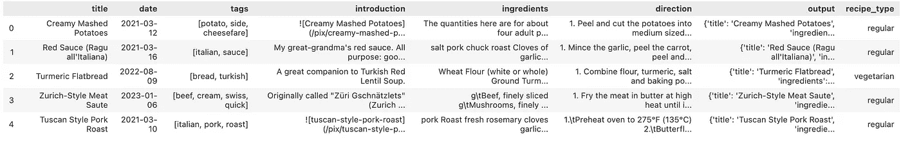
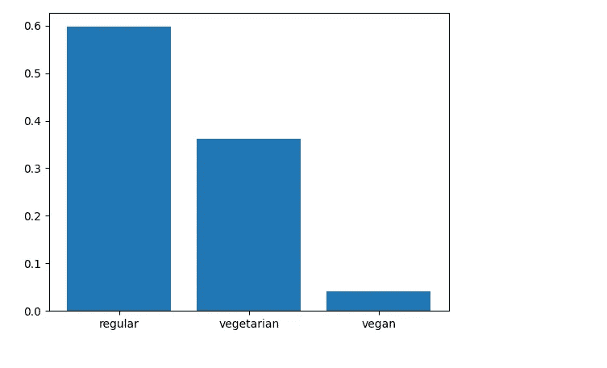
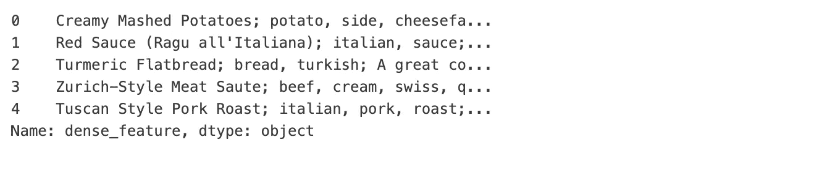
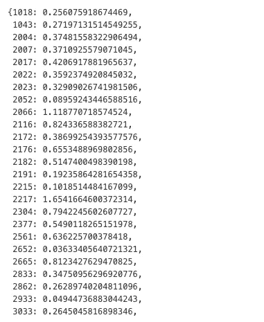
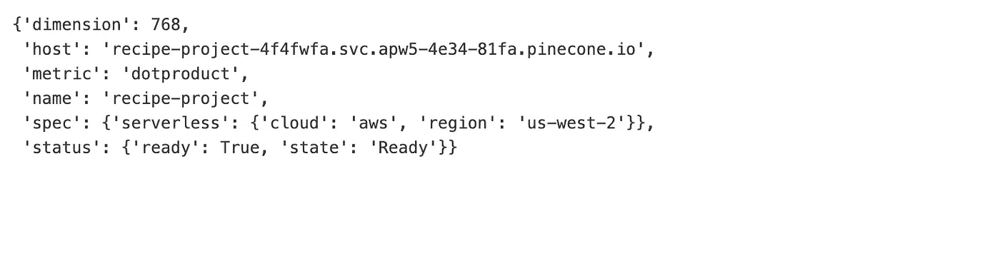
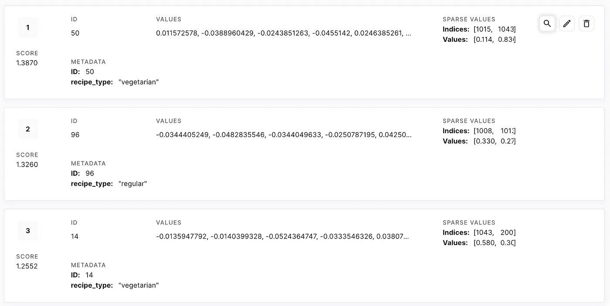
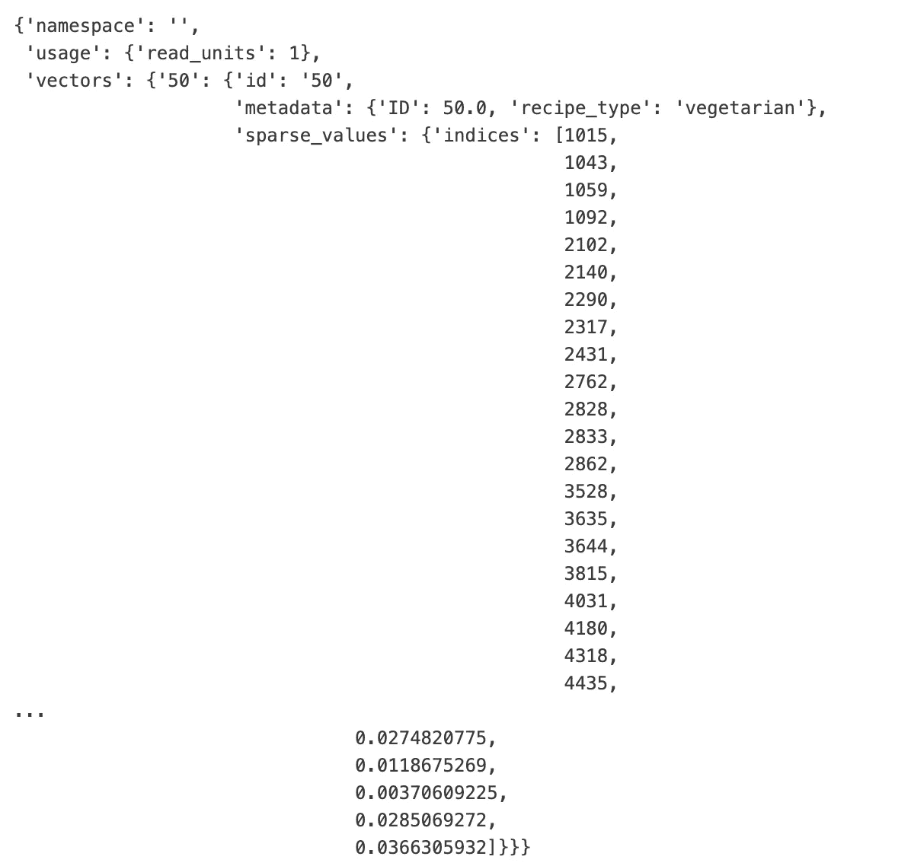
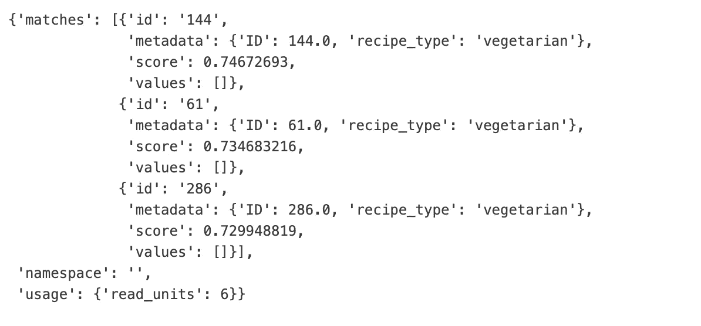
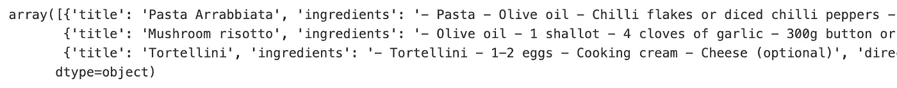

# 使用 RAG 和混合搜索构建一个（食谱）推荐聊天机器人（第一部分）

> 原文：[`towardsdatascience.com/build-a-recipe-recommender-chatbot-using-rag-and-hybrid-search-part-i-c4aa07d14dcf?source=collection_archive---------2-----------------------#2024-03-20`](https://towardsdatascience.com/build-a-recipe-recommender-chatbot-using-rag-and-hybrid-search-part-i-c4aa07d14dcf?source=collection_archive---------2-----------------------#2024-03-20)

## 本教程将教你如何创建稀疏和密集嵌入，并使用混合搜索构建推荐系统。

[](https://medium.com/@sebastianbahr?source=post_page---byline--c4aa07d14dcf--------------------------------)[](https://towardsdatascience.com/?source=post_page---byline--c4aa07d14dcf--------------------------------) [Sebastian Bahr](https://medium.com/@sebastianbahr?source=post_page---byline--c4aa07d14dcf--------------------------------)

·发表于[Towards Data Science](https://towardsdatascience.com/?source=post_page---byline--c4aa07d14dcf--------------------------------) ·14 分钟阅读·2024 年 3 月 20 日

--


图片来自[Katie Smith](https://unsplash.com/@kate5oh3?utm_content=creditCopyText&utm_medium=referral&utm_source=unsplash)在[Unsplash](https://unsplash.com/photos/avocado-tomatoes-eggs-mushrooms-spring-onions-and-leaves-uQs1802D0CQ?utm_content=creditCopyText&utm_medium=referral&utm_source=unsplash)

本教程提供了一个逐步指南，并附有代码，教你如何创建一个聊天机器人风格的推荐系统。完成后，你将构建一个推荐系统，利用用户的开放文本输入通过混合搜索在稀疏和密集向量中找到匹配项。本教程使用的数据集包含食谱，但你可以轻松地将数据集替换为适合你需求的数据集，只需做少量调整。本任务的第一部分将专注于构建推荐系统，包括数据清洗、创建稀疏和密集嵌入、将它们上传到向量数据库，以及执行密集向量搜索和混合搜索。在第二部分，你将创建一个聊天机器人，基于用户输入和推荐生成回应，并使用 Plotly 仪表板构建用户界面。

为了跟随本教程，你需要为付费服务（如 Vertex AI、OpenAI API 和 Pinecone）设置账户。幸运的是，大多数服务提供免费额度，跟随本教程的费用不应超过 $5。除此之外，你可以通过使用我在 GitHub 上提供的[代码库](https://github.com/sebastianbahr/RecipeRecommender)中的文件和数据集进一步降低成本。

# 数据准备

对于这个项目，我们将使用来自[Public Domain Recipes](https://publicdomainrecipes.com/)的食谱。所有食谱都以 Markdown 文件格式存储在这个 GitHub [仓库](https://github.com/ronaldlong46/public-domain-recipes)中。对于本教程，我已经进行了数据清理，并从原始文本输入中创建了特征。如果你有兴趣自己做数据清理部分，代码可以在我的 GitHub [仓库](https://github.com/sebastianbahr/RecipeRecommender)中找到。

数据集包含以下列：

+   *title:* 食谱的标题

+   *date:* 食谱添加的日期

+   *tags:* 描述菜肴的标签列表

+   *introduction:* 食谱的介绍，内容在不同记录之间变化很大

+   *ingredients:* 所有所需的食材。请注意，我已移除数量，因为在创建嵌入时不需要它，而且反而可能导致不理想的推荐。

+   *direction:* 烹饪所需执行的所有步骤

+   *recipe_type:* 指示食谱是纯素食、素食还是常规食谱

+   *output:* 包含食谱的*title*、*ingredients*和*direction*，并将在后续提供给聊天模型作为输入。

让我们来看看*recipe_type*特征的分布。我们可以看到，大多数（60%）的食谱包含鱼或肉类，不适合素食者。大约 35%的食谱适合素食者，只有 5%的食谱适合纯素食者。这个特征将作为从向量数据库中检索匹配食谱的硬性筛选条件。

```py
import re
import json
import spacy
import torch
import openai
import vertexai
import pandas as pd
import numpy as np
import matplotlib.pyplot as plt
from tqdm.auto import tqdm
from transformers import AutoModelForMaskedLM, AutoTokenizer
from pinecone import Pinecone, ServerlessSpec
from vertexai.language_models import TextEmbeddingModel
from utils_google import authenticate
credentials, PROJECT_ID, service_account, pinecone_API_KEY = authenticate() 
from utils_openai import authenticate
OPENAI_API_KEY = authenticate() 

openai_client = openai.OpenAI(api_key=OPENAI_API_KEY)

REGION = "us-central1"
vertexai.init(project = PROJECT_ID,
              location = REGION,
              credentials = credentials)

pc = Pinecone(api_key=pinecone_API_KEY)

# download spacy model
#!python -m spacy download en_core_web_sm
```

```py
recipes = pd.read_json("recipes_v2.json")
recipes.head()
```



```py
plt.bar(recipes.recipe_type.unique(), recipes.recipe_type.value_counts(normalize=True).values)
plt.show()
```



食谱类型的分布

混合搜索使用稀疏向量和密集向量的组合，以及加权因子*alpha*，这使得在检索过程中可以调整密集向量的重要性。接下来，我们将基于*title*、*tags*和*introduction*创建密集向量，并基于*ingredients*创建稀疏向量。通过调整*alpha*，我们可以在后续确定在查询中，用户提到的食材应受到多少“关注”。

在创建嵌入之前，需要创建一个新的特征，包含*title*、*tags*和*introduction*的组合信息。

```py
recipes["dense_feature"] = recipes.title + "; " + recipes.tags.apply(lambda x: str(x).strip("[]").replace("'", "")) + "; " + recipes.introduction
recipes["dense_feature"].head()
```



最后，在深入生成嵌入之前，我们先来看看*output*列。本教程的第二部分将全程讲解如何使用 OpenAI 创建一个能够回答用户问题的聊天机器人，并利用我们的食谱数据库中的知识。因此，在找到最匹配用户查询的食谱后，聊天模型需要一些信息来构建其答案。这就是*output*的作用，它包含了构建一个合适答案所需的所有信息。

```py
# example output
{'title': 'Creamy Mashed Potatoes',
 'ingredients': 'The quantities here are for about four adult portions. If you are planning on eating this as a side dish, it might be more like 6-8 portions. * 1kg potatoes * 200ml milk* * 200ml mayonnaise* * ~100g cheese * Garlic powder * 12-16 strips of bacon * Butter * 3-4 green onions * Black pepper * Salt  *You can play with the proportions depending on how creamy or dry you want the mashed potatoes to be.',
 'direction': '1\. Peel and cut the potatoes into medium sized pieces. 2\. Put the potatoes in a pot with some water so that it covers the potatoes and   boil them for about 20-30 minutes, or until the potatoes are soft. 3\. About ten minutes before removing the potatoes from the boiling water, cut   the bacon into little pieces and fry it. 4\. Warm up the milk and mayonnaise. 5\. Shred the cheese. 6\. When the potatoes are done, remove all water from the pot, add the warm milk   and mayonnaise mix, add some butter, and mash with a potato masher or a   blender. 7\. Add some salt, black pepper and garlic powder to taste and continue mashing   the mix. 8\. Once the mix is somewhat homogeneous and the potatoes are properly mashed,   add the shredded cheese and fried bacon and mix a little. 9\. Serve and top with chopped green onions.'}
```

此外，还需要为每个食谱添加一个唯一标识符，以便检索推荐候选食谱及其*output*。

```py
recipes["ID"] = range(len(recipes))
```

## 生成稀疏嵌入

下一步是为所有 360 条观察生成稀疏嵌入。为了计算这些嵌入，使用了一种比常用的 TF-IDF 或 BM25 方法更为复杂的方法。相反，应用了 SPLADE **Sp**arse **L**exical **a**n**d** **E**xpansion 模型。关于 SPLADE 的详细解释可以在 [这里](https://www.pinecone.io/learn/splade/)找到。密集嵌入对于每个文本输入具有相同的形状，无论输入中的 token 数量如何。相反，稀疏嵌入包含输入中每个唯一 token 的权重。下面的字典表示一个稀疏向量，其中 token ID 是键，分配的权重是值。

```py
model_id = "naver/splade-cocondenser-ensembledistil"

tokenizer = AutoTokenizer.from_pretrained(model_id)
model = AutoModelForMaskedLM.from_pretrained(model_id)

def to_sparse_vector(text, tokenizer, model):
    tokens = tokenizer(text, return_tensors='pt')
    output = model(**tokens)
    vec = torch.max(
        torch.log(1 + torch.relu(output.logits)) * tokens.attention_mask.unsqueeze(-1), dim=1
    )[0].squeeze()

    cols = vec.nonzero().squeeze().cpu().tolist()
    weights = vec[cols].cpu().tolist()
    sparse_dict = dict(zip(cols, weights))
    return sparse_dict

sparse_vectors = []

for i in tqdm(range(len(recipes))):
    sparse_vectors.append(to_sparse_vector(recipes.iloc[i]["ingredients"], tokenizer, model))

recipes["sparse_vectors"] = sparse_vectors
```



第一份食谱的稀疏嵌入

## 生成密集嵌入

在本教程的这一阶段，如果您使用 VertexAI（谷歌）或 OpenAI 的文本嵌入模型，将会产生一些费用。然而，如果您使用相同的数据集，费用最多为 $5。费用可能会根据数据集记录数或文本长度的不同而有所变化，因为按 token 收费。如果您不想产生任何费用，但仍希望继续进行教程，特别是第二部分，您可以从我的 GitHub [仓库](https://github.com/sebastianbahr/RecipeRecommender) 下载预生成嵌入数据的 pandas DataFrame *recipes_with_vectors.pkl*。

您可以选择使用 VertexAI 或 OpenAI 来创建嵌入。OpenAI 的优点是设置简单，只需一个 API 密钥，而 VertexAI 需要登录 Google 控制台、创建一个项目并将 VertexAI API 添加到您的项目中。此外，OpenAI 模型允许您指定密集向量的维度。然而，这两者都能创建最先进的密集嵌入。

使用 VertexAI API

```py
# running this code will create costs !!!
model = TextEmbeddingModel.from_pretrained("textembedding-gecko@003")

def to_dense_vector(text, model):
    dense_vectors = model.get_embeddings([text])
    return [dense_vector.values for dense_vector in dense_vectors][0]

dense_vectors = []

for i in tqdm(range(len(recipes))):
    dense_vectors.append(to_dense_vector(recipes.iloc[i]["dense_feature"], model))

recipes["dense_vectors"] = dense_vectors
```

使用 OpenAI API

```py
# running this code will create costs !!!

# Create dense embeddings using OpenAIs text embedding model with 768 dimensions
model = "text-embedding-3-small"

def to_dense_vector_openAI(text, client, model, dimensions):
    dense_vectors = client.embeddings.create(model=model, dimensions=dimensions, input=[text])
    return [dense_vector.values for dense_vector in dense_vectors][0]

dense_vectors = []

for i in tqdm(range(len(recipes))):
    dense_vectors.append(to_dense_vector_openAI(recipes.iloc[i]["dense_feature"], openai_client, model, 768))

recipes["dense_vectors"] = dense_vectors
```

## 上传数据到向量数据库

在生成稀疏和密集嵌入后，我们拥有了上传到向量数据库所需的所有数据。在本教程中，将使用 Pinecone，因为它们支持使用稀疏和密集向量进行混合搜索，并提供 $100 免费积分的无服务器定价模式。为了以后执行混合搜索，必须将相似度度量设置为点积。如果我们只进行密集搜索而不是混合搜索，我们将能够选择以下相似度度量之一：点积、余弦相似度和欧几里得距离。关于相似度度量及其如何计算两个向量之间相似度的更多信息，请查看 [这里](https://www.pinecone.io/learn/vector-similarity/)。

```py
# load pandas DataFrame with pre-generated embeddings if you
# didn't generate them in the last step
recipes = pd.read_pickle("recipes_with_vectors.pkl")

# if you need to delte an existing index
pc.delete_index("index-name")

# create a new index 
pc.create_index(
    name="recipe-project",
    dimension=768, # adjust if needed
    metric="dotproduct",
    spec=ServerlessSpec(
        cloud="aws",
        region="us-west-2"
    )
)

pc.describe_index("recipe-project")
```



恭喜您创建了第一个 Pinecone 索引！现在是时候将嵌入数据上传到向量数据库了。如果您使用的嵌入模型创建的向量维度不同，请确保调整 *dimension* 参数。

现在是时候将数据上传到新创建的 Pinecone 索引了。

```py
# upsert to pinecone in batches
def sparse_to_dict(data):
    dict_ = {"indices": list(data.keys()),
             "values": list(data.values())}
    return dict_

batch_size = 100
index = pc.Index("recipe-project")

for i in tqdm(range(0, len(recipes), batch_size)):
    i_end = min(i + batch_size, len(recipes))
    meta_batch = recipes.iloc[i: i_end][["ID", "recipe_type"]]
    meta_dict = meta_batch.to_dict(orient="records")

    sparse_batch = recipes.iloc[i: i_end]["sparse_vectors"].apply(lambda x: sparse_to_dict(x))
    dense_batch = recipes.iloc[i: i_end]["dense_vectors"]

    upserts = []

    ids = [str(x) for x in range(i, i_end)]
    for id_, meta, sparse_, dense_ in zip(ids, meta_dict, sparse_batch, dense_batch):
        upserts.append({
            "id": id_,
            "sparse_values": sparse_,
            "values": dense_,
            "metadata": meta
        })

    index.upsert(upserts)

index.describe_index_stats()
```

如果你对上传的数据内容感到好奇，可以登录 Pinecone，选择新创建的索引，查看其中的项目。目前，我们无需关注分数，因为它是默认生成的，表示与 Pinecone 随机生成的向量的匹配度。不过，稍后我们将计算嵌入的用户查询与向量数据库中所有条目的相似度，并检索*最相似的 k 个*条目。此外，每个项目都包含一个由 Pinecone 生成的项目 ID 和元数据，其中包括食谱*ID*及其*recipe_type*。密集嵌入存储在*Values*中，稀疏嵌入存储在*Sparse Values*中。



索引的前三项（*作者提供的图片*）

我们可以使用 Pinecone Python SDK 获取上述信息。让我们查看索引项 ID 为 50 的第一个项目存储的信息。

```py
index.fetch(ids=["50"])
```



与 Pinecone 仪表板中一样，我们获取元素的项目 ID、元数据、稀疏值和密集值，这些信息存储在截断输出底部的列表中。

# 搜索

在本节中，我们将仅使用密集向量来查找数据库中最匹配的条目（*密集搜索*）。在第二步中，我们将利用稀疏和密集向量中存储的信息来执行混合搜索。

## 使用密集向量的常规搜索

为了测试推荐系统的功能，我们将尝试获取素食意大利菜肴的推荐。需要注意的是，必须使用与嵌入食谱时相同的模型来生成密集嵌入。

```py
user_query = "I want to cook some Italian dish with rice"
recipe_type = "vegetarian"
```

```py
# running this code will create costs !!!

# If you used VertexAI and gecko003 to create dense embeddings
model = TextEmbeddingModel.from_pretrained("textembedding-gecko@003")

def to_dense_vector(text, model):
    dense_vectors = model.get_embeddings([text])
    return [dense_vector.values for dense_vector in dense_vectors][0]

text_dense_vector = to_dense_vector(user_query, model)
```

使用 OpenAI API

```py
# running this code will create costs !!!

# If you used OpenAI to create dense embeddings
model = "text-embedding-3-small"

def to_dense_vector_openAI(text, client, model, dimensions):
    dense_vectors = client.embeddings.create(model=model, dimensions=dimensions, input=[text])
    return [dense_vector.values for dense_vector in dense_vectors][0]

text_dense_vector = to_dense_vector_openAI(user_query, openai_client, model, 768)
```

在将用户文本嵌入后，我们可以查询向量数据库，获取与用户查询最相似的食谱。如前所述，Pinecone 使用点积来计算相似度分数。此外，我们指定 Pinecone 返回推荐项的元数据，因为我们需要食谱的*ID*来筛选食谱数据库并获取相应条目的输出。参数*top_k*允许我们指定应该返回的匹配项数量，最后，我们使用硬筛选仅推荐价格等于或低于指定价格（10.0）的咖啡混合物。有关 Pinecone 中如何筛选元数据的更多信息，请查看[此处](https://docs.pinecone.io/docs/metadata-filtering)。

```py
index = pc.Index("recipe-project")

retrieved_items = index.query(vector=text_dense_vector,
                              include_values=False,
                              include_metadata=True,
                              top_k=3,
                              filter={"recipe_type": {"$eq": recipe_type}})

retrieved_ids = [item.get("metadata").get("ID") for item in retrieved_items.get("matches")]

retrieved_items
```



在获取推荐食谱的 ID 后，我们可以轻松查询*食谱*数据集，并查看它们的*输出*。*输出*包含所有所需信息，如*标题*、*食材*和*做法*。查看前几条推荐结果，发现它们都是素食，这并不奇怪，因为我们应用了“硬”筛选，但它们都是用户要求的意大利菜肴。

```py
recipes[recipes.ID.isin(retrieved_ids)].output.values
```



相似度得分最高的食谱

```py
recipes[recipes.ID.isin(retrieved_ids)].output.values[0]
```

```py
{'title': 'Pasta Arrabbiata',
 'ingredients': '- Pasta - Olive oil - Chilli flakes or diced chilli peppers - Crushed garlic cloves - Crushed tomatoes (about 800 gramms for 500 gramms of pasta) - Chopped parsley - Grated Pecorino Romano or Parmigiano Reggiano (optional, but highly recommended)',
 'direction': '1\. Start heating up water for the pasta. 2\. Heat up a few tablespoons of olive oil over low heat. 3\. Crush several cloves of garlic into the olive oil, add the chilli flakes or chilli peppers and fry them for a short time, while being careful not to burn the garlic. 4\. Add your crushed tomatoes, together with some salt and pepper, increase the heat to medium and let simmer for 10-15 minutes or until it looks nicely thickened. 5\. When the water starts boiling, put a handful of salt into it and then your pasta of choice. Ideally leave the pasta slightly undercooked, because it will go in the hot sauce and finish cooking there. 6\. When the sauce is almost ready, add most of your chopped parsley and stir it around. Save some to top the dish later. 8\. When the pasta is ready (ideally at the same time as the sauce or slightly later), strain it and add it to the sauce, which should be off the heat. If the sauce looks a bit too thick, add some of the pasta water. Mix well. 9\. Add some of the grated cheese of your choice and stir it in. 10\. Serve with some more grated cheese and chopped parsley on top.'}
```

## 混合搜索

现在是时候实现混合搜索了。这个概念听起来比实际要复杂，你会发现我们只需用两行代码就能实现它。混合搜索通过一个因子*alpha*对密集向量的值进行加权，对稀疏向量的值加权系数为*1-alpha*。换句话说，*alpha*决定了输入文本的密集向量与稀疏向量分别应该获得多少“关注”。如果*alpha=1*，我们进行纯密集向量搜索；*alpha=0.5*是纯混合搜索；而*alpha=0*是纯稀疏向量搜索。

正如你所记得的，稀疏和密集向量是使用不同的信息创建的。稀疏向量包含有关食材的信息，而密集向量包含标题、标签和介绍。因此，通过改变*alpha*，我们可以告诉查询引擎优先考虑食谱的某些特征而非其他特征。让我们首先使用 alpha 值为 1，并在用户查询上进行纯密集搜索：

> 我可以用土豆、蘑菇和牛肉做些什么？

不幸的是，除了牛肉，推荐的食谱不包含其他提到的食材。

生成稀疏嵌入

```py
model_id = "naver/splade-cocondenser-ensembledistil"
tokenizer = AutoTokenizer.from_pretrained(model_id)
model = AutoModelForMaskedLM.from_pretrained(model_id)

def to_sparse_vector(text, tokenizer, model):
    tokens = tokenizer(text, return_tensors='pt')
    output = model(**tokens)
    vec = torch.max(
        torch.log(1 + torch.relu(output.logits)) * tokens.attention_mask.unsqueeze(-1), dim=1
    )[0].squeeze()

    cols = vec.nonzero().squeeze().cpu().tolist()
    weights = vec[cols].cpu().tolist()
    sparse_dict = dict(zip(cols, weights))
    return sparse_dict

text_sparse_vector = to_sparse_vector(user_query, tokenizer, model)
```

生成密集嵌入

```py
# running this code will create costs !!!

# If you used VertexAI and gecko003 to create dense embeddings
model = TextEmbeddingModel.from_pretrained("textembedding-gecko@003")

text_dense_vector = to_dense_vector(user_query, model)
```

```py
def hybride_search(sparse_dict, dense_vectors, alpha):

    # check alpha value is in range
    if alpha < 0 or alpha > 1:
        raise ValueError("Alpha must be between 0 and 1")
    # scale sparse and dense vectors to create hybrid search vecs
    hsparse = {
        "indices": list(sparse_dict.keys()),
        "values": [v * (1 - alpha) for v in list(sparse_dict.values())]
    }
    hdense = [v * alpha for v in dense_vectors]
    return hdense, hsparse

user_query = "What can I cook with potatos, mushrooms, and beef?"
recipe_type = ["regular", "vegetarian", "vegan"] # allows for all recipe types

dense_vector, sparse_dict = hybride_search(text_sparse_vector, text_dense_vector, 1.0)

retrieved_items = index.query(vector=dense_vector,
                              sparse_vector=sparse_dict,
                              include_values=False,
                              include_metadata=True,
                              top_k=1,
                              filter={"recipe_type": {"$in": recipe_type}})

retrieved_ids = [item.get("metadata").get("ID") for item in retrieved_items.get("matches")]

[x.get("ingredients") for x in recipes[recipes.ID.isin(retrieved_ids)].output.values]
```

```py
# retrived output with alpha=1.0
['- 1 beef kidney - 60g butter - 2 onions - 2 shallots - 1 sprig of fresh parsley - 3 bay leaves - 400g croutons or toasted bread in pieces']
```

让我们将 alpha 设置为 0.5，看看推荐食谱的食材。这个 alpha 值得出了一个更好的结果，推荐的食谱包含了要求的所有三种食材：

+   500 克牛肉

+   300–400 克土豆

+   2–3 颗香菇

```py
dense_vector, sparse_dict = hybride_search(text_sparse_vector, text_dense_vector, 0.5)

retrieved_items = index.query(vector=dense_vector,
                              sparse_vector=sparse_dict,
                              include_values=False,
                              include_metadata=True,
                              top_k=1,
                              filter={"recipe_type": {"$in": recipe_type}})

retrieved_ids = [item.get("metadata").get("ID") for item in retrieved_items.get("matches")]

[x.get("ingredients") for x in recipes[recipes.ID.isin(retrieved_ids)].output.values]
```

```py
# retrived output with alpha=0.5
['* 500g beef * 300-400g potatoes * 1 carrot * 1 medium onion * 12 tablespoons tomato paste * 500ml water * 3-4 garlic cloves * 3-4 bay leaves * Curcuma * Paprika * Oregano * Parsley * Caraway * Basil (optional) * Cilantro (optional) * 2-3 champignon mushrooms (optional)']Using a serverless index has the advantage that you do not need to pay for a server instance that runs 24/7\. Instead, you are billed by queries or read and write units, as they are called by Pinecone. Sparse and dense vector searches work well with a serverless index. However, please keep in mind the following limitation.
```

恭喜你，已经完成了本教程的学习！

## 最后的备注

> 混合搜索的实现，在基于 pod 和无服务器索引之间有所不同。如果你从一种切换到另一种，可能会经历精度或性能上的回退。
> 
> 当你查询无服务器索引时，查询的密集值用于检索初步的候选记录，然后在返回最终结果时考虑稀疏值。

# 结论

在本教程中，你学习了如何使用稀疏和密集嵌入来嵌入数据集，并使用密集和混合搜索来查找向量数据库中最匹配的条目。

在第二部分，你将使用 GPT 3.5-turbo 模型构建一个带有函数调用的聊天机器人，并使用 Plotly Dash 生成 UI。如果你感兴趣并且喜欢第一部分，可以看看第二部分。

## 请支持我的工作！

如果你喜欢这篇博客文章，请留下掌声或评论。要保持关注，请在[Medium](https://medium.com/@sebastianbahr)和[LinkedIn](https://www.linkedin.com/in/sebastian-bahr-61b58b197/)上关注我。
