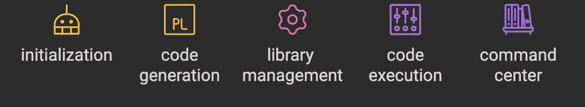

# 从零开始构建你的智能体

> 原文：[`towardsdatascience.com/build-your-agents-from-scratch-forget-autogen-or-crewai-part-a-a114cd1e785f?source=collection_archive---------2-----------------------#2024-09-23`](https://towardsdatascience.com/build-your-agents-from-scratch-forget-autogen-or-crewai-part-a-a114cd1e785f?source=collection_archive---------2-----------------------#2024-09-23)

## 设计你自己的智能体，完全不依赖任何框架

[](https://medium.com/@hamzafarooq?source=post_page---byline--a114cd1e785f--------------------------------)[](https://towardsdatascience.com/?source=post_page---byline--a114cd1e785f--------------------------------) [Hamza Farooq](https://medium.com/@hamzafarooq?source=post_page---byline--a114cd1e785f--------------------------------)

·发表于[Towards Data Science](https://towardsdatascience.com/?source=post_page---byline--a114cd1e785f--------------------------------) ·7 分钟阅读·2024 年 9 月 23 日

--


图片由[Arseny Togulev](https://unsplash.com/@tetrakiss?utm_source=medium&utm_medium=referral)提供，来源于[Unsplash](https://unsplash.com/?utm_source=medium&utm_medium=referral)

最近几个月，我们都听说过智能体和多智能体框架。这些 AI 智能体已经成为自动化和决策制定中默默无闻的英雄。

虽然像[AutoGen](https://microsoft.github.io/autogen/)和[CrewAI](https://www.crewai.com/)这样的预构建框架提供了诱人的快捷方式，（这是有道理的！）但是，从零开始构建你自己的智能体，所带来的无与伦比的刺激感和深度理解，是任何快捷方式都无法比拟的。

*这就像是在选择方便面的速食和制作一顿精美的餐点——当然，前者很快，但后者？那才是魔力的源泉。*

今天，我们将撸起袖子，深入探讨如何创建*AgentPro*，我们自己的 AI 助手。在本文结束时，你将对 AI 智能体的运作原理有一个基础的了解，并且你将能够顺利创建一个可以按需生成和执行代码的数字助手。

*这就像是在教一个机器人钓鱼，只不过钓到的不是鱼，而是从空中提取 Python 脚本！*

**警告：此代码可能在所有情况下无法运行，但它应该能帮助你入门 + 代码中可能会出现缩进错误**

这是[Colab Notebook](https://colab.research.google.com/drive/1JilIxgnrs1vrWeF2tOL0eboiYwNfTmB0?usp=sharing)

# **构建模块：通往 AgentPro 的路线图**

在深入代码之前，让我们先概述一下我们将构建的关键组件：



开发一个代理人从零开始的五个阶段（图片由作者提供）

1.  *初始化：设置我们代理人的“大脑”*

1.  *代码生成：教我们的代理人编写 Python 脚本*

1.  *库管理：让我们的代理人能够安装必要的工具*

1.  *代码执行：赋能我们的代理人运行它生成的代码*

1.  *指挥中心：创建一个集中管理所有这些功能的中心枢纽*

现在，让我们分解每个步骤，看看它们如何结合在一起，形成我们的 AI 助手。

**步骤 1：初始化 — 给予我们的代理人第一次生命的火花**

每一段伟大的旅程都是从第一步开始的，在人工智能代理人的世界里，这一步就是初始化。这是我们设置代理人基本结构并将其与主要智能源（在本例中是 OpenAI API）连接的地方。

```py
from openai import OpenAI
import os
from google.colab import userdata
import base64
import requests
from PIL import Image
from io import BytesIO
import subprocess
import tempfile
import re
import importlib
import sys

os.environ["OPENAI_API_KEY"] = userdata.get('OPENAI_API_KEY')
class AgentPro:
    def __init__(self):
        # Future initialization code can go here
        pass
```

这段代码是给我们的 AI 助手赋予生命的数字等价物。我们正在导入必要的库，设置我们的 OpenAI API 密钥，并创建 AgentPro 类的框架。这就像是为我们的 AI 提供了一个身体——单独来看，它不太有用，但它对接下来的所有内容都是至关重要的。

**步骤 2：代码生成 — 教我们的代理人写 Python 代码**

现在我们的代理人有了一个“身体”，让我们赋予它思考的能力——或者在这个例子中，赋予它生成代码的能力。这就是事情开始变得激动人心的地方！

```py
def generate_code(self, prompt):
    client = OpenAI()
    response = client.chat.completions.create(
    model="gpt-4o",
    messages=[
      {"role": "system", "content": "You are a Python code generator. Respond only with executable Python code, no explanations or comments except for required pip installations at the top."},
      {"role": "user", "content": f"Generate Python code to {prompt}. If you need to use any external libraries, include a comment at the top of the code listing the required pip installations."}
    ],
    max_tokens=4000,
    temperature=0.7,
    top_p=1,
    frequency_penalty=0,
    presence_penalty=0
    )
    code = re.sub(r'^```python\n|^```py\n|```$', '', response.choices[0].message.content, flags=re.MULTILINE)

    code_lines = code.split('\n')

    当 code_lines 并且不是以 'import' 或 'from' 或 '#' 开头时：

        code_lines.pop(0)

    return '\n'.join(code_lines)

```py

This method is the crown jewel of our agent’s capabilities. It’s using the OpenAI API to generate Python code based on a given prompt.

Think of it as giving our agent the ability to brainstorm and write code on the fly. We’re also doing some cleanup to ensure we get clean, executable Python code without any markdown formatting or unnecessary comments.

The parameters we’re using (like temperature and top_p) allow us to control the creativity and randomness of the generated code. It’s like adjusting the “inspiration” knob on our AI’s imagination!

**Step 3: Library Management — Equipping Our Agent with the Right Tools**

Every good coder knows the importance of having the right libraries at their disposal. Our AI assistant is no different. This next method allows AgentPro to identify and install any necessary Python libraries

```

def install_libraries(self, code):

    libraries = re.findall(r'#\s*pip install\s+([\w-]+)', code)

    如果 libraries:

        print("正在安装所需的库...")

        对于 lib 在 libraries 中：

            try:

                importlib.import_module(lib.replace('-', '_'))

                print(f"{lib} 已经安装。")

            except ImportError:

                print(f"正在安装 {lib}...")

                subprocess.check_call([sys.executable, "-m", "pip", "install", lib])

        print("库安装成功。")

```py

This method is like sending our agent on a shopping spree in the Python Package Index. It scans the generated code for any pip install comments, checks if the libraries are already installed, and if not, installs them. It’s ensuring our agent always has the right tools for the job, no matter what task we throw at it.

**Step 4: Code Execution — Bringing the Code to Life**

Generating code is great, but executing it is where the rubber meets the road. This next method allows our agent to run the code it has generated:

```

def execute_code(self, code):

    with tempfile.NamedTemporaryFile(mode='w', suffix='.py', delete=False) as temp_file:

        temp_file.write(code)

        temp_file_path = temp_file.name

    try:

        result = subprocess.run(['python', temp_file_path], capture_output=True, text=True, timeout=30)

        output = result.stdout

        error = result.stderr

    except subprocess.TimeoutExpired:

        output = ""

        error = "执行超时，超出 30 秒。"

    finally:

        os.unlink(temp_file_path)

    return output, error

```py

This method is where the magic really happens. It takes the generated code, writes it to a temporary file, executes it, captures the output (or any errors), and then cleans up after itself. It’s like giving our agent hands to type out the code and run it, all in the blink of an eye.

**Step 5: Command Center — Putting It All Together**

Finally, we need a way to orchestrate all these amazing capabilities. Enter the run method:

```

def run(self, prompt):

    print(f"正在为 {prompt} 生成代码")

    code = self.generate_code(prompt)

    print("生成的代码：")

    print(code)

    print("\n 正在执行代码...")

    output, error = self.execute_code(code)

    如果 output:

        print("输出：")

        print(output)

    如果 error:

        print("错误：")

        print(error)

```py

This is the command center of our AI assistant. It takes a prompt, generates the code, executes it, and reports back with the results or any errors. It’s like having a personal assistant who not only understands your requests but carries them out and gives you a full report.

**Putting It All Together:**

Now that we have all our components, let’s see how we can use our newly minted AI assistant:

```

如果 __name__ == "__main__"：

    agent = AgentPro()

    agent.run("""制作一个关于最佳领导形式的详细幻灯片，至少包含 10 张，并保存为名为 leadership.pptx 的 pptx 文件""")

至少包含 10 张幻灯片，并保存为名为 leadership.pptx 的 pptx 文件""")

```

使用这个简单的命令，我们要求我们的代理创建一个关于领导风格的完整演示文稿，包含至少 10 张幻灯片，并将其保存为 PowerPoint 文件。

我们的代理将生成必要的 Python 代码（可能使用如 python-pptx 之类的库），安装任何需要的库，执行代码以创建演示文稿，然后报告结果或遇到的任何错误。

我们刚刚建立了一个强大的 AI 代理的基础，能够按需生成并执行 Python 代码。从通过 OpenAI API 设置它的“大脑”，到赋予它编写和运行代码的能力，再到为它装备安装必要工具的功能，我们创造了一个多功能的数字助手。

这只是自定义 AI 代理可能实现的一个开端。在未来的系列中，我们将探索如何通过网络搜索能力、图像生成，甚至更复杂的决策过程来增强 AgentPro。

记住，**能力越大，责任越大**。你新的 AI 助手是一个强大的工具，但如何使用它完全取决于你。用它来自动化繁琐的任务，探索新想法，推动 AI 的边界。

只是，也许不要让它为你写结婚誓言或决定你的下一份职业——有些事情还是交给人类直觉来处理吧！

敬请期待 B 部分，在那里我们将教我们的代理一些新技巧，并开始解锁它的真正潜力。直到那时，祝你编程愉快，愿你的 AI 冒险没有 bug 且永无止境！

关注 B 部分！

如果你对了解更多内容感兴趣，请订阅。你也可以通过[LinkedIn](https://www.linkedin.com/in/hamzafarooq/)与我联系。

**关于我**

你好！我是 Hamza，我很高兴成为你进入 AI 代理世界的指南。作为 Google 的资深研究科学家，并在斯坦福和 UCLA 等著名院校有教学经验，我多年来一直处于 AI 开发和教育的前沿。我的热情在于揭开复杂 AI 概念的神秘面纱，并赋能下一代 AI 从业者。

说到这个，如果你喜欢这次深入了解如何从零构建 AI 代理，或许你会对将你的 LLM 知识提升到一个新层次感兴趣。我最近在 MAVEN 平台上开发了一门名为[企业 RAG 与多代理应用](https://maven.com/boring-bot/advanced-llm)的综合课程。这门课程专为那些希望推动大型语言模型（LLM）边界的实践者而设计，尤其是在企业环境中。

在[企业 RAG 和多智能体应用](https://maven.com/boring-bot/advanced-llm)中，我们探索了超越基础的前沿技术。从先进的检索增强生成（RAG）解决方案，到最新的模型优化方法和负责任的 AI 实践，本课程旨在让你掌握应对现实世界 AI 挑战所需的技能。

无论你是想实施最先进的 LLM 应用，还是深入研究模型微调和伦理 AI 部署的复杂性，本课程都能满足你的需求。
