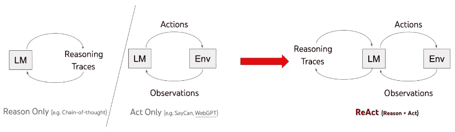

# 使用 LangChain、LLM 和 Streamlit 构建复杂 SQL 数据库交互的聊天应用

> 原文：[`towardsdatascience.com/building-a-chat-app-with-langchain-llms-and-streamlit-for-complex-sql-database-interaction-7433245079f3?source=collection_archive---------0-----------------------#2024-02-09`](https://towardsdatascience.com/building-a-chat-app-with-langchain-llms-and-streamlit-for-complex-sql-database-interaction-7433245079f3?source=collection_archive---------0-----------------------#2024-02-09)

## 构建并部署一个用于复杂数据库交互的聊天应用，使用 LangChain 代理。

[](https://medium.com/@hamzagharbi_19502?source=post_page---byline--7433245079f3--------------------------------)[](https://towardsdatascience.com/?source=post_page---byline--7433245079f3--------------------------------) [Hamza Gharbi](https://medium.com/@hamzagharbi_19502?source=post_page---byline--7433245079f3--------------------------------)

·发表于[Towards Data Science](https://towardsdatascience.com/?source=post_page---byline--7433245079f3--------------------------------) ·16 分钟阅读·2024 年 2 月 9 日

--


由 DALL-E 生成的图像。

在本文中，我们将展示如何使用大型语言模型（LLM）通过`Langchain`代理和工具与复杂数据库进行交互，并随后使用`Streamlit`部署聊天应用。

本文是一个两阶段项目的第二部分，也是最终部分，该项目利用了[RappelConso](https://api.gouv.fr/les-api/api-rappel-conso) API 数据，这是一个法国公共服务，提供关于法国产品召回的信息。

在[第一篇](https://medium.com/towardsdev/end-to-end-data-engineering-system-on-real-data-with-kafka-spark-airflow-postgres-and-docker-a70e18df4090)文章中，我们建立了一个管道，利用各种数据工程工具从 API 中查询数据，并将其存储到 PostgreSQL 数据库中。在本文中，我们将开发一个基于语言模型的聊天应用，允许我们与数据库进行交互。

## 目录

· 概览

· 设置

· SQL 代理

· SQL 数据库工具包

· 附加工具

· 实现记忆功能

· 使用 Streamlit 创建应用

· 观察与增强

· 结论

· 参考文献

# 概览

在这个项目中，我们将创建一个聊天机器人，它可以通过`Langchain`框架与 RappelConso 数据库进行交互。这个聊天机器人能够理解自然语言，并利用自然语言创建和执行 SQL 查询。我们将通过提供额外的工具来增强聊天机器人进行 SQL 查询的能力。它还将具备记忆功能，以便记住与用户的过去互动。为了使其更易于使用，我们将使用`Streamlit`将其转化为一个基于聊天的网页应用程序。


用户查询和代理响应的示例。图片由作者提供。

你可以在这里看到最终应用程序的演示：

rappel-conso 数据库上的最终 Streamlit 聊天应用程序演示。视频由作者提供。

该聊天机器人可以回答不同复杂度的查询，从召回产品的类别计数到关于产品或品牌的具体问题。它可以通过使用可用的工具来识别查询所需的正确列。该聊天机器人还可以用“ASCII”兼容的语言（如英语、法语、德语等）回答查询。


德语中的查询和响应示例。图片由作者提供。

## 术语表：

这里是一些关键术语的快速介绍，帮助你理解本文中提到的概念。

+   **Langchain：** LangChain 是一个开源框架，用于构建利用大语言模型（LLM）的应用程序。

+   **代理：** 它们是 Langchain 的组件，利用语言模型决定采取哪些操作以及操作的顺序。代理通常可以访问一组称为*工具*的函数，它可以根据用户输入决定使用哪一个工具。

+   **工具：** 这些是代理可以调用的函数，使其能够与外界互动。工具必须以最有助于代理的方式进行描述。

+   **工具包：** 一组相关工具。在这个项目中，我们将使用*SQLDatabaseToolkit*。关于这一点将在后续部分进行详细说明。

+   **SQL 数据库：** 存储你将查询数据的数据库。在我们的项目中，我们将使用 Postgres 数据库。

+   **Streamlit：** 一个 Python 框架，能够非常简单地创建交互式网页应用程序。

现在让我们深入了解这个项目的技术细节！

# **设置**

首先，你可以使用以下命令克隆 GitHub 仓库：

```py
git clone https://github.com/HamzaG737/rappel-conso-chat-app.git
```

接下来，你可以导航到项目根目录并安装所需的包：

```py
pip install -r requirements.txt
```

在这个项目中，我们使用了 OpenAI 的两个大型语言模型，`gpt-3.5-turbo-1106` 和 `gpt-4–1106-preview`。由于后者在理解和执行复杂查询方面表现更好，我们将其作为默认的 LLM。

## 设置数据库

在我的[上一篇](https://medium.com/@hamzagharbi_19502/end-to-end-data-engineering-system-on-real-data-with-kafka-spark-airflow-postgres-and-docker-a70e18df4090)文章中，我介绍了如何为从源 API 直接流式传输数据到 Postgres 数据库设置数据管道。然而，如果你想要更简单的解决方案，我创建了一个脚本，可以将所有数据从 API 直接传输到 Postgres，省去了设置完整管道的需求。

首先，你需要安装[Docker](https://www.docker.com/products/docker-desktop/)。然后，你必须将 POSTGRES_PASSWORD 设置为环境变量。默认情况下，它将设置为字符串`"postgres"`。

接下来，使用项目根目录中的 docker-compose yaml 文件启动 Postgres 服务器：

```py
docker-compose -f docker-compose-postgres.yaml up -d
```

之后，脚本`database/stream_data.py`帮助你创建`rappel_conso_table`表，将数据从 API 流式传输到数据库，并通过计数行数对数据进行快速检查。截至 2024 年 2 月，你应该能看到大约 10400 行数据，因此预期会接近这个数字。

要运行该脚本，请使用以下命令：

```py
python database/stream_data.py
```

请注意，数据传输可能需要约一分钟，视你的网络连接速度而定，可能稍微长一些。

*rappel_conso_table* 总共有**25**列，其中大部分是**TEXT**类型，可以接受无限值。以下是一些重要的列：

+   *reference_fiche (参考表格):* 被召回产品的唯一标识符。它作为我们 Postgres 数据库的主键。

+   *categorie_de_produit (产品类别):* 例如食品、电器、工具、交通工具等……

+   *sous_categorie_de_produit (产品子类别):* 例如我们可以将肉类、乳制品、谷物作为食品类别的子类别。

+   *motif_de_rappel (召回原因):* 一目了然，且是最重要的字段之一。

+   *date_de_publication* 代表发布日期。

+   *risques_pour_le_consommateur* 包含消费者在使用产品时可能遇到的风险。

+   还有几个字段对应不同的链接，如产品图片链接、分销商列表链接等。

所有列的完整列表可以在`constants.py`文件中的常量`RAPPEL_CONSO_COLUMNS`下找到。

鉴于存在大量的列，代理必须有效地区分它们，尤其是在用户查询不明确的情况下。`SQLDatabaseToolkit`，以及我们计划实现的其他工具，将在提供必要的上下文方面发挥重要作用。这个上下文对于代理准确生成适当的 SQL 查询至关重要。

# SQL 代理

LangChain 提供了一个 SQL 代理，它提供了一种灵活的方式与 SQL 数据库进行交互。

使用 SQL 代理的好处包括：

+   它能够响应关于数据库结构（如特定表的详细信息）以及内容的查询。

+   它有效处理错误的能力。当执行查询时发生错误，SQL 代理可以识别问题、修正它，然后成功执行修正后的查询。

在 Langchain 中，我们可以通过 `create_sql_agent` 函数初始化 SQL 代理。

```py
from langchain.agents import create_sql_agent

agent = create_sql_agent(
        llm=llm_agent,
        agent_type=AgentType.ZERO_SHOT_REACT_DESCRIPTION,
        toolkit=toolkit,
        verbose=True,
    )
```

+   在这个函数中，**llm** 是代理的主要大型语言模型骨干。我们为此任务选择了 OpenAI GPT 模型，但其他模型也可能适用。以下是如何为代理定义 LLM 的方法：

```py
from langchain.chat_models import ChatOpenAI

from constants import chat_openai_model_kwargs, langchain_chat_kwargs

# Optional: set the API key for OpenAI if it's not set in the environment.
# os.environ["OPENAI_API_KEY"] = "xxxxxx"

def get_chat_openai(model_name):
    llm = ChatOpenAI(
        model_name=model_name,
        model_kwargs=chat_openai_model_kwargs,
        **langchain_chat_kwargs
    )
    return llm
```

+   目前，`create_sql_agent` 函数支持两种类型的代理：OpenAI 函数代理和 ReAct 代理。我们选择了 ReAct 代理，因为它们更容易与记忆功能集成。**ReAct** 代理模型使用大型语言模型同时生成推理和特定任务的动作。这种方法帮助代理在处理异常时规划、跟踪和调整其动作。它还使代理能够连接外部资源，如知识库，以获取更多信息，从而提高任务的效率。关于该框架的更多详细信息可以在[这里](https://react-lm.github.io/)找到。



ReAct 框架的示意图。图片基于 ReAct 论文（请查看参考文献部分）。

+   最后，`create_sql_agent` 函数中的 `toolkit` 表示与数据库交互的 SQL 工具集。更多内容将在下一节介绍！

# SQL 数据库工具包

`SQLDatabaseToolkit` 包含以下工具：

+   创建并执行查询：在以下示例中，ReAct 代理将调用 `sql_db_query` 工具，并以某个 SQL 查询作为输入。随后，它分析数据库结果以为用户制定适当的响应。

```py
Action: sql_db_query
Action Input: SELECT reference_fiche, nom_de_la_marque_du_produit, noms_des_modeles_ou_references, date_de_publication, liens_vers_les_images FROM rappel_conso_table WHERE categorie_de_produit = 'Alimentation' ORDER BY date_de_publication DESC LIMIT 1
Observation: [('2024-01-0125', 'MAITRE COQ', 'Petite Dinde', '2024-01-13', 'https://rappel.conso.gouv.fr/image/ea3257df-7a68-4b49-916b-d6f019672ed2.jpg https://rappel.conso.gouv.fr/image/2a73be1e-b2ae-4a31-ad38-266028c6b219.jpg https://rappel.conso.gouv.fr/image/95bc9aa0-cc75-4246-bf6f-b8e8e35e2a88.jpg')]
Thought:I now know the final answer to the question about the last recalled food item.

Final Answer: The last recalled food item is "Petite Dinde" by the brand "MAITRE COQ", which was published on January 13, 2024\. You can find the images of the recalled food item here: [lien vers l'image](https://rappel.conso.gouv.fr/image/ea3257df-7a68-4b49-916b-d6f019672ed2.jpg), [lien vers l'image](https://rappel.conso.gouv.fr/image/2a73be1e-b2ae-4a31-ad38-266028c6b219.jpg), [lien vers l'image](https://rappel.conso.gouv.fr/image/95bc9aa0-cc75-4246-bf6f-b8e8e35e2a88.jpg).
```

+   使用 `sql_db_query_checker` 工具检查查询语法。

```py
Action: sql_db_query_checker
Action Input: SELECT reference_fiche, nom_de_la_marque_du_produit, noms_des_modeles_ou_references, date_de_publication, liens_vers_les_images FROM rappel_conso_table WHERE categorie_de_produit = 'Alimentation' ORDER BY date_de_publication DESC LIMIT 1
Observation: ```sql

SELECT reference_fiche, nom_de_la_marque_du_produit, noms_des_modeles_ou_references, date_de_publication, liens_vers_les_images FROM rappel_conso_table WHERE categorie_de_produit = 'Alimentation' ORDER BY date_de_publication DESC LIMIT 1

```py
Thought:The query has been checked and is correct. I will now execute the query to find the last recalled food item.
```

+   使用 `sql_db_schema` 工具获取表描述。

```py
Action: sql_db_schema
Action Input: rappel_conso_table
Observation: 
CREATE TABLE rappel_conso_table (
        reference_fiche TEXT NOT NULL, 
        liens_vers_les_images TEXT, 
        lien_vers_la_liste_des_produits TEXT, 
        lien_vers_la_liste_des_distributeurs TEXT, 
        lien_vers_affichette_pdf TEXT, 
        lien_vers_la_fiche_rappel TEXT, 
        date_de_publication TEXT, 
        date_de_fin_de_la_procedure_de_rappel TEXT, 
        categorie_de_produit TEXT, 
        sous_categorie_de_produit TEXT, 
        nom_de_la_marque_du_produit TEXT, 
        noms_des_modeles_ou_references TEXT, 
        identification_des_produits TEXT, 
        conditionnements TEXT, 
        temperature_de_conservation TEXT, 
        zone_geographique_de_vente TEXT, 
        distributeurs TEXT, 
        motif_du_rappel TEXT, 
        numero_de_contact TEXT, 
        modalites_de_compensation TEXT, 
        risques_pour_le_consommateur TEXT, 
        recommandations_sante TEXT, 
        date_debut_commercialisation TEXT, 
        date_fin_commercialisation TEXT, 
        informations_complementaires TEXT, 
        CONSTRAINT rappel_conso_table_pkey PRIMARY KEY (reference_fiche)
)

/*
1 rows from rappel_conso_table table:
reference_fiche liens_vers_les_images   lien_vers_la_liste_des_produits lien_vers_la_liste_des_distributeurs    lien_vers_affichette_pdf        lien_vers_la_fiche_rappel      date_de_publication     date_de_fin_de_la_procedure_de_rappel   categorie_de_produit    sous_categorie_de_produit       nom_de_la_marque_du_produit     noms_des_modeles_ou_references identification_des_produits     conditionnements        temperature_de_conservation     zone_geographique_de_vente      distributeurs   motif_du_rappel        numero_de_contact       modalites_de_compensation       risques_pour_le_consommateur    recommandations_sante   date_debut_commercialisation    date_fin_commercialisation     informations_complementaires
2021-04-0165    https://rappel.conso.gouv.fr/image/bd8027eb-ba27-499f-ba07-9a5610ad8856.jpg     None    None    https://rappel.conso.gouv.fr/affichettePDF/225/Internehttps://rappel.conso.gouv.fr/fiche-rappel/225/Interne    2021-04-22      mercredi 5 mai 2021     Alimentation    Cereales et produits de boulangerie     GERBLE BIO    BISCUITS 3 GRAINES BIO   3175681257535 11908141 Date de durabilite minimale 31/03/2022   ETUI CARTON 132 g       Produit a conserver a temperature ambiante      France entiere CASINO  Presence possible d'oxyde d'ethylene superieure a la limite autorisee sur un lot de matiere premiere    0805293032      Remboursement   Produits phytosanitaires non autorises Ne plus consommer Rapporter le produit au point de vente        19/03/2021      02/04/2021      None
```

在定义 SQLDatabaseToolkit 类之前，我们必须初始化围绕 Postgres 数据库的 `SQLDatabase` 包装器：

```py
import os

from langchain.sql_database import SQLDatabase
from .constants_db import port, password, user, host, dbname

url = f"postgresql+psycopg2://{user}:{password}@{host}:{port}/{dbname}"
TABLE_NAME = "rappel_conso_table"

db = SQLDatabase.from_uri(
    url,
    include_tables=[TABLE_NAME],
    sample_rows_in_table_info=1,
)
```

`sample_rows_in_table_info` 设置决定了每个表的描述中添加多少示例行。添加这些示例行可以提升代理的性能，正如这篇[论文](https://arxiv.org/abs/2204.00498)中所示。因此，当代理访问表描述以获得更清晰的理解时，它将同时获取表的模式和该表的一个示例行。

最后让我们定义 SQL 工具包：

```py
from langchain.agents.agent_toolkits import SQLDatabaseToolkit

def get_sql_toolkit(tool_llm_name):
    llm_tool = get_chat_openai(model_name=tool_llm_name)
    toolkit = SQLDatabaseToolkit(db=db, llm=llm_tool)
    return toolkit
```

# 额外工具

鉴于我们的表格复杂性，代理可能仅通过检查模式和示例行来无法完全理解数据库中的信息。例如，代理应该识别出一个关于汽车的查询意味着在 `category` 列中搜索值为 ‘Automobiles et moyens de déplacement’（即‘汽车与交通工具’）。因此，额外的工具是必要的，以为代理提供更多关于数据库的上下文。

以下是我们计划使用的额外工具的详细说明：

+   `get_categories_and_sub_categories`：此工具旨在帮助代理从 `category` 和 `sub_category` 列中获取不同项的列表。由于这些列中独特值的数量相对较少，这种方法非常有效。如果这些列包含数百或数千个独特值，可能更适合使用检索工具。在这种情况下，当用户询问类别时，代理可以在向量数据库中查找最相似的类别，向量数据库存储了各种值的嵌入。代理随后会使用这些类别来执行 SQL 查询。然而，鉴于我们的 `category` 和 `sub_category` 列没有太多独特值，我们将直接返回列表。

```py
from langchain.tools import tool, Tool

import ast
import json

from sql_agent.sql_db import db

def run_query_save_results(db, query):
    res = db.run(query)
    res = [el for sub in ast.literal_eval(res) for el in sub]
    return res

def get_categories(query: str) -> str:
    """
    Useful to get categories and sub_categories. A json is returned where the key can be category or sub_category,
    and the value is a list of unique itmes for either both.
    """
    sub_cat = run_query_save_results(
        db, "SELECT DISTINCT sous_categorie_de_produit FROM rappel_conso_table"
    )
    cat = run_query_save_results(
        db, "SELECT DISTINCT categorie_de_produit FROM rappel_conso_table"
    )
    category_str = (
        "List of unique values of the categorie_de_produit column : \n"
        + json.dumps(cat, ensure_ascii=False)
    )
    sub_category_str = (
        "\n List of unique values of the sous_categorie_de_produit column : \n"
        + json.dumps(sub_cat, ensure_ascii=False)
    )

    return category_str + sub_category_str
```

+   `get_columns_descriptions`：由于我们不能直接提供列描述，我们创建了一个额外的工具，用于返回每个模糊列的简短描述。一些例子包括：

```py
"reference_fiche": "primary key of the database and unique identifier in the database. ",
"nom_de_la_marque_du_produit": "A string representing the Name of the product brand. Example: Apple, Carrefour, etc ... When you filter by this column,you must use LOWER() function to make the comparison case insensitive and you must use LIKE operator to make the comparison fuzzy.",
"noms_des_modeles_ou_references": "Names of the models or references. Can be used to get specific infos about the product. Example: iPhone 12, etc, candy X, product Y, bread, butter ...",
"identification_des_produits": "Identification of the products, for example the sales lot.",
```

```py
 def get_columns_descriptions(query: str) -> str:
    """
    Useful to get the description of the columns in the rappel_conso_table table.
    """
    return json.dumps(COLUMNS_DESCRIPTIONS)
```

+   `get_today_date`：这个工具使用 Python 的 datetime 库来获取今天的日期。代理在被问及时间性问题时会使用此工具。例如：*“上周以来召回的产品有哪些？”*

```py
from datetime import datetime

def get_today_date(query: str) -> str:
    """
    Useful to get the date of today.
    """
    # Getting today's date in string format
    today_date_string = datetime.now().strftime("%Y-%m-%d")
    return today_date_string
```

最后，我们创建一个包含所有这些工具的列表，并将其传递给 `create_sql_agent` 函数。对于每个工具，我们必须在提供给代理的工具集合中定义一个唯一的名称。描述是可选的，但强烈推荐提供，因为它可以用于提供更多信息。

```py
def sql_agent_tools():
    tools = [
        Tool.from_function(
            func=get_categories,
            name="get_categories_and_sub_categories",
            description="""
            Useful to get categories and sub_categories. A json is returned where the key can be category or sub_category, 
            and the value is a list of unique items for either both.
            """,
        ),
        Tool.from_function(
            func=get_columns_descriptions,
            name="get_columns_descriptions",
            description="""
            Useful to get the description of the columns in the rappel_conso_table table.
            """,
        ),
        Tool.from_function(
            func=get_today_date,
            name="get_today_date",
            description="""
            Useful to get the date of today.
            """,
        ),
    ]
    return tools
```

```py
extra_tools = sql_agent_tools()

agent = create_sql_agent(
    llm=llm_agent,
    toolkit=toolkit,
    agent_type=AgentType.ZERO_SHOT_REACT_DESCRIPTION,
    extra_tools=extra_tools,
    verbose=True,
)
```

有时候，仅靠工具描述，代理可能无法理解何时使用它们。为了解决这个问题，我们可以修改代理 LLM 提示的结尾部分，即后缀。在我们的设置中，提示有三个部分：

1.  **前缀：** 这是放在工具列表之前的字符串。我们遵循默认前缀，指示代理如何根据用户的问题创建和执行 SQL 查询，设置结果数量限制为 **10**，仔细检查查询，并避免对数据库进行更改。

1.  **工具列表：** 这一部分列出了代理可用的所有工具。

1.  **后缀：** 这是我们给代理指示如何处理和思考用户问题的部分。

这是 Langchain 中 SQL ReAct 代理的默认后缀：

```py
SQL_SUFFIX = """Begin!

Question: {input}
Thought: I should look at the tables in the database to see what I can query.  Then I should query the schema of the most relevant tables.
{agent_scratchpad}"""
```

`input` 和 `agent_scratchpad` 是两个占位符。`input` 代表用户的查询，`agent_scratchpad` 则代表工具调用的历史记录和相应的工具输出。

我们可以让“思维”部分更长一些，以提供更多关于使用哪些工具以及何时使用的指令：

```py
CUSTOM_SUFFIX = """Begin!

Question: {input}
Thought Process: It is imperative that I do not fabricate information not present in the database or engage in hallucination; 
maintaining trustworthiness is crucial. If the user specifies a category, I should attempt to align it with the categories in the `categories_produits` 
or `sous_categorie_de_produit` columns of the `rappel_conso_table` table, utilizing the `get_categories` tool with an empty string as the argument. 
Next, I will acquire the schema of the `rappel_conso_table` table using the `sql_db_schema` tool. 
Utilizing the `get_columns_descriptions` tool is highly advisable for a deeper understanding of the `rappel_conso_table` columns, except for straightforward tasks. 
When provided with a product brand, I will search in the `nom_de_la_marque_du_produit` column; for a product type, in the `noms_des_modeles_ou_references` column. 
The `get_today_date` tool, requiring an empty string as an argument, will provide today's date. 
In SQL queries involving string or TEXT comparisons, I must use the `LOWER()` function for case-insensitive comparisons and the `LIKE` operator for fuzzy matching. 
Queries for currently recalled products should return rows where `date_de_fin_de_la_procedure_de_rappel` (the recall's ending date) is null or later than today's date. 
When presenting products, I will include image links from the `liens_vers_les_images` column, formatted strictly as:  [lien vers l'image] url1, [lien vers l'image] url2 ... Preceded by the mention in the query's language "here is(are) the image(s) :"
Additionally, the specific recalled product lot will be included from the `identification_des_produits` column. 
My final response must be delivered in the language of the user's query.

{agent_scratchpad}
"""
```

这样，代理不仅知道它拥有的工具，还能获得更好的指导，了解何时使用它们。

现在，让我们修改`create_sql_agent`的参数，以适应新的后缀：

```py
agent = create_sql_agent(
    llm=llm_agent,
    toolkit=toolkit,
    agent_type=AgentType.ZERO_SHOT_REACT_DESCRIPTION,
    suffix=CUSTOM_SUFFIX,
    extra_tools=agent_tools,
    verbose=True,
)
```

我们考虑的另一个选项是将指令包含在前缀中。然而，我们的实证观察表明，这对最终响应几乎没有影响。因此，我们选择将指令保留在后缀中。对模型输出进行更广泛的评估可能有助于对这两种方法进行详细比较。

# 实现记忆功能

我们为代理添加的一个有用功能是记住过去的互动。这样，代理在每次对话时就不必重新开始，特别是当查询之间有联系时。

要添加这个记忆功能，我们需要进行以下几个步骤：

+   首先，我们导入`ConversationBufferMemory`类。它是一个缓冲区，用于跟踪对话历史。

```py
from langchain.memory import ConversationBufferMemory

memory = ConversationBufferMemory(memory_key="history", input_key="input")
```

+   接下来，我们更新后缀，以包含对话历史。

```py
custom_suffix = """Begin!

Relevant pieces of previous conversation:
{history}
(Note: Only reference this information if it is relevant to the current query.)

Question: {input}
Thought Process: It is imperative that I do not fabricate information ... (same as previous suffix)

{agent_scratchpad}
"""
```

+   最后，我们调整`create_sql_agent`函数，将历史记录添加到提示占位符中，并将记忆包含在代理执行器的参数中。

```py
agent = create_sql_agent(
    llm=llm_agent,
    toolkit=toolkit,
    agent_type=AgentType.ZERO_SHOT_REACT_DESCRIPTION,
    input_variables=["input", "agent_scratchpad", "history"],
    suffix=custom_suffix,
    agent_executor_kwargs={"memory": memory},
    extra_tools=agent_tools,
    verbose=True,
)
```

这样，代理可以利用其记忆，更好地处理对话中的相关查询。

# 使用 Streamlit 创建应用程序

我们将使用 Python 框架 Streamlit 来构建一个基本的 LLM 聊天应用程序。Streamlit 提供了聊天元素，可用于构建对话式应用程序。我们将使用的元素包括：

+   `st.chat_input`：一个聊天输入小部件，用户可以用来输入消息。


`chat_input`小部件的示例。图片由作者提供。

+   `st.chat_message`：此函数将聊天消息添加到应用程序中，显示用户或应用程序的输入。第一个参数指定消息的作者，可以选择“user”或“assistant”，以应用适当的样式和头像。


“用户”聊天信息示例。图片由作者提供。

此外，我们将利用 Streamlit 的[会话状态](https://docs.streamlit.io/library/api-reference/session-state)来保持对话历史。此功能对于提供良好的用户体验至关重要，因为它能保留聊天上下文。

有关创建对话应用程序的更多细节，可以在[这里](https://docs.streamlit.io/knowledge-base/tutorials/build-conversational-apps)找到。

由于我们指示代理始终返回图像网址，因此我们创建了一个后处理函数，该函数从这些网址获取图像，格式化输出，并使用 Streamlit 的 Markdown 和图像组件显示内容。此功能的实现细节可以在`streamlit_app/gen_final_output.py`模块中找到。

现在一切准备就绪，可以启动聊天应用程序。您可以执行以下命令：

```py
streamlit run streamlit_app/app.py
```

未来的改进可能包括用户选择所需模型并配置 OpenAI API 密钥的选项，进一步自定义聊天体验。

# 观察和改进

以下是我们在与代理进行多次对话后获得的一些见解：

+   这并不令人惊讶，但 GPT-4 确实比 GPT-3.5 强大得多。后者能够很好地处理简单查询，但往往在调用数据库相关的必要工具以提供更多上下文时遇到困难，导致频繁的幻觉。

+   用户问题的复杂性可能使得使用 GPT-4 既昂贵又缓慢。生成像数据库架构、行数和列描述等详细信息需要消耗大量的 tokens。此外，如果需要深入的结果，例如有关最后 10 个回溯产品的信息，代理需要处理查询输出以及工具的操作和观察，这可能会非常昂贵。因此，监控使用情况以避免意外费用是非常重要的。

为了提高代理的表现，我们可以：

+   改进我们设计提示的方式，调整后缀和/或前缀，更好地预测和高效地调用必要的工具。

+   在提示中包括一些示例，或使用检索工具来查找与常见用户查询最相关的示例，从而减少每次新问题时反复调用相同工具的需要。

+   添加一个评估框架，例如，根据最终答案评估大型语言模型（LLMs）的表现，或用于比较提示。

# 结论

总结：本文探讨了如何创建一个聊天应用程序，该应用程序利用大型语言模型（LLMs）通过 Langchain 框架与 SQL 数据库进行交互。我们使用了 ReACT 代理框架，并结合了各种 SQL 工具和其他资源，能够回应广泛的用户查询。

通过整合记忆功能并通过 Streamlit 进行部署，我们创建了一个简化复杂数据库查询的用户友好界面，使其能够以对话方式进行交互。

鉴于数据库的复杂性及其包含的大量列，我们的解决方案需要一套全面的工具和强大的 LLM。

我们已经讨论了增强聊天机器人功能的方法。此外，使用在 SQL 查询上进行微调的 LLM 可以作为使用像 GPT 这样的通用模型的替代方法。这可以使系统在处理数据库时表现得更好，帮助它更有效地解决复杂查询。

# 联系方式

+   LinkedIn : [`www.linkedin.com/in/hamza-gharbi-043045151/`](https://www.linkedin.com/in/hamza-gharbi-043045151/)

+   Twitter : [`twitter.com/HamzaGh25079790`](https://twitter.com/HamzaGh25079790)

# 参考文献

+   [[2210.03629] ReAct：在语言模型中协同推理与行动](https://arxiv.org/abs/2210.03629)

+   [Langchain SQL 数据库](https://python.langchain.com/docs/integrations/toolkits/sql_database)

+   [Langchain SQL 代理](https://python.langchain.com/docs/use_cases/sql/agents)

+   Langchain [代理](https://python.langchain.com/docs/modules/agents/) 和 [工具](https://python.langchain.com/docs/modules/agents/tools/) 文档

+   [使用 Streamlit 构建一个基础的 LLM 聊天应用](https://docs.streamlit.io/knowledge-base/tutorials/build-conversational-apps)

+   [Langchain 博客上关于 LLM 和 SQL 的一篇文章](https://blog.langchain.dev/llms-and-sql/)
