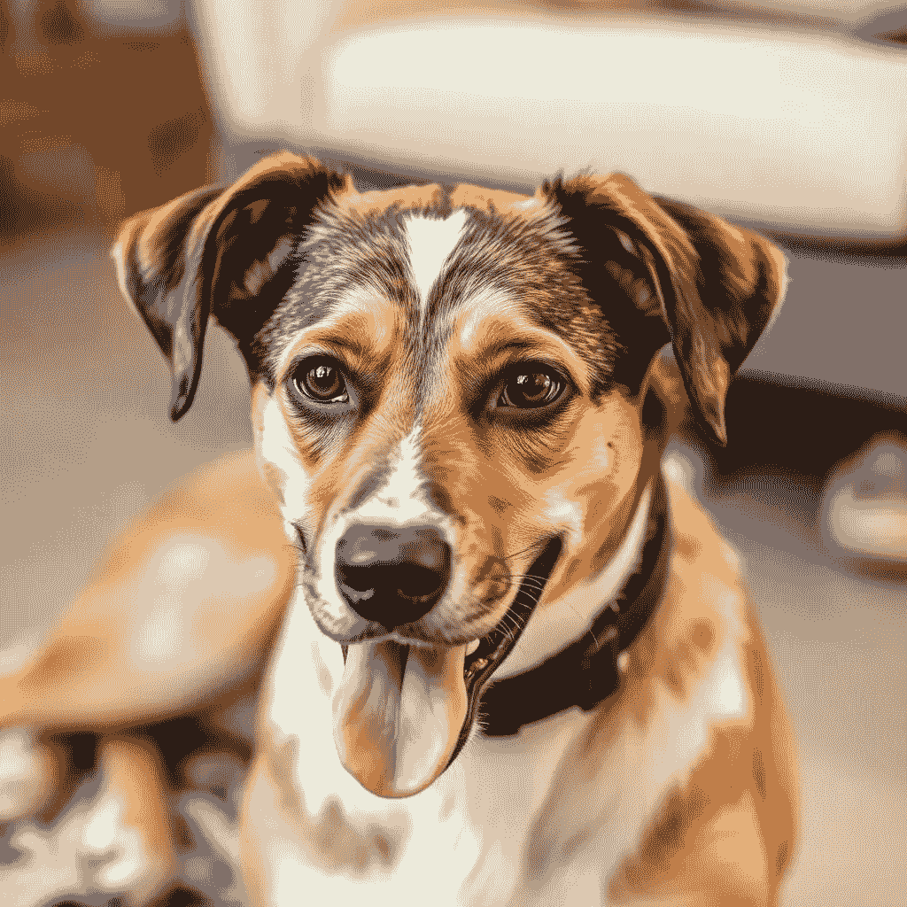

# 从零开始构建卷积神经网络（CNNs）

> 原文：[`towardsdatascience.com/building-a-convolutional-neural-network-cnns-from-scratch-3cfa453f9594?source=collection_archive---------2-----------------------#2024-11-05`](https://towardsdatascience.com/building-a-convolutional-neural-network-cnns-from-scratch-3cfa453f9594?source=collection_archive---------2-----------------------#2024-11-05)

## 一步一步，构建一个基于 MNIST-Fashion 数据集的 ResNet 分类器

 [Matthew Gunton](https://medium.com/@mgunton7?source=post_page---byline--3cfa453f9594--------------------------------)

·发布于 [Towards Data Science](https://towardsdatascience.com/?source=post_page---byline--3cfa453f9594--------------------------------) ·12 分钟阅读·2024 年 11 月 5 日

--

图片来源：作者 — Flux.1

机器学习之所以是一个如此有趣的领域，其中一个原因是它使我们能够将计算逻辑应用到以前无法触及的领域。虽然计算机在处理数组和整数方面非常高效，但它们在处理突现属性时传统上不太擅长。例如，你无法仅凭屏幕上的一个像素就知道图像是一只狗。你必须综合大量数据点才能得出结论。

在过去十年中，计算机科学家通过创建计算机视觉模型——特别是卷积神经网络（CNNs）——成功地弥合了这一鸿沟。今天，我将展示如何将它们应用于图像分类。

现实世界数据的分类对于将机器学习技术集成到更典型的软件系统中非常有用。如果你从事电子商务，你可以利用这些信息自动对新产品进行分类。如果你从事医学领域，你可以用它来判断一张 X 光或 MRI 图像是否与之前需要手术的图像相似。最后，如果你在车辆中并希望安全驾驶，图像分类是目标检测和碰撞避免的关键部分。
