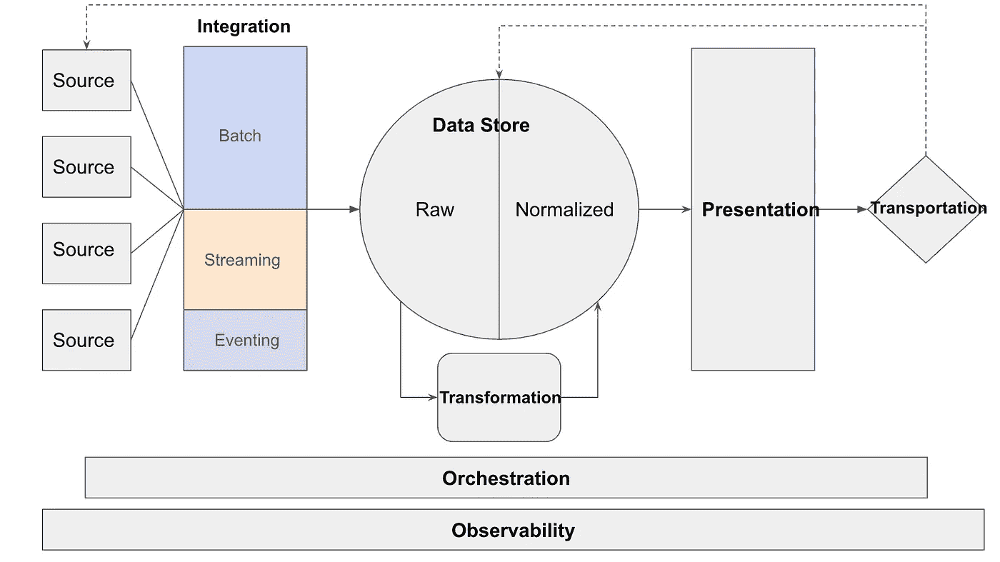

# 2024 年构建数据平台

> 原文：[`towardsdatascience.com/building-a-data-platform-in-2024-d63c736cccef?source=collection_archive---------0-----------------------#2024-02-05`](https://towardsdatascience.com/building-a-data-platform-in-2024-d63c736cccef?source=collection_archive---------0-----------------------#2024-02-05)

## 如何构建现代化、可扩展的数据平台，以支持您的分析和数据科学项目（更新版）

 [Dave Melillo](https://data-dave.medium.com/?source=post_page---byline--d63c736cccef--------------------------------)

·发表于[Towards Data Science](https://towardsdatascience.com/?source=post_page---byline--d63c736cccef--------------------------------) ·阅读时间 9 分钟·2024 年 2 月 5 日

--

## **目录：**

+   发生了什么变化？

+   平台

+   集成

+   [数据存储](http://fc3d)

+   转型

+   编排

+   展示

+   运输

+   [可观察性](http://36c0)

+   关闭

## 发生了什么变化？

自 2021 年以来，也许更好的问题是，什么没有发生变化？

在摆脱 COVID 的阴影后，我们的社会面临了无数挑战——政治和社会动荡、金融市场波动、人工智能的迅速发展，泰勒·斯威夫特（Taylor Swift）成为了…… **查阅笔记** …… ***国家橄榄球联盟**！？！

在过去三年中，我的生活也发生了变化。我在不同行业的数据信息挑战中摸索，凭借我的专业知识，在大公司和灵活的初创公司之间提供工作和咨询支持。

与此同时，我也花了大量精力塑造自己作为数据教育者的身份，与全球一些最著名的公司和顶级大学合作。

因此，以下是激励我撰写对原始[2021 年文章](https://medium.com/towards-data-science/building-a-data-platform-in-2021-b759f6470426)进行修订的简短清单：

+   **规模**

大大小小的公司正在开始达到以前仅限于 Netflix、Uber、Spotify 等巨头的规模，这些公司利用数据创造独特的服务。单纯地将数据管道和定时任务拼凑在一起，跨越不同的应用程序，已经不再有效，因此在讨论大规模数据平台时，出现了新的考量。

+   **流媒体**

尽管我在 2021 年的文章中简要提到了流处理，但在 2024 年的版本中，你将看到更多的关注。我坚信**数据必须跟上商业的速度**，而要在现代实现这一目标，唯一的途径就是通过数据流处理。

+   **编排**

我在 2021 年的文章中提到了模块化是构建现代数据平台的核心概念，但我未能强调数据编排的重要性。这一次，我专门有一整节讨论编排，以及它为何成为现代数据堆栈的自然补充。

## 平台

令我惊讶的是，目前仍没有单一的供应商能够主宰整个数据领域，尽管 Snowflake 通过[收购](https://www.snowflake.com/blog/snowflake-to-acquire-streamlit/)和开发工作（如 Snowpipe、Snowpark、Snowplow）在尽力争取。Databricks 也在其平台上取得了显著的进展，特别是在 ML/AI 领域。

2021 年文章中的所有组件都进入了 2024 年，但即便是熟悉的条目，3 年后看起来也有些不同：

+   源

+   集成

+   数据**存储**

+   转换

+   **编排**

+   展示

+   运输

+   **可观察性**

## 集成

集成类别在 2024 年获得了最大升级，分为三个逻辑子类别：

+   批处理

+   流处理

+   事件处理

**批处理**

能够以日常或每小时的间隔处理来自不同来源的输入数据流是任何数据平台的基础。

[Fivetran](https://www.fivetran.com/)仍然是托管 ETL 领域无可争议的领导者，但它面临着[Airbyte](https://airbyte.com/)等新兴竞争者，以及通过加强平台功能的大型云服务商的激烈竞争。

在过去的 3 年中，Fivetran 显著改进了其核心产品，扩展了连接器库，甚至开始在轻量级编排方面有所突破，推出了像他们的[dbt 集成](https://www.fivetran.com/connectors/dbt-cloud)这样的功能。

值得一提的是，许多供应商，如 Fivetran，已经将开源软件（OSS）和风险投资的最佳元素融合成一种名为“产品驱动增长”的模式，通过在产品中提供免费层，降低了进入企业级平台的门槛。

**即使你解决的问题需要许多自定义的源集成，使用托管 ETL 提供商来处理大部分工作，其余部分使用自定义 Python 代码，并通过编排将所有内容整合在一起，仍然是有意义的。**

**流处理**

Kafka/[Confluent](https://www.confluent.io/)在数据流处理方面占据主导地位，但处理流数据引入了许多新的考虑因素，除了主题、生产者、消费者和代理之外，还涉及序列化、模式注册表、流处理/转化以及流式分析。

Confluent 在将成功的数据流处理所需的所有组件聚集在一个平台上做得很好，但我将指出数据平台其他层次中的流处理注意事项。

**数据流处理的引入本身并不要求彻底改造数据平台的结构。实际上，批处理和流处理管道之间的协同作用对于应对数据平台在大规模应用中面临的各种挑战至关重要。解决这些挑战的关键，毫无疑问，在于数据编排。**

**事件处理**

在许多情况下，数据平台本身需要负责，或至少需要通知，生成第一方数据的过程。许多人可能会认为这是软件工程师和应用开发者的工作，但我认为让构建数据平台的人也负责你的事件策略是一个协同的机会。

我将事件分为两类：

+   **变更数据捕获** — CDC

CDC 的基本要点是将数据库的 CRUD 命令本身作为数据流来使用。我第一次接触到的 CDC 平台是一个名为[Debezium](https://debezium.io/)的开源项目，目前有许多大大小小的公司在这一新兴领域中争夺市场份额。

+   **点击流** — Segment/Snowplow

构建遥测以捕捉网站或应用程序上客户活动的方式就是我所指的**点击流**。Segment 借助点击流的浪潮实现了[十亿美元收购](https://techcrunch.com/2020/11/02/twilio-wraps-3-2b-purchase-of-segment-after-warp-speed-courtship/)，[Amplitude](https://amplitude.com/)将点击流构建成了一个完整的分析平台，而[Snowplow](https://snowplow.io/)最近通过其开源方法大幅增长，展示了这一领域适合持续创新并最终标准化。

AWS 在数据流处理方面一直处于领先地位，提供了建立[外部箱模式](https://docs.aws.amazon.com/prescriptive-guidance/latest/cloud-design-patterns/transactional-outbox.html)的模板，并构建了如[MSK](https://aws.amazon.com/msk/)、[SQS](https://aws.amazon.com/sqs/)、[SNS](https://aws.amazon.com/sns/)、[Lambdas](https://aws.amazon.com/lambda/)、[DynamoDB](https://aws.amazon.com/dynamodb/)等数据流处理产品。

## 数据存储

从 2021 年到 2024 年的另一个重大变化是从“数据仓库”到“数据存储”的转变，承认数据库视野的扩展，包括数据湖的兴起。

将数据湖视为战略而非产品，强调其作为结构化和非结构化数据的暂存区的角色，可能与数据仓库交互。为数据湖的每个方面选择合适的数据存储解决方案至关重要，**但更大的技术决策是将这些存储结合起来并探索它们，以将原始数据转化为下游洞察。**

分布式 SQL 引擎，如 [Presto](https://prestodb.io/)、[Trino](https://trino.io/) 以及它们的众多托管版本（[Pandio](https://pandio.com/)、[Starburst](https://www.starburst.io/)），已经出现，能够跨越数据湖，允许用户使用 SQL 连接不同物理位置的多样化数据。

在追赶生成性 AI 和大语言模型趋势的过程中，像向量数据库这样的专用数据存储变得至关重要。这些包括像 [Weaviate](https://github.com/weaviate/weaviate) 这样的开源选项，像 [Pinecone](https://www.pinecone.io/) 这样的托管解决方案，以及更多的其他选择。

## 转换

很少有工具像 [dbt](https://www.getdbt.com/) 那样彻底改变了数据工程。它的影响深远，甚至催生了一种新的数据角色——**分析工程师**。

dbt 已成为各类组织在其数据平台上自动化转换的首选工具。dbt 产品的免费版本 [dbt core](https://docs.getdbt.com/guides/manual-install?step=1) 的推出，在帮助数据工程师和分析师熟悉 dbt、加速其普及以及推动新特性迅速发展的过程中，起到了至关重要的作用。

**在这些特性中，** [**dbt mesh**](https://docs.getdbt.com/best-practices/how-we-mesh/mesh-1-intro) **尤为引人注目。这一创新使得多个 dbt 项目的关联和引用成为可能，帮助组织模块化其数据转换管道，特别是应对大规模数据转换的挑战。**

与“静态”数据处理工具（如 dbt）相比，流式转换仍然是一个较为不成熟的领域。尽管像 [Flink](https://flink.apache.org/) 这样的开源项目已经存在多年（自 2011 年以来），它们的影响力却没有像处理“静态”数据的工具那样广泛。然而，随着流数据的日益普及以及计算资源的不断进化，推进流式转换领域的需求愈加迫切。

在我看来，这一领域的广泛采用未来依赖于像 [Flink SQL](https://nightlies.apache.org/flink/flink-docs-release-1.18/docs/dev/table/sql/overview/) 这样的技术，或者来自 [Confluent](https://www.confluent.io/blog/getting-started-with-apache-flink-sql/)、[Decodable](https://www.decodable.co/blog/getting-started-with-apache-flink-and-flink-sql)、[Ververica](https://www.ververica.com/) 和 [Aiven](https://aiven.io/) 等提供商的托管服务。这些解决方案使分析师能够利用熟悉的语言，如 SQL，将这些概念应用于实时流数据。

## 编排

回顾 2024 年构建数据平台时的数据摄取、数据存储和转换组件，突显了在众多工具、技术和解决方案中做出选择的艰巨挑战。

根据我的经验，找到适合你场景的正确迭代的关键是通过实验，这样你可以交换不同的组件，直到获得理想的结果。

**数据编排在构建数据平台的初期阶段，促进实验过程变得至关重要。它不仅简化了流程，还提供了可扩展的选项，以适应任何业务的发展轨迹。**

编排通常通过有向无环图（DAG）或代码来执行，这些代码构建了跨多个系统的任务层次、依赖关系和管道。同时，它还管理和扩展用于运行这些任务的资源。

[Airflow](https://airflow.apache.org/) 仍然是数据编排的首选解决方案，提供多种托管版本，如 [MWAA](https://docs.aws.amazon.com/mwaa/latest/userguide/what-is-mwaa.html)、[Astronomer](https://astronomer.io/)，以及一些令人鼓舞的衍生分支，如 [Prefect](https://www.prefect.io/) 和 [Dagster](https://dagster.io/)。

**没有编排引擎，你将无法充分模块化你的数据平台，进而解锁其全部潜力。此外，它还是启动数据可观察性和治理策略的前提条件，在整个数据平台的成功中发挥着至关重要的作用。**

## 演示

令人惊讶的是，像 [Tableau](https://www.tableau.com/)、[PowerBI](https://www.microsoft.com/en-us/power-platform/products/power-bi/)、[Looker](https://lookerstudio.google.com/u/0/navigation/reporting) 和 [Qlik](https://www.qlik.com/us) 等传统的数据可视化平台仍然主导着这个领域。虽然数据可视化在最初经历了快速增长，但过去十年中该领域相对停滞。唯一的例外是微软，通过 [PowerBI 服务](https://learn.microsoft.com/en-us/power-bi/fundamentals/power-bi-service-overview) 等产品，在保持相关性和创新方面作出了值得称赞的努力。

新兴的数据可视化平台，如 [Sigma](https://www.sigmacomputing.com/) 和 [Superset](https://superset.apache.org/)，感觉是通往未来的自然桥梁。它们支持即时、资源高效的转换，同时具备世界一流的数据可视化能力。然而，一位强有力的新晋者，Streamlit，有潜力重新定义一切。

[**Streamlit**](http://streamlit.io)**，一个强大的 Python 库，用于构建前端界面与 Python 代码的交互，已在展示层中开辟了一个有价值的市场。虽然与 PowerBI 和 Tableau 等拖放工具相比，技术学习曲线更陡峭，但 Streamlit 提供了无限的可能性，包括交互式设计元素、动态切片、内容显示以及自定义导航和品牌塑造。**

Streamlit 给人的印象极为深刻，以至于 Snowflake 在 2022 年以近 10 亿美元收购了这家公司。[收购](https://techcrunch.com/2022/03/02/snowflake-acquires-streamlit-for-800m-to-help-customers-build-data-based-apps/)后，Streamlit 如何与 Snowflake 的产品套件融合，可能会塑造 Snowflake 以及数据可视化的未来发展。

## 运输

运输、反向 ETL 或数据激活——数据平台的最终环节——代表了一个关键阶段，在这个阶段，平台的转换和洞察结果回流到源系统和应用中，真正影响业务操作。

**目前，** [**Hightouch**](https://hightouch.com/) **作为该领域的领军者脱颖而出。它们强大的核心产品能够无缝地将数据仓库与数据密集型应用集成在一起。值得注意的是，他们与 Snowflake 和 dbt 的战略合作伙伴关系，进一步强调了其致力于成为多功能数据工具的目标，区别于单纯的营销和销售小工具。**

运输层的未来似乎注定与 API 相交，创造出通过 SQL 查询生成的 API 端点将与导出 .csv 文件共享查询结果一样普遍的场景。虽然这种转变已经被预期，但目前仍然有很少的供应商在探索这一领域的商品化。

## 可观察性

与数据编排类似，数据可观察性已成为捕捉和追踪数据平台不同组件生成的所有元数据的必要条件。这些元数据随后被用于管理、监控和促进平台的增长。

许多组织通过构建内部仪表盘或依赖单点故障（如数据编排管道）进行观察来解决数据可观察性问题。虽然这种方法对于基础监控可能足够，但在解决更复杂的逻辑可观察性挑战（如数据血缘追踪）时，仍显得力不从心。

这时，[DataHub](https://datahubproject.io/) 作为一个受欢迎的开源项目，正在获得越来越多的关注。它的托管服务对应产品，[Acryl](https://www.acryldata.io/)，更是放大了其影响力。**DataHub 擅长整合来自各个应用的元数据，帮助追踪组织内部数据流动的各个环节。它无缝地将这些信息结合起来，使得用户可以追溯仪表盘上的关键绩效指标（KPI），追溯到原始数据管道以及其中的每一个步骤。**

[Monte Carlo](https://www.montecarlodata.com/) 和 [Great Expectations](https://greatexpectations.io/) 在数据平台中承担类似的可观察性角色，但它们采用了更为主观的方式。诸如“端到端数据血缘”和“数据合同”之类术语的日益流行，预示着这一领域将迎来一波增长。我们可以预见，无论是已经确立的领导者，还是富有创新精神的新兴企业，都将推动数据可观察性领域的革命性变化。

## 结语

本文 2021 版本字数为 1,278 字。

本文的 2024 年版本在结尾之前已经超过了 2000 字。

我猜这意味着我应该简短一些。

构建一个既足够快速满足当今需求，又足够灵活以应对未来挑战的平台，从**模块化**开始，并由**编排**实现。为了采用最具创新性的解决方案来解决你的具体问题，你的平台必须为各种形式和大小的数据解决方案腾出空间，无论它是一个开源项目、新的托管服务，还是 AWS 提供的一整套产品。

这篇文章有很多观点，但最终的选择还是取决于你。我很期待听到这能如何激励人们探索新的可能性，并创造新的数据问题解决方式。

> 注意：我目前与此文中提到的任何公司没有任何关联，也没有为这些工具提供赞助。
