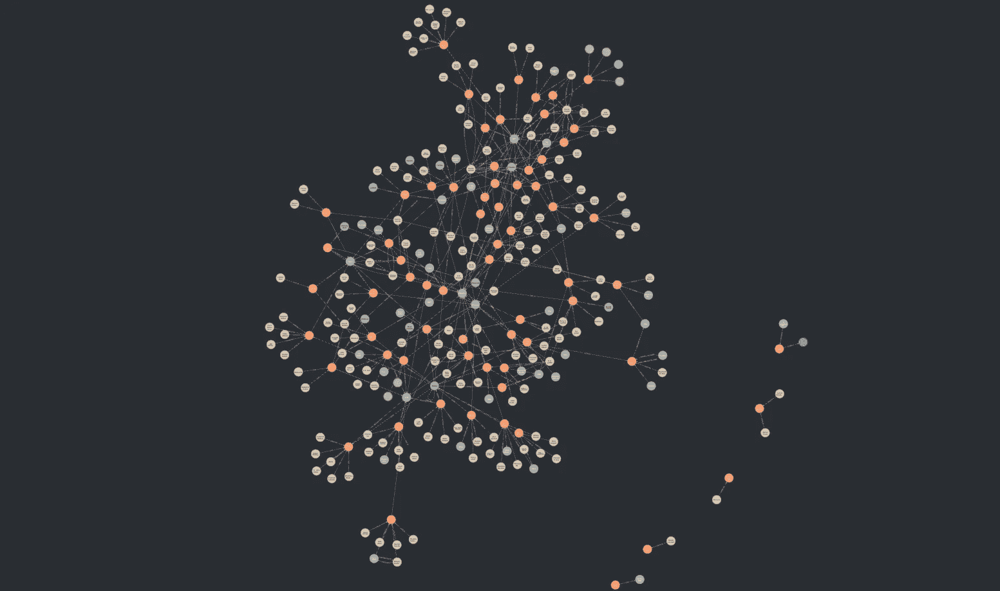

# 从零开始构建知识图谱，使用大型语言模型（LLMs）

> 原文：[`towardsdatascience.com/building-a-knowledge-graph-from-scratch-using-llms-f6f677a17f07?source=collection_archive---------0-----------------------#2024-11-25`](https://towardsdatascience.com/building-a-knowledge-graph-from-scratch-using-llms-f6f677a17f07?source=collection_archive---------0-----------------------#2024-11-25)

## 使用大型语言模型（LLMs）将你的 Pandas 数据框架转化为知识图谱。从零开始构建自己的 LLM 图谱构建器，使用 LangChain 实现 LLMGraphTransformer，并对你的知识图谱进行问答（QA）。

 [Cristian Leo](https://medium.com/@cristianleo120?source=post_page---byline--f6f677a17f07--------------------------------)

·发布于 [Towards Data Science](https://towardsdatascience.com/?source=post_page---byline--f6f677a17f07--------------------------------) ·36 分钟阅读·2024 年 11 月 25 日

--

来自维基百科的 1000 部电影知识图谱 — 作者提供的图片

在当今的人工智能世界中，知识图谱变得越来越重要，因为它们支撑了许多大型语言模型（LLMs）背后的知识检索系统。许多公司的数据科学团队正在大力投资检索增强生成（RAG），因为这是一种提高 LLM 输出准确性并防止幻觉生成的高效方法。

但事情远不止如此；从个人角度来看，图谱增强生成（graph-RAG）正在让人工智能领域变得更加开放和民主化。这是因为，在此之前，如果我们想要定制一个模型以适应某个应用场景——无论是为了娱乐还是商业——我们通常会有三种选择：对模型进行预训练，以便为你的应用场景所在行业的数据集提供更大的曝光，针对特定数据集进行微调，或者使用上下文提示。

至于预训练，这个选项极其昂贵且技术要求高，对于大多数开发者来说，并不是一个可行的选择。

微调比预训练更简单，尽管微调的成本取决于模型和训练语料库，但通常来说，它是一个更为经济的选择。这个选项是……
