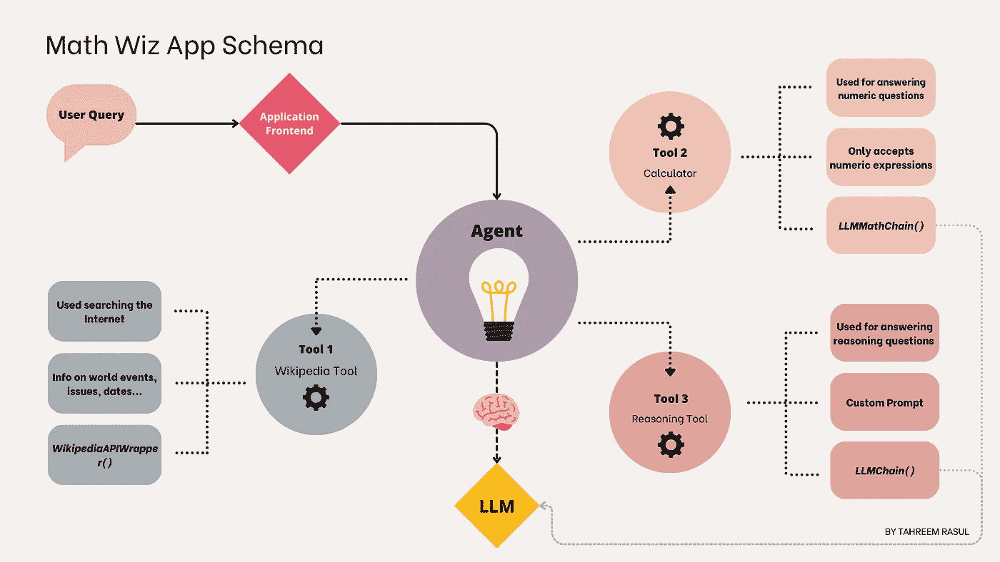

# 使用 LangChain 代理构建数学应用

> 原文：[`towardsdatascience.com/building-a-math-application-with-langchain-agents-23919d09a4d3?source=collection_archive---------0-----------------------#2024-03-19`](https://towardsdatascience.com/building-a-math-application-with-langchain-agents-23919d09a4d3?source=collection_archive---------0-----------------------#2024-03-19)

## 一篇关于为什么大语言模型（LLMs）在数学方面存在困难，以及如何使用 LangChain 代理、OpenAI 和 Chainlit 解决这些限制的教程

 [Tahreem Rasul](https://medium.com/@tahreemrasul?source=post_page---byline--23919d09a4d3--------------------------------)

·发表于 [Towards Data Science](https://towardsdatascience.com/?source=post_page---byline--23919d09a4d3--------------------------------) ·阅读时间 12 分钟·2024 年 3 月 19 日

--

在本教程中，我将演示如何使用 [LangChain](https://www.langchain.com) 代理创建一个自定义数学应用，利用 OpenAI 的 GPT3.5 模型。对于应用的前端，我将使用 [Chainlit](https://chainlit.io)，这是一个易于使用的开源 Python 框架。这个生成型数学应用，暂且称之为“数学达人”，旨在帮助用户解决数学或推理/逻辑问题。

“数学达人”应用的架构图。图示由作者提供。

# 为什么大语言模型在数学方面存在困难？

大语言模型（LLMs）在数学以及推理任务方面表现得非常差，这是许多语言模型的共同特征。造成这种情况的原因有几种：

+   **缺乏训练数据：** 其中一个原因是它们训练数据的局限性。语言模型虽然是在庞大的文本数据集上进行训练的，但可能缺乏足够的数学问题和解答。这可能导致对数字的误解、忽略重要的计算步骤，以及缺乏定量推理能力。

+   **缺乏数字表示：** 另一个原因是大语言模型被设计为理解和生成文本，操作的是符号而非数字…
