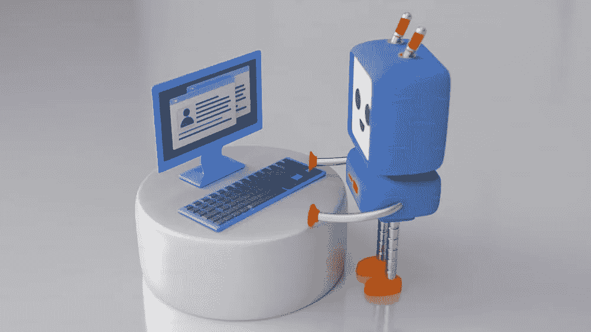

# 构建多用途的生成式 AI 驱动聊天机器人

> 原文：[`towardsdatascience.com/building-a-multi-purpose-genai-powered-chatbot-db20f1f81d90?source=collection_archive---------5-----------------------#2024-02-07`](https://towardsdatascience.com/building-a-multi-purpose-genai-powered-chatbot-db20f1f81d90?source=collection_archive---------5-----------------------#2024-02-07)

## 利用 SageMaker 推理组件高效地处理多个 LLM

 [Ram Vegiraju](https://ram-vegiraju.medium.com/?source=post_page---byline--db20f1f81d90--------------------------------)

·发表于[Towards Data Science](https://towardsdatascience.com/?source=post_page---byline--db20f1f81d90--------------------------------) ·阅读时间 10 分钟·2024 年 2 月 7 日

--

图片来自[Unsplash](https://unsplash.com/photos/a-blue-robot-with-a-keyboard-and-monitor-4NYtYSiZVlA)

大型语言模型（LLMs）功能强大，可以帮助解决各种自然语言处理（NLP）任务，如问答、摘要、实体提取等。随着生成式 AI 应用场景的不断扩展，现实世界的应用往往需要能够解决多个 NLP 任务。例如，如果你有一个供用户使用的聊天机器人，一个常见的需求是总结与聊天机器人的对话。这在许多场景下都非常有用，比如医生与患者的对话记录、虚拟电话/预约等。

我们如何构建一个能够解决这些问题的系统呢？我们可以使用多个大型语言模型（LLMs），一个用于问答，另一个用于摘要。另一种方法是使用相同的 LLM，并在不同的领域进行微调，但我们将在这个用例中专注于前者方法。不过，使用多个 LLM 也会带来一些必须解决的挑战。

即使仅托管一个模型也需要大量计算资源，并且需要大规模的 GPU 实例。如果使用多个 LLM，则需要为每个 LLM 提供持续的端点/硬件。这还会导致管理多个端点的开销，并且需要为此付费……
