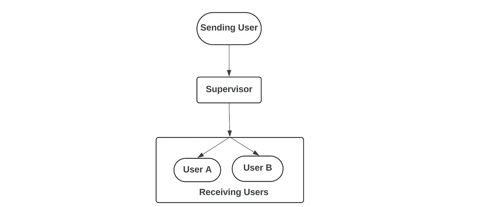

# 使用 LangGraph 构建多语言多代理聊天应用 — 第一部分

> 原文：[`towardsdatascience.com/building-a-multilingual-multi-agent-chat-application-using-langgraph-i-262d40df6b4f?source=collection_archive---------6-----------------------#2024-09-06`](https://towardsdatascience.com/building-a-multilingual-multi-agent-chat-application-using-langgraph-i-262d40df6b4f?source=collection_archive---------6-----------------------#2024-09-06)

## 在这个三部分的系列中，了解如何构建一个基于 RAG 的、多语言的、代理驱动的聊天应用，并与集成的 AI 助手一起流畅地完成职场任务

[](https://medium.com/@RSK2327?source=post_page---byline--262d40df6b4f--------------------------------)[](https://towardsdatascience.com/?source=post_page---byline--262d40df6b4f--------------------------------) [Roshan Santhosh](https://medium.com/@RSK2327?source=post_page---byline--262d40df6b4f--------------------------------)

·发表于 [Towards Data Science](https://towardsdatascience.com/?source=post_page---byline--262d40df6b4f--------------------------------) ·阅读时间：10 分钟·2024 年 9 月 6 日

--

# **背景**

尽管科技不断进步，但语言障碍在今天的世界依然存在。无论是在工作中还是在外面，总有一些场景会因为语言差异而导致尴尬的局面。对于跨多个地区、讲不同语言的大型企业尤其如此。作为最近由 Cohere AI 研究社区组织的 Aya Expedition 的一部分，我有机会参与了一个旨在解决这一语言障碍以及其他职场低效问题的项目，通过开发一款多语言的职场代理聊天应用来解决这一问题。

与其多谈产品，我认为介绍该产品及我们将在本系列中构建的内容的最佳方式是实际观看它的运行。

聊天应用的最终演示

以下教程系列涵盖了该应用程序的开发，包括：

1.  用于将内容翻译成用户首选语言的代理工作流

1.  为 AI 助手构建功能：基于 RAG 的问答、随时文档和智能总结功能

1.  通过 FastAPI 部署代理工作流，并开发一个 Web 用户界面与其进行交互

# 高级框架

考虑到 LangChain 及其基于图的对应工具 LangGraph 的流行，我不想将其变成一个讲解这些工具及其方法基础的教程。相反，我希望**更多地关注在通过这些工具实现解决方案时所面临的设计选择和挑战**，因为我认为这在长期来看会更有用。

## **LangChain 与 LangGraph**

我们面临的第一个设计选择是选择 LangChain 还是 LangGraph。

在一个简单的场景下（如下图所示），每个用户提供的消息都发送给所有其他用户，并被翻译成他们偏好的语言，那么 LangChain 将是一个足够的选择。这是一个**单向流动**，从用户发送消息开始，到用户接收到消息结束：



没有 Aya 的单向信息流

然而，在我们的场景中，主要的限制是**包含一个 AI 助手，我们称之为 Aya**（以“远征”命名）。Aya 被计划成为此聊天应用的重要组成部分，并为我们的系统增加了新的复杂性。通过 Aya，发送用户的消息需要被分析，并根据消息的性质（如果是发给 Aya 的命令），系统需要发送回一个消息，而这个消息又需要再次发送给接收用户。


有 Aya 的情况下的信息流

**定义一个运行（Run）：** 这里另一个相关的设计选择是定义一次“运行”或一次“迭代”消息循环。

在我们选择的定义中，我们认为每次运行由任何用户发送消息启动，并在所有与该初始消息相关的消息到达接收用户时结束。

所以，如果是一个没有提及 Aya 的消息，仅仅是直接发给其他用户的消息，那么当所有用户接收到初始翻译消息时，这次运行就算结束。而如果是一个涉及 Aya 的消息，那么当初始消息以及 Aya 的回复**都**传递给所有用户时，运行才算结束。

因此，采用这种设计选择/定义一次运行时，我们希望有一个流程，在等待 Aya 生成并推送回应给用户后再终止运行。为了实现这样的流程，我们使用了 LangGraph，因为它专门为解决这种情况而构建。

# 构建代理

本应用的核心是代理及其相互作用。总体而言，我们有两种不同类型的代理：

1.  用户代理：附加在每个用户上的代理，主要任务是将收到的消息翻译成用户偏好的语言

1.  Aya 代理：与 Aya 相关的各种代理，每个代理有其特定的角色/任务

## 用户代理

UserAgent 类用于定义一个代理，每个用户在聊天室中都会与之关联。UserAgent 类实现的部分功能包括：

1\. 将传入的消息翻译成用户首选语言

2\. 当用户发送消息时，激活/调用图

3\. 维护聊天历史，以帮助提供翻译任务的上下文，从而实现“上下文感知”翻译

```py
class UserAgent(object):

    def __init__(self, llm, userid, user_language):
        self.llm = llm
        self.userid = userid
        self.user_language = user_language
        self.chat_history = []

        prompt = ChatPromptTemplate.from_template(USER_SYSTEM_PROMPT2)

        self.chain = prompt | llm

    def set_graph(self, graph):
        self.graph = graph

    def send_text(self,text:str, debug = False):

        message = ChatMessage(message = HumanMessage(content=text), sender = self.userid)
        inputs = {"messages": [message]}
        output = self.graph.invoke(inputs, debug = debug)
        return output

    def display_chat_history(self, content_only = False):

        for i in self.chat_history:
            if content_only == True:
                print(f"{i.sender} : {i.content}")
            else:
                print(i)

    def invoke(self, message:BaseMessage) -> AIMessage:

        output = self.chain.invoke({'message':message.content, 'user_language':self.user_language})

        return output
```

在大多数情况下，UserAgent 的实现是标准的 LangChain/LangGraph 代码：

+   定义一个 LangChain 链（一个提示模板 + LLM），负责进行实际的翻译。

+   定义一个 send_text 函数，用于在用户发送新消息时调用图

在大多数情况下，该代理的性能取决于 LLM 的翻译质量，因为翻译是该代理的主要目标。而 LLM 的翻译性能会因语言的不同而有显著差异。某些低资源语言在一些模型的训练数据中代表性较差，这会影响这些语言的翻译质量。

## Aya 代理

对于 Aya，我们实际上有一个由多个独立代理组成的系统，它们共同协作以实现整体助手功能。具体来说，我们有

1.  AyaSupervisor：控制代理，负责监督其他 Aya 代理的运行。

1.  AyaQuery：用于运行基于 RAG 的问答代理

1.  AyaSummarizer：用于生成聊天总结和进行任务识别的代理

1.  AyaTranslator：用于将消息翻译成英语的代理

```py
class AyaTranslator(object):

    def __init__(self, llm) -> None:
        self.llm = llm 
        prompt = ChatPromptTemplate.from_template(AYA_TRANSLATE_PROMPT)
        self.chain = prompt | llm 

    def invoke (self, message: str) -> AIMessage:
        output = self.chain.invoke({'message':message})
        return output

class AyaQuery(object):

    def __init__(self, llm, store, retriever) -> None:
        self.llm = llm
        self.retriever = retriever
        self.store = store
        qa_prompt = ChatPromptTemplate.from_template(AYA_AGENT_PROMPT)
        self.chain = qa_prompt | llm

    def invoke(self, question : str) -> AIMessage:

        context = format_docs(self.retriever.invoke(question))
        rag_output = self.chain.invoke({'question':question, 'context':context})
        return rag_output

class AyaSupervisor(object):

    def __init__(self, llm):

        prompt = ChatPromptTemplate.from_template(AYA_SUPERVISOR_PROMPT)
        self.chain = prompt | llm

    def invoke(self, message : str) -> str:
        output = self.chain.invoke(message)
        return output.content

class AyaSummarizer(object):

    def __init__(self, llm):

        message_length_prompt = ChatPromptTemplate.from_template(AYA_SUMMARIZE_LENGTH_PROMPT)
        self.length_chain = message_length_prompt | llm 

        prompt = ChatPromptTemplate.from_template(AYA_SUMMARIZER_PROMPT)
        self.chain = prompt | llm

    def invoke(self, message : str, agent : UserAgent) -> str:

        length = self.length_chain.invoke(message)

        try:
            length = int(length.content.strip())
        except:
            length = 0

        chat_history = agent.chat_history

        if length == 0:
            messages_to_summarize = [chat_history[i].content for i in range(len(chat_history))]
        else:
            messages_to_summarize = [chat_history[i].content for i in range(min(len(chat_history), length))]

        print(length)
        print(messages_to_summarize)

        messages_to_summarize = "\n ".join(messages_to_summarize)

        output = self.chain.invoke(messages_to_summarize)
        output_content = output.content 

        print(output_content)

        return output_content
```

这些代理大多数有类似的结构，主要由一个 LangChain 链组成，该链包含一个自定义提示和一个 LLM。例外情况包括 AyaQuery 代理，它有一个额外的向量数据库检索器来实现 RAG，和 AyaSummarizer，它在其中实现了多个 LLM 功能。

## **设计考虑**

**AyaSupervisor 代理的角色**：在图的设计中，我们有一个从 Supervisor 节点到用户节点的固定边。这意味着所有到达 Supervisor 节点的消息都会推送到用户节点本身。因此，在 Aya 被提及的情况下，**我们必须确保只有 Aya 的最终输出被推送给用户**。我们不希望中间消息（如果有的话）到达用户。因此，我们有 AyaSupervisor 代理，它作为 Aya 代理的单一接触点。这个代理主要负责解释传入消息的意图，将消息引导到适当的任务特定代理，并将最终消息输出与用户共享。

**AyaSummarizer 的设计**：与其他 Aya 代理相比，AyaSummarizer 代理稍微复杂一些，因为它执行了一个两步过程。在第一步中，代理首先确定需要总结的消息数量，这是一个带有自己提示的 LLM 调用。在第二步中，一旦我们知道了需要总结的消息数量，我们就将所需的消息整理起来并传递给 LLM 生成实际的总结。除了总结外，在这一步中，LLM 还会识别消息中存在的任何待办事项，并单独列出。

所以大体上有三个任务：确定需要总结的消息长度、总结消息、识别待办事项。然而，鉴于第一个任务对于没有任何明确示例的 LLM 来说有些困难，我决定将其作为单独的 LLM 调用，然后将后两个任务合并为一个 LLM 调用。

可能有办法消除额外的 LLM 调用，并将所有三个任务合并为一个调用。潜在的选项包括：

1.  提供非常详细的示例，一步涵盖所有三个任务

1.  生成大量示例，实际微调 LLM，使其能够在此任务中表现良好

**AyaTranslator 的作用**：关于 Aya 的一个目标是使其成为一个多语言 AI 助手，可以使用用户的首选语言进行交流。然而，在 Aya 代理内部处理不同语言会很困难。具体来说，如果 Aya 代理的提示是英语，而用户的消息是其他语言，这可能会引发问题。因此，为了避免这种情况，作为过滤步骤，**我们将任何传入 Aya 的用户消息翻译成英语**。因此，Aya 代理组内部的所有工作都是用英语进行的，包括输出。我们不需要将 Aya 的输出翻译回原语言，因为当消息到达用户时，用户代理会负责将消息翻译成各自分配的语言。

# **提示设计**

在提示设计方面，大部分工作集中在让 LLM 以一致的方式输出特定格式的响应。在大多数情况下，我通过提供明确的指示实现了这一目标。在某些情况下，仅凭指示不足，我不得不提供示例，以确保代理的一致性。

大部分情况下，提示模板具有以下结构：

```py
[High level task definition] You are an AI assistant that answers user's questions... 

[List of specific constraints related to the response]
Obey the following rules : 
1\. ....

[Providing context/user input]
Message : 
```

以用户代理使用的提示为例：

```py
You are a {user_language} translator, translating a conversation between work colleagues. Translate the message provided by the user into {user_language}. 

Obey the following rules : 
1\. Only translate the text thats written after 'Message:' and nothing else
2\. If the text is already in {user_language} then return the message as it is.
3\. Return only the translated text
4\. Ensure that your translation uses formal language

Message:
{message}
```

关于这个代理，一个重要的约束是确保模型只输出翻译后的文本，而不会输出任何支持性文本，如“这是翻译后的文本”或“当然，以下是提供文本的翻译”。在这种情况下，添加一个特定的规则来遵守（规则#3）足以确保模型只输出翻译后的文本，而不会输出其他内容。

需要在提示中提供示例的一个实例是与摘要代理相关的提示。具体来说，是负责确定要总结的消息数量的代理。我发现很难让代理一致地提取列出的消息数量（如果有的话），并以特定格式输出。因此，提供示例变得必要，以便更好地解释我期待代理给出的响应。

# 其他实现细节

## ChatMessage

熟悉 LangChain 的人应该已经了解 AIMessage、HumanMessage 类，它们用于存储 AI 和人类消息。对于我们的用例，**我们需要能够存储发送者的 ID 以供后续任务使用**。因此，为了解决这个问题，我们创建了一个名为 ChatMessage 的新派生类，用于存储消息以及发送者的 ID。

```py
class ChatMessage(object):

    def __init__(self, message : BaseMessage, sender : str = None):
        self.message = message
        self.sender = sender
        self.content = message.content

    def __repr__(self) -> str:
        return f"{self.sender} | {self.content}"
```

## 图状态

在 LangGraph 中，图的一项关键元素是图状态。状态变量/对象对于代理之间的正确通信以及跟踪图工作流的进度至关重要。

```py
def reducer(a : list, b : list | str ) -> list:

    if type(b) == list: 
        return a + b
    else:
        return a

class AgentState(TypedDict):
    messages: Annotated[Sequence[ChatMessage], reducer]
```

在大多数 LangGraph 示例中，状态变量是一个字符串列表，每经过一个代理就会继续追加。在我们的用例中，**我希望排除某些节点的输出对图状态的影响**，尽管工作流已经经过了该节点。为了适应这种情况，我通过将一种类型的状态变化设为列表，另一种类型设为字符串来区分这两种状态变化。当状态更新为列表时，它会被追加到整体状态对象中；当状态更新为字符串时，我们会忽略该更新，并传播现有状态。这是通过上面定义的自定义***reducer***函数来实现的。

# 结论

在这一阶段，我们已经覆盖了代理工作流中一个关键组件的设计选择：代理。在下一节教程中，我们将详细介绍实际的 LangGraph 图以及其实现方式，并进一步探讨与 Aya 相关的功能细节。

## 资源

对于代码，您可以参考此仓库：[Multilingual Chatbot](https://github.com/rsk2327/Multilingual-Chatbot)。

除非另有说明，否则所有图像均由作者创作。

*除了在 Medium 上，我还在* [*LinkedIn*](https://www.linkedin.com/in/roshan-santhosh/) *分享我的想法、创意和其他更新*。
