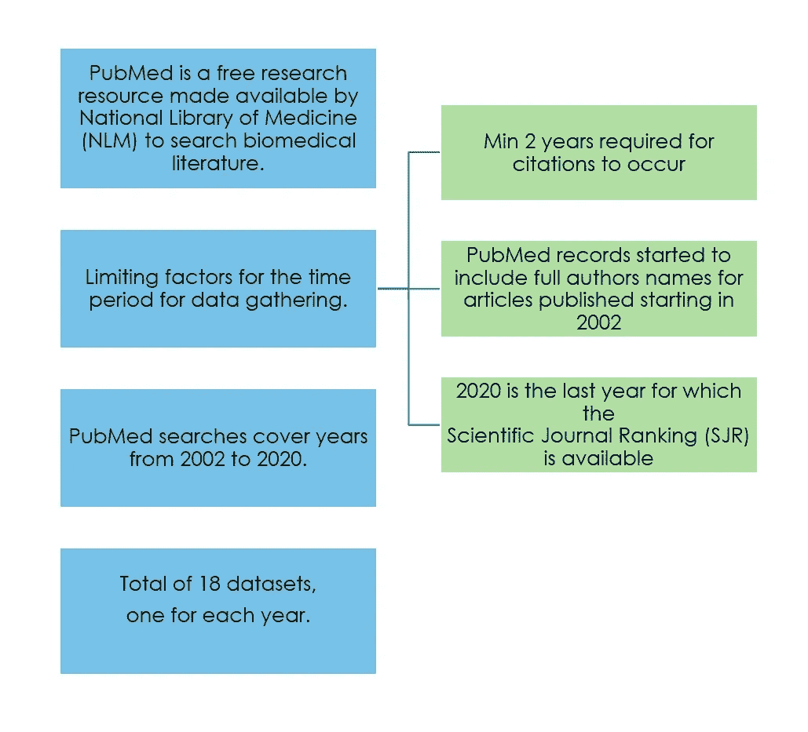
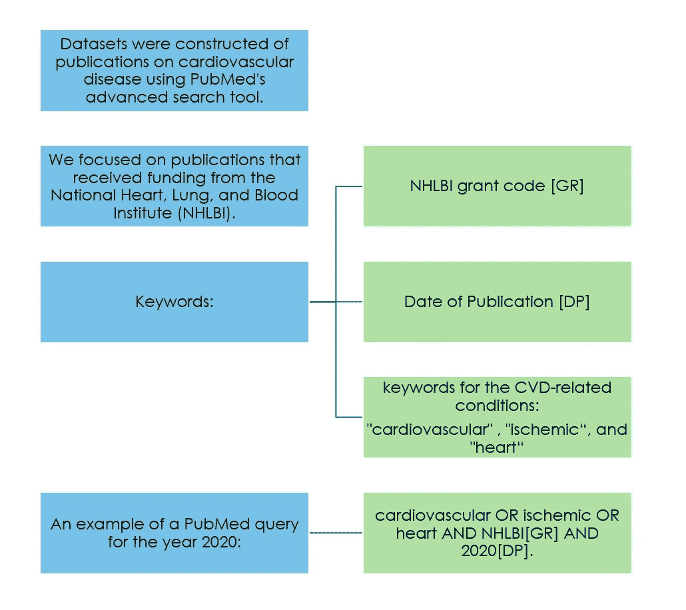
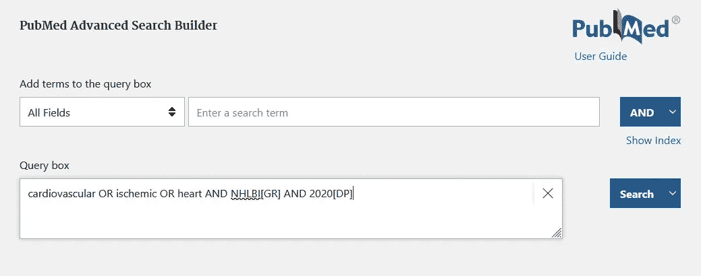
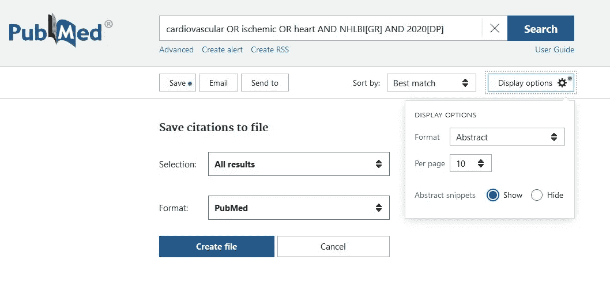
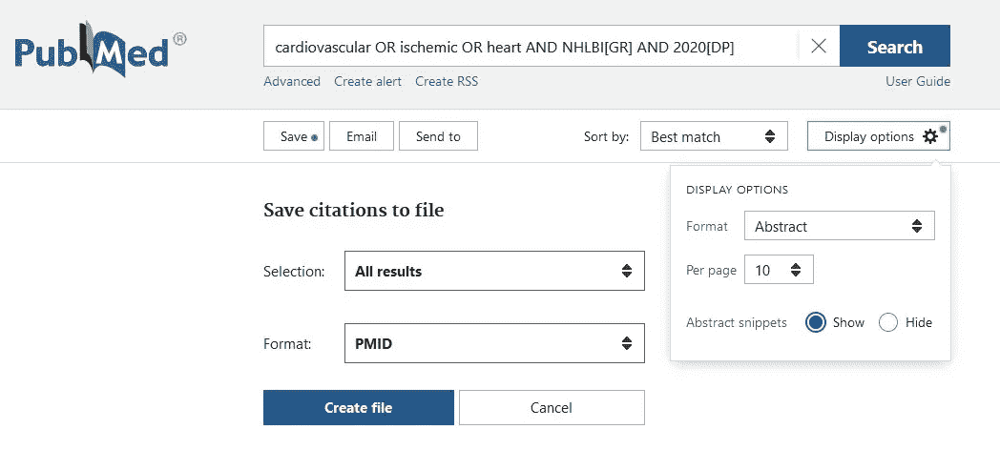
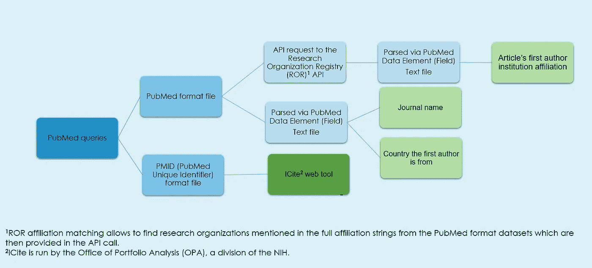
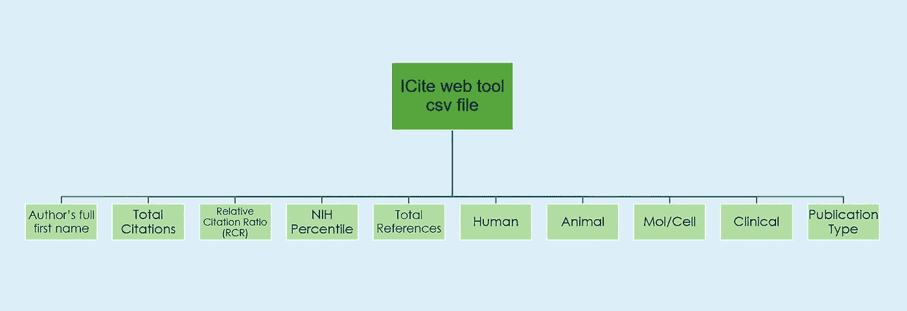
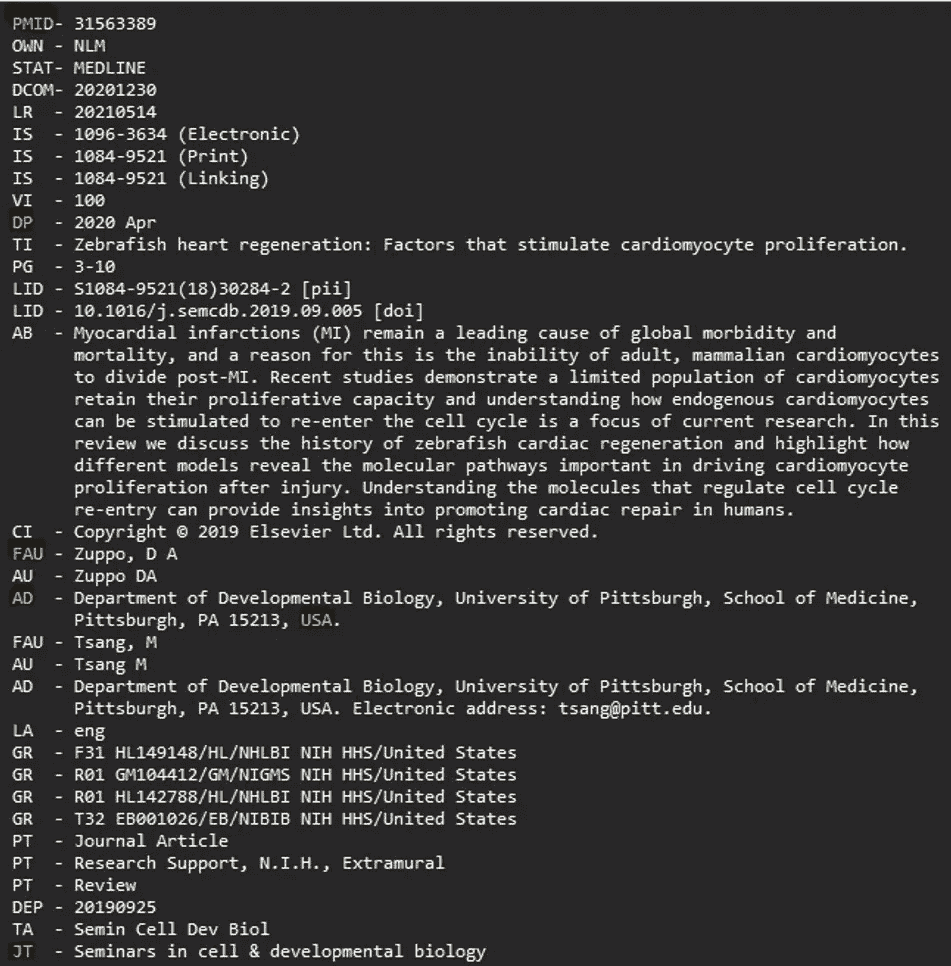
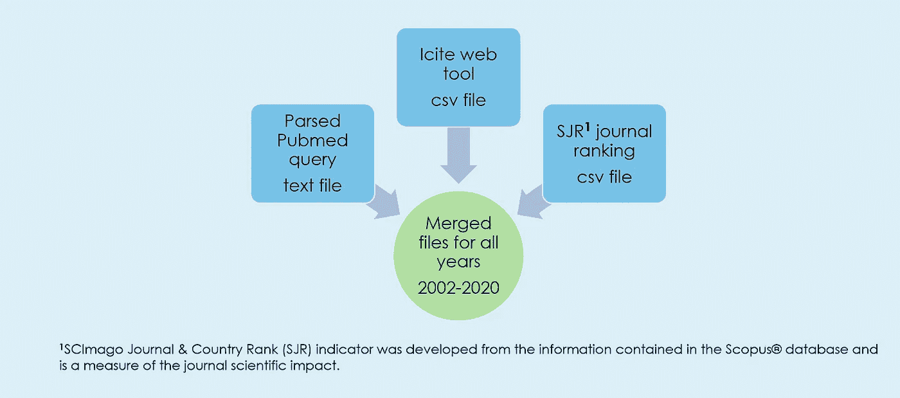

# 构建 PubMed 数据集

> 原文：[`towardsdatascience.com/building-a-pubmed-dataset-b1267408417c?source=collection_archive---------11-----------------------#2024-10-31`](https://towardsdatascience.com/building-a-pubmed-dataset-b1267408417c?source=collection_archive---------11-----------------------#2024-10-31)

## 构建关于心血管疾病研究的 PubMed 收录文献数据集的逐步说明

 [Diana Rozenshteyn](https://dianarozenshteyn.medium.com/?source=post_page---byline--b1267408417c--------------------------------)

·发表于 [Towards Data Science](https://towardsdatascience.com/?source=post_page---byline--b1267408417c--------------------------------) ·6 分钟阅读·2024 年 10 月 31 日

--

图片由作者提供

# 挑战

当我开始撰写我的硕士论文《与 NIH 资助的心脏病研究中具有影响力的科学出版物相关的因素》时，第一项任务是构建一个原始数据集来进行研究。为了实现这一目标，我转向了 PubMed，这是由美国国立医学图书馆（NLM）提供的一个免费的生物医学文献研究数据库。

## 该数据集需要满足多个特定标准，包括：

1.  跨越尽可能长的时间段。

1.  包含美国国立卫生研究院（NIH）资助的研究。

1.  仅专注于心血管疾病研究的文献。

1.  提供第一作者的详细信息，例如全名、性别、所在机构以及研究机构所在国家。

1.  包含每篇文章的引用次数、NIH 百分位排名、文章中的参考文献总数以及其他与引用相关的数据。

1.  包括期刊的科学排名信息。

在本文中，我将解释如何根据这些标准创建一个 PubMed 收录文献的数据集。

两个限制因素——第一作者的完整姓名的可用性和引用发生所需的年数——被用来选择数据收集的时间段。PubMed 记录从 2002 年开始包含完整的作者姓名（Full Author, FAU）[1]。此外，三年是进行引用和出版影响分析的最低推荐年数[2]。为了最大化数据集的大小，采用了至少两年的时间框架来积累引用，因为数据集是在 2022 年构建的。此外，2020 年是当时用于数据分析的科学期刊排名（SJR）信息可用的最后一年[3]。因此，我在 PubMed 上搜索了 2002 年到 2020 年的记录，共创建了 18 个数据集——每年一个。限制因素的概述如下图所示。

图片由作者提供

我使用 PubMed 的高级搜索工具[4]构建了关于心血管疾病的出版物数据集。PubMed 数据元素（字段）描述[1]被用来构建查询。NIH 资助通过国立心脏、肺、血液研究所（NHLBI）资助来表示。我在查询中使用了 NHLBI 资助（[GR]）、出版日期（[DP]）等关键词，以及基于心血管疾病相关病症的关键词组合。这些关键词包括 cardiovascular、ischemic 和 heart。

图片由作者提供

2020 年 PubMed 查询示例：“cardiovascular OR ischemic OR heart AND NHLBI[GR] AND 2020[DP]”。

图片由作者提供

为了获取期刊名称、文章第一作者所属机构及其国家信息以便进一步解析，我通过选择显示选项菜单中的摘要格式选项和保存引用到文件菜单中的 PubMed 格式选项，保存了 PubMed 高级搜索查询。

图片由作者提供

为了获取每个出版物的 PMID（PubMed 唯一标识符）列表，以便进一步获取引用信息，我通过选择显示选项菜单中的摘要格式选项和保存引用到文件菜单中的 PMID 格式选项，保存了通过高级搜索 PubMed 查询收集的数据。

图片由作者提供

以下流程图概述了从 PubMed 网站下载 PubMed 和 PMID 文件后的步骤。更详细的解释见后文。

图片由作者提供

为了获取引用相关信息和（如有）完整未缩写的作者名字，我将每年的 PMID 数据集上传到 ICite Web 工具[5]。我将结果数据分析保存为 csv 文件。ICite 由 NIH 的投资组合分析办公室（OPA）运行。OPA 是 NIH 的一个部门，负责基于数据的研究评估，帮助 NIH 决定哪些当前或新领域的研究将对科学和人类健康产生更大的益处。ICite 提供了有关作者的完整名字、总引用次数、每年引用次数、一个经过领域和时间调整的科学影响力的引用衡量标准——相对引用比率（RCR），以及 NIH 百分位数的可用信息。

图片来自作者

PubMed 格式数据集不能以 CSV 格式保存，因此必须解析以提取期刊标题（JT）、第一作者所属机构（AD）和国家。我为此编写了一个 Python 3.10.1 解析脚本。本文不讨论该脚本的详细内容，但我计划在未来的出版物中涉及。第一作者所属机构是通过向研究组织登记处（ROR）API [5]发出应用程序编程接口（API）请求来确定的。由于数据元素字段提供了研究机构不一致的名称以及如地址和部门名称等不必要的信息，因此需要进行 ROR 匹配。ROR 匹配可以帮助查找在 PubMed 格式数据集中提到的研究机构，这些机构随后通过 API 调用提供。API 调用的结果以 JSON 格式返回。我使用 PubMed 数据元素（字段）描述从 PubMed 格式数据集中解析期刊标题和国家。我分别处理了每年的数据集。以下是 PubMed 格式文件条目的示例。

图片来自作者

我在 JupyterLab 中处理了每年查询的解析过的 PubMed 格式数据集，并通过 ICite 引用数据集在 PMID 上合并它们。然后，我根据期刊名称将每年的合并数据集与 SJR 数据集进行合并。我从 SCImago Journal & Country Rank 网站[3]下载了最后可用年份（2020 年）的 SJR 数据集。SCImago Journal & Country Rank 数据库排名基于 SJR 指标。SJR 指标是通过 Scopus®数据库中的信息开发的，是衡量期刊科学影响力的一个标准。

图片来自作者

随后的步骤包括使用 Gender-API Web 服务估算第一作者的性别，并进行数据清理。这些步骤将在本刊物中不做详细讨论。

## 总结来说，自己构建数据集是有多方面益处的：

1.  定制化：你可以根据特定的研究需求定制数据集。

1.  数据理解：构建自己的数据集帮助你深入理解数据本身，包括其局限性和偏差。

1.  技能发展：它加强了如数据收集、清理、组织等关键研究技能。

1.  质量控制：通过自行构建数据集，你可以控制数据质量。

1.  灵活性：你可以在出现新问题时修改或扩展数据集。

1.  问题解决：这一过程促进了创造性问题解决，因为你需要开发收集、筛选和结构化数据以进行分析的方法。

这些好处提升了你的研究能力，并有助于产生更有影响力和更精确的结果。

本文使用的 Jupyter Notebook 可以在[GitHub](https://github.com/drozenshteyn/Building-a-PubMed-Dataset)找到。

这里引用的完整硕士论文也可以在[GitHub](https://github.com/drozenshteyn/Master-s-Thesis)找到。

感谢阅读，

Diana

# 参考文献

1.  美国国立医学图书馆，“MEDLINE/PubMed 数据元素（字段）描述，”nlm.nih.gov。可用：[`www.nlm.nih.gov/bsd/mms/medlineelements.html#fau`](https://www.nlm.nih.gov/bsd/mms/medlineelements.html#fau)

1.  M. Thelwall，“1996–2014 年 27 个领域和 6 个英语国家的引用影响性别差异，”《定量科学研究》，第 1 卷，第 2 期，页码 599–617，2020 年 6 月。

1.  SCImago，（无日期），“SJR — SCImago 期刊与国家排名[门户]”，2020 年，scimagojr.com。可用：[`www.scimagojr.com`](http://www.scimagojr.com)

1.  美国国立医学图书馆，“高级搜索结果 — pubmed，”可用：[`pubmed.ncbi.nlm.nih.gov/advanced/`](https://pubmed.ncbi.nlm.nih.gov/advanced/)

1.  研究组织注册，“ROR，”ror.org。可用：[`ror.org/`](https://ror.org/)
