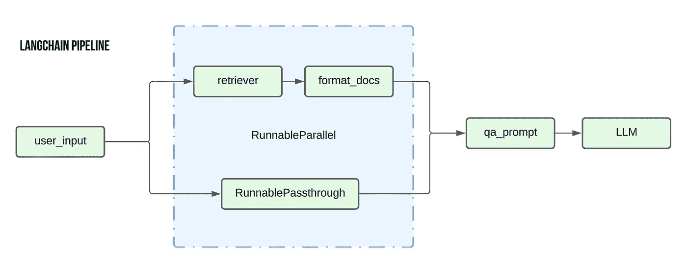
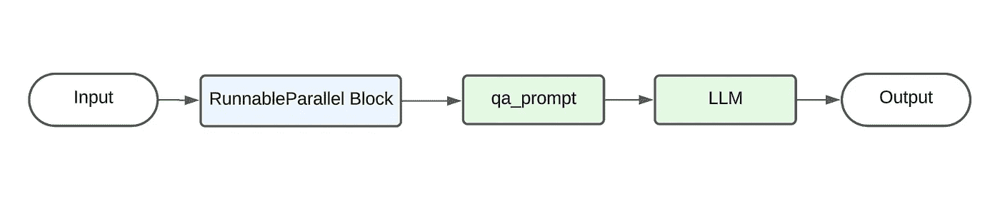
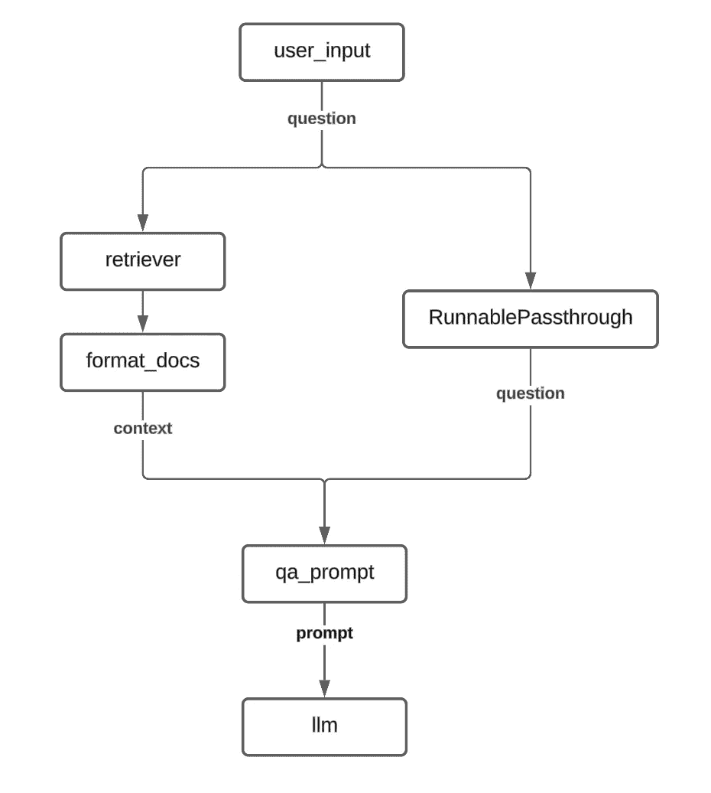
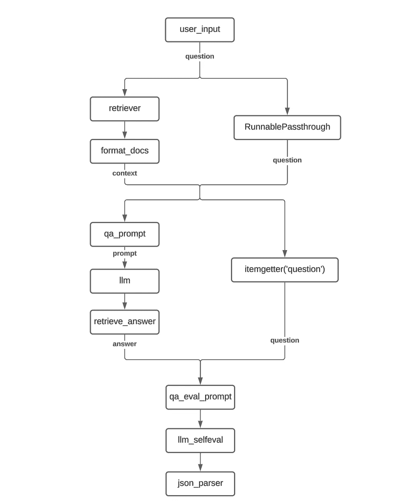
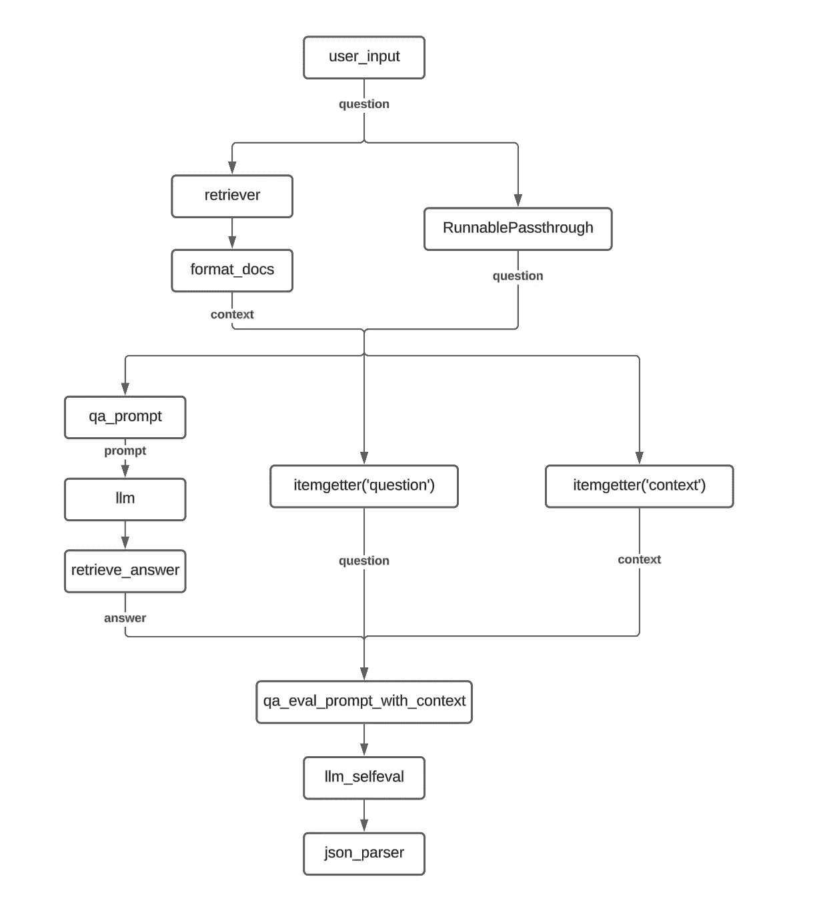
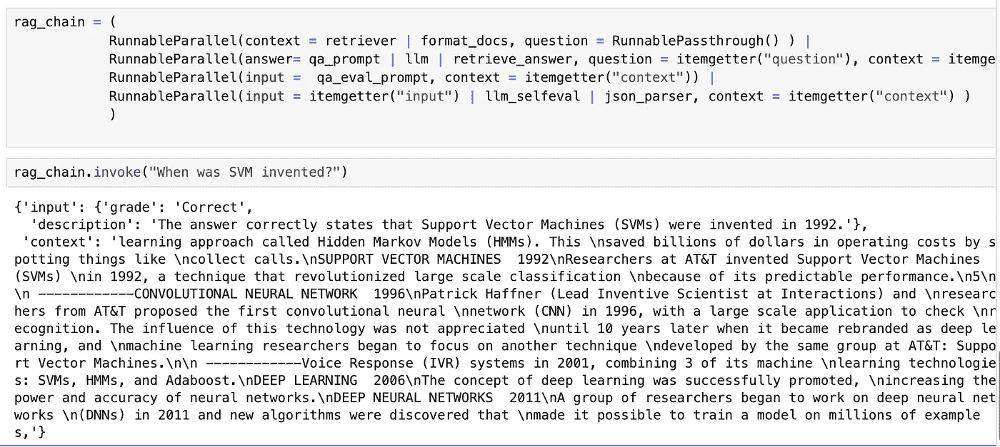
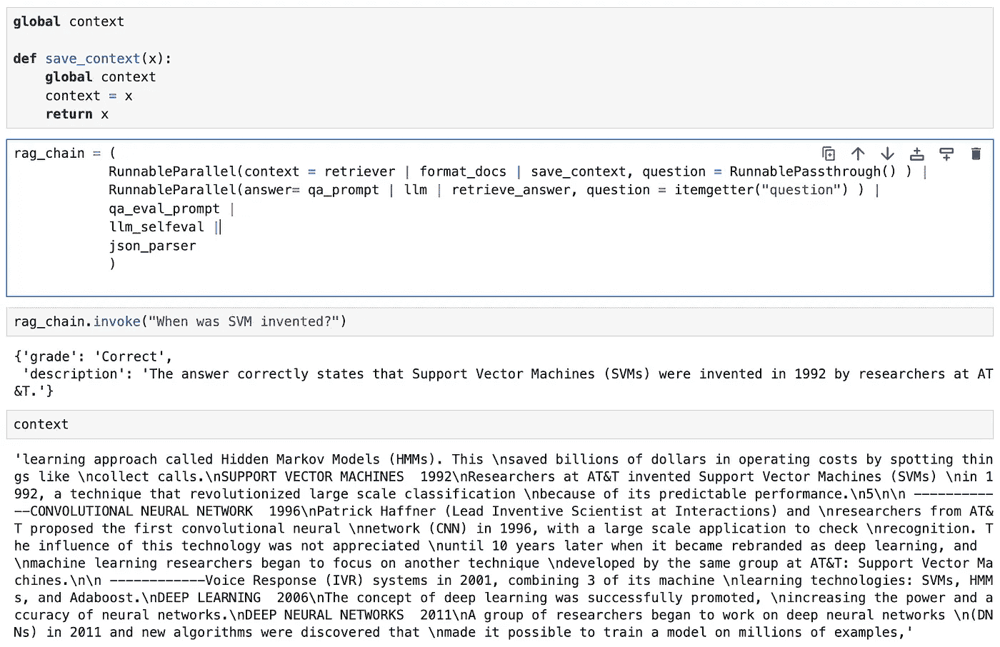

# 使用 LangChain 表达式语言（LCEL）构建 RAG 链

> 原文：[`towardsdatascience.com/building-a-rag-chain-using-langchain-expression-language-lcel-3688260cad05?source=collection_archive---------1-----------------------#2024-04-11`](https://towardsdatascience.com/building-a-rag-chain-using-langchain-expression-language-lcel-3688260cad05?source=collection_archive---------1-----------------------#2024-04-11)

## 学习 LCEL 的构建模块，以开发越来越复杂的 RAG 链

[](https://medium.com/@RSK2327?source=post_page---byline--3688260cad05--------------------------------)[](https://towardsdatascience.com/?source=post_page---byline--3688260cad05--------------------------------) [Roshan Santhosh](https://medium.com/@RSK2327?source=post_page---byline--3688260cad05--------------------------------)

·发布在 [Towards Data Science](https://towardsdatascience.com/?source=post_page---byline--3688260cad05--------------------------------) ·7 分钟阅读·2024 年 4 月 11 日

--

在这篇文章中，我将介绍**使用 LangChain 表达式语言（LCEL）实现自我评估 RAG 管道的问答功能**。本文的重点是使用 LCEL 来构建管道，而不是实际的 RAG 和自我评估原理，这些原理已简化，以便于理解。



我将涵盖以下主题：

1.  基本初始化步骤

1.  使用 LCEL 开发不同复杂度的 RAG 管道变体

1.  从 LCEL 脚本化管道中提取中间变量的方法

1.  使用 LCEL 的原因

# 设置

在我们开始开发 RAG 链之前，需要执行一些基本的设置步骤以初始化此设置。这些步骤包括：

## 数据摄取

数据摄取包括两个关键步骤：

1.  从 PDF 中读取文本

1.  将 PDF 文本拆分成多个块以输入向量数据库

## **提示模板**

我们将为问答任务和自我评估任务使用不同的提示。我们将有 3 个不同的提示模板：

1.  qa_prompt : 问答任务的基本提示

1.  qa_eval_prompt : 评估模型的提示，输入为问答对

1.  qa_eval_prompt_with_context : 与上述提示类似，但额外包含上下文以进行评估

## 数据库初始化

我们使用 FAISS 和 Open AI 嵌入初始化一个简单的向量数据库。对于检索，我们将 k 设置为 3（返回给定查询的前 3 个块）

# RAG 开发

## 简单的 QA RAG

我们从一个基本的 RAG 链示例开始，执行以下步骤：

1.  根据用户的问题，从向量数据库中检索相关的文本块（PDF 文本的分割），并将它们合并为一个单一字符串

1.  将检索到的上下文文本和问题一起传递给提示模板以生成提示

1.  将生成的输入提示传递给 LLM，以生成最终答案

**使用** [**LangChain 表达式语言(LCEL)**](https://python.langchain.com/docs/expression_language/)**，该 RAG 的实现方式如下：**

```py
rag_chain = ( 
            RunnableParallel(context = retriever | format_docs, question = RunnablePassthrough() ) |
            qa_prompt | 
            llm 
)
```

上述代码主要遵循管道架构，其中前一个元素的输出作为下一个元素的输入。下图展示了数据流。从用户的输入开始，首先通过 RunnableParallel 块，然后通过 qa_prompt 生成提示。这个提示随后被发送到 LLM，以生成最终输出。



基本的 LCEL 输入/输出流程

这个管道中有两个 LangChain 独有的关键添加项：

1.  **RunnableParallel**：顾名思义，这个类提供了***并行运行多个进程的功能***。因此，RunnableParallel 的输出是一个字典，键是初始化时提供的参数。在这种情况下，输出将包含两个键：*context*和*question*。

    那么，为什么我们在当前情况下需要这个呢？这是因为 qa_prompt 模板需要两个输入值：上下文和问题。因此，我们需要分别计算这些值，然后将它们一起传递给 qa_prompt 模板。

1.  **RunnablePassthrough**：当你想将输入传递给下一个阶段而不做任何修改时，这是一个有用的类。本质上，这***充当了一个恒等函数***，返回传入的任何内容作为其输入。

上述 RAG 的流程图如下：



## QA RAG 与自我评估 I

在之前的 RAG 链的基础上，我们现在将新的元素引入链中，以实现自我评估组件。

自我评估组件的实现相对直接。我们获取第一个 LLM 提供的答案，并将其与问题一起传递给评估器 LLM，并要求它提供一个二进制响应（正确/错误）。

```py
rag_chain = ( 
            RunnableParallel(context = retriever | format_docs, question = RunnablePassthrough() ) |
            RunnableParallel(answer= qa_prompt | llm | retrieve_answer, question = itemgetter("question") ) |
            qa_eval_prompt | 
            llm_selfeval |
            json_parser
            )
```

第一个关键区别是添加了一个额外的 RunnableParallel 组件。这是必需的，因为，与 QA 的初始提示类似，自我评估提示也需要两个输入：基础 LLM 的答案以及用户的问题。

因此，第一个 RunnableParallel 的输出是上下文文本和问题，而第二个 RunnableParallel 的输出是 LLM 的答案和问题。

> ***注意:*** *对于第二个 RunnableParallel，我们使用 itemgetter 方法仅保留前一个输入中的问题值并将其向前传递。这是为了避免使用 RunnablePassthrough，因为它会传递完整的输入（带有两个键的字典），而我们现在只关心传递问题而不是上下文。此外，还有格式化的问题，因为 qa_eval_prompt 期望的是一个 str -> str 映射，而使用 RunnablePassthrough 会导致 str -> dict 映射。*

这个 RAG 实现的流程图如下所示：



## QA 自评 RAG II

对于这个变体，我们对评估过程进行了更改。除了问答对外，我们还将检索到的上下文传递给评估器 LLM。

为了实现这一点，我们在第二个 RunnableParallel 中添加了一个额外的 itemgetter 函数，以收集上下文字符串并将其传递给新的 qa_eval_prompt_with_context 提示模板。

```py
rag_chain = ( 
            RunnableParallel(context = retriever | format_docs, question = RunnablePassthrough() ) |
            RunnableParallel(answer= qa_prompt | llm | retrieve_answer, question = itemgetter("question"), context = itemgetter("context") ) |
            qa_eval_prompt_with_context | 
            llm_selfeval |
            json_parser
            )
```

实现流程图：



# 检索中间变量

使用像 LCEL 这样的链式实现时，一个常见的痛点是难以访问中间变量，而访问这些变量对于调试管道非常重要。我们查看了几个选项，通过操作 LCEL 来访问我们感兴趣的任何中间变量。

## 使用 RunnableParallel 传递中间输出

如前所述，RunnableParallel 允许我们将多个参数传递到链中的下一步。因此，我们利用 RunnableParallel 的这个能力，直到最后一步都将所需的中间值传递下去。

在下面的示例中，我们修改了原始的自评 RAG 链，以便输出检索到的上下文文本以及最终的自评输出。主要的变化是，我们在每个步骤中都添加了一个 RunnableParallel 对象，以将上下文变量传递下去。

此外，我们还使用了 itemgetter 函数来明确指定后续步骤的输入。例如，对于最后两个 RunnableParallel 对象，我们使用*itemgetter('input')*来确保仅将前一步的输入参数传递给 LLM/Json 解析器对象。

```py
rag_chain = ( 
            RunnableParallel(context = retriever | format_docs, question = RunnablePassthrough() ) |
            RunnableParallel(answer= qa_prompt | llm | retrieve_answer, question = itemgetter("question"), context = itemgetter("context") ) |
            RunnableParallel(input =  qa_eval_prompt, context = itemgetter("context")) |
            RunnableParallel(input = itemgetter("input") | llm_selfeval , context = itemgetter("context") ) | 
            RunnableParallel(input = itemgetter("input") | json_parser,  context = itemgetter("context") )
            )
```

该链的输出如下所示：



更简洁的变体：

```py
rag_chain = ( 
            RunnableParallel(context = retriever | format_docs, question = RunnablePassthrough() ) |
            RunnableParallel(answer= qa_prompt | llm | retrieve_answer, question = itemgetter("question"), context = itemgetter("context") ) |
            RunnableParallel(input =  qa_eval_prompt | llm_selfeval | json_parser, context = itemgetter("context"))
            )
```

## 使用全局变量保存中间步骤

这种方法本质上使用了日志记录器的原理。我们引入了一个新函数，将其输入保存到全局变量中，从而允许我们通过全局变量访问中间变量。

```py
global context

def save_context(x):
    global context
    context = x
    return x

rag_chain = ( 
            RunnableParallel(context = retriever | format_docs | save_context, question = RunnablePassthrough() ) |
            RunnableParallel(answer= qa_prompt | llm | retrieve_answer, question = itemgetter("question") ) |
            qa_eval_prompt | 
            llm_selfeval |
            json_parser
            )
```

在这里，我们定义了一个全局变量*context*和一个名为*save_context*的函数，该函数在返回相同的输入之前将其输入值保存到全局*context*变量中。在链中，我们将*save_context*函数添加为获取上下文步骤的最后一步。

此选项允许您在不进行重大更改的情况下访问任何中间步骤。



使用全局变量访问中间变量

## 使用回调

将回调附加到链上是另一种常用于记录中间变量值的方法。在 LangChain 中，回调有很多内容需要探讨，因此我将在另一篇文章中详细讨论。

# 为什么使用 LCEL？

使用 LCEL 的原因最好由 LangChain 的作者在其[官方文档](https://python.langchain.com/docs/expression_language/)中解释。

在文档中提到的要点中，以下是我认为特别有用的一些：

1.  [输入和输出模式](https://python.langchain.com/docs/expression_language/interface/#input-schema) ：将在另一篇文章中详细介绍

1.  [异步支持](https://python.langchain.com/docs/expression_language/interface/) ：随着我们向生产应用推进，异步功能变得愈加重要。LCEL 管道允许无缝过渡到异步操作。

1.  [优化的并行执行](https://python.langchain.com/docs/expression_language/primitives/parallel/)

鉴于以上原因，作为个人偏好，我认为使用 LCEL 有助于提高代码的可读性，并允许更清晰的实现。

# 资源

[完整代码笔记本](https://github.com/rsk2327/AI-Workbook/blob/main/LangChain/Self%20Eval%20RAG.ipynb)

[PDF 文档](https://github.com/rsk2327/AI-Workbook/blob/main/LangChain/machine_learning_basics.pdf)

图像 ：所有图像均由作者创建

*除了 Medium，我还在* [*Linkedin*](https://www.linkedin.com/in/roshan-santhosh/)*上分享我的想法、创意和其他更新。*
