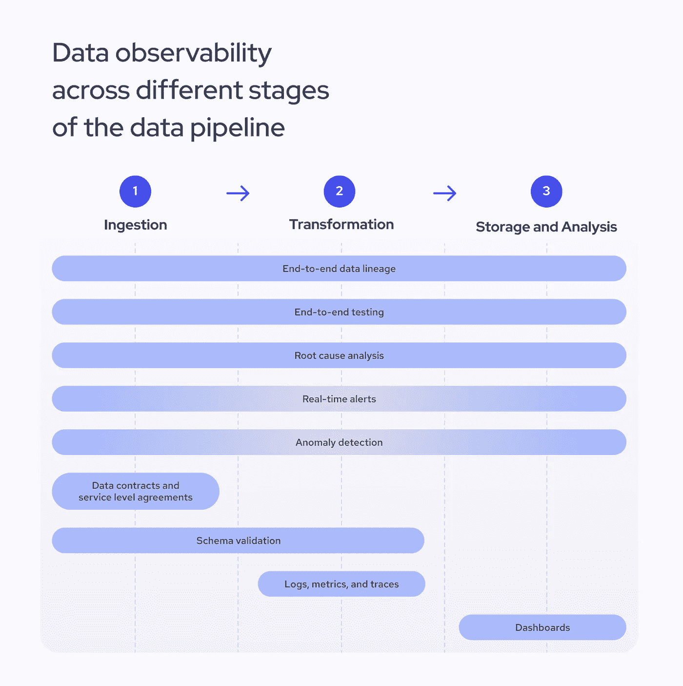

# 构建一个稳健的数据可观察性框架以确保数据质量和完整性

> 原文：[`towardsdatascience.com/building-a-robust-data-observability-framework-to-ensure-data-quality-and-integrity-07ff6cffdf69?source=collection_archive---------5-----------------------#2024-08-27`](https://towardsdatascience.com/building-a-robust-data-observability-framework-to-ensure-data-quality-and-integrity-07ff6cffdf69?source=collection_archive---------5-----------------------#2024-08-27)

## 我们如何通过开源工具提高可观察性？

 [Jurgita Motus | Coresignal](https://medium.com/@jurgitamotus?source=post_page---byline--07ff6cffdf69--------------------------------)

·发布于[Towards Data Science](https://towardsdatascience.com/?source=post_page---byline--07ff6cffdf69--------------------------------) ·7 分钟阅读·2024 年 8 月 27 日

--

[照片由 rivage 提供，来自 Unsplash](https://unsplash.com/photos/man-in-black-jacket-sitting-beside-black-flat-screen-computer-monitor-rWE7bTqgMJE)

**传统的监控方式已经无法满足复杂数据组织的需求。数据工程师不再依赖反应式系统来识别已知问题，而是必须创建互动式可观察性框架，帮助他们快速发现任何类型的异常。**

虽然可观察性涵盖了许多不同的实践，但在本文中，我将分享一个高层次的概述以及我们在组织中使用开源工具构建可观察性框架的实际经验和技巧。

那么，如何构建一个能够有效显示数据健康状况并确保数据质量的基础设施呢？

# 什么是数据可观察性？

总的来说，可观察性定义了你从外部输出中能够了解多少有关内部系统的信息。这个术语最早由匈牙利裔美国工程师[Rudolf E. Kálmán](https://learning.oreilly.com/library/view/observability-engineering/9781492076438/ch01.html#the_mathematical_definition_of_observab)在 1960 年提出，他在讨论数学控制系统中的可观察性时首次定义了这一术语。

多年来，这一概念已经被应用于多个领域，包括数据工程。在这里，它解决了数据质量的问题，并能够追踪数据是如何收集的以及如何进行转化的。

数据可观察性意味着确保所有管道和系统中的数据都是完整且高质量的。这是通过实时监控和管理数据来解决质量问题。可观察性确保了清晰度，使得在问题蔓延之前能够采取行动。

# 什么是数据可观察性框架？

数据可观察性框架是一个监控和验证机构内数据完整性和质量的过程。它有助于主动确保数据的质量和完整性。

该框架必须基于五个强制性方面，这些方面由[IBM](https://www.ibm.com/topics/data-observability#2)定义：

1.  **数据新鲜度**。必须找到并移除任何过时的数据。

1.  **分布**。必须记录预期数据值，以帮助识别异常值和不可靠数据。

1.  **数据量**。必须跟踪预期数据值的数量，以确保数据完整。

1.  **数据模式**。必须监控数据表和组织的变化，以帮助找到破损的数据。

1.  **血缘追踪**。收集元数据并映射数据源是帮助故障排除的必要步骤。

这五个原则确保数据可观察性框架有助于维护和提高数据质量。通过实施以下数据可观察性方法，您可以实现这些目标。

# 如何将可观察性实践添加到数据管道中

只有从可靠来源收集的高质量数据才能提供准确的见解。正如那句老话所说：垃圾进，垃圾出。您不能指望从组织混乱的数据集中提取任何实际的知识。

作为公共数据提供商 Coresignal 的高级数据分析师，我不断寻求改善数据质量的新方法。尽管在动态的技术环境中实现这一目标相当复杂，但许多路径可以通向它。良好的数据可观察性在这里发挥着重要作用。

那么，我们如何确保数据的质量呢？归根结底，就是在每个数据管道阶段中添加更好的可观察性方法——从数据摄取、转换到存储和分析。这些方法中的一些将在整个管道中起作用，而另一些只会在某个特定阶段相关。让我们来看看：

*跨越数据管道不同阶段的数据可观察性。来源：Jurgita Motus*

首先，我们需要考虑涵盖整个管道的五个项目：

1.  **端到端数据血缘追踪**。追踪血缘关系可以让您快速访问数据库历史，并从原始数据源跟踪数据直到最终输出。通过理解结构及其关系，您将更容易发现不一致之处，从而避免它们成为问题。

1.  **端到端测试**。验证过程会检查数据管道各个阶段的完整性和质量，帮助工程师确定管道是否正常运行，并发现任何不典型的行为。

1.  **根本原因分析**。如果管道的任何阶段出现问题，工程师必须能够准确定位源头，并快速找到解决方案。

1.  **实时警报**。可观察性的一个重要目标是迅速发现新出现的问题。在标记异常行为时，时间至关重要，因此任何数据可观察性框架都必须能够实时发送警报。这对数据接收以及存储和分析阶段尤其重要。

1.  **异常检测**。数据管道中可能会出现丢失数据或性能低下等问题。异常检测是一种先进的可观察性方法，通常会在流程的后期实现。在大多数情况下，需要机器学习算法来检测数据和日志中的异常模式。

接下来，我们有五个其他项目，在不同的数据管道阶段中更为相关：

1.  **服务水平协议（SLAs）**。SLA 有助于为客户和供应商设定标准，并定义数据的质量、完整性和一般责任。SLA 的阈值还可以在设置警报系统时提供帮助，通常，它们会在数据接收阶段之前或期间签署。

1.  **数据合同**。这些协议定义了数据进入其他系统之前的结构方式。它们充当一套规则，明确你可以期望的数据的新鲜度和质量水平，通常会在数据接收阶段之前谈判确定。

1.  **架构验证**。它保证数据结构的一致性，并确保与下游系统的兼容性。工程师通常在数据接收或处理阶段验证架构。

1.  **日志、指标和追踪**。虽然这些对于监控性能至关重要，但收集和轻松访问这些关键信息将成为危机中的有力工具——它帮助你更快地找到问题的根本原因。

1.  **数据质量仪表板**。仪表板帮助监控数据管道的整体健康状况，并提供可能出现问题的高级视图。它们确保通过其他可观察性方法收集到的数据以清晰、实时的方式呈现。

最后，数据可观察性无法实现，如果框架中没有自我评估，因此，持续审计和检查系统对于任何组织来说都是必须的。

接下来，让我们讨论一些可能有助于你简化工作流程的工具。

# 数据可观察性平台及其功能

那么，如果你开始在组织中构建数据可观察性框架，应该考虑哪些工具呢？虽然市场上有许多选择，但根据我的经验，你最好的选择是从以下工具开始。

在构建我们的数据基础设施时，我们专注于最大化利用开源平台。下面列出的工具在处理大量数据时，能够确保透明度和可扩展性。虽然它们中的大多数工具并非专门用于数据可观察性，但它们结合使用时能提供确保数据管道可见性的好方法。

下面是我推荐查看的五个必要平台的列表：

1.  **Prometheus 和 Grafana** 平台互为补充，帮助工程师实时收集和可视化大量数据。Prometheus 是一款开源监控系统，非常适合数据存储和观察，而可观察性平台 Grafana 则通过易于导航的可视化仪表板帮助追踪新趋势。

1.  **Apache Iceberg** 表格格式提供了数据库元数据的概览，包括跟踪表列的统计信息。跟踪元数据有助于更好地理解整个数据库，而无需不必要地处理数据。它不完全是一个可观察性平台，但其功能允许工程师更好地了解他们的数据。

1.  **Apache Superset** 是另一款开源数据探索和可视化工具，可以帮助展示大量数据、构建仪表板并生成警报。

1.  **Great Expectations** 是一个帮助测试和验证数据的 Python 包。例如，它可以使用预定义规则扫描样本数据集，并创建数据质量条件，稍后可用于整个数据集。我们的团队使用 Great Expectations 对新数据集进行质量测试。

1.  **Dagster** 数据管道编排工具可以帮助确保数据血缘关系并进行资产检查。尽管它不是作为数据可观察性平台而创建的，但它通过现有的数据工程工具和表格格式提供可视化。该工具有助于找出数据异常的根本原因。该平台的付费版本还包含由 AI 生成的洞察。这款应用程序提供自助式可观察性，并带有内置的资产目录，用于跟踪数据资产。

请记住，这些只是众多可选工具中的一部分。务必进行研究，找到适合你组织的工具。

# 如果忽视数据可观察性原则会发生什么？

一旦出现问题，组织通常依赖工程师的直觉来找出问题的根本原因。正如软件工程师 Charity Majors 在[她的回忆录](https://learning.oreilly.com/library/view/observability-engineering/9781492076438/)中生动地解释的那样，在 MBaaS 平台 Parse 工作时，大多数传统的监控系统都是由在公司工作时间最长的工程师推动的，他们能够迅速猜测系统的问题。这使得资深工程师变得不可替代，并且带来了其他问题，比如较高的职业倦怠率。

使用数据可观察性工具可以消除故障排除中的猜测，减少停机时间，并增强信任。如果没有数据可观察性工具，你可能会遇到较长的停机时间、数据质量问题以及对新出现问题反应迟缓等问题。因此，这些问题可能会迅速导致收入损失、客户流失，甚至损害品牌声誉。

数据可观察性对处理大量信息并必须保证数据质量和完整性不中断的大型企业至关重要。

# 数据可观察性未来会如何发展？

数据可观察性是每个组织必须具备的，尤其是那些从事数据收集和存储的公司。一旦所有工具就位，就可以开始使用先进的方法来优化这一过程。

机器学习，特别是大型语言模型（LLMs），是这里显而易见的解决方案。它们可以帮助快速扫描数据库，标记异常，并通过识别重复项或添加新的丰富字段来提高整体数据质量。同时，这些算法还能帮助跟踪模式和日志的变化，改善数据一致性并提升数据血缘关系。

然而，选择合适的时机来实施你的人工智能计划至关重要。提升你的可观察性能力需要资源、时间和投资。在开始使用自定义的 LLM 之前，你应该仔细考虑这是否真的能为你的组织带来好处。有时，坚持使用上述已经有效完成工作的标准开源数据可观察性工具，可能会更高效。
