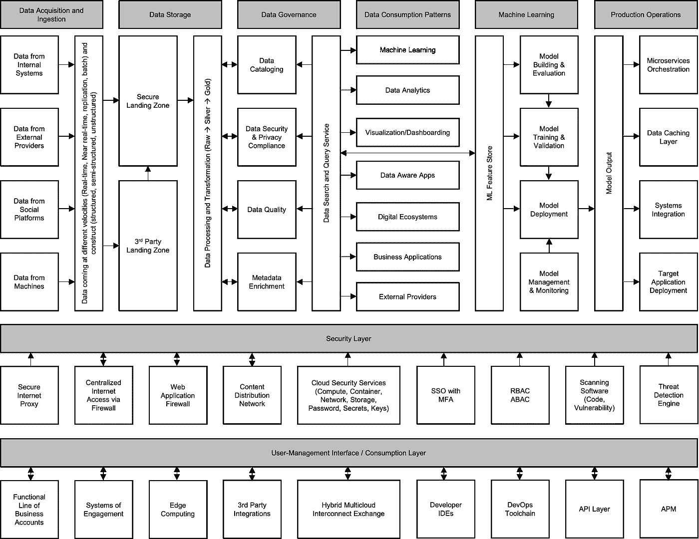
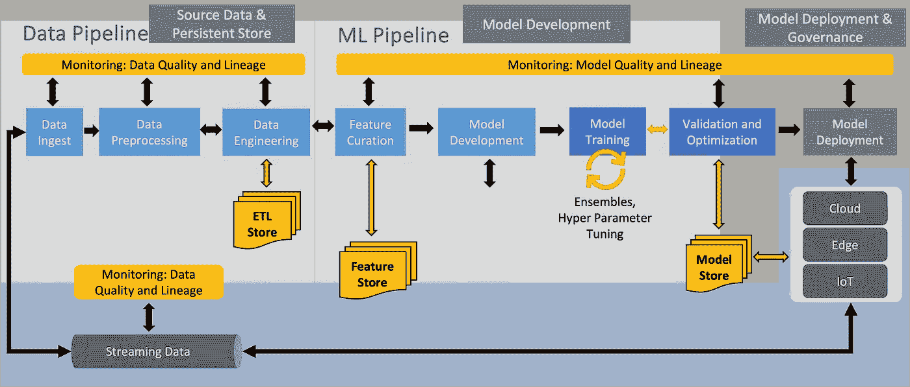
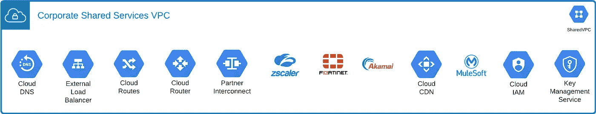
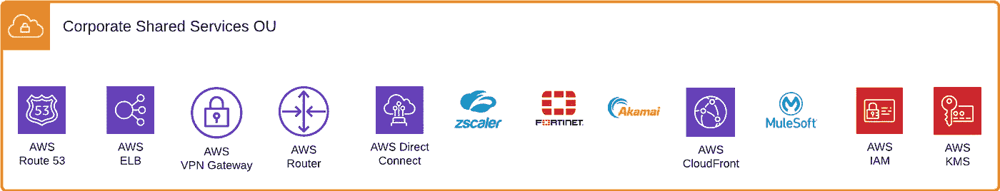
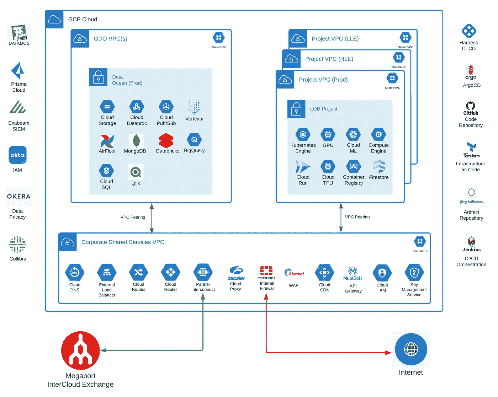
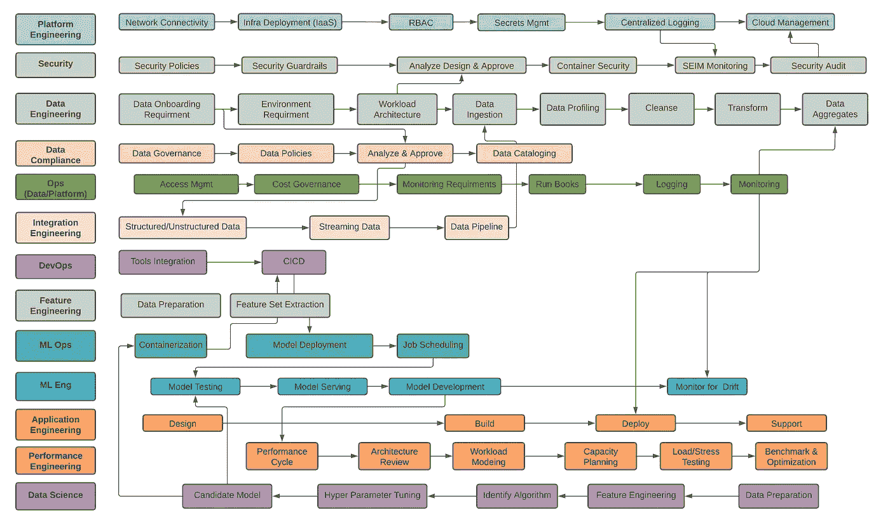

# 构建安全且可扩展的数据与 AI 平台

> 原文：[`towardsdatascience.com/building-a-secure-and-scalable-data-and-ai-platform-074e191b291f?source=collection_archive---------7-----------------------#2024-02-22`](https://towardsdatascience.com/building-a-secure-and-scalable-data-and-ai-platform-074e191b291f?source=collection_archive---------7-----------------------#2024-02-22)

## 通过数据驱动的决策赋能业务

 [Adil Rizvi](https://medium.com/@rizviadil?source=post_page---byline--074e191b291f--------------------------------)

·发表于[Towards Data Science](https://towardsdatascience.com/?source=post_page---byline--074e191b291f--------------------------------) ·7 分钟阅读·2024 年 2 月 22 日

--

图片由[Igor Omilaev](https://unsplash.com/@omilaev?utm_source=medium&utm_medium=referral)提供，来自[Unsplash](https://unsplash.com/?utm_source=medium&utm_medium=referral)

在过去的四年里，我有幸领导了全球规模的大数据和 AI 平台的战略、设计和实施，涉及的不仅是一个而是两个公共云平台——AWS 和 GCP。此外，我的团队使 70 多个数据科学/机器学习（DSML）用例和 10 个数字应用得以投入运营，为公司贡献了约 1 亿美元的收入增长。

这段旅程充满了令人兴奋的挑战和一些陡峭的学习曲线，但最终的结果非常有影响力。通过这篇文章，我想分享我的学习和经验，这将帮助其他技术创新者思考他们的规划过程，并使他们的实施能够跨越式发展。

本文将主要集中在基础构建上，以提供整体生产生态系统的全貌。在之后的文章中，我将讨论技术选择，并分享更详细的规范性建议。

让我先给你展示一下数据和 AI 平台的构建模块。

数据和 AI 平台的端到端区块级架构

思考从端到端架构是一个极好的主意，因为这样你可以避免快速而粗糙完成工作的常见陷阱。毕竟，你的 ML 模型输出的质量取决于你输入的数据。而且，你不想在数据安全性和完整性上做出妥协。

## **1\. 数据采集与摄取**

创建一个良好的数据操作（DataOps）框架对于整体数据导入过程至关重要。很多因素取决于生成数据的来源（结构化与非结构化数据）以及接收数据的方式（批量、复制、近实时、实时）。

在获取数据时，有多种方式可以将其导入 -

1.  提取 → 加载（无需转换）

1.  提取 → 加载 → 转换（主要用于批量上传）

1.  提取 → 转换 → 加载（适用于流式数据）

特征工程师必须进一步结合数据，创建用于机器学习用例的特征（特征工程）。

## 2\. 数据存储

选择最佳的数据存储至关重要，像 S3、GCS 或 Blob Storage 这样的对象存储桶是导入原始数据的最佳选择，尤其适用于非结构化数据。

对于纯粹的分析用例，此外，如果你要导入 SQL 结构化数据，也可以将数据直接导入云数据仓库（如 Big Query 等）。许多工程团队也更倾向于使用数据仓库存储（与对象存储不同）。你的选择将取决于使用场景和涉及的成本。请谨慎选择！

通常，你可以直接从内部和外部（第一方和第三方）源导入数据，而无需任何中间步骤。

然而，在一些情况下，数据提供方可能需要访问你的环境进行数据交易。计划在 DMZ 设置中为第三方创建一个着陆区，以防止将整个数据系统暴露给供应商。

此外，对于合规相关的数据，如 PCI、PII 和受监管的数据（如 GDPR、MLPS、AAPI、CCPA 等），应创建结构化存储区，从一开始就妥善处理这些数据。

记得根据你的机器学习模型和分析报告的时间旅行或历史上下文要求，规划数据保留和备份策略。虽然存储便宜，但随着时间的推移，积累的数据会成倍增加成本。

## 3\. 数据治理

虽然大多数组织擅长导入和存储数据，但大多数工程团队在使数据对最终用户可消费方面存在困难。

导致采纳不良的主要因素有 —

1.  组织内的数据素养不足

1.  缺乏明确定义的数据目录和数据字典（元数据）

1.  无法访问查询接口

数据团队必须与法律、隐私和安全团队合作，了解国家和地区的数据法规以及合规要求，以确保数据治理的合规性。

实施数据治理的几种方法包括：

1.  数据掩码和匿名化

1.  基于属性的访问控制

1.  数据本地化

如果未能妥善保护存储和数据访问，可能会使组织面临法律问题及相关处罚。

## 4\. 数据消费模式

随着数据被转化并丰富为业务关键绩效指标（KPIs），数据的呈现和消费有不同的方面。

对于纯粹的可视化和仪表盘，简单的存储数据访问和查询接口就足够了。

随着需求变得更加复杂，比如向机器学习模型提供数据，你必须实施和增强功能存储。这个领域需要成熟，且大多数云原生解决方案仍处于生产级就绪的早期阶段。

同时，寻找一个水平数据层，通过 API 向其他应用程序提供数据消费。GraphQL 是一个很好的解决方案，能够帮助创建微服务层，从而显著提升访问的便捷性（数据即服务）。

随着这一领域的成熟，考虑将数据结构化为数据产品域，并在业务单元中找到数据管理员，作为该域的管理者。

## 5\. 机器学习

在数据后处理后，机器学习采用两步走的方式——模型开发和模型部署与治理。

操作化 AI 平台

在模型开发阶段，机器学习工程师与数据科学家密切合作，直到模型被打包并准备好进行部署。选择机器学习框架和功能，并与数据科学家合作进行超参数调优和模型训练，都是开发生命周期的一部分。

创建部署流水线并选择技术栈来使模型能够投入生产并提供服务，这些都属于 MLOps 范畴。MLOps 工程师还提供机器学习模型管理，包括监控、评分、漂移检测和启动再训练。

自动化机器学习模型生命周期中的所有这些步骤有助于实现规模化。

不要忘记将所有训练过的模型存储在机器学习模型注册表中，并促进重用，以提高操作效率。

## 6\. 生产操作

提供模型输出需要与其他功能领域的持续合作。提前规划和开放的沟通渠道对于确保发布日程的协调至关重要。请务必做到这一点，以避免错过截止日期、技术选择冲突以及集成层的问题。

根据消费层和部署目标，你将通过 API 发布模型输出（模型端点），或者让应用程序直接从存储中获取推断结果。结合 API 网关使用 GraphQL 是实现这一目标的高效方式。

## 7\. 安全层

分离管理平面并创建共享服务层，这将成为你的云账户的主要进出口点。它也将是你组织内外部公有/私有云的会面室。

共享服务 — 谷歌云平台

共享服务 — 亚马逊 Web 服务

你的服务控制策略（AWS）或组织政策限制（GCP）应集中管理，并保护资源，防止在没有适当访问控制的情况下被创建或托管。

## 8\. 用户管理界面 / 消费层

明智的做法是提前选择云账户的结构。您可以根据业务线（LOB）、产品领域或两者的混合来构建账户结构。同时，设计并分隔您的开发、测试和生产环境。

最好将您的 DevOps 工具链集中化。我更倾向于使用一个与云平台无关的工具集，以支持在混合多云生态系统之间的无缝集成和过渡。

对于开发者 IDE，可能会有个人 IDE 和共享 IDE 的混合。确保开发者经常将代码提交到代码库，否则他们可能会丢失工作进度。

使用云无关的 DevSecOps 工具链进行 GCP 设置

## **端到端数据科学过程**

在组织动态中进行导航，并将利益相关者聚集在一个共同的对齐目标上，对于成功的生产部署和持续运营至关重要。

我正在分享使这个复杂系统顺畅运行的跨职能工作流和流程。

从头到尾的数据科学模型部署过程

## **结论**

希望这篇文章能激发您的思考，激发新的想法，并帮助您勾画出您的工作全貌。这是一个复杂的任务，但通过深思熟虑的设计、精心规划的执行和大量的跨职能合作，您将能够轻松应对。

最后的建议：不要仅仅因为某项技术解决方案看起来很酷就去创建它。首先要理解业务问题，并评估潜在的投资回报。最终目标是创造业务价值，并为公司的收入增长做出贡献。

祝你在构建或完善数据和 AI 平台的过程中好运。

一路顺风！

~ Adil {[LinkedIn](https://www.linkedin.com/in/rizviadil/)}

*<< 除非另有说明，所有图片均来自作者 >>*
